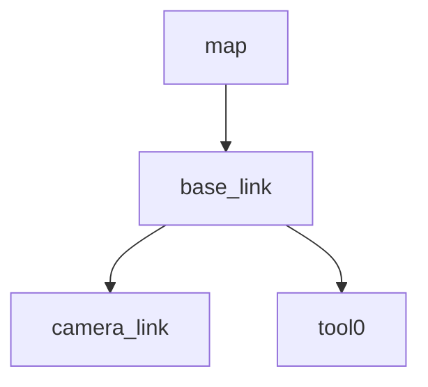

# Lab 2 — TF tree

## 目的

- static transform を立て、TF ブロードキャスタの基本操作を習得する
- `tf2_echo` で frame 間の 6-DOF transform を確認する
- `view_frames` で TF tree の全体構造を可視化する (ローカル確認用)
- CC/MS で使う frame 一覧案を Mermaid TF tree として書き起こす

## 前提

- Lecture L2 (TF/URDF) 完了済みであること

## 手順

### Step 1: static transform を起動 (3つ)

ターミナルを 3 つ開き、それぞれで以下を実行する:

```bash
# Terminal 1: camera_link を base_link の child に
ros2 run tf2_ros static_transform_publisher 1 0 0 0 0 0 base_link camera_link

# Terminal 2: tool0 を base_link の child に
ros2 run tf2_ros static_transform_publisher 0 0 0.5 0 0 0 base_link tool0

# Terminal 3: base_link を map の child に
ros2 run tf2_ros static_transform_publisher 0 0 0 0 0 0 map base_link
```

3 つのノードが起動していることを確認する:

```bash
ros2 node list
```

### Step 2: tf2_echo で確認

新しいターミナルで以下を実行し、`map` → `tool0` の 6-DOF transform が出力されることを確認する:

```bash
ros2 run tf2_ros tf2_echo map tool0
```

`Translation:` 行と `Rotation:` 行が表示されれば成功。Ctrl-C で停止。

### Step 3: view_frames で PDF 生成 (ローカル確認用)

```bash
ros2 run tf2_tools view_frames
```

実行後 5 秒待つと `frames.pdf` と `frames.gv` が **カレントディレクトリ** に生成される。
PDF を開いて tree の構造 (`map → base_link → camera_link / tool0`) を目視確認する。

### Step 4: PDF を commit しない (重要)

`.gitignore` で `**/frames.pdf` および `**/frames.gv` がブロック済み。
確認後は手元で削除することを推奨する:

```bash
rm frames.pdf frames.gv
```

### Step 5: Mermaid TF tree を frame_inventory.md に書く

自 Sandbox の `wk1/lab2/frame_inventory.md` を新規作成する。
下の「フォーマット例」を参考に、Mermaid TF tree と表を記述すること。

**必ず `base_link`、`camera_link`、`tool0` の 3 キーワードを含めること** (CC/MS の frame 案として)。

作成後、Sandbox に commit/PR する:

```bash
cd ~/Develop/Sandbox_<name>
git add wk1/lab2/frame_inventory.md
git commit -m "lab2: add TF frame inventory"
git push origin main
```

## frame_inventory.md フォーマット例

````markdown
# CC/MS で使う frame 一覧案



| frame | 親 | 用途 | 備考 |
|---|---|---|---|
| `map` | (root) | 静的世界座標 | CC/MS 共通 |
| `base_link` | `map` | ロボット本体 | UR7e/CRX 共通 |
| `camera_link` | `base_link` | カメラ筐体 | hand-eye calib 対象 |
| `tool0` | `base_link` | エンドエフェクタ取付 | gripper を更に child として付与 |
````

## 提出物

自 Sandbox の `wk1/lab2/frame_inventory.md` (Mermaid TF tree + 表)

## 合格条件

合格条件は [CHECKLIST.md](./CHECKLIST.md) を参照。

## 参照

- R-01: ROS 2 公式ドキュメント
- R-03: REP-103 (Standard Units of Measure and Coordinate Conventions)
- R-05: tf2 公式ドキュメント
