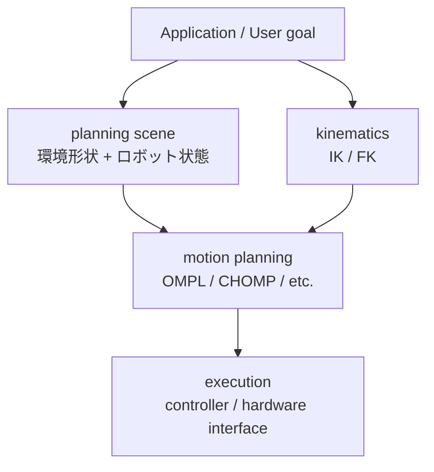

# MoveIt 2 概観

## 目的

MoveIt 2 を「ロボットを直接動かす魔法の層」ではなく、planning scene / IK / trajectory / controller の **合成層** として理解する。

## 1. MoveIt 2 全体像

MoveIt 2 は ROS 2 上の **manipulation framework** で、4 層に分けると見通しが良い:



各層は ROS 2 上で具体的な node / topic / action として実体化する。例: `/move_group` (motion planning + 全体 orchestration)、`/move_group/planning_scene` (planning scene topic)、`FollowJointTrajectory` action (execution)。

## 2. planning scene

planning scene は **ロボット + 環境形状 (collision objects) の状態** を表す抽象。

- topic: `/move_group/planning_scene` (read), `/planning_scene` (write)
- 操作: collision object の `add` / `remove` / `attach` / `detach`
- attach: object が end-effector に固定される (例: gripper が物体を掴んだ状態)、IK に組み込まれる
- detach: 固定解除、object は world に残る

planning scene が間違っていると、見た目には動けるはずの動作が collision で計算上 fail する。

## 3. IK feasibility

IK = Inverse Kinematics。end-effector の目標 pose から joint 解を逆算する。

- **解の存在性 (feasibility)**: そもそも到達できるか
- **解の品質 (manipulability)**: 到達できても singularity 近傍だと制御が難しい
- **collision-aware IK**: planning scene を参照し、衝突しない解だけを返す

MoveIt 2 のデフォルト IK solver は **KDL** (運動学のみ)。collision-aware は OMPL の planner が後段でフィルタする形。

## 4. trajectory

trajectory = **時間付き joint 列** (`JointTrajectory` メッセージ)。

- 各 point = (positions, velocities, accelerations, time_from_start)
- planner の出力、controller への入力
- 平滑性・速度制限・加速度制限を満たす必要がある

## 5. Panda demo の起動

ROS 2 Humble + MoveIt 2 のチュートリアルで使われる Panda アーム demo:

```bash
ros2 launch moveit_resources_panda_moveit_config demo.launch.py
```

RViz が起動し、Panda が表示される。Planning タブ (左パネル) で start/goal を設定 → `Plan` → `Execute`。

最低操作:
- start state: `<current>` または `<random>` を選ぶ
- goal state: 同じく `<current>` `<random>` または手動 (interactive marker)
- `Plan` ボタン: planning 結果が緑線で表示される
- `Plan & Execute`: 計算 + 実行 (mock execution、実機なし)

## 6. ros2_control との接続

MoveIt 2 が trajectory を出力した後の流れ:

```
MoveIt 2 (move_group)
    --> FollowJointTrajectory action client
        --> controller (例: joint_trajectory_controller, ros2_controllers)
            --> hardware interface (mock_components / fake_components / 実機 driver)
                --> ros2_control_node (controller_manager)
```

詳細 (controller_manager / hardware interface / mock_components) は **Lecture 4** で扱う。本 Lecture では「MoveIt 2 は controller を介して動く」点だけ抑える。

## 7. よくある誤解

| 誤解 | 実際 |
|---|---|
| MoveIt 2 が直接ロボットを動かす | MoveIt 2 は trajectory を生成、実行は controller の役割 |
| IK 解が出れば実行できる | IK 解 ≠ 安全実行。collision / velocity / joint limit / dynamics 別検査が必要 |
| Panda demo を改造すれば自前 robot が動く | Panda demo は固定 config。自前 robot は MoveIt Configuration Wizard が別途必要 |
| `Plan & Execute` で実機が動く | mock execution。実機接続は driver + controller + safety の追加設定が必須 |

## 次のLab

→ [Lab 3: RViz Planning](../labs/lab3_rviz_planning/README.md)
