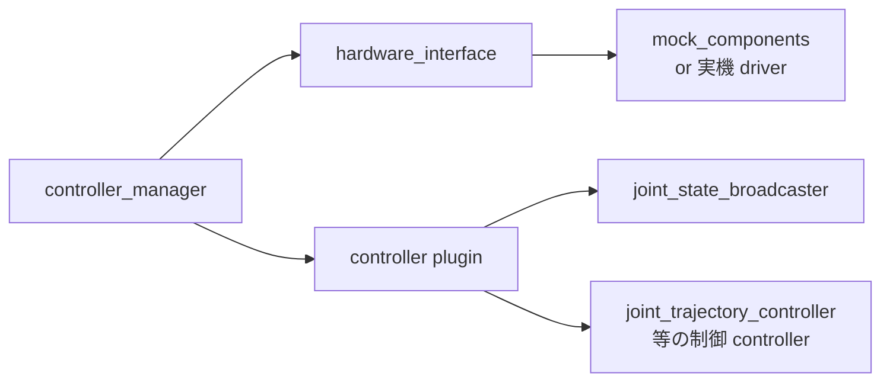

# Robot Adapter + Calibration + Safety 最小語彙

## 目的

Robot Adapter 4 段階の境界 (no-op / mock_hardware / URSim / real) を理解し、実機投入前に揃える必要がある **Calibration 最小語彙 + Safety 最小語彙** を獲得する。本 Lecture の語彙は Robot Readiness Mini Report (Lab 4 提出物) を埋めるために必要。

## 1. なぜ Adapter が必要か

ロボット制御で「Python で書いた adapter」を制御本体だと思ってはいけない。

- **制御本体**: ros2_control + hardware driver (real-time、PID、safety check 付き)
- **Python adapter**: orchestration / bridge / 高レベルロジック層

Python adapter は「外の指示」(例: 視覚モジュールから来る pose 候補) と「ロボット制御の語彙」(joint 命令、trajectory) の **翻訳層** に留めるべき。低レベル制御 (位置追従、モータ電流) は driver が担う。

## 2. Robot Adapter 4 段階の評価範囲

| 段階 | 評価できること | 評価できないこと |
|---|---|---|
| **no-op** | adapter の I/O 接続、ログ出力、failure 検知 | 実際の動作、controller / driver / 物理 |
| **mock_hardware** | controller_manager 起動順、`/joint_states` の流れ、controller spawn | 実機 driver protocol、reaction force、safety stop |
| **URSim** | UR driver protocol (URCap)、PolyScopeX 通信、emergency stop UI | 実機の calibration drift、reaction force、人協調安全 |
| **real** | 実機 calibration、安全機構、人協調動作 | (ここに到達したら全評価可能) |

教育計画§4.3 合格条件: 「`no-op → URDF+IK mock → URSim → real` の段階と各段階で評価できることを説明できる」。本 Lecture でこの理解を獲得する。

## 3. ros2_control の役割

ros2_control は ROS 2 標準の **hardware abstraction layer**:

- **controller_manager**: lifecycle 管理 (configure / activate / deactivate)
- **hardware_interface**: 「joint command / state」の抽象 API
- **mock_components/GenericSystem**: 実機なしで動く mock plugin (Lab 4 で使用)
- **joint_state_broadcaster**: `/joint_states` を publish する controller (mock でも実機でも使う)

mock_components があるおかげで、**実ハードウェアなしに controller spawn 順や joint_state pipeline をテストできる**。Lab 4 はこの段階を扱う。

## 4. URSim と UR ROS2 driver (概念のみ)

URSim = Universal Robots が公開する、UR 実機の URCap protocol を simulate するソフトウェア。
UR ROS2 driver = ROS 2 側で URSim/実機と話す driver。

W2 では **概念のみ扱い、ハンズオンしない** (Stretch goal)。Robot Adapter / Safety Role Owner が個別に SP5 / 個別宿題で扱う。Robot Readiness Mini Report の `adapter stage` 欄に「URSim 段階は未到達 / SP5 で評価予定」と書ける状態を W2 ゴールとする。

## 5. Calibration 最小語彙

Robot Readiness Mini Report の `calibration state` 行を埋めるための最低語彙:

| 用語 | 1-2 行定義 |
|---|---|
| `intrinsic` | カメラ固有パラメータ (焦点距離 / 光学中心 / 歪み係数)。カメラ自体の特性 |
| `extrinsic` | カメラ ↔ 他フレーム (例: ロボット base) の相対 pose |
| `hand-eye` | カメラ ↔ ロボット (base または end-effector) の calibration。最も実装が複雑 |
| `fixture` | calibration 用治具 (chessboard、ArUco marker、3D marker plate 等) |
| `reprojection error` | calibration 評価値 (px 単位)。3D 推定点を 2D 画像に再投影し、観測点との誤差 |

**ハンズオンは SP5 (Calibration Role) で扱う。** 本 Lecture は「Robot Readiness で `すべて 未確認 / SP5 で評価予定 / 実カメラ未接続` と書ける」状態を到達点とする。

## 6. Safety 最小語彙

Robot Readiness Mini Report の `safety state` 行を埋めるための最低語彙:

| 用語 | 1-2 行定義 |
|---|---|
| `emergency stop` | 非常停止 (安全停止カテゴリ 1)。最終手段、recoverable ではない通常停止には使わない |
| `safeguard stop` | 防護停止。外部入力 (light curtain 等)、再開可能 |
| `protective stop` | 保護停止。controller 自己判断 (force/torque overlimit 等)、再開可能 |
| `safe no-action` | **不確実時に何もしない** ことを Robot Adapter の方針として明示する選択 |
| `operator confirmation` | 人による明示承認 (例: 大きい動作の前に手動 ack) |

**SOP / stop condition / 禁止操作の設計は SP4 (W4) で扱う。** 本 Lecture は「Robot Readiness で `すべて 未確認 / SP4 で評価予定 / 実機接続なし` と書ける」状態を到達点とする。

## 7. よくある誤解

| 誤解 | 実際 |
|---|---|
| mock_hardware で OK なら実機でも OK | mock は driver protocol、reaction force、safety stop を一切見ない。実機との隔たりは大きい |
| emergency stop を通常停止にも使う | 非常停止は recoverable ではない。通常停止は controller の deactivate を使う |
| IK 解が出たから実行してよい | calibration error が出力 pose を狂わせる。IK 解 ≠ 安全に実行可能 |
| Calibration は 1 回やれば OK | 温度 / 機械的 drift / 治具交換で再 calibration が必要 |

## 8. Robot Readiness Mini Report との接続

Lab 4 で Robot Readiness Mini Report の **全 7 行** を空欄なく記入する必要がある。本 Lecture の語彙はその 7 行のうち 3 行 (`adapter stage` / `calibration state` / `safety state`) を埋めるためのもの。

W2 mock 環境では多くの行が「未確認 / SP4-5 で評価予定 / 実機接続なし」になるが、**「未確認」と書けることが重要** (空欄 NG)。

## 次のLab

→ [Lab 4: mock_hardware adapter](../labs/lab4_mock_hardware_adapter/README.md)
