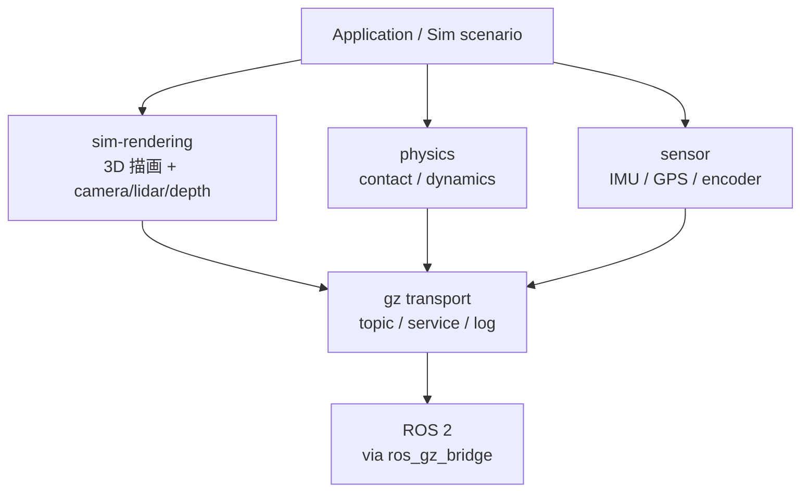

# Gazebo Fortress + ros_gz_bridge

## 目的

Gazebo Fortress を「physics simulator」ではなく **ROS 2 連携と robot model 検証の場** として理解する。`ros_gz_bridge` は gz topic ↔ ROS topic の翻訳層。Lab 5 で `/clock` 1 topic の bridge YAML を設計し、`/joint_states` は概念例として扱う (joint を持つ robot model が必要、Stretch goal)。

## 1. Gazebo Fortress 全体像

Gazebo Fortress は 4 層に分けると見通しが良い:



ROS 2 との接続点は **transport 層** (gz transport)。`ros_gz_bridge` がここを ROS 2 topic / service と双方向 mapping する。

## 2. gz CLI 最低操作

| コマンド | 用途 |
|---|---|
| `gz sim --version` | install 確認 |
| `gz sim shapes.sdf` | 標準 demo world (3 物体) を GUI 起動 |
| `gz sim --headless-rendering shapes.sdf` | X11 不可環境用 |
| `gz topic -l` | gz transport 上の topic 一覧 |
| `gz sim -r shapes.sdf` | auto-run flag、pause 状態を回避 |

注: Fortress 過渡期環境では `gz` の代わりに `ign` (Ignition) コマンドが使われる場合あり (`ign gazebo`、`ign topic`)。Lab 5 では両系統を fallback で扱う。

## 3. ros_gz_bridge の役割

`ros_gz_bridge` は **gz transport ↔ ROS 2 topic の双方向 mapping** を行う ROS 2 ノード。実体は `ros2 run ros_gz_bridge parameter_bridge`。

YAML config 駆動。各 entry に以下の field を持つ:

| field | 意味 |
|---|---|
| `ros_topic_name` | ROS 2 側の topic 名 |
| `gz_topic_name` | gz transport 側の topic 名 |
| `ros_type_name` | ROS 2 message type (例: `rosgraph_msgs/msg/Clock`) |
| `gz_type_name` | gz message type (例: `ignition.msgs.Clock`) |
| `direction` | `GZ_TO_ROS` / `ROS_TO_GZ` / `BIDIRECTIONAL` |

**実 robot model なしでは `/joint_states` は流れない**: 標準 demo の `shapes.sdf` には joint を持つ robot がない。`/clock` (mandatory) は世界 simulation 時刻なので robot 不要。

## 4. bridge YAML 最小書き方

`/clock` 1 topic の YAML 完全例:

```yaml
- ros_topic_name: "/clock"
  gz_topic_name: "/clock"
  ros_type_name: "rosgraph_msgs/msg/Clock"
  gz_type_name: "ignition.msgs.Clock"
  direction: GZ_TO_ROS
```

`/joint_states` は **概念例として併記** (real run には joint を持つ robot model が必要、Stretch):

```yaml
# - ros_topic_name: "/joint_states"
#   gz_topic_name: "/world/default/model/<robot>/joint_state"
#   ros_type_name: "sensor_msgs/msg/JointState"
#   gz_type_name: "ignition.msgs.Model"
#   direction: GZ_TO_ROS
```

起動: `ros2 run ros_gz_bridge parameter_bridge --ros-args -p config_file:=$(pwd)/bridge_config.yaml`

## 5. QoS / topic 名 mapping 注意点

- gz transport の QoS 概念は best_effort 相当、ROS 2 QoS との互換は parameter_bridge が吸収するが、複雑な QoS (TRANSIENT_LOCAL 等) では mismatch あり
- topic 名の lower/upper case は厳密 (`/Clock` ≠ `/clock`)
- gz transport の topic 名は world / model / link / joint の hierarchical naming (例: `/world/default/model/panda/joint_state`)
- wildcard 不可 (個別 topic を YAML で列挙する必要あり)

## 6. Gazebo Fortress EOL + Harmonic 将来移行

- **Gazebo Fortress EOL: 2026-09**
- SP3 で Fortress を扱うのは Q1 W3 (2026-05-11 開始) スケジュールと整合させるため
- SP6+ で Harmonic への移行レビュー予定 (spec §4.5 と整合)
- Course は Fortress 期間中の「Sim Bridge 概念学習」を目的とし、Harmonic 移行時は Lab 5 + L5 の updates のみで対応可能な設計

## 7. よくある誤解

| 誤解 | 実際 |
|---|---|
| Gazebo を起動すればロボットが動く | URDF + ros2_control + bridge が揃って初めて動く (SP6+ 統合) |
| `/joint_states` は自動的に来る | ロボット joint を持つ robot model + ros2_control plugin が必要、shapes.sdf には joint なし |
| Gazebo = simulator | 部分的。Gazebo の本質は **ROS 2 connect された robot model 検証の場** で、bridge を介して上位層と連携する点が重要 |
| `gz` と `ign` は別物 | 同じ Gazebo の過渡期コマンド名差異。Fortress では両方使える |

## 次のLab

→ [Lab 5: Gazebo + ros_gz_bridge YAML](../labs/lab5_gazebo_topic_bridge/README.md)
