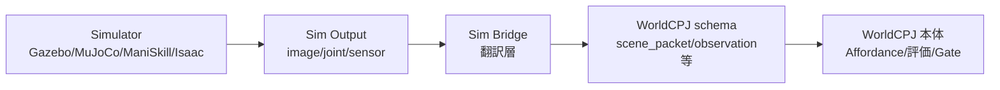

# 4-simulator landscape + Sim Bridge の役割

## 目的

4 simulator (Gazebo / MuJoCo / ManiSkill / Isaac) の用途差を理解し、自分の case にどれを使うか判断材料を持つ。Sim Bridge の本質 (Sim I/O ↔ WorldCPJ schema 翻訳) を理解し、`simulator_decision_table_template.md` で選択練習を行う。

## 1. Gazebo (要約)

詳細は [L5](./l5_gazebo_fortress_ros2_bridge.md) 参照。要点:

- ROS 2 統合 + robot model 検証の場
- `ros_gz_bridge` で gz topic ↔ ROS 2 topic 翻訳
- Q1 SP3 標準 simulator
- Fortress EOL 2026-09、SP6+ で Harmonic 移行

## 2. MuJoCo

- **軽量接触/制御/学習実験** 向け
- Python API (`mujoco`) でスクリプト driven、CUDA 不要
- ROS 2 統合は **薄い** (MuJoCo ROS 2 ラッパは存在するが標準ではない)
- 物理エンジン精度が高く、研究 / RL training 向け
- SP5 Sim Role での hands-on 候補
- 参照: R-20 (MuJoCo Documentation), R-21 (MuJoCo Python)

## 3. ManiSkill

- **manipulation benchmark + parallel data 収集** 向け
- GPU 必須 (CUDA)
- RL training 向け、parallel envs で reproducibility 高い
- ROS 2 統合は中程度 (community wrapper あり)
- SP5 Sim Role での hands-on 候補
- 参照: R-22 (ManiSkill Documentation), R-23 (ManiSkill Quickstart)

## 4. Isaac Sim / Lab

- **高忠実度 rendering + synthetic data + large-scale RL** 向け
- **インストールサイズが大きく、NVIDIA GPU + nvidia-docker / NVIDIA stack 依存が強い**
- Robot Learning 担当の Watch 教材として位置づけ
- Phase 0 全員ハンズオンには **不適合** (環境負荷が大きすぎる)
- 参照: R-24 (NVIDIA Isaac Sim learning docs), R-25 (Isaac Lab tutorials)

## 5. 4×4 比較 table

| 軸 | Gazebo (Fortress) | MuJoCo | ManiSkill | Isaac Sim/Lab |
|---|---|---|---|---|
| rendering 忠実度 | 中 | 中 | 中-高 | **最高** |
| contact 物理 | 中 | **高精度** | 中-高 | 高 |
| parallel data 収集 | 弱 | 中 | **強** (parallel envs) | **最強** (large-scale RL) |
| ROS 2 統合 | **標準** (ros_gz_bridge) | 弱 (wrapper のみ) | 中 (community wrapper) | 中 (Isaac ROS) |

## 6. Sim Bridge の役割

**Sim Bridge = Sim I/O ↔ WorldCPJ schema 翻訳層**。

Sim 出力 (画像、joint angle、contact force) を WorldCPJ provisional schema (`scene_packet`, `observation` 等) に mapping することが Sim Bridge の本質。実 bridge コード (Lab 6b で扱う) は Stub 段階で、actual mapping は SP4-5 / Q1 後半で WorldCPJ 本体 schema 確定と並行。

## 7. simulator_decision_table を埋める判断練習

`simulator_decision_table_template.md` を Sandbox にコピーし、上記 4×4 table を自分の case で埋める。さらに:

- 「私の case = …」(1 行)
- 「選んだ simulator = …」(1 行)
- 「選んだ理由 = …」(1-2 行)

を書く。SP5 Sim Role / Q1 後半の意思決定の **入口** になる。

## 8. よくある誤解

| 誤解 | 実際 |
|---|---|
| Isaac が一番高機能なら Isaac を使えばいい | GPU/install/学習コスト大、Phase 0 では Gazebo で十分 |
| ManiSkill は ROS 2 と無縁 | community wrapper あり、ただし標準ではない |
| 全部試してから選ぶ | 用途で先に絞る (rendering 重視 / contact 重視 / parallel data 重視 / ROS 統合重視) |
| simulator 比較で WorldCPJ が動く | 違う、Sim Bridge で WorldCPJ schema に翻訳して初めて WorldCPJ 成果になる |

## 次のLab

→ [Lab 6: provisional schema 8 field 設計演習](../labs/lab6_sim_to_worldcpj_schema/README.md)
