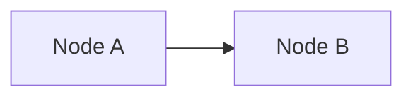

# Course Documentation Conventions

本文書はこのコースリポジトリ内のすべての文書・成果物が従うべきランタイムルールセットである。SP2以降を含む将来のすべての実装はこの規約を踏襲すること。

---

## 1. 命名規約

| 対象 | 規約 | 例 |
|---|---|---|
| Lecture file | `l<番号>_<topic_snake>.md` (lowercase) | `l1_ros2_basics.md` |
| Lab folder | `lab<番号>[a-z]?_<topic_snake>/` | `lab1_turtlesim_rosbag/`, `lab4b_codex_mock_adapter/` |
| Lab中の文書 | `README.md` (手順)、`HINTS.md` (任意)、`CHECKLIST.md` (合格条件、正本) | — |
| Template | `<deliverable>_template.md` | `skill_baseline_sheet_template.md` |
| Sandbox reference | `sandbox_reference/week<N>/lab<N>/` | `sandbox_reference/week1/lab1/` |
| Branch (instructor) | `course/sp<N>-<topic>` | `course/sp1-foundation-week1` |
| Branch (学習者向け推奨) | `learner/<name>/wk<N>-<topic>` | `learner/alice/wk1-tf-tree` |
| Commit prefix | `feat:`, `docs:`, `chore:`, `lab:`, `tool:`, `resource:`, `fix:` | `lab: add turtlesim bag exercise` |

**大文字例外** (GitHub慣習・Course独自):

- `README.md`, `CONTRIBUTING.md`, `LICENSE`, `CHANGELOG.md` — リポジトリ慣習
- `CHECKLIST.md`, `HINTS.md` — Lab内特殊役割文書
- 上記以外はすべて lowercase ASCII (`a-z 0-9 _ -`) のみ使用可

**Branch名の詳細**:

- instructor管理ブランチ: `course/sp<N>-<topic>` 形式 (例: `course/sp1-foundation-week1`)
- 学習者推奨ブランチ: `learner/<name>/wk<N>-<topic>` 形式 (例: `learner/alice/wk1-tf-tree`)
- すべて lowercase ASCII、`/` 区切り

---

## 2. 文書共通 front matter (10キー)

すべての教材文書は以下の front matter を持つ。`type` の値によって必須/任意が異なる (§2.1 参照)。

```yaml
---
type: lecture | lab | template | reference | week | setup | guide | checklist | hints | spec | plan
id: W1-L1                          # W<week>-{L<n>|Lab<n>[a-z]?|T-<short>} | SPEC-<id> | PLAN-<id>
title: ROS2 基礎 (node/topic/service/action/launch)
week: 1
duration_min: 45
prerequisites: [W1-L0]             # 統一キー
worldcpj_ct: [CT-01, CT-07]
roles: [common]                    # common | affordance | adapter | logging | sim | nav | gate | sandbox
references: [R-01, R-02]           # docs/references.md の ID
deliverables: []                   # lectureなら空、labなら成果物リスト
---
```

**`type` enum 全11値**:

| 値 | 用途 |
|---|---|
| `lecture` | 講義ファイル |
| `lab` | 演習 README |
| `template` | 学習者用テンプレート |
| `reference` | sandbox reference 文書 |
| `week` | 週単位 README |
| `setup` | 環境構築文書 |
| `guide` | 運用ガイド (本文書など) |
| `checklist` | 合格条件チェックリスト |
| `hints` | ヒント文書 |
| `spec` | 設計書 |
| `plan` | 実装計画 |

**`id` 命名ルール**:

- lecture/lab/template/week/setup: `W<week>-{L<n>|Lab<n>[a-z]?|T-<short>|Wk}` (例: `W1-L1`, `W1-Lab1`, `W1-T-skill`)
- spec: `SPEC-<id>` (例: `SPEC-SP1`)
- plan: `PLAN-<id>` (例: `PLAN-SP1`)
- guide/reference/checklist/hints: 文脈に応じた短縮ID

### 2.1 type別 front matter 必須/任意

| type | 対象ファイル | front matter |
|---|---|---|
| `lecture` | `course/week<N>/lectures/l<n>_*.md` | **必須** (10キー) |
| `lab` | `course/week<N>/labs/lab<n>*/README.md` | **必須** (10キー) |
| `template` | `course/week<N>/deliverables/*_template.md` | **必須** (10キー) |
| `week` | `course/week<N>/README.md` | **必須** (10キー) |
| `setup` | `course/00_setup/*.md` | **必須** (10キー、配列フィールド (prerequisites / worldcpj_ct / references / deliverables) は空配列 `[]` 許容) |
| `reference` | `sandbox_reference/**/*.md` | **必須** (10キー) |
| `checklist` | `lab<n>*/CHECKLIST.md` | **任意** (省略可。check_structure.sh は CHECKLIST.md / HINTS.md の front matter を検証対象としない。文脈情報は同 lab フォルダの README.md (front matter 必須) から人間が読み取る) |
| `hints` | `lab<n>*/HINTS.md` | **任意** (省略可。check_structure.sh は CHECKLIST.md / HINTS.md の front matter を検証対象としない。文脈情報は同 lab フォルダの README.md (front matter 必須) から人間が読み取る) |
| `guide` | `README.md`, `CONTRIBUTING.md`, `docs/CONVENTIONS.md`, `docs/glossary.md`, `docs/references.md` | **任意** (慣習文書。10キー不要、4キー (type/id/title/date) のみで運用) |
| `spec` | `docs/superpowers/specs/*.md` | **専用 front matter** (course 10キー対象外) |
| `plan` | `docs/superpowers/plans/*.md` | **専用 front matter** (course 10キー対象外) |

**`spec` 専用 front matter 必須キー**:

- `type`, `id`, `title`, `date`
- `status`: `draft` / `pending_user_review` / `approved` / `superseded`
- `sub_project`: 対象SPの識別子
- `related_plan`: 対応する実装計画へのパス (plan未生成時もパス予定値を記載)

**`plan` 専用 front matter 必須キー**:

- `type`, `id`, `title`, `date`
- `status`: `draft` / `pending_user_review` / `approved` / `superseded`
- `sub_project`: 対象SPの識別子
- `related_spec`: 派生元 spec へのパス

---

## 3. Lab成果物のGit管理ルール

### 3.1 .gitignore (root)

リポジトリ root の `.gitignore` は以下を含む。以下のエントリはすべて必須。リポジトリ root の `.gitignore` と byte 単位で一致させること。

```gitignore
# ROS2 build artifacts at repo root
/build/
/install/
/log/

# rosbag2 / mcap bodies are not committed
*.db3
*.db3-journal
*.mcap
**/rosbag2_*/

# Lab 2 local-only artifacts (view_frames output)
**/frames.pdf
**/frames.gv
**/frames.png

# Python / IDE
__pycache__/
*.pyc
.vscode/
.idea/

# Large media
*.mp4
*.mov
```

上記エントリはすべて必須。追加が必要な場合は末尾に追記し、コメントで理由を記す。

### 3.2 Commit対象 (軽量証跡のみ)

| 種別 | OK (commit) | NG (commitしない) |
|---|---|---|
| bag関連 | `bag_info.txt`, `rosbag_metadata.yaml` | `.db3`, `.mcap`, `rosbag2_*/` 本体 |
| terminal log | `terminal_*.log` | バイナリ terminal capture |
| 画像 | 1MB以下のPNG | 動画、未圧縮画像 |
| 大きなbag | 外部ストレージ参照URLをmdに書く | リポジトリへ直接push |

**`rosbag_metadata.yaml` の運用注記**:

`rosbag2` が生成するディレクトリ内の `metadata.yaml` を `cp` して軽量コピーとして commit する。コピー先は Lab 成果物フォルダ直下 (例: `lab1_turtlesim_rosbag/rosbag_metadata.yaml`)。元の `rosbag2_*/` ディレクトリ本体は `.gitignore` でブロックされているため誤って commit されない。

学習者向け注記は `course/week1/labs/lab1_turtlesim_rosbag/README.md` 末尾に明記する。

---

## 4. 合格条件の正本一本化

- **正本: `CHECKLIST.md`**  
  Lab フォルダ内の `CHECKLIST.md` が合格条件の唯一の正本である。
- **Lab `README.md` の扱い**  
  Lab `README.md` 末尾には `# 合格条件` セクションを置くが、本文は1行のみ:  
  `合格条件は [CHECKLIST.md](./CHECKLIST.md) を参照。`
- **`CHECKLIST.md` の形式**  
  チェックボックス形式 (`- [ ] 条件`) で記述する。

この分離により、合格条件の更新が `CHECKLIST.md` だけで完結し、`README.md` との二重管理を回避する。

---

## 5. ドキュメント分離 (glossary vs references)

> 本セクションが指す `glossary.md` と `references.md` は SP1 後続タスク (Task 3, 4) で作成される。

| ファイル | 責務 | 収録内容 |
|---|---|---|
| `docs/glossary.md` | 英↔日 用語と短い定義のみ | ROS2/MoveIt/Calibration/Safety/Git/Codex 分類別用語 |
| `docs/references.md` | リソース台帳 | R-01〜R-39 + R-40+ の追番管理 |

**`docs/references.md` の表項目**: ID, タイトル, URL, 種別, 対応Week, 対応Role, 最終確認日

**参照の方向**:

- front matter の `references: [R-01]` は `docs/references.md` を引く
- `glossary.md` は front matter から直接引かれない (用語説明専用)

**`glossary.md` に含めてはいけないもの**: URL、外部リソースのリスト、合格条件、Lab手順

---

## 6. Codex統合パターン

Codex (AI コーディングアシスタント) の利用は週ごとに段階的に必須化する。

| Week | Codex 必須度 | 内容 |
|---|---|---|
| Week 1 | **接続確認 + ルール理解 + prompt前5項目の練習のみ** | Codex生成コードを成果物に必須化しない。Lab 0で workspace接続/connector確認/`tools/codex_prompt_template.md` 写経 |
| Week 2 | **必須**: Lab 4b で生成→PR→人間レビュー一巡 | `sandbox_pr_review_notes.md` を最低1件提出 |
| Week 3 | **必須**: Lab 6b で bridge stub / schema mappingをCodex支援で1PR | レビュー観点に schema整合性追加 |
| Week 4 | **必須**: Lab 8b でCodex任せ範囲・人間判断・検証証跡を分離記録 | 最終sandbox final review |

**段階表のまとめ**:

- Week 1: 練習のみ (生成コードを成果物に含めることを強制しない)
- Week 2 以降: 必須 (Lab 4b/6b/8b で各1PR以上)

**Lab 4b/6b/8b 共通 README セクション例**:

W2/W3/W4 の Lab 4b/6b/8b 各 `README.md` に以下の共通セクションを含める:

```markdown
# Codex 利用ガイド (このLab必須)
## prompt前に書く5項目
- 目的 / 入力 / 制約 / 成功条件 / 検証コマンド
  → 雛形: ../../../../tools/codex_prompt_template.md
## 委ねない判断
- Affordance schema、評価指標、安全境界、実機投入可否
## レビュー観点 (sandbox_pr_review_notes.md に記録)
- diff summary / 動く根拠 / 壊れうる条件 / 採用しない提案 / 追加修正
```

**prompt前5項目**: 目的 / 入力 / 制約 / 成功条件 / 検証コマンド。雛形は `tools/codex_prompt_template.md`。

---

## 7. Templateの2形態

| ファイル | 場所 | 用途 |
|---|---|---|
| `<x>_template.md` (空欄) | `course/week<N>/deliverables/` | 学習者がコピーして使う空テンプレート |
| `<x>_example.md` (記入済) | `sandbox_reference/week<N>/` | instructor が記入した参照例 |

**運用ルール**:

- template は学習者が `cp` して自分の Sandbox repo に持ち込む
- example は `sandbox_reference/` に置き、学習者が詰まったときの参照用
- template と example は対になっているが、ファイル名の `_template` / `_example` サフィックスで区別する
- `<x>` 部分 (例: `skill_baseline_sheet`) は対応する成果物名と一致させる

---

## 8. sandbox_reference 構成方針

**フォルダ構造**: `sandbox_reference/week<N>/lab<N>/` に成果物を配置する。

```
sandbox_reference/
├── README.md          # スナップショット注意書き (必須)
└── week1/
    ├── lab1/
    ├── lab2/
    └── ...
```

**`sandbox_reference/README.md` 冒頭に必ず明示する内容**:

> これはinstructorの1スナップショットであり唯一解ではない。学習者は自分の `Sandbox_<name>` repoで自分のbranch/PRを作ること。

**配置ルール**:

- `sandbox_reference/` は instructor 1名分の実行結果スナップショット
- 学習者の `Sandbox_<name>` repo とは別物 (本リポジトリには学習者の成果物を入れない)
- 各Labの参照例 (`<x>_example.md`) はここに置く (§7 参照)
- バイナリ成果物は §3.2 のOK条件に従う

---

## 9. 図表方針

**第一選択: Mermaid**

GitHub が標準サポートする Mermaid を第一選択とする。コードフェンスは必ず ` ```mermaid ` を使う。

````markdown

````

**第二選択: ASCII図**

Mermaid で表現しにくい場合 (例: 複雑なシーケンスの詳細) は ASCII 図を使う。

**不採用: PlantUML / 外部ツール DSL**

PlantUML その他の外部ツール DSL は不採用。GitHub 標準で直接レンダリングされないため、学習者環境に依存が生まれる。

**バイナリ画像のルール**:

- 配置先: `assets/` 配下
- サイズ: 1MB 以下
- 種別: 再現可能性のあるスクリーンショットに限定
- 動画・未圧縮画像はコミット禁止 (§3.2 参照)

---

## 10. 文字制限とロケール

| 対象 | ルール |
|---|---|
| ファイル名・フォルダ名 | lowercase ASCII、`a-z 0-9 _ -` のみ (例外は §1) |
| Branch名 | lowercase ASCII、`/` 区切り |
| Commit message | 英語、prefix付き (§1 の Commit prefix 参照) |
| 散文 (md本文) | 日本語OK |
| コード識別子 | 英語 snake_case (Python) / camelCase (該当時) |

**補足**:

- ファイル名の大文字例外は §1 の「大文字例外」リストに記載されたもののみ
- Commit message は `feat:`, `docs:`, `chore:`, `lab:`, `tool:`, `resource:`, `fix:` のいずれかのprefixで始める
- md本文の散文は日本語で記述し、コード識別子・コマンド・キーワードは英語のまま埋め込む

---

## 11. Tool動作確認規約

| 種別 | 必須 | 推奨 |
|---|---|---|
| Tool (`tools/*.sh`, `course/00_setup/verify_setup.sh`) | `bash -n` 構文チェック通過 + 実行成功 | `shellcheck` 警告解消 |

**`bash -n` 必須の理由**:

`bash -n` は bash 同梱のため追加インストール不要。すべての `.sh` ファイルは commit 前に `bash -n <script>` で構文チェックを通過しなければならない。

**`shellcheck` 推奨の理由**:

`shellcheck` は別途インストールが必要なため現時点では必須化しない。ただし利用可能な環境では実行して警告を解消することを強く推奨する。CI 整備時 (SP6+) に必須昇格を検討する。

**確認手順例**:

```bash
# 構文チェック (必須)
bash -n tools/verify_env.sh

# shellcheck (推奨)
shellcheck tools/verify_env.sh
```

---

## 12. リソース参照のIDシステム

教育計画原典 §6 の R-01 〜 R-39 をそのまま ID として `docs/references.md` で管理する。

**IDルール**:

- **R-01〜R-39**: 教育計画原典 §6 から移植した既存リソース
- **R-40+**: 新規追加リソースの追番 (SP2以降も継続追番)

**運用方法**:

- 各SPでは既存IDを front matter の `references:` フィールドで参照する
- URL変更・内容更新時は `docs/references.md` の最終確認日のみ更新する
- 新規リソースは `docs/references.md` に R-40+ で追記し、front matter で参照する

**`docs/references.md` の表項目**:

| 列 | 内容 |
|---|---|
| ID | `R-<nn>` |
| タイトル | リソース名称 |
| URL | 参照URL |
| 種別 | 公式doc / 論文 / 動画 / ツール 等 |
| 対応Week | W1〜W4 または全Week |
| 対応Role | common / affordance / adapter 等 |
| 最終確認日 | YYYY-MM-DD 形式 |

**参照例** (front matter):

```yaml
references: [R-01, R-07, R-23]
```

このIDは `docs/references.md` の ID 列と完全一致しなければならない。存在しないIDを `references:` に書いてはならない。
