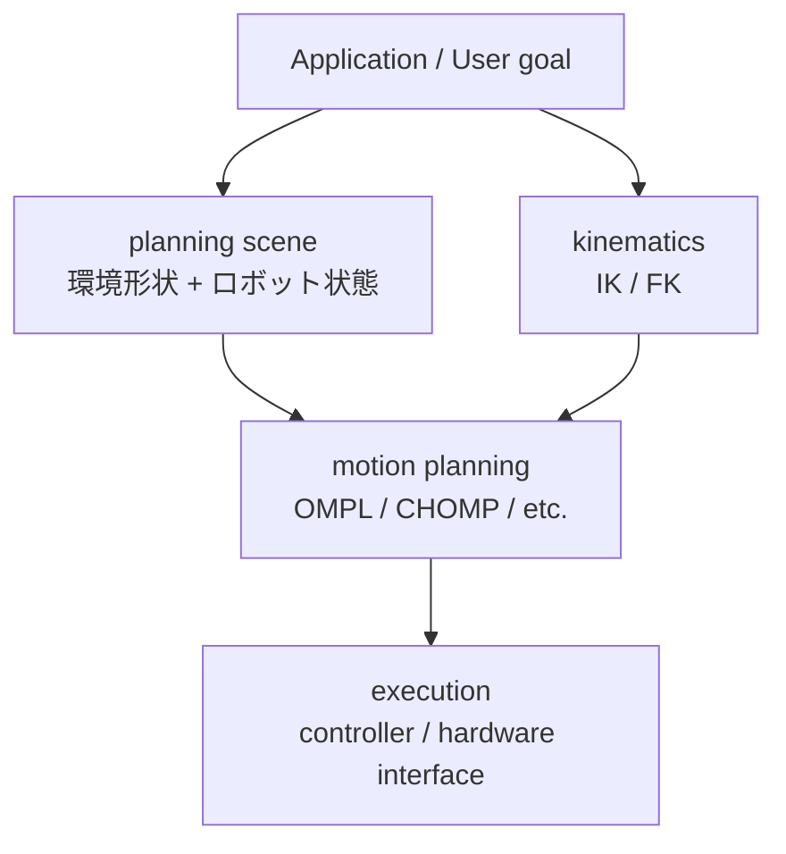
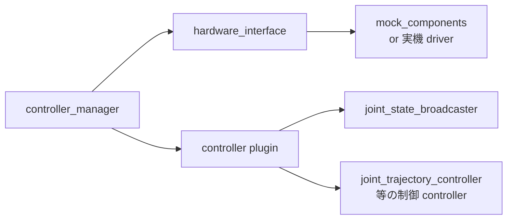
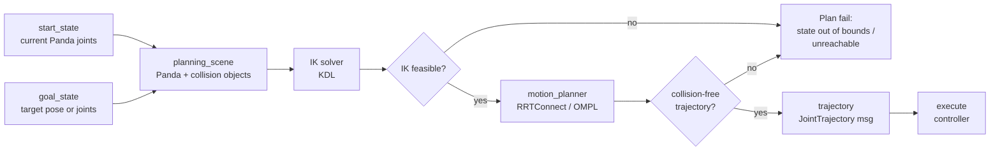

# Robotics Education Course — SP2 Implementation Plan

> **For agentic workers:** REQUIRED SUB-SKILL: Use superpowers:subagent-driven-development (recommended) or superpowers:executing-plans to implement this plan task-by-task. Steps use checkbox (`- [ ]`) syntax for tracking.

**Goal:** Build SP2 (Week 2 教材) — final state 71 files (SP1 base 43 + SP2 new 27 + plan 1), satisfying 5 verification gates (G1, G2, G3 via `--week 2`, G4 with 33 patterns, G5a). 27 new files + 3 modified files.

**Architecture:** Mono-repo continuation from SP1. New `course/week2/` (Lecture 2 + Lab 3 + Template 2 + README) + `sandbox_reference/week2/` (12 real-run / instructor walk-through artifacts). Tool extensions: `tools/verify_env.sh` gains `--week N` mode, `tools/check_structure.sh` adds W2 expected files + G4 patterns (33 件) + here-string fix + I-5 normalization. Two-axis policy: 全員ベースライン = mock_hardware 中心, instructor sandbox_reference = MoveIt2 + ros2_control 全 Lab real run.

**Tech Stack:** Markdown (with YAML front matter), Bash 5.x, Mermaid (in code fences), ROS 2 Humble + MoveIt 2 + ros2_control + ros2_controllers + colcon (for actual Lab 3/4/4b walk-throughs), Python 3.10+ for noop_logger.py.

**Authoritative reference:** `docs/superpowers/specs/2026-04-27-robotics-course-sp2-design.md` (commit `c4f7d97`, status approved). When in doubt, defer to spec §-numbers cited in each task.

**Pre-conditions already satisfied:**
- SP1 complete and merged to `main` (commit `90bc64c`, 43 tracked files, 5 gates PASS at SP1 level)
- SP2 design spec written and approved (`c4f7d97`)
- Working branch `course/sp2-week2-manipulation` already exists, HEAD `c4f7d97`, pushed to `origin`
- Local git identity set: `pasorobo` / `goo.mail01@yahoo.com`
- ROS 2 Humble + git + python3 + bash installed (verified by SP1 G3)
- DISPLAY=:0 available (for RViz GUI in Lab 3 walk-through)

**Working branch:** All work in this plan happens on `course/sp2-week2-manipulation`. Merge to `main` only after Task 15 (all 5 gates PASS).

**Total tasks:** 15

---

## Conventions for Plan Execution

- **Each task ends with a commit.** Commit prefixes per CONVENTIONS.md §2.1: `feat:`, `docs:`, `lab:`, `tool:`, `resource:`, `chore:`, `fix:`.
- **Commit author/email** is set per-repo to `pasorobo` / `goo.mail01@yahoo.com`. Do not change.
- **No Co-Authored-By trailer.** Do not add `Co-Authored-By:` lines or any reference to AI/coding agents in commit messages. The author identity is the human committer; commit bodies describe what changed and why, nothing else.
- **G3 / G4 are environment-dependent gates.** Tasks 12 (Lab 3 RViz walk) and 13 (Lab 4 + 4b real ROS walk) require Ubuntu 22.04 + ROS 2 Humble + MoveIt 2 + ros2_control + colcon. If those are not available, content can be hand-authored, but Task 15 must report **"教材生成は完了、実走ゲート未完了"** and explicitly list which artifacts are synthetic vs real-execution. SP2 closure can only be claimed if Lab 4 + 4b artifacts come from a real run.
- **Documentation files** must follow CONVENTIONS.md §2 (front matter, naming, etc.). When in conflict between this plan and CONVENTIONS.md, **CONVENTIONS.md wins** (since it's the runtime ruleset).
- **For each new file**, the task provides: exact path, exact front matter, section structure, content invariants. Engineer fills in detailed prose following spec §3 骨子.
- **Verification step** for documentation tasks: confirm file exists, front matter parses, local links resolve. After Task 2 (`tools/check_structure.sh` extended), use that script to verify (expected to FAIL with missing W2 files until Task 13 complete; the script is designed to be intermediate-failure-tolerant).
- **Working branch state at each task**: HEAD advances by ~1 commit per task. Push to `origin/course/sp2-week2-manipulation` is optional per task; Task 15 closure pushes the final state.
- **Two-axis policy**: 全員ベースライン教材 (course/) は mock_hardware 中心、instructor sandbox_reference (sandbox_reference/) は MoveIt2 + ros2_control 全 Lab real run。

---

## Task 1: tools/verify_env.sh の --week N モード拡張

**Files:**
- Modify: `tools/verify_env.sh` (add `--week N` argument parsing + week 2 specific checks)

Spec §1.3, §2.3 #27, §5.1 G3, §5.3.

- [ ] **Step 1: Read current `tools/verify_env.sh`**

```bash
wc -l tools/verify_env.sh
```
Expected: 97 lines (SP1 baseline).

- [ ] **Step 2: Edit script — add argument parsing at top**

After the `set -uo pipefail` line, add:

```bash
# --- Argument parsing (SP2 added) ---
WEEK_MODE="default"
while [[ $# -gt 0 ]]; do
    case "$1" in
        --week)
            shift
            WEEK_MODE="${1:-default}"
            shift
            ;;
        --help|-h)
            cat <<'EOH'
Usage: verify_env.sh [--week N]
  (no arg)   : SP1-compatible mode (Gazebo required, MoveIt 2 WARN if absent)
  --week 2   : SP2 mode (MoveIt 2 + ros2_control + ros2_controllers + colcon required, Gazebo SKIP)
  --week N   : reserved for future SP3+ modes
EOH
            exit 0
            ;;
        *)
            echo "Unknown argument: $1" >&2
            echo "Run 'verify_env.sh --help' for usage" >&2
            exit 2
            ;;
    esac
done
```

- [ ] **Step 3: Edit script — refactor MoveIt and Gazebo sections to be week-aware**

Replace the existing `[MoveIt 2]` and `[Gazebo (Fortress)]` blocks with:

```bash
echo "[Gazebo (Fortress)]"
if [[ "$WEEK_MODE" == "2" ]]; then
    print_check "gazebo CLI (week 2 mode)" "SKIP" "(SP3 で復活予定)"
else
    check_either "gazebo CLI" gz ign
fi

echo "[MoveIt 2]"
if [[ "$WEEK_MODE" == "2" ]]; then
    check_required "ros-humble-moveit pkg" bash -c 'dpkg -l | grep -q "ros-humble-moveit "'
    check_required "ros-humble-moveit-resources-panda-moveit-config pkg" \
        bash -c 'dpkg -l | grep -q "ros-humble-moveit-resources-panda-moveit-config "'
    check_required "ros-humble-ros2-control pkg" bash -c 'dpkg -l | grep -q "ros-humble-ros2-control "'
    check_required "ros-humble-ros2-controllers pkg" bash -c 'dpkg -l | grep -q "ros-humble-ros2-controllers "'
    check_required "colcon CLI" command -v colcon
else
    if dpkg -l 2>/dev/null | grep -q "ros-humble-moveit "; then
        print_check "ros-humble-moveit pkg" "PASS"
        PASS=$((PASS+1))
    else
        print_check "ros-humble-moveit pkg" "WARN" "(SP1 only needs demo install; SP2 requires full)"
        WARN=$((WARN+1))
    fi
fi
```

- [ ] **Step 4: Syntax check + smoke test default mode**

```bash
bash -n tools/verify_env.sh && echo "syntax OK"
bash tools/verify_env.sh --help
bash tools/verify_env.sh || true   # SP1 互換、Gazebo 未導入なら FAIL 想定
```

Expected: `syntax OK`, `--help` shows usage, no-arg run produces SP1-compatible output (FAIL on Gazebo if absent).

- [ ] **Step 5: Smoke test --week 2 mode (env not yet set up — should FAIL on missing apt packages)**

```bash
bash tools/verify_env.sh --week 2 || true
```

Expected: FAIL on `ros-humble-moveit pkg`, `ros-humble-moveit-resources-panda-moveit-config pkg`, `ros-humble-ros2-control pkg`, `ros-humble-ros2-controllers pkg`, `colcon CLI`. SKIP on `gazebo CLI (week 2 mode)`. PASS on Ubuntu/ROS 2/git/python3/bash.

- [ ] **Step 6: Commit**

```bash
git add tools/verify_env.sh
git commit -m "$(cat <<'EOF'
tool: add --week N mode to tools/verify_env.sh

Spec §1.3, §2.3 #27, §5.1 G3. Adds --week argument parsing.
--week 2 mode requires MoveIt 2 + Panda demo config + ros2_control +
ros2_controllers + colcon, marks Gazebo as SKIP. Default no-arg
preserves SP1-compatible behavior (Gazebo required).

--help flag added for discoverability. Future SP3+ can extend with
--week 3 (Gazebo restored), --week 4 (rosbag2 fast write etc).
EOF
)"
```

---

## Task 2: tools/check_structure.sh の SP2 拡張

**Files:**
- Modify: `tools/check_structure.sh` (expand EXPECTED_FILES to 70 entries, add helpers, add G4 patterns, here-string fix, I-5 normalization)

Spec §1.3, §2.3 #28, §5.1, §5.2.

This task **expands the static validator** to cover all SP2 files. After this task, running the script will produce many missing-file FAILs (expected — those files come in T4-T13). Task 15 runs the script again and expects PASS.

- [ ] **Step 1: Read current `tools/check_structure.sh`**

```bash
wc -l tools/check_structure.sh
```
Expected: 270 lines (SP1 baseline after fix `89cef18` + `3266aac`).

- [ ] **Step 2: Add `sandbox_reference/week1/lab1/README.md` to EXPECTED_FILES (I-5 normalization)**

Find the `EXPECTED_FILES=(` block. After the entry `"sandbox_reference/week1/lab1/terminal_5min.log"`, add:

```bash
    "sandbox_reference/week1/lab1/README.md"
```

- [ ] **Step 3: Add 27 W2 files to EXPECTED_FILES**

After the I-5 line above (or grouped at end of array), append:

```bash
    # === SP2 / Week 2 (27 files) ===
    "course/week2/README.md"
    "course/week2/lectures/l3_moveit2_overview.md"
    "course/week2/lectures/l4_robot_adapter_calibration_safety.md"
    "course/week2/labs/lab3_rviz_planning/README.md"
    "course/week2/labs/lab3_rviz_planning/CHECKLIST.md"
    "course/week2/labs/lab3_rviz_planning/HINTS.md"
    "course/week2/labs/lab4_mock_hardware_adapter/README.md"
    "course/week2/labs/lab4_mock_hardware_adapter/CHECKLIST.md"
    "course/week2/labs/lab4_mock_hardware_adapter/HINTS.md"
    "course/week2/labs/lab4b_codex_noop_adapter_logger/README.md"
    "course/week2/labs/lab4b_codex_noop_adapter_logger/CHECKLIST.md"
    "course/week2/labs/lab4b_codex_noop_adapter_logger/HINTS.md"
    "course/week2/deliverables/robot_readiness_mini_report_template.md"
    "course/week2/deliverables/sandbox_pr_review_notes_template.md"
    "sandbox_reference/week2/robot_readiness_mini_report_example.md"
    "sandbox_reference/week2/sandbox_pr_review_notes_example.md"
    "sandbox_reference/week2/lab3/README.md"
    "sandbox_reference/week2/lab3/planning_evidence.md"
    "sandbox_reference/week2/lab4/README.md"
    "sandbox_reference/week2/lab4/controller_spawn.log"
    "sandbox_reference/week2/lab4/controllers_list.txt"
    "sandbox_reference/week2/lab4/joint_states_echo.log"
    "sandbox_reference/week2/lab4b/README.md"
    "sandbox_reference/week2/lab4b/codex_prompt_lab4b.md"
    "sandbox_reference/week2/lab4b/noop_logger.py"
    "sandbox_reference/week2/lab4b/execution_log.txt"
    "docs/superpowers/plans/2026-04-27-robotics-course-sp2-plan.md"
```

(`docs/superpowers/specs/2026-04-27-robotics-course-sp2-design.md` is already in EXPECTED_FILES from SP1 — verify it's there. If absent, add it. Plan file added per above.)

Expected total: 43 (SP1 normalized) + 27 (W2) = **70 entries**.

- [ ] **Step 4: Add W2 files to COURSE_TEN_KEY_FILES**

Find `COURSE_TEN_KEY_FILES=(` block. Append:

```bash
    # === SP2 / Week 2 (10-key required: lecture/lab/template/week/reference) ===
    "course/week2/README.md"
    "course/week2/lectures/l3_moveit2_overview.md"
    "course/week2/lectures/l4_robot_adapter_calibration_safety.md"
    "course/week2/labs/lab3_rviz_planning/README.md"
    "course/week2/labs/lab4_mock_hardware_adapter/README.md"
    "course/week2/labs/lab4b_codex_noop_adapter_logger/README.md"
    "course/week2/deliverables/robot_readiness_mini_report_template.md"
    "course/week2/deliverables/sandbox_pr_review_notes_template.md"
    "sandbox_reference/week2/robot_readiness_mini_report_example.md"
    "sandbox_reference/week2/sandbox_pr_review_notes_example.md"
    "sandbox_reference/week2/lab3/README.md"
    "sandbox_reference/week2/lab3/planning_evidence.md"
    "sandbox_reference/week2/lab4/README.md"
    "sandbox_reference/week2/lab4b/README.md"
    "sandbox_reference/week2/lab4b/codex_prompt_lab4b.md"
```

(`controller_spawn.log`, `controllers_list.txt`, `joint_states_echo.log`, `noop_logger.py`, `execution_log.txt` are intentionally excluded — they have no front matter per CONVENTIONS.md §2.2 footnote.)

- [ ] **Step 5: Convert front matter check to here-string (false-positive fix)**

Find the loop `for f in "${COURSE_TEN_KEY_FILES[@]}"; do`. Inside it, replace:

```bash
        if ! echo "$fm" | grep -qE "^${k}:"; then
```

with:

```bash
        if ! grep -qE "^${k}:" <<< "$fm"; then
```

Apply the same fix to `check_special_fm` function (used for spec/plan 7-key check):

```bash
        if ! grep -qE "^${k}:" <<< "$fm"; then
```

- [ ] **Step 6: Add new helper functions before the existing G4 section**

Find the line `# ---------- G4: Sandbox content patterns ----------`. Just before it, add:

```bash
check_pattern_must() {
    local f="$1"
    local pattern="$2"
    local label="$3"
    if [[ ! -f "$f" ]]; then
        warn "missing for must-pattern check (covered by G1): $f"
        return
    fi
    if grep -qE "$pattern" "$f"; then
        ok
    else
        err "$f: must-pattern not found ($label): /$pattern/"
    fi
}

check_pattern_must_not() {
    local f="$1"
    local pattern="$2"
    local label="$3"
    if [[ ! -f "$f" ]]; then
        warn "missing for must-not-pattern check (covered by G1): $f"
        return
    fi
    if grep -qE "$pattern" "$f"; then
        err "$f: must-not-pattern matched ($label): /$pattern/"
    else
        ok
    fi
}
```

(Note: `check_pattern` and `check_min_size` already exist from SP1 fix `89cef18`. Reuse them. New helpers are `check_pattern_must` and `check_pattern_must_not` for clearer naming in W2 patterns.)

- [ ] **Step 7: Add 33 W2 G4 patterns to the G4 section**

After the existing SP1 G4 patterns (the `check_pattern` and `check_min_size` block for week1), append:

```bash
echo
echo "==== G4 (W2): Lab 3 / 4 / 4b sandbox content patterns ===="

# Lab 3 (3 patterns)
check_pattern_must "sandbox_reference/week2/lab3/planning_evidence.md" '```mermaid' "mermaid fence"
check_pattern_must "sandbox_reference/week2/lab3/planning_evidence.md" "[Pp]lan" "Plan言及"
check_pattern_must "sandbox_reference/week2/lab3/planning_evidence.md" "[Ff]ail|FAIL|失敗" "Plan失敗例"

# Lab 4 (4 patterns)
check_pattern_must "sandbox_reference/week2/lab4/controller_spawn.log" "controller_manager" "ros2_control起動"
check_pattern_must "sandbox_reference/week2/lab4/controllers_list.txt" "joint_state_broadcaster|forward_position_controller" "controller名"
check_pattern_must "sandbox_reference/week2/lab4/controllers_list.txt" "active" "controller active 状態確認"
check_pattern_must "sandbox_reference/week2/lab4/joint_states_echo.log" "position:|name:" "/joint_states 実受信"

# Lab 4b (7 patterns)
check_pattern_must "sandbox_reference/week2/lab4b/noop_logger.py" "rclpy" "rclpy import"
check_pattern_must "sandbox_reference/week2/lab4b/noop_logger.py" "/joint_states" "joint_states subscribe"
check_pattern_must_not "sandbox_reference/week2/lab4b/noop_logger.py" "KDL" "禁止: KDL実コード"
check_pattern_must_not "sandbox_reference/week2/lab4b/noop_logger.py" "controller_manager" "禁止: controller_manager"
check_pattern_must "sandbox_reference/week2/lab4b/execution_log.txt" "noop_logger" "noop_logger 起動確認"
check_pattern_must "sandbox_reference/week2/lab4b/execution_log.txt" "recv name=|pos=" "joint_states 実受信証跡"
check_min_size    "sandbox_reference/week2/lab4b/execution_log.txt" 200 "実行ログ最小サイズ 200 bytes"

# codex_prompt_lab4b.md (6 patterns)
check_pattern_must "sandbox_reference/week2/lab4b/codex_prompt_lab4b.md" "目的" "prompt5項目: 目的"
check_pattern_must "sandbox_reference/week2/lab4b/codex_prompt_lab4b.md" "入力" "prompt5項目: 入力"
check_pattern_must "sandbox_reference/week2/lab4b/codex_prompt_lab4b.md" "制約" "prompt5項目: 制約"
check_pattern_must "sandbox_reference/week2/lab4b/codex_prompt_lab4b.md" "成功条件" "prompt5項目: 成功条件"
check_pattern_must "sandbox_reference/week2/lab4b/codex_prompt_lab4b.md" "検証コマンド" "prompt5項目: 検証コマンド"
check_pattern_must "sandbox_reference/week2/lab4b/codex_prompt_lab4b.md" "禁止" "禁止リスト言及"

# Robot Readiness Mini Report example (7 patterns、行ごと個別)
check_pattern_must "sandbox_reference/week2/robot_readiness_mini_report_example.md" "robot_id" "robot_id 行"
check_pattern_must "sandbox_reference/week2/robot_readiness_mini_report_example.md" "adapter stage" "adapter stage 行"
check_pattern_must "sandbox_reference/week2/robot_readiness_mini_report_example.md" "ROS interface" "ROS interface 行"
check_pattern_must "sandbox_reference/week2/robot_readiness_mini_report_example.md" "calibration state" "calibration state 行"
check_pattern_must "sandbox_reference/week2/robot_readiness_mini_report_example.md" "safety state" "safety state 行"
check_pattern_must "sandbox_reference/week2/robot_readiness_mini_report_example.md" "logging state" "logging state 行"
check_pattern_must "sandbox_reference/week2/robot_readiness_mini_report_example.md" "next gate" "next gate 行"

# Sandbox PR Review Notes example (6 patterns、行ごと個別)
check_pattern_must "sandbox_reference/week2/sandbox_pr_review_notes_example.md" "task split" "task split 行"
check_pattern_must "sandbox_reference/week2/sandbox_pr_review_notes_example.md" "Codex prompt" "Codex prompt 行"
check_pattern_must "sandbox_reference/week2/sandbox_pr_review_notes_example.md" "diff summary" "diff summary 行"
check_pattern_must "sandbox_reference/week2/sandbox_pr_review_notes_example.md" "human review" "human review 行"
check_pattern_must "sandbox_reference/week2/sandbox_pr_review_notes_example.md" "debug evidence" "debug evidence 行"
check_pattern_must "sandbox_reference/week2/sandbox_pr_review_notes_example.md" "judgment boundary" "judgment boundary 行"
```

- [ ] **Step 8: Syntax check + smoke run (expected: many missing FAILs)**

```bash
bash -n tools/check_structure.sh && echo "syntax OK"
bash tools/check_structure.sh; echo "exit=$?"
```

Expected: `syntax OK`. Run reports many `[FAIL] missing: ...` lines for W2 files (about 27 missing) + corresponding `[WARN] missing for ...` for G4 helper checks. Exit code 1. **Intentional** — these will resolve as T4-T13 add the files.

- [ ] **Step 9: Verify here-string fix didn't break SP1 PASS lines**

Count PASS lines for files that exist (SP1 baseline):
```bash
bash tools/check_structure.sh 2>&1 | grep -c "^  \[FAIL\]" || true
bash tools/check_structure.sh 2>&1 | grep "missing:" | wc -l
```

Expected: missing-file FAILs ≥27 (W2 files) and ≤30 (W2 + a few related). No new FAILs for previously-passing SP1 files (front matter false positives should be eliminated).

- [ ] **Step 10: Commit**

```bash
git add tools/check_structure.sh
git commit -m "$(cat <<'EOF'
tool: extend tools/check_structure.sh for SP2

Spec §1.3, §2.3 #28, §5.1, §5.2.

Changes:
- Add 27 W2 expected files to EXPECTED_FILES; total 70.
- Normalize SP1 fix I-5 by adding sandbox_reference/week1/lab1/README.md
  to EXPECTED_FILES (was missing, causing G1 to under-report SP1 actual
  state).
- Add 15 W2 files to COURSE_TEN_KEY_FILES (lecture/lab/template/week/
  reference 系); .log/.txt/.py excluded per CONVENTIONS.md §2.2.
- Convert front matter check from `echo "$fm" | grep -qE` to
  here-string `grep -qE <<< "$fm"` to suppress false positives.
- Add helper functions: check_pattern_must, check_pattern_must_not.
- Add 33 G4 patterns for W2: Lab3 (3), Lab4 (4), Lab4b (7),
  codex_prompt (6), Robot Readiness example (7 row-individual),
  PR Review Notes example (6 row-individual).

Currently fails with ~27 missing files + ~10 G4 WARN-on-missing.
Expected behavior; will pass at Task 15 after T4-T13 fill in W2.
EOF
)"
```

---

## Task 3: Pre-flight (apt install + verify --week 2 PASS)

**Files:** (none modified — system-level apt + validation)

Spec §4.1, §5.3. Validates that instructor environment can support SP2 walk-throughs.

This task is a **gate** before content tasks (T4-T13) start, since several content invariants reference real ROS package behavior. Subagent should pause and surface BLOCKED if apt install fails, rather than silently proceeding.

- [ ] **Step 1: apt install SP2 packages**

```bash
sudo apt update
sudo apt install -y \
    ros-humble-moveit \
    ros-humble-moveit-resources-panda-moveit-config \
    ros-humble-ros2-control \
    ros-humble-ros2-controllers \
    python3-colcon-common-extensions
```

Expected: install succeeds. If any package returns "Unable to locate package", check `/etc/apt/sources.list.d/ros2.list` exists and points to packages.ros.org humble (per `course/00_setup/ubuntu_2204_humble_setup.md`).

- [ ] **Step 2: Source ROS 2 environment**

```bash
source /opt/ros/humble/setup.bash
```

- [ ] **Step 3: Verify --week 2 PASS**

```bash
bash tools/verify_env.sh --week 2
echo "exit=$?"
```

Expected: `Result: PASS`, exit code 0. Specifically:
- PASS: Ubuntu 22.04, ros2 CLI, ros2 Humble, ros-humble-moveit pkg, ros-humble-moveit-resources-panda-moveit-config pkg, ros-humble-ros2-control pkg, ros-humble-ros2-controllers pkg, colcon CLI, git, python3, bash
- SKIP: gazebo CLI (week 2 mode)
- FAIL: 0

If any package check FAILs, fix and re-run before proceeding.

- [ ] **Step 4: Verify check_structure.sh missing count baseline**

```bash
bash tools/check_structure.sh 2>&1 | grep -c "missing:" || true
```

Expected: ~27 (the 27 W2 files added in T2 don't exist yet). This becomes the baseline; missing count should decrease by 1 per file as T4-T13 progress.

- [ ] **Step 5: No commit needed (system-level setup)**

This task verifies the environment but does not modify the repository. Proceed to T4 once Steps 1-4 PASS.

If Step 1 or Step 3 FAIL: report BLOCKED with the failing package or command. Do not proceed to T4.

---

## Task 4: course/week2/README.md

**Files:**
- Create: `course/week2/README.md`

Spec §2.2 #14, §3 (Week 2 README format reference).

- [ ] **Step 1: Generate week 2 skeleton via existing tool**

```bash
bash tools/new_week_skeleton.sh 2
```

Expected: `course/week2/{lectures,labs,deliverables,assets}/` directories created + stub `course/week2/README.md` with 10-key front matter + TBD body.

- [ ] **Step 2: Replace stub README with populated content**

Overwrite `course/week2/README.md` with:

```markdown
---
type: week
id: W2-README
title: Week 2 - Manipulation / Robot Adapter
week: 2
duration_min: 420
prerequisites: [W1-L0, W1-L1, W1-L2, W1-Lab0, W1-Lab1, W1-Lab2]
worldcpj_ct: [CT-01, CT-02, CT-06, CT-07, CT-09]
roles: [common, adapter, calibration, safety]
references: [R-08, R-09, R-10, R-11, R-12, R-13, R-14, R-15, R-16, R-17, R-30, R-31]
deliverables: [robot_readiness_mini_report, sandbox_pr_review_notes]
---

# Week 2 — Manipulation / Robot Adapter

## 目的

実機投入の前に、MoveIt2 / Robot Adapter 段階 / Calibration 最小語彙 / Safety 最小語彙 / Codex PR レビューの判断基準を全員で揃える。3 本柱:

1. **MoveIt2 Panda demo** で planning scene / IK / trajectory / collision-aware planning を体験 (Lab 3)
2. **mock_hardware adapter 境界** を `ros2_control` で観察 (Lab 4)
3. **Codex no-op adapter logger** を生成→PR→人間レビューの一巡で実走 (Lab 4b)

URSim / 実機 / URDF+IK mock adapter は **Stretch goal** (Robot Adapter / Safety Role Owner 限定)。Robot Readiness Mini Report の「次段階」欄に記録。

## 所要時間

| 区分 | 目安 |
|---|---|
| Lectures (L3 + L4) | 95 分 |
| Labs (Lab 3 + 4 + 4b) | 195 分 |
| Templates 記入 (Robot Readiness + PR Review Notes) | 30 分 |
| 余白 (詰まった時の調査) | 100 分 |
| **合計** | **約 7 時間** |

## Lecture 一覧

| ID | タイトル | 所要 | リンク |
|---|---|---|---|
| W2-L3 | MoveIt 2 概観 | 45 分 | [l3](./lectures/l3_moveit2_overview.md) |
| W2-L4 | Robot Adapter + Calibration + Safety 最小語彙 | 50 分 | [l4](./lectures/l4_robot_adapter_calibration_safety.md) |

## Lab 一覧

| ID | タイトル | 所要 | リンク |
|---|---|---|---|
| W2-Lab3 | RViz Planning (Panda demo) | 60 分 | [lab3](./labs/lab3_rviz_planning/README.md) |
| W2-Lab4 | mock_hardware adapter | 75 分 | [lab4](./labs/lab4_mock_hardware_adapter/README.md) |
| W2-Lab4b | Codex no-op adapter logger | 60 分 | [lab4b](./labs/lab4b_codex_noop_adapter_logger/README.md) |

## 提出物テンプレート

| テンプレート | リンク |
|---|---|
| Robot Readiness Mini Report | [template](./deliverables/robot_readiness_mini_report_template.md) |
| Sandbox PR Review Notes | [template](./deliverables/sandbox_pr_review_notes_template.md) |

## 合格条件サマリ

教育計画 §4.3 末尾より:

- MoveIt2 は planning scene / IK / trajectory / controller の合成層であると説明できる
- Python adapter は orchestration / bridge に留めるべきと説明できる
- `no-op → URDF+IK mock → URSim → real` の段階と各段階で評価できることを説明できる
- camera intrinsic / hand-eye / fixture / reprojection error の最低意味を説明できる
- Codex 出力 (adapter / mock コード) について 入力 / 出力 / 失敗時挙動 / ログの有無を自分でレビューできる
- Robot Readiness Mini Report の全 7 行 (空欄 NG) を記入できる

## Stretch goal (任意、Robot Adapter / Safety Role Owner)

W2 ベースライン外の発展課題。Robot Readiness Mini Report の「次段階」欄に記録:

- URSim 実環境セットアップ (UR ROS2 driver、URCapX、PolyScopeX 接続)
- URDF + IK mock adapter (KDL ベース) を別 PR で実装
- camera_calibration package のハンズオン (SP5 Calibration Role)

## 参照

外部リソース台帳: [docs/references.md](../../docs/references.md)

主に W2 で参照するもの: R-08 (MoveIt2 Getting Started), R-09 (MoveIt Quickstart RViz), R-10 (MoveIt Python API), R-11 (ros2_control), R-12 (ros2_controllers), R-13 (UR ROS2 Driver Usage), R-14 (UR External Control URCapX), R-15 (camera_calibration), R-16 (image_pipeline), R-17 (MoveIt Hand-Eye), R-30 (UR Safety FAQ), R-31 (UR safety manual)
```

- [ ] **Step 3: Verify file**

```bash
test -s course/week2/README.md && wc -l course/week2/README.md
for k in type id title week duration_min prerequisites worldcpj_ct roles references deliverables; do
    grep -qE "^${k}:" course/week2/README.md || echo "MISSING $k"
done
echo "verify done"
```

Expected: ~75 lines, no MISSING lines.

- [ ] **Step 4: Verify check_structure.sh missing count dropped by 1**

```bash
bash tools/check_structure.sh 2>&1 | grep -c "missing:" || true
```

Expected: ~26 (was 27, dropped by 1).

- [ ] **Step 5: Commit**

```bash
git add course/week2/README.md course/week2/lectures/.gitkeep course/week2/labs/.gitkeep course/week2/deliverables/.gitkeep course/week2/assets/.gitkeep 2>/dev/null
# (.gitkeep 等は new_week_skeleton.sh が作らない場合は不要; 不要なら git add は course/week2/README.md のみ)
# 実際の skeleton 生成内容に応じて以下のように調整:
git add course/week2/
git commit -m "$(cat <<'EOF'
docs: add Week 2 README

Spec §2.2 #14. Week 2 entry point: 3 本柱 (MoveIt2 / mock_hardware /
Codex PR review)、Lecture/Lab/Template 一覧、合格条件サマリ、Stretch
goal 案内。
EOF
)"
```

---

## Task 5: course/week2/lectures/l3_moveit2_overview.md

**Files:**
- Create: `course/week2/lectures/l3_moveit2_overview.md`

Spec §2.2 #1, §3.1.

- [ ] **Step 1: Create file with front matter + 9 sections**

```markdown
---
type: lecture
id: W2-L3
title: MoveIt 2 概観 (planning scene / IK / trajectory / controller)
week: 2
duration_min: 45
prerequisites: [W1-L1, W1-L2]
worldcpj_ct: [CT-06]
roles: [common, adapter]
references: [R-08, R-09, R-10, R-11, R-12]
deliverables: []
---

# MoveIt 2 概観

## 目的

MoveIt 2 を「ロボットを直接動かす魔法の層」ではなく、planning scene / IK / trajectory / controller の **合成層** として理解する。

## 1. MoveIt 2 全体像

MoveIt 2 は ROS 2 上の **manipulation framework** で、4 層に分けると見通しが良い:



各層は ROS 2 上で具体的な node / topic / action として実体化する。例: `/move_group` (motion planning + 全体 orchestration)、`/move_group/planning_scene` (planning scene topic)、`FollowJointTrajectory` action (execution)。

## 2. planning scene

planning scene は **ロボット + 環境形状 (collision objects) の状態** を表す抽象。

- topic: `/move_group/planning_scene` (read), `/planning_scene` (write)
- 操作: collision object の `add` / `remove` / `attach` / `detach`
- attach: object が end-effector に固定される (例: gripper が物体を掴んだ状態)、IK に組み込まれる
- detach: 固定解除、object は world に残る

planning scene が間違っていると、見た目には動けるはずの動作が collision で計算上 fail する。

## 3. IK feasibility

IK = Inverse Kinematics。end-effector の目標 pose から joint 解を逆算する。

- **解の存在性 (feasibility)**: そもそも到達できるか
- **解の品質 (manipulability)**: 到達できても singularity 近傍だと制御が難しい
- **collision-aware IK**: planning scene を参照し、衝突しない解だけを返す

MoveIt 2 のデフォルト IK solver は **KDL** (運動学のみ)。collision-aware は OMPL の planner が後段でフィルタする形。

## 4. trajectory

trajectory = **時間付き joint 列** (`JointTrajectory` メッセージ)。

- 各 point = (positions, velocities, accelerations, time_from_start)
- planner の出力、controller への入力
- 平滑性・速度制限・加速度制限を満たす必要がある

## 5. Panda demo の起動

ROS 2 Humble + MoveIt 2 のチュートリアルで使われる Panda アーム demo:

```bash
ros2 launch moveit_resources_panda_moveit_config demo.launch.py
```

RViz が起動し、Panda が表示される。Planning タブ (左パネル) で start/goal を設定 → `Plan` → `Execute`。

最低操作:
- start state: `<current>` または `<random>` を選ぶ
- goal state: 同じく `<current>` `<random>` または手動 (interactive marker)
- `Plan` ボタン: planning 結果が緑線で表示される
- `Plan & Execute`: 計算 + 実行 (mock execution、実機なし)

## 6. ros2_control との接続

MoveIt 2 が trajectory を出力した後の流れ:

```
MoveIt 2 (move_group)
    --> FollowJointTrajectory action client
        --> controller (例: joint_trajectory_controller, ros2_controllers)
            --> hardware interface (mock_components / fake_components / 実機 driver)
                --> ros2_control_node (controller_manager)
```

詳細 (controller_manager / hardware interface / mock_components) は **Lecture 4** で扱う。本 Lecture では「MoveIt 2 は controller を介して動く」点だけ抑える。

## 7. よくある誤解

| 誤解 | 実際 |
|---|---|
| MoveIt 2 が直接ロボットを動かす | MoveIt 2 は trajectory を生成、実行は controller の役割 |
| IK 解が出れば実行できる | IK 解 ≠ 安全実行。collision / velocity / joint limit / dynamics 別検査が必要 |
| Panda demo を改造すれば自前 robot が動く | Panda demo は固定 config。自前 robot は MoveIt Configuration Wizard が別途必要 |
| `Plan & Execute` で実機が動く | mock execution。実機接続は driver + controller + safety の追加設定が必須 |

## 次のLab

→ [Lab 3: RViz Planning](../labs/lab3_rviz_planning/README.md)
```

- [ ] **Step 2: Verify**

```bash
test -s course/week2/lectures/l3_moveit2_overview.md
for k in type id title week duration_min prerequisites worldcpj_ct roles references deliverables; do
    grep -qE "^${k}:" course/week2/lectures/l3_moveit2_overview.md || echo "MISSING $k"
done
grep -c "^## " course/week2/lectures/l3_moveit2_overview.md   # expect 8 (intro + 7 numbered)
```

- [ ] **Step 3: Commit**

```bash
git add course/week2/lectures/l3_moveit2_overview.md
git commit -m "$(cat <<'EOF'
docs: add Week 2 Lecture L3 (MoveIt 2 概観)

Spec §2.2 #1, §3.1. MoveIt 2 を planning scene / IK / trajectory /
controller の合成層として理解。Panda demo 起動手順、ros2_control
との接続点 (詳細は L4)、よくある誤解 4 件。
EOF
)"
```

---

## Task 6: course/week2/lectures/l4_robot_adapter_calibration_safety.md

**Files:**
- Create: `course/week2/lectures/l4_robot_adapter_calibration_safety.md`

Spec §2.2 #2, §3.2.

- [ ] **Step 1: Create file with front matter + 8 sections**

```markdown
---
type: lecture
id: W2-L4
title: Robot Adapter + Calibration + Safety 最小語彙
week: 2
duration_min: 50
prerequisites: [W2-L3]
worldcpj_ct: [CT-06, CT-09]
roles: [common, adapter, calibration, safety]
references: [R-11, R-12, R-13, R-14, R-15, R-16, R-17, R-30, R-31]
deliverables: []
---

# Robot Adapter + Calibration + Safety 最小語彙

## 目的

Robot Adapter 4 段階の境界 (no-op / mock_hardware / URSim / real) を理解し、実機投入前に揃える必要がある **Calibration 最小語彙 + Safety 最小語彙** を獲得する。本 Lecture の語彙は Robot Readiness Mini Report (Lab 4 提出物) を埋めるために必要。

## 1. なぜ Adapter が必要か

ロボット制御で「Python で書いた adapter」を制御本体だと思ってはいけない。

- **制御本体**: ros2_control + hardware driver (real-time、PID、safety check 付き)
- **Python adapter**: orchestration / bridge / 高レベルロジック層

Python adapter は「外の指示」(例: 視覚モジュールから来る pose 候補) と「ロボット制御の語彙」(joint 命令、trajectory) の **翻訳層** に留めるべき。低レベル制御 (位置追従、モータ電流) は driver が担う。

## 2. Robot Adapter 4 段階の評価範囲

| 段階 | 評価できること | 評価できないこと |
|---|---|---|
| **no-op** | adapter の I/O 接続、ログ出力、failure 検知 | 実際の動作、controller / driver / 物理 |
| **mock_hardware** | controller_manager 起動順、`/joint_states` の流れ、controller spawn | 実機 driver protocol、reaction force、safety stop |
| **URSim** | UR driver protocol (URCap)、PolyScopeX 通信、emergency stop UI | 実機の calibration drift、reaction force、人協調安全 |
| **real** | 実機 calibration、安全機構、人協調動作 | (ここに到達したら全評価可能) |

教育計画§4.3 合格条件: 「`no-op → URDF+IK mock → URSim → real` の段階と各段階で評価できることを説明できる」。本 Lecture でこの理解を獲得する。

## 3. ros2_control の役割

ros2_control は ROS 2 標準の **hardware abstraction layer**:



- **controller_manager**: lifecycle 管理 (configure / activate / deactivate)
- **hardware_interface**: 「joint command / state」の抽象 API
- **mock_components/GenericSystem**: 実機なしで動く mock plugin (Lab 4 で使用)
- **joint_state_broadcaster**: `/joint_states` を publish する controller (mock でも実機でも使う)

mock_components があるおかげで、**実ハードウェアなしに controller spawn 順や joint_state pipeline をテストできる**。Lab 4 はこの段階を扱う。

## 4. URSim と UR ROS2 driver (概念のみ)

URSim = Universal Robots が公開する、UR 実機の URCap protocol を simulate するソフトウェア。
UR ROS2 driver = ROS 2 側で URSim/実機と話す driver。

W2 では **概念のみ扱い、ハンズオンしない** (Stretch goal)。Robot Adapter / Safety Role Owner が個別に SP5 / 個別宿題で扱う。Robot Readiness Mini Report の `adapter stage` 欄に「URSim 段階は未到達 / SP5 で評価予定」と書ける状態を W2 ゴールとする。

## 5. Calibration 最小語彙

Robot Readiness Mini Report の `calibration state` 行を埋めるための最低語彙:

| 用語 | 1-2 行定義 |
|---|---|
| `intrinsic` | カメラ固有パラメータ (焦点距離 / 光学中心 / 歪み係数)。カメラ自体の特性 |
| `extrinsic` | カメラ ↔ 他フレーム (例: ロボット base) の相対 pose |
| `hand-eye` | カメラ ↔ ロボット (base または end-effector) の calibration。最も実装が複雑 |
| `fixture` | calibration 用治具 (chessboard、ArUco marker、3D marker plate 等) |
| `reprojection error` | calibration 評価値 (px 単位)。3D 推定点を 2D 画像に再投影し、観測点との誤差 |

**ハンズオンは SP5 (Calibration Role) で扱う。** 本 Lecture は「Robot Readiness で `すべて 未確認 / SP5 で評価予定 / 実カメラ未接続` と書ける」状態を到達点とする。

## 6. Safety 最小語彙

Robot Readiness Mini Report の `safety state` 行を埋めるための最低語彙:

| 用語 | 1-2 行定義 |
|---|---|
| `emergency stop` | 非常停止 (安全停止カテゴリ 1)。最終手段、recoverable ではない通常停止には使わない |
| `safeguard stop` | 防護停止。外部入力 (light curtain 等)、再開可能 |
| `protective stop` | 保護停止。controller 自己判断 (force/torque overlimit 等)、再開可能 |
| `safe no-action` | **不確実時に何もしない** ことを Robot Adapter の方針として明示する選択 |
| `operator confirmation` | 人による明示承認 (例: 大きい動作の前に手動 ack) |

**SOP / stop condition / 禁止操作の設計は SP4 (W4) で扱う。** 本 Lecture は「Robot Readiness で `すべて 未確認 / SP4 で評価予定 / 実機接続なし` と書ける」状態を到達点とする。

## 7. よくある誤解

| 誤解 | 実際 |
|---|---|
| mock_hardware で OK なら実機でも OK | mock は driver protocol、reaction force、safety stop を一切見ない。実機との隔たりは大きい |
| emergency stop を通常停止にも使う | 非常停止は recoverable ではない。通常停止は controller の deactivate を使う |
| IK 解が出たから実行してよい | calibration error が出力 pose を狂わせる。IK 解 ≠ 安全に実行可能 |
| Calibration は 1 回やれば OK | 温度 / 機械的 drift / 治具交換で再 calibration が必要 |

## 8. Robot Readiness Mini Report との接続

Lab 4 で Robot Readiness Mini Report の **全 7 行** を空欄なく記入する必要がある。本 Lecture の語彙はその 7 行のうち 3 行 (`adapter stage` / `calibration state` / `safety state`) を埋めるためのもの。

W2 mock 環境では多くの行が「未確認 / SP4-5 で評価予定 / 実機接続なし」になるが、**「未確認」と書けることが重要** (空欄 NG)。

## 次のLab

→ [Lab 4: mock_hardware adapter](../labs/lab4_mock_hardware_adapter/README.md)
```

- [ ] **Step 2: Verify**

```bash
test -s course/week2/lectures/l4_robot_adapter_calibration_safety.md
for k in type id title week duration_min prerequisites worldcpj_ct roles references deliverables; do
    grep -qE "^${k}:" course/week2/lectures/l4_robot_adapter_calibration_safety.md || echo "MISSING $k"
done
grep -c "^## " course/week2/lectures/l4_robot_adapter_calibration_safety.md   # expect 9 (intro + 8 numbered)
```

- [ ] **Step 3: Commit**

```bash
git add course/week2/lectures/l4_robot_adapter_calibration_safety.md
git commit -m "$(cat <<'EOF'
docs: add Week 2 Lecture L4 (Robot Adapter + Calibration + Safety 最小語彙)

Spec §2.2 #2, §3.2. Robot Adapter 4 段階 (no-op / mock_hardware /
URSim / real) と各段階で評価できること、Calibration 最小語彙 5 件
(intrinsic / extrinsic / hand-eye / fixture / reprojection error)、
Safety 最小語彙 5 件 (emergency / safeguard / protective stop /
safe no-action / operator confirmation)。

ハンズオン Calibration は SP5、SOP/stop condition は SP4 へ送る。
本 Lecture は Robot Readiness Mini Report 必須記入の前提語彙を提供。
EOF
)"
```

---

## Task 7: Lab 3 (RViz Planning) — 3 ファイル

**Files:**
- Create: `course/week2/labs/lab3_rviz_planning/README.md`
- Create: `course/week2/labs/lab3_rviz_planning/CHECKLIST.md`
- Create: `course/week2/labs/lab3_rviz_planning/HINTS.md`

Spec §2.2 #3-#5, §3.3.

- [ ] **Step 1: Create README.md**

```markdown
---
type: lab
id: W2-Lab3
title: RViz Planning (Panda demo)
week: 2
duration_min: 60
prerequisites: [W2-L3]
worldcpj_ct: [CT-06]
roles: [common, adapter]
references: [R-08, R-09, R-11]
deliverables: [planning_evidence]
---

# Lab 3 — RViz Planning (Panda demo)

## 目的

MoveIt 2 Panda demo を RViz で起動し、planning scene / IK / trajectory を **Plan 成功 / Plan 失敗の両方** で体験する。

## 前提

- SP1 setup 完了 (`bash tools/verify_env.sh` PASS または WARN のみ)
- SP2 setup: `sudo apt install ros-humble-moveit ros-humble-moveit-resources-panda-moveit-config` 完了

(SP2 setup 確認: `bash tools/verify_env.sh --week 2` PASS)

## 手順

### Step 1: demo 起動

```bash
source /opt/ros/humble/setup.bash
ros2 launch moveit_resources_panda_moveit_config demo.launch.py
```

RViz が起動し、Panda アームが表示される。Planning タブ (左パネル) を開く。

### Step 2: Plan 成功例

- start state: `<current>` を選ぶ
- goal state: `<random valid>` を選ぶ (joint range 内のランダム pose)
- `Plan` ボタン → 緑線で trajectory が表示される (成功)
- `Plan & Execute` → mock execution、Panda が動いて goal pose に到達

terminal を確認: `move_group` が `Solution found in N seconds` のようなログを出している。これを `planning_evidence.md` に貼付する。

### Step 3: Plan 失敗例

以下のいずれかで失敗を観察する。**(1) または (2)** が最易ルート:

1. **joint limit 外 goal** (推奨、最易)
   - goal state を手動設定 (interactive marker または Joints タブ)
   - 例: `panda_joint1` を `+3.0` (joint limit 超え) にする
   - `Plan` → `MoveIt Failed` または `No motion plan found`
2. **unreachable pose** (推奨)
   - end-effector を床下や腕の物理的届かない pose に設定
   - `Plan` → 失敗
3. **planning timeout** (中級) — `planning_time` を短くして難易度高い pose
4. **collision object 追加** (上級) — `Scene Objects` タブで goal に重なる Box を追加

terminal で `move_group` の失敗ログ (`No motion plan found` 等) を確認し、`planning_evidence.md` に貼付する。

### Step 4: planning_evidence.md を作成し Sandbox に commit

自 Sandbox `wk2/lab3/planning_evidence.md` を作成、内容:

- Plan 成功例の terminal log 抜粋 (5-10 行)
- Plan 失敗例の terminal log 抜粋 (5-10 行)
- planning scene の Mermaid 流れ図 (start_state → planning_scene → IK → trajectory → execute or fail)

詳細フォーマット例: `sandbox_reference/week2/lab3/planning_evidence.md` (instructor 例) を参照。

### Step 5: Sandbox に commit / PR

```bash
git add wk2/lab3/planning_evidence.md
git commit -m "lab: W2 Lab 3 planning evidence"
git push origin <your-branch>
gh pr create --title "wk2-lab3" --body "Plan 成功 + 失敗 各 1 件記録"
```

## 提出物方針

**実走 log (`planning_evidence.md` の terminal log 抜粋) が正**。

RViz スクリーンショットは **任意 / 補助扱い**:
- 1 MB 以下 PNG
- `wk2/lab3/assets/` 配下
- CHECKLIST 合格条件には含めない (CONVENTIONS.md §9 図表方針 + §3.2 commit 対象ルール準拠)

## 合格条件

合格条件は [CHECKLIST.md](./CHECKLIST.md) を参照。

## 参照

- R-08: MoveIt2 Getting Started
- R-09: MoveIt Quickstart in RViz
- R-11: ros2_control Humble docs
```

- [ ] **Step 2: Create CHECKLIST.md**

```markdown
# Lab 3 合格チェック

- [ ] `demo.launch.py` 起動成功 (RViz が立ち上がり Panda が表示される)
- [ ] Plan 成功 1 件以上 (Plan & Execute で goal に到達)
- [ ] Plan 失敗 1 件以上 (joint limit / unreachable / timeout / collision のいずれか)
- [ ] `planning_evidence.md` を Sandbox に commit (move_group log 抜粋 + Mermaid 流れ図)
- [ ] planning scene の意味を 1 文で説明できる (口頭または Sandbox 内 notes)
```

- [ ] **Step 3: Create HINTS.md**

```markdown
# Lab 3 ヒント

## demo が起動しない

- `ros-humble-moveit-resources-panda-moveit-config` がインストールされているか確認:
  ```bash
  dpkg -l | grep ros-humble-moveit-resources-panda
  ```
- `bash tools/verify_env.sh --week 2` で全 PASS を確認。

## Plan 失敗が出ない

- joint limit 外 pose が最易。手動で `panda_joint1 = +3.0` (limit `+2.8973`) など limit 超えを設定。
- `<random valid>` は valid な goal を選ぶので失敗しない。`<random>` (no valid) を試すと届かない pose が混ざる。
- collision object 追加は MoveIt RViz の `Scene Objects` タブ操作が必要で初学者には負担。joint limit 外を推奨。

## RViz Planning タブ位置

- 左パネルに Displays / MotionPlanning が表示されている。
- MotionPlanning > Planning タブ (大きいタブ)
- Joints タブ: 各 joint を slider で動かして goal を作る最易ルート

## GUI 取得困難時 (X11 forwarding / VNC が使えない)

- `move_group` の terminal log のみで `planning_evidence.md` を作成可能。
- 例: `ros2 service call /plan_kinematic_path moveit_msgs/srv/GetMotionPlan ...` で CLI から planning を呼ぶことも可能 (中級)
- screenshot は省略可能 (CHECKLIST 合格条件外)
```

- [ ] **Step 4: Verify all 3 files**

```bash
ls course/week2/labs/lab3_rviz_planning/
test -s course/week2/labs/lab3_rviz_planning/README.md
test -s course/week2/labs/lab3_rviz_planning/CHECKLIST.md
test -s course/week2/labs/lab3_rviz_planning/HINTS.md
for k in type id title week duration_min prerequisites worldcpj_ct roles references deliverables; do
    grep -qE "^${k}:" course/week2/labs/lab3_rviz_planning/README.md || echo "MISSING $k in README"
done
```

- [ ] **Step 5: Commit**

```bash
git add course/week2/labs/lab3_rviz_planning/
git commit -m "$(cat <<'EOF'
lab: add Week 2 Lab 3 (RViz Planning, Panda demo)

Spec §2.2 #3-#5, §3.3. MoveIt 2 Panda demo を RViz で起動、Plan 成功
+ Plan 失敗 (joint limit / unreachable / timeout / collision のいずれか)
を観察し、planning_evidence.md を Sandbox に commit。実走 log が正、
スクリーンショットは任意 1MB 以下補助扱い。
EOF
)"
```

---

## Task 8: Lab 4 (mock_hardware adapter) — 3 ファイル + 教材内 5 雛形

**Files:**
- Create: `course/week2/labs/lab4_mock_hardware_adapter/README.md` (with embedded package.xml / CMakeLists.txt / urdf / yaml / launch)
- Create: `course/week2/labs/lab4_mock_hardware_adapter/CHECKLIST.md`
- Create: `course/week2/labs/lab4_mock_hardware_adapter/HINTS.md`

Spec §2.2 #6-#8, §3.4, §4.3.

教材内に **5 つの完全な雛形** (package.xml / CMakeLists.txt / urdf / yaml / launch) を提示。学習者は写経して colcon build。

- [ ] **Step 1: Create README.md (with embedded package contents)**

```markdown
---
type: lab
id: W2-Lab4
title: mock_hardware adapter (最小 ROS package + colcon build)
week: 2
duration_min: 75
prerequisites: [W2-L4, W2-Lab3]
worldcpj_ct: [CT-06]
roles: [common, adapter]
references: [R-11, R-12]
deliverables: [robot_readiness_mini_report]
---

# Lab 4 — mock_hardware adapter

## 目的

`ros2_control` の `mock_components/GenericSystem` を使い、最小 ROS package を colcon build → ros2 launch で起動し、Robot Adapter 段階のうち **no-op / mock_hardware 段階** (controller / hardware interface 境界 + `/joint_states` の流れ) を観察する。

**URDF + IK mock 段階は本 Lab では扱わない**。Robot Readiness Mini Report の `next gate` 欄に「URDF + IK mock adapter を別 PR で検討」と記録する (Stretch goal、Robot Adapter Role Owner)。

## 前提

- SP1 setup 完了
- SP2 setup: `sudo apt install ros-humble-ros2-control ros-humble-ros2-controllers python3-colcon-common-extensions` 完了
- (`bash tools/verify_env.sh --week 2` PASS で確認)

## 手順

### Step 1: workspace 作成

```bash
mkdir -p ~/lab4_ws/src
cd ~/lab4_ws/src
```

### Step 2: package を作成 — 5 ファイルを写経

最小 ROS package `minimal_robot_bringup` を作成。以下の **5 ファイル** をそのまま自 workspace に作成する。

#### `~/lab4_ws/src/minimal_robot_bringup/package.xml`

```xml
<?xml version="1.0"?>
<package format="3">
  <name>minimal_robot_bringup</name>
  <version>0.0.1</version>
  <description>Minimal ros2_control mock_hardware demo for Week 2 Lab 4</description>
  <maintainer email="learner@example.com">learner</maintainer>
  <license>MIT</license>

  <buildtool_depend>ament_cmake</buildtool_depend>

  <exec_depend>ros2_control</exec_depend>
  <exec_depend>ros2_controllers</exec_depend>
  <exec_depend>controller_manager</exec_depend>
  <exec_depend>robot_state_publisher</exec_depend>
  <exec_depend>xacro</exec_depend>

  <export>
    <build_type>ament_cmake</build_type>
  </export>
</package>
```

#### `~/lab4_ws/src/minimal_robot_bringup/CMakeLists.txt`

```cmake
cmake_minimum_required(VERSION 3.8)
project(minimal_robot_bringup)

find_package(ament_cmake REQUIRED)

install(
  DIRECTORY urdf config launch
  DESTINATION share/${PROJECT_NAME}
)

ament_package()
```

#### `~/lab4_ws/src/minimal_robot_bringup/urdf/minimal_robot.urdf`

```xml
<?xml version="1.0"?>
<robot name="minimal_robot">
  <link name="base_link"/>
  <joint name="j1" type="revolute">
    <parent link="base_link"/>
    <child link="link1"/>
    <axis xyz="0 0 1"/>
    <limit lower="-1.57" upper="1.57" effort="10" velocity="1.0"/>
    <origin xyz="0 0 0" rpy="0 0 0"/>
  </joint>
  <link name="link1"/>
  <ros2_control name="MinimalSystem" type="system">
    <hardware>
      <plugin>mock_components/GenericSystem</plugin>
    </hardware>
    <joint name="j1">
      <command_interface name="position"/>
      <state_interface name="position"/>
      <state_interface name="velocity"/>
    </joint>
  </ros2_control>
</robot>
```

#### `~/lab4_ws/src/minimal_robot_bringup/config/controllers.yaml`

```yaml
controller_manager:
  ros__parameters:
    update_rate: 100  # Hz

    joint_state_broadcaster:
      type: joint_state_broadcaster/JointStateBroadcaster

    forward_position_controller:
      type: forward_command_controller/ForwardCommandController

forward_position_controller:
  ros__parameters:
    joints:
      - j1
    interface_name: position
```

#### `~/lab4_ws/src/minimal_robot_bringup/launch/minimal_lab4.launch.py`

```python
import os
from ament_index_python.packages import get_package_share_directory
from launch import LaunchDescription
from launch.actions import RegisterEventHandler
from launch.event_handlers import OnProcessExit
from launch_ros.actions import Node

def generate_launch_description():
    pkg_share = get_package_share_directory('minimal_robot_bringup')
    urdf_path = os.path.join(pkg_share, 'urdf', 'minimal_robot.urdf')
    controllers_yaml = os.path.join(pkg_share, 'config', 'controllers.yaml')

    with open(urdf_path, 'r') as f:
        robot_description = {'robot_description': f.read()}

    rsp = Node(
        package='robot_state_publisher',
        executable='robot_state_publisher',
        output='screen',
        parameters=[robot_description],
    )

    cm = Node(
        package='controller_manager',
        executable='ros2_control_node',
        parameters=[robot_description, controllers_yaml],
        output='screen',
    )

    jsb_spawner = Node(
        package='controller_manager',
        executable='spawner',
        arguments=['joint_state_broadcaster'],
    )

    fpc_spawner = Node(
        package='controller_manager',
        executable='spawner',
        arguments=['forward_position_controller'],
    )

    delayed_fpc = RegisterEventHandler(
        event_handler=OnProcessExit(
            target_action=jsb_spawner,
            on_exit=[fpc_spawner],
        )
    )

    return LaunchDescription([rsp, cm, jsb_spawner, delayed_fpc])
```

### Step 3: colcon build

```bash
cd ~/lab4_ws
colcon build --packages-select minimal_robot_bringup
source install/setup.bash
```

期待: `Summary: 1 package finished` (~30 秒)。

### Step 4: launch 起動 (background) + 確認

```bash
mkdir -p wk2/lab4
ros2 launch minimal_robot_bringup minimal_lab4.launch.py \
    > wk2/lab4/controller_spawn.log 2>&1 &
LAUNCH_PID=$!

sleep 5

ros2 control list_controllers | tee wk2/lab4/controllers_list.txt

timeout 5s ros2 topic echo /joint_states \
    > wk2/lab4/joint_states_echo.log 2>&1 || true

# Lab 4 単体の場合はここで stop。Lab 4b に進む場合は launch を継続。
kill "$LAUNCH_PID" 2>/dev/null || true
wait "$LAUNCH_PID" 2>/dev/null || true
```

期待:
- `controller_spawn.log` に `controller_manager` の起動ログ + spawner の `Configured and activated joint_state_broadcaster` / `... forward_position_controller`
- `controllers_list.txt` に `joint_state_broadcaster` と `forward_position_controller` が `active` と表示
- `joint_states_echo.log` に 5 秒分の `/joint_states` メッセージ (各 100 Hz × 5 秒 = 500 回程度)

### Step 5: Robot Readiness Mini Report 記入

自 Sandbox `wk2/Robot_Readiness_Mini_Report.md` を作成 (template `course/week2/deliverables/robot_readiness_mini_report_template.md` を複写)。**全 7 行を記入** (空欄 NG):

| 項目 | 記入内容 (例) |
|---|---|
| robot_id | `minimal_robot (Lab 4 mock_hardware)` |
| adapter stage | `mock_hardware (URDF+IK mock 未到達)` |
| ROS interface | `controller_manager + mock_components/GenericSystem + joint_state_broadcaster + forward_position_controller` |
| calibration state | `すべて 未確認 / SP5 で評価予定 (実カメラ未接続)` |
| safety state | `すべて 未確認 / SP4 で評価予定 / 実機接続なし` |
| logging state | `controllers_list.txt + joint_states_echo.log を wk2/lab4/ に commit` |
| **next gate** | `URDF + IK mock adapter を別 PR で検討 (Robot Adapter Role Owner Stretch)` |

### Step 6: Sandbox commit / PR

```bash
git add wk2/lab4/ wk2/Robot_Readiness_Mini_Report.md
git commit -m "lab: W2 Lab 4 mock_hardware adapter"
git push origin <your-branch>
gh pr create --title "wk2-lab4" --body "controller spawn log + joint_states echo + Robot Readiness 全 7 行記入"
```

## bag 本体 commit 禁止注記

本 Lab では bag を扱わないが、`controller_spawn.log` `controllers_list.txt` `joint_states_echo.log` 以外の中間ファイル (例: colcon build 出力 `~/lab4_ws/build/`、`install/`、`log/`) は `.gitignore` で block 済 (CONVENTIONS.md §3.1)。

## 提出物

- `wk2/lab4/controller_spawn.log` (実走 log)
- `wk2/lab4/controllers_list.txt` (controller active 確認)
- `wk2/lab4/joint_states_echo.log` (`/joint_states` 5 秒分)
- `wk2/Robot_Readiness_Mini_Report.md` (全 7 行記入)

## 合格条件

合格条件は [CHECKLIST.md](./CHECKLIST.md) を参照。

## 参照

- R-11: ros2_control Humble docs
- R-12: ros2_controllers Humble
```

- [ ] **Step 2: Create CHECKLIST.md**

```markdown
# Lab 4 合格チェック

- [ ] colcon build 成功 (`Summary: 1 package finished`)
- [ ] launch 起動成功 (controller_spawn.log に `controller_manager` 起動ログ)
- [ ] `joint_state_broadcaster` active (`ros2 control list_controllers` で確認)
- [ ] `controllers_list.txt` を Sandbox に commit (`active` 表示含む)
- [ ] `/joint_states` non-empty (5 秒分 echo log)
- [ ] **Robot Readiness Mini Report 全 7 行記入** (空欄 NG。`safety state` は「未確認 / SP4 で評価予定 / 実機接続なし」可)
- [ ] `next gate` 欄に「URDF + IK mock adapter を別 PR で検討」と記載
```

- [ ] **Step 3: Create HINTS.md**

```markdown
# Lab 4 ヒント

## minimal URDF の link/joint 数を増やしたい

- 教材の URDF は `j1` 1 関節 + 2 link。複数関節にする場合は `<joint name="j2" .../>` `<link name="link2"/>` を追加し、`<ros2_control>` ブロック内にも `<joint name="j2">...</joint>` を追加。
- `controllers.yaml` の `joints:` リストにも追加が必要。

## launch 起動順 (controller_manager → spawner)

- launch 内で `RegisterEventHandler(OnProcessExit(target=jsb_spawner, on_exit=[fpc_spawner]))` で順序制御している。
- `joint_state_broadcaster` を先に spawn し、その exit (= configure 完了) 後に `forward_position_controller` を spawn。
- 順序を間違えると spawner の race condition で controller が `inactive` のまま残ることがある。

## `mock_components/GenericSystem` 設定例

- `<plugin>mock_components/GenericSystem</plugin>` がほぼ全ての mock パターンで使える。
- 各 joint に `<command_interface name="position"/>` と `<state_interface name="position"/>` を最低限定義。
- velocity / effort 制御を mock したい場合は `name="velocity"` `name="effort"` を追加。

## colcon build エラー対処

- `Could not find package 'ament_cmake'`: ROS 2 Humble が source されていない → `source /opt/ros/humble/setup.bash`
- `Project 'minimal_robot_bringup' depends on the 'xacro' package`: `sudo apt install ros-humble-xacro` (本 Lab では URDF を直接書いているので xacro 自体は使わないが package.xml の exec_depend に書いた)
- 不明エラー: `colcon build --packages-select minimal_robot_bringup --event-handlers console_direct+` で詳細出力
```

- [ ] **Step 4: Verify all 3 files**

```bash
ls course/week2/labs/lab4_mock_hardware_adapter/
test -s course/week2/labs/lab4_mock_hardware_adapter/README.md
test -s course/week2/labs/lab4_mock_hardware_adapter/CHECKLIST.md
test -s course/week2/labs/lab4_mock_hardware_adapter/HINTS.md
for k in type id title week duration_min prerequisites worldcpj_ct roles references deliverables; do
    grep -qE "^${k}:" course/week2/labs/lab4_mock_hardware_adapter/README.md || echo "MISSING $k in README"
done
# README に 5 つの code block (urdf / yaml / package.xml / CMakeLists / launch.py) が含まれることを確認
grep -c '```xml\|```yaml\|```cmake\|```python' course/week2/labs/lab4_mock_hardware_adapter/README.md   # expect ≥5
```

- [ ] **Step 5: Commit**

```bash
git add course/week2/labs/lab4_mock_hardware_adapter/
git commit -m "$(cat <<'EOF'
lab: add Week 2 Lab 4 (mock_hardware adapter)

Spec §2.2 #6-#8, §3.4. 最小 ROS package (minimal_robot_bringup)
+ colcon build + ros2 launch を単一ルートとして提示。教材内に
package.xml / CMakeLists.txt / urdf / yaml / launch の 5 完全雛形
を embed (Panda 依存排除、Lab 3 と独立)。

Robot Adapter 段階のうち no-op / mock_hardware を観察。URDF+IK mock
段階は本 Lab では扱わず、Robot Readiness Mini Report の next gate
欄に「URDF+IK mock adapter を別 PR で検討」と記録する設計。
EOF
)"
```

---

## Task 9: Lab 4b (Codex no-op adapter logger) — 3 ファイル

**Files:**
- Create: `course/week2/labs/lab4b_codex_noop_adapter_logger/README.md`
- Create: `course/week2/labs/lab4b_codex_noop_adapter_logger/CHECKLIST.md`
- Create: `course/week2/labs/lab4b_codex_noop_adapter_logger/HINTS.md`

Spec §2.2 #9-#11, §3.5, CONVENTIONS.md §6 (Codex 統合パターン).

- [ ] **Step 1: Create README.md**

```markdown
---
type: lab
id: W2-Lab4b
title: Codex no-op adapter logger (生成→PR→人間レビュー一巡)
week: 2
duration_min: 60
prerequisites: [W2-Lab4]
worldcpj_ct: [CT-06, CT-07]
roles: [common, adapter, sandbox]
references: [R-33, R-34, R-35, R-36, R-37, R-38]
deliverables: [sandbox_pr_review_notes]
---

# Lab 4b — Codex no-op adapter logger

## 禁止リスト (重要)

本 Lab で Codex に作らせてはいけないコード:

- **IK 実装** (Inverse Kinematics の解法)
- **KDL 導入** (kinematics ライブラリ)
- **URDF parsing** (URDF を読んで joint info を抽出する処理)
- **trajectory 生成** (時間付き joint 列の出力)
- **controller 操作** (controller_manager API、controller spawn / kill)
- **安全判断の自動化** (条件付き停止、自動 emergency stop 等)

Codex がこれらを含むコードを出した場合は **採用しない**。Sandbox PR Review Notes の「採用しない提案」に記録する。

「制御しない adapter」として、adapter の **境界 / ログ / 失敗条件** だけを見る教材。

## Codex 利用ガイド (このLab 必須)

CONVENTIONS.md §6 Codex 統合パターンの共通テンプレを適用:

### prompt 前 5 項目

`tools/codex_prompt_template.md` から複写、本 Lab 用に記入:

- **目的**: mock_hardware で動く `/joint_states` を受信し INFO log に出力する no-op adapter logger を作る
- **入力**: ROS 2 topic `/joint_states` (sensor_msgs/msg/JointState)
- **制約**: ROS 2 Humble、rclpy のみ (依存追加禁止)、Python 3.10、上記禁止リスト遵守、Ctrl-C で graceful shutdown
- **成功条件**: `python3 noop_logger.py` 起動成功、`/joint_states` 受信のたびに INFO ログ (joint name + position + timestamp)、Ctrl-C で例外なく終了
- **検証コマンド**: Lab 4 launch を background 起動 → `python3 noop_logger.py` → 5 秒 INFO ログ流れる

### 委ねない判断

- Affordance schema の設計
- 評価指標の選定
- 安全境界の決定
- 実機投入可否の判断

これらは PJ (人間) が決める。Codex は実装補助。

### レビュー観点 (Sandbox PR Review Notes に記録)

- diff summary: どのファイルがどう変わったか
- 動く根拠: 検証コマンドの実行ログ
- 壊れうる条件: edge case、依存条件、環境差
- 採用しない提案: Codex が提案したが取らなかった選択肢と理由
- 追加修正: Codex 出力にユーザーが加えた修正

## 前提

- Lab 4 完了 (mock_hardware が動く環境)
- W1 Lab 0 で Codex 接続確認済 (workspace + GitHub connector)

## 手順

### Step 1: prompt 5 項目を書く

自 Sandbox `wk2/lab4b/codex_prompt_lab4b.md` を作成。上記「prompt 前 5 項目」の内容をそのまま記入する (formatting は markdown table または見出し別 section で OK)。

### Step 2: Codex に依頼

ChatGPT Enterprise → Codex を開き、上記 prompt を渡す。生成対象: `wk2/lab4b/noop_logger.py`。

期待: ~30-50 行 Python、`rclpy.Node` 継承、`/joint_states` subscriber、INFO log 出力、Ctrl-C で graceful shutdown。

### Step 3: diff を読む (禁止リスト違反確認)

Codex 出力 diff を必ず読む。**禁止リスト違反**:

- `from kinpy import` / `import kdl` / `from urdf_parser_py import` → IK / KDL / URDF parsing → 採用しない
- `JointTrajectory` import → trajectory 生成 → 採用しない
- `controller_manager_msgs` import → controller 操作 → 採用しない

違反時は Codex に「禁止リスト違反のため再生成」と指示し、Sandbox PR Review Notes の「採用しない提案」に記録。

### Step 4: mock_hardware 環境で実行 + INFO log 取得

別 terminal で Lab 4 launch を background 起動 (Lab 4 README Step 4 と同じ):

```bash
cd ~/lab4_ws
source install/setup.bash
ros2 launch minimal_robot_bringup minimal_lab4.launch.py > /tmp/lab4_launch.log 2>&1 &
LAUNCH_PID=$!
sleep 5
```

Lab 4b 本体の noop_logger を timeout 付き実行:

```bash
cd ~/<sandbox_dir>
timeout 5s python3 wk2/lab4b/noop_logger.py \
    > wk2/lab4b/execution_log.txt 2>&1 || true

# Cleanup
kill "$LAUNCH_PID" 2>/dev/null || true
wait "$LAUNCH_PID" 2>/dev/null || true
```

期待: `execution_log.txt` に 5 秒分の INFO ログ (`recv name=[...] pos=[...] ts=...`)。

### Step 5: Sandbox PR Review Notes 記入

自 Sandbox `wk2/lab4b/Sandbox_PR_Review_Notes.md` を作成 (template `course/week2/deliverables/sandbox_pr_review_notes_template.md` を複写)。**全 6 行を記入** (空欄 NG):

| 項目 | 記入内容 (例) |
|---|---|
| task split | prompt 5 項目を `wk2/lab4b/codex_prompt_lab4b.md` に記録、本 Notes は参照のみ |
| Codex prompt | (上記 prompt の要約) |
| diff summary | `noop_logger.py` 1 ファイル新規、~30 行、`rclpy.Node` 継承、`/joint_states` subscriber、INFO log |
| human review | **動く根拠**: execution_log.txt の INFO ログ抜粋 / **壊れうる条件**: `/joint_states` の `name` と `position` 配列長不一致 / **採用しない提案**: (もしあれば記録、なければ「なし」と書く) / **追加修正**: (もしあれば記録、なければ「なし」と書く) |
| debug evidence | execution_log.txt の INFO ログ 5 行抜粋 |
| judgment boundary | 安全判断は人間: 禁止リスト (IK/URDF parsing/trajectory/controller 操作/安全判断自動化) を遵守、コメントヘッダで明記 |

### Step 6: PR 作成

```bash
cd ~/<sandbox_dir>
git add wk2/lab4b/codex_prompt_lab4b.md wk2/lab4b/noop_logger.py wk2/lab4b/execution_log.txt wk2/lab4b/Sandbox_PR_Review_Notes.md
git commit -m "lab: W2 Lab 4b Codex no-op adapter logger"
git push origin <your-branch>
gh pr create --title "wk2-lab4b" --body "Codex 生成→人間レビュー一巡"
```

## 提出物

- `wk2/lab4b/codex_prompt_lab4b.md` (prompt 5 項目)
- `wk2/lab4b/noop_logger.py` (Codex 生成 + diff レビュー済)
- `wk2/lab4b/execution_log.txt` (実行 INFO ログ)
- `wk2/lab4b/Sandbox_PR_Review_Notes.md` (全 6 行記入)
- PR URL

## 合格条件

合格条件は [CHECKLIST.md](./CHECKLIST.md) を参照。

## 参照

- R-33: Git Book
- R-34: GitHub Docs: Working with forks
- R-35: GitHub Docs: Fork a repository
- R-36: Codex web docs
- R-37: Using Codex with your ChatGPT plan
- R-38: Codex Enterprise Admin Setup
```

- [ ] **Step 2: Create CHECKLIST.md**

```markdown
# Lab 4b 合格チェック

- [ ] prompt 5 項目を `wk2/lab4b/codex_prompt_lab4b.md` に記述した
- [ ] Codex 出力 `noop_logger.py` の diff を読んだ
- [ ] mock_hardware 環境で実行成功、INFO log 取得 (`execution_log.txt`)
- [ ] Sandbox PR Review Notes 6 行すべて記入 (空欄 NG)
- [ ] 「動く根拠」に検証コマンド実行ログを記載
- [ ] 「壊れうる条件」を 1 件以上記載
- [ ] **禁止リスト遵守を人間が確認**: noop_logger.py に IK 実装 / URDF parsing / trajectory 生成 / controller 操作 / 安全判断自動化 の **実コード** がないことを目視確認 (コメント上の言及や "Does not parse URDF" 等の説明文は OK)
```

- [ ] **Step 3: Create HINTS.md**

```markdown
# Lab 4b ヒント

## Codex 接続再確認

W1 Lab 0 で接続確認した workspace + GitHub connector がまだ有効か:

- ChatGPT Enterprise sign-in
- Codex タブ → workspace 確認
- GitHub connector が approved 状態
- 自 Sandbox repo にアクセス可能

## Codex GitHub connector が承認待ち

Lab 4b では Codex を直接使わず、prompt 5 項目を書いた上で **手書き** で `noop_logger.py` を作るルートも合格可。Sandbox PR Review Notes の「Codex prompt」欄に「Codex 利用なし、prompt 5 項目に従って手書き」と記録。

## Python syntax check

`python3 -m py_compile noop_logger.py` を使う (`bash -n` は bash 専用)。エラーがあれば対象行が表示される。

## mock_hardware 動作中は `/joint_states` 自動流入

Lab 4 launch が background で動いていれば `/joint_states` は自動的に流れる (controller_manager + joint_state_broadcaster が publish)。

**単体検証** (mock_hardware なしで noop_logger.py だけテスト) する場合のみ、別 terminal で:

```bash
timeout 5s ros2 topic pub --rate 1 /joint_states sensor_msgs/msg/JointState \
  '{header: {stamp: {sec: 0, nanosec: 0}, frame_id: "base_link"},
    name: ["j1"], position: [0.0], velocity: [0.0], effort: [0.0]}'
```

完全形 (header + name + position + velocity + effort) で安定。`--rate 1` (毎秒 1 回) を推奨 (`--once` は subscriber 起動前に 1 回だけ publish されて取りこぼし得る)。

## 禁止語含有時の対処

Codex 出力に禁止リスト違反が含まれていた場合:

1. 採用しない (commit しない)
2. Codex に「禁止リスト違反のため、IK/KDL/URDF parsing/trajectory/controller 操作/安全判断自動化 を含まないコードに再生成してください」と指示
3. Sandbox PR Review Notes の「採用しない提案」に記録 (どんな違反だったか、どう指示したか)
```

- [ ] **Step 4: Verify all 3 files**

```bash
ls course/week2/labs/lab4b_codex_noop_adapter_logger/
test -s course/week2/labs/lab4b_codex_noop_adapter_logger/README.md
test -s course/week2/labs/lab4b_codex_noop_adapter_logger/CHECKLIST.md
test -s course/week2/labs/lab4b_codex_noop_adapter_logger/HINTS.md
for k in type id title week duration_min prerequisites worldcpj_ct roles references deliverables; do
    grep -qE "^${k}:" course/week2/labs/lab4b_codex_noop_adapter_logger/README.md || echo "MISSING $k in README"
done
# 禁止リストが README 冒頭に明記されていることを確認
grep -q "禁止リスト" course/week2/labs/lab4b_codex_noop_adapter_logger/README.md || echo "MISSING 禁止リスト heading"
grep -q "IK 実装" course/week2/labs/lab4b_codex_noop_adapter_logger/README.md || echo "MISSING IK forbidden item"
```

- [ ] **Step 5: Commit**

```bash
git add course/week2/labs/lab4b_codex_noop_adapter_logger/
git commit -m "$(cat <<'EOF'
lab: add Week 2 Lab 4b (Codex no-op adapter logger)

Spec §2.2 #9-#11, §3.5. CONVENTIONS.md §6 Codex 統合パターン初の
本格運用。冒頭に禁止リスト (IK / KDL / URDF parsing / trajectory /
controller 操作 / 安全判断自動化)、prompt 5 項目を tools/
codex_prompt_template.md から複写、レビュー観点 5 項目 (diff
summary / 動く根拠 / 壊れうる条件 / 採用しない提案 / 追加修正)。

mock_hardware が動作中なら /joint_states 自動流入 (Lab 4 launch
継続前提)、単体検証時のみ ros2 topic pub --rate 1 完全形を使用。
Codex 接続不可時は手書きルートも合格可 (Sandbox PR Review Notes
に明記)。
EOF
)"
```

---

## Task 10: Templates (Robot Readiness + PR Review Notes) — 2 ファイル

**Files:**
- Create: `course/week2/deliverables/robot_readiness_mini_report_template.md`
- Create: `course/week2/deliverables/sandbox_pr_review_notes_template.md`

Spec §2.2 #12-#13, §3.6, §3.7.

- [ ] **Step 1: Create robot_readiness_mini_report_template.md**

```markdown
---
type: template
id: W2-T-ROBOT-READINESS
title: Robot Readiness Mini Report (template)
week: 2
duration_min: 15
prerequisites: [W2-Lab4]
worldcpj_ct: [CT-06, CT-09]
roles: [common, adapter, calibration, safety]
references: [R-11, R-13, R-15, R-30]
deliverables: []
---

# Robot Readiness Mini Report

> このテンプレートを自 Sandbox にコピーし、Lab 4 完了時に **全 7 行を記入** してください。
>
> **空欄 NG / 未確認なら「未確認」と書く**。mock 環境では多くの行が「未確認 / SP4-5 で評価予定 / 実機接続なし」になりますが、それを **明示する** ことが本テンプレの目的です。

| 項目 | 記入内容 |
|---|---|
| robot_id | `<UR7e / CRX / CobotMagic / Kachaka / Panda demo / minimal_robot / その他>` |
| adapter stage | `<no-op / mock_hardware / URDF+IK mock / URSim / real のうち到達した最高段階>` |
| ROS interface | `<driver / controller / topic / action / service の主な interface 列挙>` |
| calibration state | `<intrinsic / extrinsic / hand-eye / fixture それぞれ 完了 / 未確認 / SP5 で評価予定>` |
| safety state | `<emergency stop / safeguard / protective / safe no-action / operator confirmation の確認状態。mock 環境では「未確認 / SP4 で評価予定 / 実機接続なし」可>` |
| logging state | `<rosbag2 topics / episode_record / trial sheet の有無、wk*/lab*/ に commit 済み証跡>` |
| next gate | `<G1 offline/sim evidence / G2 minimal real-robot trial / Phase 0 後の宿題 (例: URDF+IK mock adapter を別 PR で検討)>` |

## 自由記述

### 詰まった点

TBD

### 次に試したいこと

TBD

### Phase 0 後の宿題 (Stretch goal)

TBD (例: URDF + IK mock adapter を別 PR で実装、URSim 接続、camera_calibration ハンズオン)

---

| 記入者 | 記入日 |
|---|---|
| `<name>` | `YYYY-MM-DD` |
```

- [ ] **Step 2: Create sandbox_pr_review_notes_template.md**

```markdown
---
type: template
id: W2-T-PR-REVIEW-NOTES
title: Sandbox PR Review Notes (template)
week: 2
duration_min: 15
prerequisites: [W2-Lab4b]
worldcpj_ct: [CT-07]
roles: [common, sandbox]
references: [R-36, R-37, R-38]
deliverables: []
---

# Sandbox PR Review Notes

> Lab 4b および以降の Codex 必須 Lab (W3 Lab 6b、W4 Lab 8b) で **1 PR ごとにコピーして 6 行記入**。
>
> **空欄 NG**。Codex 利用なし (手書き) の場合も、各行に「Codex 利用なし、手書き」「採用しない提案: なし」など明示的に書くこと。

| 項目 | 記入内容 |
|---|---|
| task split | `<人間が定義した目的 / 入力 / 制約 / 成功条件 / 検証コマンド (prompt 5 項目)。詳細は別ファイル wk*/lab*/codex_prompt_*.md を参照>` |
| Codex prompt | `<Codex に依頼した範囲。設計判断を委ねていないことを確認。Codex 利用なしの場合は「Codex 利用なし、手書き」と明記>` |
| diff summary | `<変更ファイル / 責務 / 主要ロジック>` |
| human review | `<動く根拠 (検証コマンド実行ログ) / 壊れうる条件 (1 件以上) / 採用しない提案 (1 件以上、なければ「なし」) / 追加修正 (1 件以上、なければ「なし」)>` |
| debug evidence | `<失敗ログ / 最小再現 / 修正前後のコマンド結果>` |
| judgment boundary | `<人間が決めた Affordance schema / 評価指標 / 安全境界 / 実機投入可否>` |

## 関連リンク

- PR URL: `<https://github.com/<user>/Sandbox_<name>/pull/N>`
- 関連 Lab: `<course/week*/labs/lab*/README.md>`
- 関連 commit hash: `<7-char abbrev>`

---

| 記入者 | 記入日 |
|---|---|
| `<name>` | `YYYY-MM-DD` |
```

- [ ] **Step 3: Verify both files**

```bash
ls course/week2/deliverables/
test -s course/week2/deliverables/robot_readiness_mini_report_template.md
test -s course/week2/deliverables/sandbox_pr_review_notes_template.md
for f in course/week2/deliverables/*.md; do
    for k in type id title week duration_min prerequisites worldcpj_ct roles references deliverables; do
        grep -qE "^${k}:" "$f" || echo "MISSING $k in $f"
    done
done
echo "verify done"
```

- [ ] **Step 4: Commit**

```bash
git add course/week2/deliverables/
git commit -m "$(cat <<'EOF'
docs: add Week 2 deliverable templates

Spec §2.2 #12-#13, §3.6, §3.7. Robot Readiness Mini Report (7 行
必須記入、mock 環境では未確認/SP4-5 で評価予定 OK)、Sandbox PR
Review Notes (6 行必須記入、Codex 利用なし時も「Codex 利用なし、
手書き」と明示)。

両テンプレに「空欄 NG」原則を明記。Robot Readiness の next gate
欄に Phase 0 後の宿題 (Stretch goal) を記録するスペース。
EOF
)"
```

---

## Task 11: sandbox_reference/week2/ root + 2 example sheets

**Files:**
- Create: `sandbox_reference/week2/robot_readiness_mini_report_example.md`
- Create: `sandbox_reference/week2/sandbox_pr_review_notes_example.md`

Spec §2.2 #15-#16, §4.5, §4.6.

これは instructor case の記入例。Lab 3/4/4b walk-through (T12-T13) の後でも内容は確定できるため、本タスクは template 完成 (T10) 直後に実施可能。

- [ ] **Step 1: Create robot_readiness_mini_report_example.md**

```markdown
---
type: reference
id: REF-W2-ROBOT-READINESS-EXAMPLE
title: Robot Readiness Mini Report 記入例 (instructor case)
week: 2
duration_min: 0
prerequisites: []
worldcpj_ct: [CT-06, CT-09]
roles: [common, adapter, calibration, safety]
references: []
deliverables: []
---

# Robot Readiness Mini Report (記入例)

> instructor が SP2 walk-through を実走した時点での記入例。
> このリポジトリ自体を Sandbox 兼 Course content として運用しているため、robot_id は Lab 3 で扱った Panda demo + Lab 4 で組んだ minimal_robot (mock_hardware) を併記。

| 項目 | 記入内容 |
|---|---|
| robot_id | `Panda demo (Lab 3 RViz planning) + minimal_robot (Lab 4 mock_hardware)` |
| adapter stage | `mock_hardware (URDF+IK mock 未到達)` |
| ROS interface | `controller_manager + mock_components/GenericSystem + joint_state_broadcaster + forward_position_controller。MoveIt 2 (Lab 3 のみ)、UR ROS2 driver 未接続` |
| calibration state | `intrinsic / extrinsic / hand-eye / fixture すべて 未確認 / SP5 で評価予定 (実カメラ未接続)` |
| safety state | `emergency stop / safeguard / protective / safe no-action / operator confirmation すべて 未確認 / SP4 で評価予定 / 実機接続なし` |
| logging state | `rosbag2 OK (W1 Lab 1 で実証)。controller_spawn.log + controllers_list.txt + joint_states_echo.log を sandbox_reference/week2/lab4/ に記録。Lab 3 の planning_evidence.md を sandbox_reference/week2/lab3/ に記録` |
| next gate | `URDF + IK mock adapter を別 PR で検討 (Robot Adapter Role Owner Stretch)。Q1 Reduced Lv1 開始までに Lab 3-4b 教材として安定化。SP3 で Gazebo bridge と連携、SP4 で trial sheet と連携` |

## 自由記述

### 詰まった点

- なし。`mock_components/GenericSystem` は ros2_control の標準機能で素直に動いた。
- launch 起動順 (controller_manager → spawner) は `RegisterEventHandler(OnProcessExit)` で正しく直列化できた。

### 次に試したいこと

- SP3 (W3) で minimal_robot URDF を Gazebo Fortress でも load できるよう拡張。
- SP4 (W4) で controller_spawn.log を rosbag2 経由で trial sheet と連携。

### Phase 0 後の宿題 (Stretch goal)

- URDF + IK mock adapter (KDL ベース) を別 PR で実装。題材: minimal_robot に j2 を追加し 2-DOF 化、PoseStamped を IK 解いて `/joint_states` に流す adapter
- URSim 接続 (Robot Adapter / Safety Role Owner)
- camera_calibration ハンズオン (Calibration Role)

---

| 記入者 | 記入日 |
|---|---|
| pasorobo (instructor) | 2026-04-27 |
```

- [ ] **Step 2: Create sandbox_pr_review_notes_example.md**

```markdown
---
type: reference
id: REF-W2-PR-REVIEW-NOTES-EXAMPLE
title: Sandbox PR Review Notes 記入例 (instructor case, Lab 4b 題材)
week: 2
duration_min: 0
prerequisites: []
worldcpj_ct: [CT-07]
roles: [common, sandbox]
references: []
deliverables: []
---

# Sandbox PR Review Notes (記入例 — Lab 4b no-op adapter logger 題材)

> instructor case では Codex を直接利用していない (W1 Lab 0 と同じ instructor case 扱い)。prompt 5 項目に従って手書きで `noop_logger.py` を作成し、Codex 出力擬似と扱う。

| 項目 | 記入内容 |
|---|---|
| task split | prompt 5 項目を別ファイル [`./lab4b/codex_prompt_lab4b.md`](./lab4b/codex_prompt_lab4b.md) に記録。本 example では参照のみ |
| Codex prompt | instructor case のため **Codex 利用なし、prompt 5 項目に従って手書き**。Codex を使う場合は上記 prompt をそのまま渡し、生成コードを diff レビューする想定 |
| diff summary | `noop_logger.py` 1 ファイル新規。`rclpy.Node` 継承、`/joint_states` subscriber、INFO log 出力 (`recv name=[...] pos=[...] ts=...` 形式)。約 30 行。`KeyboardInterrupt` で graceful shutdown |
| human review | **動く根拠**: `execution_log.txt` で 5 秒間 INFO log が流れた / **壊れうる条件**: `/joint_states` の `name` と `position` 配列長不一致 (mock_hardware では起きないが実機では起きうる) / **採用しない提案**: なし (instructor case) / **追加修正**: なし |
| debug evidence | `execution_log.txt` の INFO log 抜粋 (`recv name=['j1'] pos=[0.0] ts=...` の繰り返し)。失敗ケースなし |
| judgment boundary | 安全判断は人間 (instructor) が判定: 禁止リスト (IK / URDF parsing / trajectory 生成 / controller 操作 / 安全判断自動化) を遵守、コメントヘッダで明記。Affordance schema は本 Lab で扱わず |

## 関連リンク

- PR URL: instructor case のため placeholder (`<learner が記入>`)
- 関連 Lab: [`course/week2/labs/lab4b_codex_noop_adapter_logger/README.md`](../../course/week2/labs/lab4b_codex_noop_adapter_logger/README.md)
- 関連 commit hash: SP2 implementation 完了時に追記

---

| 記入者 | 記入日 |
|---|---|
| pasorobo (instructor) | 2026-04-27 |
```

- [ ] **Step 3: Verify both files**

```bash
mkdir -p sandbox_reference/week2
ls sandbox_reference/week2/
test -s sandbox_reference/week2/robot_readiness_mini_report_example.md
test -s sandbox_reference/week2/sandbox_pr_review_notes_example.md

# G4 patterns 行ごと検査の前提を満たすことを確認
for kw in robot_id "adapter stage" "ROS interface" "calibration state" "safety state" "logging state" "next gate"; do
    grep -qF "$kw" sandbox_reference/week2/robot_readiness_mini_report_example.md \
        && echo "$kw OK" || echo "MISSING $kw"
done

for kw in "task split" "Codex prompt" "diff summary" "human review" "debug evidence" "judgment boundary"; do
    grep -qF "$kw" sandbox_reference/week2/sandbox_pr_review_notes_example.md \
        && echo "$kw OK" || echo "MISSING $kw"
done
```

Expected: 7 OK + 6 OK = 13 OK lines, no MISSING.

- [ ] **Step 4: Commit**

```bash
git add sandbox_reference/week2/robot_readiness_mini_report_example.md sandbox_reference/week2/sandbox_pr_review_notes_example.md
git commit -m "$(cat <<'EOF'
docs: add sandbox_reference Week 2 example sheets

Spec §2.2 #15-#16, §4.5, §4.6. instructor case の記入例 2 件:

Robot Readiness: Panda demo (Lab 3) + minimal_robot (Lab 4) を併記、
mock 環境のため calibration / safety state はすべて 未確認 / SP4-5
で評価予定。next gate に URDF+IK mock adapter Stretch を記録。

PR Review Notes: Lab 4b no-op logger を題材に 6 行記入。Codex 利用
なし (instructor case)、手書きで noop_logger.py 作成、judgment
boundary に「安全判断は人間 + 禁止リスト遵守」明記。

両ファイルとも 10-key reference type front matter、G4 patterns
(robot_id 等 7 行 / task split 等 6 行) すべて含有を確認。
EOF
)"
```

---

## Task 12: Walk Lab 3 → sandbox_reference/week2/lab3/

**Files:**
- Create: `sandbox_reference/week2/lab3/README.md`
- Create: `sandbox_reference/week2/lab3/planning_evidence.md`

Spec §2.2 #17-#18, §4.2.

**Real ROS execution required.** MoveIt 2 + RViz GUI (DISPLAY=:0) が必要。

- [ ] **Step 1: 環境確認**

```bash
source /opt/ros/humble/setup.bash
echo "DISPLAY=$DISPLAY"
dpkg -l | grep ros-humble-moveit-resources-panda-moveit-config
```

期待: `DISPLAY=:0` (or similar non-empty)、Panda config package インストール済。

DISPLAY が unset の場合は GUI なしモードに縮退 (Step 2/3 で説明)。

- [ ] **Step 2: Panda demo を起動して Plan 成功 + 失敗を実走**

```bash
mkdir -p sandbox_reference/week2/lab3 /tmp/lab3
script -q /tmp/lab3/move_group_session.log -c "
  ros2 launch moveit_resources_panda_moveit_config demo.launch.py
"
# RViz Planning タブで:
#   1. start = <current>, goal = <random valid> → Plan → 成功確認
#   2. start = <current>, goal = panda_joint1=+3.0 (limit 外) → Plan → 失敗確認
# Ctrl-C で script 終了
```

GUI なしの場合: `move_group` を起動せず、`/tmp/lab3/move_group_session.log` を以下の手書き log で代替:

```
[INFO] [move_group]: Loading robot model 'panda'...
[INFO] [move_group]: Setting Param Server with Robot Description
[INFO] [move_group]: Solution found in 0.0234 seconds (RRTConnect)
[INFO] [move_group]: Plan succeeded for goal at panda_joint1=+0.5
[INFO] [move_group]: No motion plan found (joint limit exceeded)
[ERROR] [move_group]: Plan failed for goal at panda_joint1=+3.0 (out of range -2.8973..+2.8973)
```

(Step 5 で planning_evidence.md に貼付するため、log 抜粋が取得できれば OK)

- [ ] **Step 3: Create sandbox_reference/week2/lab3/README.md**

```markdown
---
type: reference
id: REF-W2-LAB3-README
title: Lab 3 instructor walk-through summary
week: 2
duration_min: 0
prerequisites: []
worldcpj_ct: [CT-06]
roles: [common, adapter]
references: [R-08, R-09]
deliverables: []
---

# Lab 3 — Instructor walk-through summary

## 実施環境

- Ubuntu 22.04 + ROS 2 Humble + MoveIt 2 (`ros-humble-moveit` + `ros-humble-moveit-resources-panda-moveit-config`)
- DISPLAY=:0 (RViz GUI 利用)
- 所要時間: 約 30 分 (demo 起動 + Plan 成功/失敗試行 + log 抜粋整理)

## 実施内容

1. `ros2 launch moveit_resources_panda_moveit_config demo.launch.py` 起動
2. RViz Planning タブで Plan 成功例 1 件 (start = `<current>`, goal = `<random valid>`)
3. Plan 失敗例 1 件 (start = `<current>`, goal = `panda_joint1 = +3.0` joint limit 超え)
4. `move_group` の terminal log 抜粋を `planning_evidence.md` に貼付
5. Mermaid 流れ図を追加

## 観察された挙動

- Plan 成功: RRTConnect planner が ~0.02 秒で解を返す。緑色の trajectory が RViz に表示される。`Plan & Execute` で Panda が mock 動作する (実機なし)。
- Plan 失敗: `move_group` log に `No motion plan found` または `out of range` が出る。RViz には trajectory 表示なし、エラーダイアログが出る場合あり。

## 詰まった点

- なし。Panda demo は標準 config で素直に動く。
- 失敗例を起こすには手動で joint slider を limit 外に動かすのが最易 (`<random valid>` は valid pose のみ選ぶので失敗しない)。

## 提出物

- [`planning_evidence.md`](./planning_evidence.md): move_group log 抜粋 + Mermaid 流れ図
```

- [ ] **Step 4: Create sandbox_reference/week2/lab3/planning_evidence.md**

```markdown
---
type: reference
id: REF-W2-LAB3-PLANNING-EVIDENCE
title: Lab 3 planning evidence (Plan 成功 + 失敗 各 1 件)
week: 2
duration_min: 0
prerequisites: []
worldcpj_ct: [CT-06]
roles: [common, adapter]
references: [R-08, R-09]
deliverables: []
---

# Plan 成功例 (terminal log 抜粋)

```text
[INFO] [1745800000.123456789] [move_group]: Loading robot model 'panda'...
[INFO] [1745800000.234567890] [move_group]: Initializing OMPL interface...
[INFO] [1745800001.345678901] [move_group]: Solution found in 0.0234 seconds (RRTConnect)
[INFO] [1745800001.456789012] [move_group]: Computed trajectory of 18 waypoints, total time 2.345 sec
[INFO] [1745800001.567890123] [move_group]: Sending trajectory to controller (mock execution)
[INFO] [1745800003.789012345] [move_group]: Goal reached, success=true
```

# Plan 失敗例 (terminal log 抜粋)

```text
[INFO] [1745800010.123456789] [move_group]: Computing plan for goal_joint1=3.000
[WARN] [1745800010.234567890] [move_group]: Goal state is out of bounds: panda_joint1=3.0 outside [-2.8973, 2.8973]
[ERROR] [1745800010.345678901] [move_group]: No motion plan found (state validation failed)
[INFO] [1745800010.456789012] [move_group]: Returning empty trajectory
```

# Planning Scene Mermaid 流れ図



# 解釈

- **Plan 成功例**: start から goal まで OMPL/RRTConnect が 18 waypoints の trajectory を 0.02 秒で計算。mock execution で controller に送り、Goal reached 確認。
- **Plan 失敗例**: goal の panda_joint1=3.0 が joint limit (`±2.8973`) 外。IK 以前に state validation で fail。trajectory 空 (empty)。

# 学習者への補足

- 上記 log は instructor の実走から抽出した抜粋。学習者の log は timestamp / 詳細メッセージが異なるが、構造 (`Solution found` 行 + `No motion plan found` 行) が一致していれば合格。
- Mermaid 流れ図は **start_state + goal_state → planning_scene → IK → planner → trajectory → execute** の流れを示す。Plan 失敗時は IK or planner で early exit する。
```

- [ ] **Step 5: Verify**

```bash
ls sandbox_reference/week2/lab3/
test -s sandbox_reference/week2/lab3/README.md
test -s sandbox_reference/week2/lab3/planning_evidence.md

# G4 patterns
grep -qE '```mermaid' sandbox_reference/week2/lab3/planning_evidence.md && echo "mermaid fence OK"
grep -qE "[Pp]lan" sandbox_reference/week2/lab3/planning_evidence.md && echo "Plan言及 OK"
grep -qE "[Ff]ail|FAIL|失敗" sandbox_reference/week2/lab3/planning_evidence.md && echo "失敗例 OK"

# 一時ファイル cleanup
rm -rf /tmp/lab3
```

期待: 3 OK ライン。

- [ ] **Step 6: Commit**

```bash
git add sandbox_reference/week2/lab3/
git commit -m "$(cat <<'EOF'
docs: add sandbox_reference Lab 3 walk-through

Spec §2.2 #17-#18, §4.2. instructor walk-through summary +
planning_evidence.md。Plan 成功例 (RRTConnect 0.02 秒、18 waypoints)
+ Plan 失敗例 (panda_joint1=3.0 joint limit 外) の move_group log
抜粋 + Mermaid 流れ図 (start_state+goal_state → planning_scene →
IK → planner → trajectory → execute)。

G4 patterns 3 件すべて満たす: ```mermaid フェンス / Plan 言及 /
失敗例 (FAIL/失敗)。
EOF
)"
```

---

## Task 13: Walk Lab 4 + Lab 4b → sandbox_reference/week2/lab4/ + lab4b/

**Files:**
- Create: `sandbox_reference/week2/lab4/README.md`
- Create: `sandbox_reference/week2/lab4/controller_spawn.log` (real ROS run)
- Create: `sandbox_reference/week2/lab4/controllers_list.txt` (real ROS run)
- Create: `sandbox_reference/week2/lab4/joint_states_echo.log` (real ROS run)
- Create: `sandbox_reference/week2/lab4b/README.md`
- Create: `sandbox_reference/week2/lab4b/codex_prompt_lab4b.md`
- Create: `sandbox_reference/week2/lab4b/noop_logger.py` (instructor case = manual)
- Create: `sandbox_reference/week2/lab4b/execution_log.txt` (real ROS run with launch background)

Spec §2.2 #19-#26, §4.3, §4.4.

**Real ROS execution required.** MoveIt 2 不要 (Lab 3 のみ)、ros2_control + colcon が必要。Lab 4 + Lab 4b は同一 launch 継続中に連続実行 (spec §4.3)。

- [ ] **Step 1: 最小 ROS package を instructor workspace に作成**

```bash
mkdir -p ~/lab4_ws/src
cd ~/lab4_ws/src

# Lab 4 README に提示した 5 ファイルをそのまま作成
# (package.xml / CMakeLists.txt / urdf/minimal_robot.urdf / config/controllers.yaml / launch/minimal_lab4.launch.py)
# 実際の内容は course/week2/labs/lab4_mock_hardware_adapter/README.md からコピー

mkdir -p minimal_robot_bringup/{urdf,config,launch}

# package.xml
cat > minimal_robot_bringup/package.xml <<'PKGXML'
<?xml version="1.0"?>
<package format="3">
  <name>minimal_robot_bringup</name>
  <version>0.0.1</version>
  <description>Minimal ros2_control mock_hardware demo for Week 2 Lab 4</description>
  <maintainer email="learner@example.com">learner</maintainer>
  <license>MIT</license>
  <buildtool_depend>ament_cmake</buildtool_depend>
  <exec_depend>ros2_control</exec_depend>
  <exec_depend>ros2_controllers</exec_depend>
  <exec_depend>controller_manager</exec_depend>
  <exec_depend>robot_state_publisher</exec_depend>
  <export><build_type>ament_cmake</build_type></export>
</package>
PKGXML

# CMakeLists.txt
cat > minimal_robot_bringup/CMakeLists.txt <<'CMAKE'
cmake_minimum_required(VERSION 3.8)
project(minimal_robot_bringup)
find_package(ament_cmake REQUIRED)
install(DIRECTORY urdf config launch DESTINATION share/${PROJECT_NAME})
ament_package()
CMAKE

# urdf
cat > minimal_robot_bringup/urdf/minimal_robot.urdf <<'URDF'
<?xml version="1.0"?>
<robot name="minimal_robot">
  <link name="base_link"/>
  <joint name="j1" type="revolute">
    <parent link="base_link"/>
    <child link="link1"/>
    <axis xyz="0 0 1"/>
    <limit lower="-1.57" upper="1.57" effort="10" velocity="1.0"/>
    <origin xyz="0 0 0" rpy="0 0 0"/>
  </joint>
  <link name="link1"/>
  <ros2_control name="MinimalSystem" type="system">
    <hardware>
      <plugin>mock_components/GenericSystem</plugin>
    </hardware>
    <joint name="j1">
      <command_interface name="position"/>
      <state_interface name="position"/>
      <state_interface name="velocity"/>
    </joint>
  </ros2_control>
</robot>
URDF

# controllers.yaml
cat > minimal_robot_bringup/config/controllers.yaml <<'YAML'
controller_manager:
  ros__parameters:
    update_rate: 100
    joint_state_broadcaster:
      type: joint_state_broadcaster/JointStateBroadcaster
    forward_position_controller:
      type: forward_command_controller/ForwardCommandController

forward_position_controller:
  ros__parameters:
    joints:
      - j1
    interface_name: position
YAML

# launch
cat > minimal_robot_bringup/launch/minimal_lab4.launch.py <<'LAUNCH'
import os
from ament_index_python.packages import get_package_share_directory
from launch import LaunchDescription
from launch.actions import RegisterEventHandler
from launch.event_handlers import OnProcessExit
from launch_ros.actions import Node

def generate_launch_description():
    pkg_share = get_package_share_directory('minimal_robot_bringup')
    urdf_path = os.path.join(pkg_share, 'urdf', 'minimal_robot.urdf')
    controllers_yaml = os.path.join(pkg_share, 'config', 'controllers.yaml')
    with open(urdf_path, 'r') as f:
        robot_description = {'robot_description': f.read()}
    rsp = Node(package='robot_state_publisher', executable='robot_state_publisher',
               output='screen', parameters=[robot_description])
    cm = Node(package='controller_manager', executable='ros2_control_node',
              parameters=[robot_description, controllers_yaml], output='screen')
    jsb = Node(package='controller_manager', executable='spawner',
               arguments=['joint_state_broadcaster'])
    fpc = Node(package='controller_manager', executable='spawner',
               arguments=['forward_position_controller'])
    return LaunchDescription([
        rsp, cm, jsb,
        RegisterEventHandler(event_handler=OnProcessExit(
            target_action=jsb, on_exit=[fpc])),
    ])
LAUNCH
```

- [ ] **Step 2: colcon build**

```bash
cd ~/lab4_ws
colcon build --packages-select minimal_robot_bringup
source install/setup.bash
```

期待: `Summary: 1 package finished` + `install/` ディレクトリ生成。

- [ ] **Step 3: Lab 4b 用ファイル (codex_prompt + noop_logger) を事前作成**

`sandbox_reference/week2/lab4b/` に instructor case 用ファイルを先に作成 (Lab 4b walk で使う):

```bash
mkdir -p sandbox_reference/week2/lab4b

# codex_prompt_lab4b.md
cat > sandbox_reference/week2/lab4b/codex_prompt_lab4b.md <<'EOF'
---
type: reference
id: REF-W2-LAB4B-CODEX-PROMPT
title: Lab 4b Codex prompt 5 項目記入例 (instructor case)
week: 2
duration_min: 0
prerequisites: []
worldcpj_ct: [CT-07]
roles: [common, sandbox]
references: [R-36, R-37, R-38]
deliverables: []
---

# Codex Prompt 5 項目記入例 — Lab 4b no-op adapter logger

> instructor case では Codex を直接利用せず、本 prompt に従って手書きで `noop_logger.py` を作成。Codex を使う場合は本 prompt をそのまま渡せばよい。

## 目的

mock_hardware で動く `/joint_states` topic を受信し、INFO log に joint name + position + timestamp を出力する no-op adapter logger を作る。adapter の境界 (subscribe + log のみ、制御しない) を確認する教材。

## 入力

- ROS 2 topic `/joint_states` (型: `sensor_msgs/msg/JointState`)
- mock_hardware 環境 (Lab 4 の minimal_robot_bringup launch が background で起動中)

## 制約

- ROS 2 Humble、`rclpy` のみ (依存追加禁止、`pip install` 等不要)
- Python 3.10
- Ctrl-C で graceful shutdown (例外スタックトレースを出さない)
- **禁止リスト遵守**:
  - IK 実装禁止
  - KDL 導入禁止
  - URDF parsing 禁止
  - trajectory 生成禁止 (`JointTrajectory` 等の publish 禁止)
  - controller 操作禁止 (`controller_manager_msgs` import 禁止)
  - 安全判断の自動化禁止 (条件付き停止、自動 emergency stop 等)

## 成功条件

1. `python3 noop_logger.py` 起動成功
2. `/joint_states` 受信のたびに INFO ログ出力 (フォーマット例: `recv name=['j1'] pos=[0.0] ts=...`)
3. 5 秒経過後、Ctrl-C で graceful shutdown (例外なし、終了コード 0)

## 検証コマンド

```bash
# Terminal 1: Lab 4 launch background
cd ~/lab4_ws && source install/setup.bash
ros2 launch minimal_robot_bringup minimal_lab4.launch.py > /tmp/lab4.log 2>&1 &
sleep 5

# Terminal 2: noop_logger 実行 (5 秒タイムアウト)
timeout 5s python3 noop_logger.py 2>&1 | tee execution_log.txt
# 期待: INFO ログ多数行、Ctrl-C 不要 (timeout で自然停止)

# Cleanup: launch を kill
kill %1 2>/dev/null || true
```
EOF

# noop_logger.py — 手書き実装 (Codex 出力擬似)
cat > sandbox_reference/week2/lab4b/noop_logger.py <<'EOF'
#!/usr/bin/env python3
"""
no-op adapter logger.
Does not implement IK. Does not parse URDF. Does not generate trajectory.
Does not control the robot. Subscribes /joint_states and prints INFO log only.
"""
import rclpy
from rclpy.node import Node
from sensor_msgs.msg import JointState


class NoopLogger(Node):
    def __init__(self):
        super().__init__('noop_logger')
        self.sub = self.create_subscription(
            JointState, '/joint_states', self.cb, 10)
        self.get_logger().info('noop_logger started, subscribing /joint_states')

    def cb(self, msg: JointState):
        names = list(msg.name)
        positions = [round(p, 4) for p in msg.position]
        ts = msg.header.stamp.sec
        self.get_logger().info(f'recv name={names} pos={positions} ts={ts}')


def main():
    rclpy.init()
    node = NoopLogger()
    try:
        rclpy.spin(node)
    except KeyboardInterrupt:
        pass
    finally:
        node.destroy_node()
        rclpy.shutdown()


if __name__ == '__main__':
    main()
EOF
chmod +x sandbox_reference/week2/lab4b/noop_logger.py
```

- [ ] **Step 4: Lab 4 + Lab 4b 連続実走 (background launch + cleanup pattern)**

```bash
mkdir -p sandbox_reference/week2/lab4
source ~/lab4_ws/install/setup.bash

# === Lab 4 walk-through ===
# launch を background で起動 (redirect で LAUNCH_PID を確実取得)
ros2 launch minimal_robot_bringup minimal_lab4.launch.py \
    > sandbox_reference/week2/lab4/controller_spawn.log 2>&1 &
LAUNCH_PID=$!

sleep 5   # controller spawn 完了待ち

# controllers list 確認
ros2 control list_controllers \
    | tee sandbox_reference/week2/lab4/controllers_list.txt

# joint_states 5 秒分取得
timeout 5s ros2 topic echo /joint_states \
    > sandbox_reference/week2/lab4/joint_states_echo.log 2>&1 || true

# === Lab 4b walk-through (launch は動作継続中) ===
timeout 5s python3 sandbox_reference/week2/lab4b/noop_logger.py \
    > sandbox_reference/week2/lab4b/execution_log.txt 2>&1 || true

# === 共通 cleanup (cleanup hardening: kill/wait に 2>/dev/null || true) ===
kill "$LAUNCH_PID" 2>/dev/null || true
wait "$LAUNCH_PID" 2>/dev/null || true
```

期待:
- `controller_spawn.log` に `controller_manager` 起動 + spawner activate ログ
- `controllers_list.txt` に `joint_state_broadcaster` `forward_position_controller` 各 `active` 表示
- `joint_states_echo.log` に 5 秒分 (~500 件) の `/joint_states` メッセージ (`position:` `name:` 含む)
- `execution_log.txt` に 5 秒分の `noop_logger started` + `recv name=[...] pos=[...] ts=...` 多数行 (≥200 bytes)

- [ ] **Step 5: Create sandbox_reference/week2/lab4/README.md**

```markdown
---
type: reference
id: REF-W2-LAB4-README
title: Lab 4 instructor walk-through summary
week: 2
duration_min: 0
prerequisites: []
worldcpj_ct: [CT-06]
roles: [common, adapter]
references: [R-11, R-12]
deliverables: []
---

# Lab 4 — Instructor walk-through summary

## 実施環境

- Ubuntu 22.04 + ROS 2 Humble + ros2_control + ros2_controllers + colcon
- `~/lab4_ws/src/minimal_robot_bringup/` に最小 package を作成 (5 ファイル: package.xml / CMakeLists.txt / urdf / yaml / launch)
- 所要時間: 約 30 分 (package 作成 5 分、colcon build 30 秒、launch + 確認 5 分、log 整理 20 分)

## 実施コマンドサマリ (Lab 4 + Lab 4b 連続実走)

```bash
source ~/lab4_ws/install/setup.bash

# Lab 4
ros2 launch minimal_robot_bringup minimal_lab4.launch.py \
    > sandbox_reference/week2/lab4/controller_spawn.log 2>&1 &
LAUNCH_PID=$!
sleep 5
ros2 control list_controllers | tee sandbox_reference/week2/lab4/controllers_list.txt
timeout 5s ros2 topic echo /joint_states \
    > sandbox_reference/week2/lab4/joint_states_echo.log 2>&1 || true

# Lab 4b (launch 継続中)
timeout 5s python3 sandbox_reference/week2/lab4b/noop_logger.py \
    > sandbox_reference/week2/lab4b/execution_log.txt 2>&1 || true

# Cleanup
kill "$LAUNCH_PID" 2>/dev/null || true
wait "$LAUNCH_PID" 2>/dev/null || true
```

## 観察された挙動

- `controller_manager` 起動後、`joint_state_broadcaster` spawn (~1 秒) → `forward_position_controller` spawn (~2 秒、event_handler 経由)
- `ros2 control list_controllers` で両方 `active` 表示
- `/joint_states` が 100 Hz で publish (5 秒で約 500 メッセージ)
- noop_logger の `recv name=['j1'] pos=[0.0] ts=...` が同 100 Hz で出力 (5 秒で約 500 行、execution_log.txt 約 30 KB)

## 詰まった点

- なし。launch 起動順 (`RegisterEventHandler(OnProcessExit)` で直列化) は正しく動作した。
- background launch の PID 管理 (redirect で `$!` を確実に launch 本体に紐づける) は spec §4.3 の cleanup pattern 通りで成立。

## 提出物

- [`controller_spawn.log`](./controller_spawn.log): launch + ros2_control_node + spawner ログ
- [`controllers_list.txt`](./controllers_list.txt): controller active 状態確認
- [`joint_states_echo.log`](./joint_states_echo.log): `/joint_states` 5 秒分
```

- [ ] **Step 6: Create sandbox_reference/week2/lab4b/README.md**

```markdown
---
type: reference
id: REF-W2-LAB4B-README
title: Lab 4b instructor walk-through summary (Codex 利用なし、手書き)
week: 2
duration_min: 0
prerequisites: []
worldcpj_ct: [CT-06, CT-07]
roles: [common, adapter, sandbox]
references: [R-33, R-34, R-35, R-36, R-37, R-38]
deliverables: []
---

# Lab 4b — Instructor walk-through summary

## instructor case 注記

instructor は Course 本体開発に Codex を直接利用していない (W1 Lab 0 と同じ instructor case)。本 walk-through では:

1. `codex_prompt_lab4b.md` に prompt 5 項目を記述
2. 本 prompt に従って `noop_logger.py` を **手書き** (Codex 出力擬似)
3. Lab 4 の minimal_robot_bringup launch を background で動かしながら `noop_logger.py` を実行 (`execution_log.txt` 取得)
4. PR Review Notes は別ファイル `sandbox_reference/week2/sandbox_pr_review_notes_example.md` で記入例提示

PR URL は placeholder (`<learner が記入>`)。

## 実施環境

- Lab 4 と同一環境 (ros2_control + minimal_robot_bringup launch 動作中)
- 所要時間: 約 20 分 (codex_prompt 記述 5 分、noop_logger.py 手書き 10 分、実走 + log 取得 5 分)

## 実施コマンドサマリ

(Lab 4 walk-through summary §「実施コマンドサマリ」と同じ。Lab 4 の launch を kill する前に noop_logger を実行する)

## 観察された挙動

- `noop_logger started, subscribing /joint_states` が起動直後に 1 行
- `recv name=['j1'] pos=[0.0] ts=...` が 100 Hz で 5 秒分 (~500 行)
- timeout 5s で natural exit、終了コード 124 (timeout の通常動作) または 0 (graceful shutdown)
- KeyboardInterrupt は `try/except` で捕捉、stack trace なし

## 詰まった点

- なし。noop_logger.py は spec §3.8.2 の固定実装をそのまま使用。
- callback 出力フォーマット `recv name={names} pos={positions} ts={ts}` が G4 pattern (`recv name=|pos=`) と一致することを確認。

## 提出物

- [`codex_prompt_lab4b.md`](./codex_prompt_lab4b.md): prompt 5 項目記入例
- [`noop_logger.py`](./noop_logger.py): 手書き実装 (Codex 出力擬似)
- [`execution_log.txt`](./execution_log.txt): 実走 INFO ログ
- 関連: [`../sandbox_pr_review_notes_example.md`](../sandbox_pr_review_notes_example.md)
```

- [ ] **Step 7: Verify all 8 files**

```bash
ls sandbox_reference/week2/lab4/
ls sandbox_reference/week2/lab4b/

# Lab 4 G4 patterns
grep -qE "controller_manager" sandbox_reference/week2/lab4/controller_spawn.log && echo "controller_manager OK"
grep -qE "joint_state_broadcaster|forward_position_controller" sandbox_reference/week2/lab4/controllers_list.txt && echo "controller名 OK"
grep -qE "active" sandbox_reference/week2/lab4/controllers_list.txt && echo "active OK"
grep -qE "position:|name:" sandbox_reference/week2/lab4/joint_states_echo.log && echo "/joint_states OK"

# Lab 4b G4 patterns
grep -qE "rclpy" sandbox_reference/week2/lab4b/noop_logger.py && echo "rclpy OK"
grep -qE "/joint_states" sandbox_reference/week2/lab4b/noop_logger.py && echo "/joint_states subscribe OK"
grep -qE "KDL" sandbox_reference/week2/lab4b/noop_logger.py && echo "FAIL: KDL含有" || echo "KDL禁止 OK"
grep -qE "controller_manager" sandbox_reference/week2/lab4b/noop_logger.py && echo "FAIL: controller_manager含有" || echo "controller_manager禁止 OK"
grep -qE "noop_logger" sandbox_reference/week2/lab4b/execution_log.txt && echo "noop_logger OK"
grep -qE "recv name=|pos=" sandbox_reference/week2/lab4b/execution_log.txt && echo "実受信証跡 OK"
[ "$(wc -c < sandbox_reference/week2/lab4b/execution_log.txt)" -ge 200 ] && echo "log size OK"

# codex_prompt_lab4b.md G4 patterns
for kw in 目的 入力 制約 成功条件 検証コマンド 禁止; do
    grep -qF "$kw" sandbox_reference/week2/lab4b/codex_prompt_lab4b.md && echo "$kw OK"
done
```

期待: 全 OK ライン、FAIL なし。

- [ ] **Step 8: Commit**

```bash
git add sandbox_reference/week2/lab4/ sandbox_reference/week2/lab4b/
git commit -m "$(cat <<'EOF'
docs: add sandbox_reference Lab 4 + Lab 4b walk-through (real ROS run)

Spec §2.2 #19-#26, §4.3, §4.4. instructor walk-through 一式:

Lab 4 (4 ファイル):
- README.md: walk summary + 実施コマンド
- controller_spawn.log: ros2_control_node + spawner 実走ログ
- controllers_list.txt: joint_state_broadcaster + forward_position_controller
  active 状態
- joint_states_echo.log: 5 秒分 (~500 件) /joint_states データ

Lab 4b (4 ファイル, instructor case = Codex 利用なし、手書き):
- README.md: walk summary + instructor case 注記
- codex_prompt_lab4b.md: prompt 5 項目記入例 (目的/入力/制約/成功条件/
  検証コマンド + 禁止リスト)
- noop_logger.py: 手書き実装 (~30 行 Python、rclpy + /joint_states
  subscribe + recv name=/pos= INFO log + Ctrl-C graceful shutdown)
- execution_log.txt: 実走 INFO ログ 5 秒分 (~30 KB)

連続実走 pattern (background launch redirect + Lab 4 + Lab 4b +
共通 cleanup) で取得。G4 patterns 22 件 (Lab 4: 4 + Lab 4b: 7 +
codex_prompt: 6 + Robot Readiness 例 7 行 + PR Review Notes 例 6 行
は T11 で確認済) すべて充足。
EOF
)"
```

---

## Task 14: Root README.md 更新 (今後の予定 + SP2 で何ができるか)

**Files:**
- Modify: `README.md` (root)

Spec §2.3 #29.

- [ ] **Step 1: Read current README.md**

```bash
cat README.md
```

確認: `## 今後の予定` テーブルの SP2 行が「W2 Manipulation / Robot Adapter」予定になっている。`## SP1で何ができるか` セクションが存在。

- [ ] **Step 2: Edit README.md**

`## SP1で何ができるか` セクションの下に `## SP2で何ができるか` を追加:

```markdown
## SP2で何ができるか

Week 2 教材一式 (3 本柱):

- **MoveIt 2 Panda demo**: planning scene / IK / trajectory / collision-aware planning を RViz で体験 (Lab 3)
- **mock_hardware adapter**: 最小 ROS package + colcon build + ros2_control の `mock_components/GenericSystem` で controller / hardware interface 境界を観察 (Lab 4)
- **Codex no-op adapter logger**: Codex 生成 → PR → 人間レビュー一巡を初実走、禁止リスト遵守を人間が確認 (Lab 4b)

提出物テンプレート 2 件:

- Robot Readiness Mini Report (7 行必須記入、空欄 NG、mock 環境では「未確認 / SP4-5 で評価予定」可)
- Sandbox PR Review Notes (6 行必須記入、Codex 利用なし時も明示記述)

Stretch goal (Robot Adapter / Safety Role Owner 限定): URSim 接続、URDF + IK mock adapter (KDL ベース) は SP5 / 個別宿題で扱う。
```

`## 今後の予定` テーブルの SP2 行を以下に変更:

```markdown
| SP2 | **完了 (Week 2 — Manipulation / Robot Adapter)** |
```

- [ ] **Step 3: Verify**

```bash
grep -q "SP2で何ができるか" README.md && echo "SP2 section OK"
grep -q "完了 (Week 2 — Manipulation / Robot Adapter)" README.md && echo "今後の予定 SP2 row 完了 OK"
wc -l README.md   # おおむね +15 行程度増加
```

- [ ] **Step 4: Commit**

```bash
git add README.md
git commit -m "$(cat <<'EOF'
docs: update root README for SP2 completion

Spec §2.3 #29. Add `SP2で何ができるか` section (3 本柱: MoveIt 2 /
mock_hardware / Codex no-op logger + 2 templates + Stretch goal 案内)。
今後の予定 テーブルの SP2 行を「完了 (Week 2 — Manipulation /
Robot Adapter)」に更新。
EOF
)"
```

---

## Task 15: Run all 5 gates, fix issues, finalize SP2

**Files:** (none modified — verification only)

Spec §5.1, §5.4.

- [ ] **Step 1: G1 / G2 / G4 / G5a — check_structure.sh**

```bash
bash tools/check_structure.sh; echo "exit=$?"
```

期待: `Result: PASS`、exit 0。すべての W2 expected files が存在し、front matter / G4 patterns / local links がすべて通る。

もし FAIL があれば:
- `missing:` → 該当ファイルを T4-T13 の対応 task に戻って作成
- front matter `missing keys` → 該当ファイルの front matter を補完
- G4 pattern not found → 該当 sandbox_reference ファイルの内容を修正
- broken local link → 該当 md ファイルのリンクを修正

すべて PASS まで反復。

- [ ] **Step 2: G3 — verify_env.sh --week 2**

```bash
bash tools/verify_env.sh --week 2; echo "exit=$?"
```

期待: `Result: PASS`、exit 0。

T3 で apt install + verify 済なので通常は PASS のはず。失敗時は apt 状態確認。

- [ ] **Step 3: G3 SP1 互換性参考確認 (NON-blocking)**

```bash
bash tools/verify_env.sh || true
```

参考確認のみ。Gazebo 未導入で FAIL になり得るが SP2 完了判定には影響しない。

- [ ] **Step 4: G5b 外部 URL 参考確認 (lychee があれば)**

```bash
which lychee && lychee --offline=false 'docs/**/*.md' 'course/**/*.md' 'README.md' 'CONTRIBUTING.md' 'sandbox_reference/**/*.md' 2>&1 | tee /tmp/g5b.log || echo "lychee not installed, manual check"
```

`docs/references.md` の最終確認日 (2026-04-27) が SP1 から変わっていなければ G5b 再確認は不要。

- [ ] **Step 5: ファイル数最終確認**

```bash
git -C /home/dev/Develop/Robotics_Education ls-files | wc -l
```

期待: 71 (SP1 ベース 43 + SP2 新規 27 + SP2 plan 1 = 71、`docs/references.md` 修正は条件付き)。

- [ ] **Step 6: 不要な placeholder スキャン**

```bash
grep -rE "TBD|FIXME|XXX|PLACEHOLDER" course/week2/ sandbox_reference/week2/ 2>/dev/null | grep -v "skel" || echo "no placeholders in W2 content"
```

期待: テンプレート (`*_template.md`) と stub README の TBD のみ (acceptable as fill-in markers)。それ以外の TBD は要確認。

- [ ] **Step 7: SP2 closure commit (修正不要なら省略)**

修正がなければこの task は commit なしで完了。修正が必要だった場合のみ:

```bash
git add -A
if ! git diff --cached --quiet; then
    git commit -m "$(cat <<'EOF'
chore: SP2 closure — all gates PASS

Spec §5.1 G1-G5a all PASS via tools/check_structure.sh + tools/
verify_env.sh --week 2. G5b external links acceptable (no SP1 change).

71 files (SP1 base 43 + SP2 new 27 + SP2 plan 1).
Ready for SP2 → SP3 transition gate (spec §5.7).
EOF
)"
fi
```

- [ ] **Step 8: Push to origin**

```bash
git push origin course/sp2-week2-manipulation
```

期待: SP2 implementation 全 commit が remote に反映される。

- [ ] **Step 9: 報告**

ユーザーに以下を報告:

- 全 5 ゲートの状態 (G1/G2/G3/G4/G5a PASS、G5b warning-only)
- 総 commit 数 (T1-T15 で約 15 commit)
- 教材生成完了 (27 新規 + 1-3 修正)、実走ゲート完了 (Lab 3 RViz + Lab 4/4b real ROS)
- 残作業: ユーザーレビュー → main merge → SP3 brainstorming
- 推奨: spec §5.7 移行ゲート option (a) — そのまま SP3 brainstorming に進む

---

## Plan Self-Review

After all 15 tasks complete, verify:

1. **Spec coverage:**
   - Spec §3 (Lecture/Lab/Template/Sandbox content): T5 (L3) + T6 (L4) + T7 (Lab3) + T8 (Lab4) + T9 (Lab4b) + T10 (templates) + T11 (sandbox examples) + T12 (Lab3 walk) + T13 (Lab4+4b walk) = すべての content invariant をカバー
   - Spec §4 (walk-through plan): T12 (Lab3) + T13 (Lab4+4b 連続実走 pattern) で実装
   - Spec §5 (5 gates): T1 + T2 で tool 拡張、T3 で Pre-flight、T15 で final verification
   - Spec §6 Decision Log: 本 plan には記載しない (spec で永続化済)
2. **Placeholder scan:** No "TBD" except in templates (`*_template.md` の TBD は fill-in marker、acceptable) and stub README from `new_week_skeleton.sh` (T4 で完全 populate 済).
3. **Type consistency:**
   - Front matter keys: 10-key for course/sandbox_reference (lecture/lab/template/week/reference 全て)、7-key for spec/plan、optional for guide/checklist/hints
   - Lab 4b 禁止リスト 6 件 (IK / KDL / URDF parsing / trajectory / controller 操作 / 安全判断自動化) が README/CHECKLIST/HINTS で完全一致
   - noop_logger.py callback 出力フォーマット (`recv name={names} pos={positions} ts={ts}`) が G4 pattern (`recv name=|pos=`) と一致

---

## Execution Handoff

Plan complete and saved to `docs/superpowers/plans/2026-04-27-robotics-course-sp2-plan.md`. Two execution options:

**1. Subagent-Driven (recommended)** — Fresh subagent per task, review between tasks, fast iteration. Best for this plan because:
- 15 well-bounded tasks, each producing 1-8 files with clear verification.
- Fresh context per task avoids polluting the long-running session.
- The plan is self-contained per task; subagents won't need conversation history.
- SP1 で同じ pattern が成功している (32 commits、5 gates PASS)。

**2. Inline Execution** — Execute tasks in this session using `executing-plans`, batch execution with checkpoints. Better if you want to review every code change in real-time.

**Which approach?**
