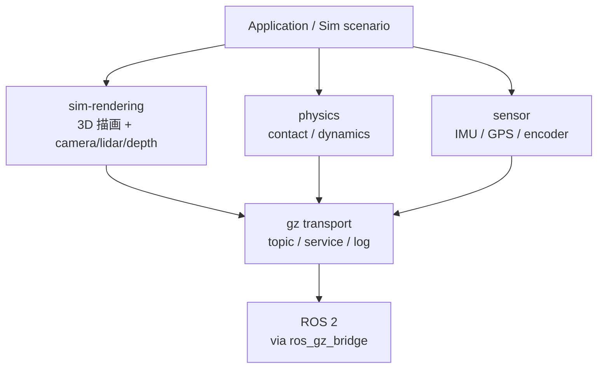
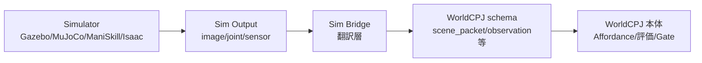

# Robotics Education Course — SP3 Implementation Plan

> **For agentic workers:** REQUIRED SUB-SKILL: Use superpowers:subagent-driven-development (recommended) or superpowers:executing-plans to implement this plan task-by-task. Steps use checkbox (`- [ ]`) syntax for tracking.

**Goal:** Build SP3 (Week 3 教材) — final state 100 files (SP1+SP2 base 71 + SP3 new 28 + plan 1), satisfying 5 verification gates (G1, G2, G3 via `--week 3`, G4 with 53 patterns, G5a). 28 new files + 3 modified files.

**Architecture:** Mono-repo continuation from SP2. New `course/week3/` (Lecture 2 + Lab 3 + Template 2 + README) + `sandbox_reference/week3/` (13 walk-through artifacts). Tool extensions: `tools/verify_env.sh` gains `--week 3` mode (gz CLI + ros_gz_bridge binary 必須、MoveIt2/ros2_control SKIP)、`tools/check_structure.sh` adds W3 expected files + 53 G4 patterns + `check_python_syntax` helper (W2 noop_logger.py + W3 bridge_stub.py 両方対象). Two-axis policy (SP2 同型): 全員ベースライン = mock 中心 + 設計演習中心、instructor sandbox_reference = 可能な範囲で real run.

**Tech Stack:** Markdown (with YAML front matter), Bash 5.x, Mermaid (in code fences), Gazebo Fortress + ros_gz_bridge (Lab 5 walk-through、sudo 利用可能時)、Python 3.10+ for bridge_stub.py (env 不要 finite script)、JSON for example_scene_packet.json.

**Authoritative reference:** `docs/superpowers/specs/2026-04-28-robotics-course-sp3-design.md` (commit `04de6b0`, status approved). When in doubt, defer to spec §-numbers cited in each task.

**Pre-conditions already satisfied:**
- SP1 + SP2 complete and merged to `main` (commit `a3287ca`, 71 tracked files, 5 gates の content complete + G3 partial 状態)
- SP3 design spec written and approved (`04de6b0`)
- Working branch `course/sp3-week3-simulation-bridge` already exists, HEAD `04de6b0`, pushed to `origin`
- Local git identity: `pasorobo` / `goo.mail01@yahoo.com`
- ROS 2 Humble + git + python3 + bash + colcon installed (verified by SP2 G3)
- W2 noop_logger.py + py_compile PASS (W2 で実走検証済)

**Working branch:** All work in this plan happens on `course/sp3-week3-simulation-bridge`. Merge to `main` only after Task 15 (5 gates check).

**Total tasks:** 15

---

## Conventions for Plan Execution

- **Each task ends with a commit.** Commit prefixes per CONVENTIONS.md §2.1: `feat:`, `docs:`, `lab:`, `tool:`, `resource:`, `chore:`, `fix:`.
- **Commit author/email** is set per-repo to `pasorobo` / `goo.mail01@yahoo.com`. Do not change.
- **No Co-Authored-By trailer.** Do not add `Co-Authored-By:` lines or any reference to AI/coding agents in commit messages.
- **G3 is environment-dependent (Full SP3 gate vs content complete + G3 partial)**. Sudo 不可環境では Lab 5 を hand-author fallback (spec §4.8 縮退ルール、SP2 で実証済)。Lab 6 / Lab 6b は env 不要のため必ず real (Lab 6 = schema design artifact、Lab 6b = Python real execution)。Task 15 で G3 状態 (PASS or partial) を明示報告する。
- **Documentation files** must follow CONVENTIONS.md §2 (front matter, naming, etc.). When in conflict between this plan and CONVENTIONS.md, **CONVENTIONS.md wins**.
- **For each new file**, the task provides: exact path, exact front matter, section structure, content invariants. Engineer fills in detailed prose following spec §3 骨子.
- **Verification step** for documentation tasks: confirm file exists, front matter parses, local links resolve. After Task 2 (`tools/check_structure.sh` extended), use that script to verify (expected to FAIL with missing W3 files until Task 14 complete).
- **Lab 5 walk-through subshell PID cleanup**: Lab 5 Stretch real run uses `(gz ... || ign ...) &` subshell pattern. For robust cleanup, prefer `command -v gz` branching to start `gz` or `ign` directly (avoid subshell PID indirection)。Spec §4.2.2 の代替実装として、`command -v gz` で gz が存在する場合は `gz sim -r shapes.sdf > /tmp/gz_sim.log 2>&1 &`、それ以外は `ign gazebo -r shapes.sdf > /tmp/gz_sim.log 2>&1 &` で起動し、`GZ_PID=$!` で本体 PID を取得する形に寄せる (instructor walk-through で残プロセスが出る場合のリカバリ)。

---

## Task 1: tools/verify_env.sh の --week 3 モード追加

**Files:**
- Modify: `tools/verify_env.sh` (add `--week 3` mode: gz CLI + ros_gz_bridge binary + colcon required, MoveIt2/ros2_control/Panda config SKIP)

Spec §1.3, §2.3 #28, §5.1 G3, §5.3.

- [ ] **Step 1: Read current `tools/verify_env.sh`**

```bash
wc -l tools/verify_env.sh
```
Expected: 136 行 (SP2 baseline)。

- [ ] **Step 2: Edit `tools/verify_env.sh` — add `--week 3` branch**

Find the existing `if [[ "$WEEK_MODE" == "2" ]]; then` block. Add a new `elif` for week 3:

```bash
elif [[ "$WEEK_MODE" == "3" ]]; then
    # SP3 mode: gz CLI + ros_gz_bridge binary + colcon required;
    # MoveIt 2 / ros2_control / Panda config are SKIP (handled in SP2)
    check_either "gazebo CLI" gz ign
    check_required "ros-humble-ros-gz pkg" \
        bash -c 'dpkg -l | grep -q "ros-humble-ros-gz "'
    check_required "ros_gz_bridge binary" \
        bash -c 'ros2 pkg prefix ros_gz_bridge >/dev/null 2>&1'
    check_required "colcon CLI" command -v colcon
    print_check "MoveIt 2 (week 3 mode)" "SKIP" "(SP2 で扱った)"
    print_check "ros2_control (week 3 mode)" "SKIP" "(SP2 で扱った)"
    print_check "ros2_controllers (week 3 mode)" "SKIP" "(SP2 で扱った)"
    print_check "Panda config (week 3 mode)" "SKIP" "(SP2 で扱った)"
fi
```

- [ ] **Step 3: Update `--help` text**

Find the `--help|-h)` case in argument parsing. Update the help text to include `--week 3`:

```bash
        --help|-h)
            cat <<'EOH'
Usage: verify_env.sh [--week N]
  (no arg)   : SP1-compatible mode (Gazebo required, MoveIt 2 WARN if absent)
  --week 2   : SP2 mode (MoveIt 2 + ros2_control + ros2_controllers + colcon required, Gazebo SKIP)
  --week 3   : SP3 mode (gz CLI + ros-humble-ros-gz + ros_gz_bridge binary + colcon required, MoveIt 2 / ros2_control SKIP)
  --week N   : reserved for future SP4+ modes
EOH
            exit 0
            ;;
```

- [ ] **Step 4: Syntax check + smoke tests**

```bash
bash -n tools/verify_env.sh && echo "syntax OK"
bash tools/verify_env.sh --help
bash tools/verify_env.sh --week 3 || true   # gz/ros_gz_bridge 未インストールなら FAIL 想定
bash tools/verify_env.sh --week 2 || true   # SP2 互換性回帰確認
bash tools/verify_env.sh || true            # SP1 互換性回帰確認
```

Expected:
- `syntax OK`
- `--help` shows 4 modes (default + week 2 + week 3 + future)
- `--week 3` runs week 3 specific checks (gz/ign + ros-humble-ros-gz + ros_gz_bridge binary + colcon)、MoveIt 2 / ros2_control / Panda config / ros2_controllers が SKIP
- `--week 2` and no-arg modes still work as before (SP2/SP1 互換)

- [ ] **Step 5: Commit**

```bash
git add tools/verify_env.sh
git commit -m "$(cat <<'EOF'
tool: add --week 3 mode to tools/verify_env.sh

Spec §1.3, §2.3 #28, §5.1 G3, §5.3. Adds --week 3 branch.
--week 3 mode requires gz CLI (gz or ign) + ros-humble-ros-gz pkg +
ros_gz_bridge binary (ros2 pkg prefix) + colcon, marks MoveIt 2 /
ros2_control / ros2_controllers / Panda config as SKIP (handled in SP2).

--help updated to list 4 modes (default + week 2 + week 3 + future).
EOF
)"
```

---

## Task 2: tools/check_structure.sh の SP3 拡張

**Files:**
- Modify: `tools/check_structure.sh` (expand EXPECTED_FILES with 28 W3 entries + COURSE_TEN_KEY_FILES with W3 reference type files + 53 G4 patterns + new `check_python_syntax` helper + `find sandbox_reference -name "*.py"` loop)

Spec §1.3, §2.3 #29, §5.1, §5.2.

- [ ] **Step 1: Read current `tools/check_structure.sh`**

```bash
wc -l tools/check_structure.sh
```
Expected: ~330 行 (SP2 baseline)。

- [ ] **Step 2: Add 28 W3 entries to EXPECTED_FILES**

Find `EXPECTED_FILES=(`. After the W2 block (last entry `sandbox_reference/week2/lab4b/codex_prompt_lab4b.md` 等), append:

```bash
    # === SP3 / Week 3 (28 files) ===
    "course/week3/README.md"
    "course/week3/lectures/l5_gazebo_fortress_ros2_bridge.md"
    "course/week3/lectures/l6_simulator_landscape.md"
    "course/week3/labs/lab5_gazebo_topic_bridge/README.md"
    "course/week3/labs/lab5_gazebo_topic_bridge/CHECKLIST.md"
    "course/week3/labs/lab5_gazebo_topic_bridge/HINTS.md"
    "course/week3/labs/lab6_sim_to_worldcpj_schema/README.md"
    "course/week3/labs/lab6_sim_to_worldcpj_schema/CHECKLIST.md"
    "course/week3/labs/lab6_sim_to_worldcpj_schema/HINTS.md"
    "course/week3/labs/lab6b_codex_noop_bridge_stub/README.md"
    "course/week3/labs/lab6b_codex_noop_bridge_stub/CHECKLIST.md"
    "course/week3/labs/lab6b_codex_noop_bridge_stub/HINTS.md"
    "course/week3/deliverables/simulation_bridge_draft_template.md"
    "course/week3/deliverables/simulator_decision_table_template.md"
    "sandbox_reference/week3/simulation_bridge_draft_example.md"
    "sandbox_reference/week3/simulator_decision_table_example.md"
    "sandbox_reference/week3/lab5/README.md"
    "sandbox_reference/week3/lab5/bridge_config.yaml"
    "sandbox_reference/week3/lab5/bridge_run.log"
    "sandbox_reference/week3/lab5/bridge_topic_list.txt"
    "sandbox_reference/week3/lab6/README.md"
    "sandbox_reference/week3/lab6/scene_packet_design.md"
    "sandbox_reference/week3/lab6b/README.md"
    "sandbox_reference/week3/lab6b/codex_prompt_lab6b.md"
    "sandbox_reference/week3/lab6b/example_scene_packet.json"
    "sandbox_reference/week3/lab6b/bridge_stub.py"
    "sandbox_reference/week3/lab6b/execution_log.txt"
    "docs/superpowers/specs/2026-04-28-robotics-course-sp3-design.md"
```

(`docs/superpowers/plans/2026-04-28-robotics-course-sp3-plan.md` は writing-plans 後に追加されるが、本 plan が書かれた段階で本ファイルは既に存在するため、後続 task で existence 検証されるのみで OK。SP1/SP2 と同パターン: plan ファイル自体は EXPECTED_FILES に追加するが G1 で missing FAIL は発生しない)

実は writing-plans 完了後 plan ファイルが存在するため、上記 EXPECTED_FILES に **plan エントリも追加**:

```bash
    "docs/superpowers/plans/2026-04-28-robotics-course-sp3-plan.md"
```

(計 29 件、ただしこの本 plan ファイル自体が既に存在するので G1 PASS は確実)

- [ ] **Step 3: Add 14 W3 entries to COURSE_TEN_KEY_FILES**

Find `COURSE_TEN_KEY_FILES=(`. Append:

```bash
    # === SP3 / Week 3 (10-key required: lecture/lab/template/week/reference) ===
    "course/week3/README.md"
    "course/week3/lectures/l5_gazebo_fortress_ros2_bridge.md"
    "course/week3/lectures/l6_simulator_landscape.md"
    "course/week3/labs/lab5_gazebo_topic_bridge/README.md"
    "course/week3/labs/lab6_sim_to_worldcpj_schema/README.md"
    "course/week3/labs/lab6b_codex_noop_bridge_stub/README.md"
    "course/week3/deliverables/simulation_bridge_draft_template.md"
    "course/week3/deliverables/simulator_decision_table_template.md"
    "sandbox_reference/week3/simulation_bridge_draft_example.md"
    "sandbox_reference/week3/simulator_decision_table_example.md"
    "sandbox_reference/week3/lab5/README.md"
    "sandbox_reference/week3/lab6/README.md"
    "sandbox_reference/week3/lab6/scene_packet_design.md"
    "sandbox_reference/week3/lab6b/README.md"
    "sandbox_reference/week3/lab6b/codex_prompt_lab6b.md"
```

(`bridge_config.yaml`, `bridge_run.log`, `bridge_topic_list.txt`, `example_scene_packet.json`, `bridge_stub.py`, `execution_log.txt` は front matter なし type で除外)

- [ ] **Step 4: Add `check_python_syntax` helper function**

Find the existing helper functions (`check_pattern_must`, `check_pattern_must_not`, `check_min_size`). After them, append:

```bash
check_python_syntax() {
    local f="$1"
    local label="${2:-py_compile}"
    if [[ ! -f "$f" ]]; then
        warn "missing for python syntax check (covered by G1): $f"
        return
    fi
    if python3 -m py_compile "$f" 2>/dev/null; then
        ok
    else
        local error_msg
        error_msg=$(python3 -m py_compile "$f" 2>&1)
        err "Python syntax error: $f ($label)"
        printf "         %s\n" "$error_msg"
    fi
}
```

- [ ] **Step 5: Add 53 W3 G4 patterns**

Find the existing G4 patterns block (W2). After it, append:

```bash
echo
echo "==== G4 (W3): Lab 5 / 6 / 6b sandbox content patterns (53 件) ===="

# === Lab 5 (6 patterns) ===
check_pattern_must "sandbox_reference/week3/lab5/bridge_config.yaml" "ros_gz_bridge|ros_topic_name" "bridge YAML 構造"
check_pattern_must "sandbox_reference/week3/lab5/bridge_config.yaml" "/clock" "/clock mandatory bridge"
check_pattern_must "sandbox_reference/week3/lab5/bridge_config.yaml" "GZ_TO_ROS|direction" "bridge 方向指定"
check_pattern_must "sandbox_reference/week3/lab5/bridge_run.log" "ros_gz_bridge|parameter_bridge" "ros_gz_bridge 起動"
check_pattern_must "sandbox_reference/week3/lab5/bridge_run.log" "/clock" "/clock real run 証跡"
check_pattern_must "sandbox_reference/week3/lab5/bridge_topic_list.txt" "/clock" "/clock ROS 2 側到達"

# === Lab 6 (8 patterns、scene_packet_design.md 8 field 行ごと) ===
check_pattern_must "sandbox_reference/week3/lab6/scene_packet_design.md" "scene_packet" "scene_packet 行"
check_pattern_must "sandbox_reference/week3/lab6/scene_packet_design.md" "robot_state" "robot_state 行"
check_pattern_must "sandbox_reference/week3/lab6/scene_packet_design.md" "candidate_set" "candidate_set 行"
check_pattern_must "sandbox_reference/week3/lab6/scene_packet_design.md" "action_intent" "action_intent 行"
check_pattern_must "sandbox_reference/week3/lab6/scene_packet_design.md" "observation" "observation 行"
check_pattern_must "sandbox_reference/week3/lab6/scene_packet_design.md" "execution_result" "execution_result 行"
check_pattern_must "sandbox_reference/week3/lab6/scene_packet_design.md" "failure_reason" "failure_reason 行"
check_pattern_must "sandbox_reference/week3/lab6/scene_packet_design.md" "metrics" "metrics 行"

# === Lab 6b — example_scene_packet.json (4 patterns) ===
check_pattern_must "sandbox_reference/week3/lab6b/example_scene_packet.json" "scene_packet" "input field 1"
check_pattern_must "sandbox_reference/week3/lab6b/example_scene_packet.json" "robot_state" "input field 2"
check_pattern_must "sandbox_reference/week3/lab6b/example_scene_packet.json" "candidate_set" "input field 3"
check_pattern_must "sandbox_reference/week3/lab6b/example_scene_packet.json" "action_intent" "input field 4"

# === Lab 6b — bridge_stub.py (6 patterns) ===
check_pattern_must "sandbox_reference/week3/lab6b/bridge_stub.py" "json[.]load" "json.load (実コード)"
check_pattern_must "sandbox_reference/week3/lab6b/bridge_stub.py" "recv field=" "出力フォーマット固定"
check_pattern_must_not "sandbox_reference/week3/lab6b/bridge_stub.py" "subprocess" "禁止: subprocess"
check_pattern_must_not "sandbox_reference/week3/lab6b/bridge_stub.py" "os[.]system" "禁止: os.system"
check_pattern_must_not "sandbox_reference/week3/lab6b/bridge_stub.py" "KDL" "禁止: KDL"
check_pattern_must_not "sandbox_reference/week3/lab6b/bridge_stub.py" "controller_manager" "禁止: controller_manager"

# === Lab 6b — bridge_stub.py syntax (1 pattern、check_python_syntax helper) ===
check_python_syntax "sandbox_reference/week3/lab6b/bridge_stub.py" "py_compile"

# === Lab 6b — execution_log.txt (6 patterns、input 4 field 個別 + 起動 + min_size) ===
check_pattern_must "sandbox_reference/week3/lab6b/execution_log.txt" "recv field=scene_packet" "input 1: scene_packet log"
check_pattern_must "sandbox_reference/week3/lab6b/execution_log.txt" "recv field=robot_state" "input 2: robot_state log"
check_pattern_must "sandbox_reference/week3/lab6b/execution_log.txt" "recv field=candidate_set" "input 3: candidate_set log"
check_pattern_must "sandbox_reference/week3/lab6b/execution_log.txt" "recv field=action_intent" "input 4: action_intent log"
check_pattern_must "sandbox_reference/week3/lab6b/execution_log.txt" "bridge_stub" "起動確認"
check_min_size    "sandbox_reference/week3/lab6b/execution_log.txt" 200 "実行ログ最小サイズ"

# === Lab 6b — codex_prompt_lab6b.md (6 patterns、Lab 4b 同型) ===
check_pattern_must "sandbox_reference/week3/lab6b/codex_prompt_lab6b.md" "目的" "prompt5項目: 目的"
check_pattern_must "sandbox_reference/week3/lab6b/codex_prompt_lab6b.md" "入力" "prompt5項目: 入力"
check_pattern_must "sandbox_reference/week3/lab6b/codex_prompt_lab6b.md" "制約" "prompt5項目: 制約"
check_pattern_must "sandbox_reference/week3/lab6b/codex_prompt_lab6b.md" "成功条件" "prompt5項目: 成功条件"
check_pattern_must "sandbox_reference/week3/lab6b/codex_prompt_lab6b.md" "検証コマンド" "prompt5項目: 検証コマンド"
check_pattern_must "sandbox_reference/week3/lab6b/codex_prompt_lab6b.md" "禁止" "禁止リスト言及"

# === simulation_bridge_draft_example.md (8 patterns、8 field 行ごと) ===
check_pattern_must "sandbox_reference/week3/simulation_bridge_draft_example.md" "scene_packet" "input field 1"
check_pattern_must "sandbox_reference/week3/simulation_bridge_draft_example.md" "robot_state" "input field 2"
check_pattern_must "sandbox_reference/week3/simulation_bridge_draft_example.md" "candidate_set" "input field 3"
check_pattern_must "sandbox_reference/week3/simulation_bridge_draft_example.md" "action_intent" "input field 4"
check_pattern_must "sandbox_reference/week3/simulation_bridge_draft_example.md" "observation" "output field 1"
check_pattern_must "sandbox_reference/week3/simulation_bridge_draft_example.md" "execution_result" "output field 2"
check_pattern_must "sandbox_reference/week3/simulation_bridge_draft_example.md" "failure_reason" "output field 3"
check_pattern_must "sandbox_reference/week3/simulation_bridge_draft_example.md" "metrics" "output field 4"

# === simulator_decision_table_example.md (8 patterns、4 simulator + 4 軸 行ごと) ===
check_pattern_must "sandbox_reference/week3/simulator_decision_table_example.md" "Gazebo" "simulator 1: Gazebo"
check_pattern_must "sandbox_reference/week3/simulator_decision_table_example.md" "MuJoCo" "simulator 2: MuJoCo"
check_pattern_must "sandbox_reference/week3/simulator_decision_table_example.md" "ManiSkill" "simulator 3: ManiSkill"
check_pattern_must "sandbox_reference/week3/simulator_decision_table_example.md" "Isaac" "simulator 4: Isaac"
check_pattern_must "sandbox_reference/week3/simulator_decision_table_example.md" "rendering" "軸 1: rendering"
check_pattern_must "sandbox_reference/week3/simulator_decision_table_example.md" "contact" "軸 2: contact"
check_pattern_must "sandbox_reference/week3/simulator_decision_table_example.md" "parallel data" "軸 3: parallel data"
check_pattern_must "sandbox_reference/week3/simulator_decision_table_example.md" "ROS 2 統合" "軸 4: ROS 2 統合"
```

- [ ] **Step 6: Add Python syntax check loop**

After the existing `bash -n` loop (`bash -n tools/*.sh course/00_setup/*.sh` 等)、新たに以下を追加:

```bash
echo
echo "==== Python syntax check on sandbox_reference/**/*.py (W2 + W3) ===="
while IFS= read -r py; do
    check_python_syntax "$py" "py_compile"
done < <(find sandbox_reference -name "*.py" 2>/dev/null)
```

(W2 noop_logger.py + W3 bridge_stub.py 両方を自動検出して py_compile 検査。回帰防止)

- [ ] **Step 7: Syntax check + smoke run**

```bash
bash -n tools/check_structure.sh && echo "syntax OK"
bash tools/check_structure.sh; echo "exit=$?"
```

Expected: `syntax OK`。run shows many `[FAIL] missing: ...` lines for W3 files (~26 missing 想定: 28 W3 files - 2 already exist (本spec + 本plan)) + corresponding G4 helper warns。Exit code 1。**Intentional** — these will resolve as T4-T14 add the files.

`grep -c "missing:"` 検査:
```bash
bash tools/check_structure.sh 2>&1 | grep -c "missing:"
```
Expected: ~26 W3 missing files。

- [ ] **Step 8: Commit**

```bash
git add tools/check_structure.sh
git commit -m "$(cat <<'EOF'
tool: extend tools/check_structure.sh for SP3

Spec §1.3, §2.3 #29, §5.1, §5.2.

Changes:
- Add 28 W3 expected files to EXPECTED_FILES (course/week3/ 14 +
  sandbox_reference/week3/ 13 + spec); plus plan file (writing-plans
  output) for total 29 net additions. Cumulative: SP1+SP2+SP3 = 100.
- Add 15 W3 files to COURSE_TEN_KEY_FILES (lecture/lab/template/week/
  reference 系); .yaml/.log/.txt/.json/.py excluded per CONVENTIONS.md
  §2.2 footnote.
- Add 53 W3 G4 patterns: Lab5 (6) + Lab6 (8) + Lab6b JSON (4) +
  bridge_stub (6) + py_compile (1) + execution_log (6) + codex_prompt
  (6) + template examples (16).
- Add new helper check_python_syntax (python3 -m py_compile wrapper).
- Add Python syntax check loop on sandbox_reference/**/*.py covering
  W2 noop_logger.py (回帰防止) + W3 bridge_stub.py.

Currently fails with ~26 missing files + ~30 G4 WARN-on-missing.
Expected behavior; will pass at Task 15 after T4-T14 fill in W3.
EOF
)"
```

---

## Task 3: Pre-flight (apt install + verify --week 3)

**Files:** (none modified — system-level apt + validation)

Spec §4.1, §5.3.

- [ ] **Step 1: Try apt install (if sudo available)**

```bash
sudo apt update
sudo apt install -y \
    gz-fortress \
    ros-humble-ros-gz \
    ros-humble-ros-gz-bridge
```

If `sudo` requires password and is non-interactive (auto-execution context), this step may fail. Document outcome:
- **Success**: continue to Step 3
- **Failure**: skip to Step 4 (sudo 不可 fallback、SP2 同型)

- [ ] **Step 2: Source ROS 2 environment**

```bash
source /opt/ros/humble/setup.bash
```

- [ ] **Step 3: Verify --week 3**

```bash
bash tools/verify_env.sh --week 3
echo "exit=$?"
```

Expected (sudo 利用可能 + apt install 完了の場合):
- PASS: Ubuntu 22.04, ros2 CLI, ros2 Humble, gz CLI, ros-humble-ros-gz, ros_gz_bridge binary, colcon, git, python3, bash
- SKIP: MoveIt 2 (week 3 mode), ros2_control (week 3 mode), ros2_controllers (week 3 mode), Panda config (week 3 mode)
- FAIL: 0
- exit code: 0

- [ ] **Step 4: sudo 不可 fallback (SP2 同型 documented)**

If sudo unavailable / install failed:
- `verify_env.sh --week 3` will FAIL on `gazebo CLI` + `ros-humble-ros-gz pkg` + `ros_gz_bridge binary`
- Continue with SP3 implementation under **content complete + G3 partial** mode (spec §5.3 縮退)
- Lab 5 walk-through (T12) becomes hand-author route (spec §4.8)
- Lab 6 (T13) and Lab 6b (T14) are env-independent and proceed normally
- Final closure (T15) reports G3 partial state explicitly

- [ ] **Step 5: Verify check_structure.sh missing baseline**

```bash
bash tools/check_structure.sh 2>&1 | grep -c "missing:" || true
```

Expected: ~26 (the 28 W3 files added in T2 don't exist yet, minus 2 already-present spec + plan)。

- [ ] **Step 6: No commit needed (system-level setup)**

This task verifies the environment but does not modify the repository. Proceed to T4 once Steps 1-5 understood (PASS or fallback documented).

---

## Task 4: course/week3/README.md

**Files:**
- Create: `course/week3/README.md`

Spec §2.2 #14, §3 (Week 3 README format).

- [ ] **Step 1: Generate week 3 skeleton**

```bash
bash tools/new_week_skeleton.sh 3
```

Expected: `course/week3/{lectures,labs,deliverables,assets}/` directories + stub `course/week3/README.md` with 10-key front matter + TBD body。

- [ ] **Step 2: Replace stub README with populated content**

Overwrite `course/week3/README.md` with:

```markdown
---
type: week
id: W3-README
title: Week 3 - Simulation Bridge
week: 3
duration_min: 420
prerequisites: [W2-Lab3, W2-Lab4, W2-Lab4b]
worldcpj_ct: [CT-07, CT-08]
roles: [common, sim, sandbox]
references: [R-18, R-19, R-20, R-21, R-22, R-23, R-24, R-25, R-33, R-34, R-35, R-36, R-37, R-38]
deliverables: [simulation_bridge_draft, simulator_decision_table]
---

# Week 3 — Simulation Bridge

## 目的

Simulation を **WorldCPJ schema 翻訳** + **simulator 比較選択** 視点で扱う。3 本柱:

1. **Gazebo Fortress 起動確認 + ros_gz_bridge YAML 設計** (Lab 5) — `/clock` mandatory + `/joint_states` 概念例
2. **provisional schema 8 field 設計演習** (Lab 6) — plan §8.3 流用、自分の MS Lv1 / CC Gate 0-a 想定 case で埋める
3. **Codex no-op bridge stub PR レビュー一巡** (Lab 6b) — Lab 4b 同型 + 追加禁止リスト (実 simulator/bridge/Affordance 自動判定)

`simulator_decision_table` で 4-simulator (Gazebo / MuJoCo / ManiSkill / Isaac) 用途差を理解し、自分の case にどれを使うか判断できる。

MuJoCo / ManiSkill / Isaac の hands-on は **Stretch goal** (SP5 Sim Role / Sandbox Bridge Role Owner)。

## 所要時間

| 区分 | 目安 |
|---|---|
| Lectures (L5 + L6) | 95 分 |
| Labs (Lab 5 + 6 + 6b) | 195 分 |
| Templates 記入 (simulation_bridge_draft + simulator_decision_table) | 30 分 |
| 余白 (詰まった時の調査) | 100 分 |
| **合計** | **約 7 時間** |

## Lecture 一覧

| ID | タイトル | 所要 | リンク |
|---|---|---|---|
| W3-L5 | Gazebo Fortress + ros_gz_bridge | 45 分 | [l5](./lectures/l5_gazebo_fortress_ros2_bridge.md) |
| W3-L6 | 4-simulator landscape + Sim Bridge の役割 | 50 分 | [l6](./lectures/l6_simulator_landscape.md) |

## Lab 一覧

| ID | タイトル | 所要 | リンク |
|---|---|---|---|
| W3-Lab5 | Gazebo + ros_gz_bridge YAML | 60 分 | [lab5](./labs/lab5_gazebo_topic_bridge/README.md) |
| W3-Lab6 | provisional schema 8 field 設計演習 | 60 分 | [lab6](./labs/lab6_sim_to_worldcpj_schema/README.md) |
| W3-Lab6b | Codex no-op bridge stub | 75 分 | [lab6b](./labs/lab6b_codex_noop_bridge_stub/README.md) |

## 提出物テンプレート

| テンプレート | リンク |
|---|---|
| Simulation Bridge Draft (provisional schema 8 field) | [template](./deliverables/simulation_bridge_draft_template.md) |
| Simulator Decision Table (4 simulator × 4 軸) | [template](./deliverables/simulator_decision_table_template.md) |

## 合格条件サマリ

教育計画 §4.4 末尾より:

- Gazebo は ROS 2 連携と robot model / bridge 検証に使うと説明できる
- MuJoCo / ManiSkill / Isaac の用途差を説明できる (rendering / contact / parallel data / ROS 統合)
- Simulation の出力を `episode_record` / `trial sheet` / `Gate Eval` に渡す I/O として書ける (provisional schema 流用)
- Simulator 比較だけでは WorldCPJ 成果にならないと説明できる (Sim Bridge の本質 = WorldCPJ schema 翻訳)
- AI が提案した schema や metrics を採用する前に、WorldCPJ Affordance schema、評価指標、安全境界と照合できる

## Stretch goal (任意、Sim Bridge / Sandbox Bridge Role Owner)

W3 ベースライン外の発展課題。Robot Readiness Mini Report の「次段階」欄に記録:

- 実 `ros_gz_bridge` で SP2 minimal_robot を Gazebo 上で動かす統合 (`<gazebo>` URDF extension 拡張)
- MuJoCo / ManiSkill / Isaac の hands-on (SP5 Sim Role)
- WorldCPJ 本物 schema 確定後の bridge 実装 (SP4-5 / Q1 後半)

## 参照

外部リソース台帳: [docs/references.md](../../docs/references.md)

主に W3 で参照するもの: R-18 (Gazebo Fortress ROS install), R-19 (Gazebo Fortress ROS2 integration), R-20 (MuJoCo Documentation), R-21 (MuJoCo Python), R-22 (ManiSkill Documentation), R-23 (ManiSkill Quickstart), R-24 (NVIDIA Isaac Sim learning docs), R-25 (Isaac Lab tutorials), R-33〜R-38 (Codex)
```

- [ ] **Step 3: Verify**

```bash
test -s course/week3/README.md && wc -l course/week3/README.md
for k in type id title week duration_min prerequisites worldcpj_ct roles references deliverables; do
    grep -qE "^${k}:" course/week3/README.md || echo "MISSING $k"
done
echo "verify done"
```

Expected: 75-90 行、no MISSING lines。

- [ ] **Step 4: Verify check_structure.sh missing count drops by 1**

```bash
bash tools/check_structure.sh 2>&1 | grep -c "missing:"
```

Expected: drops from 26 to 25。

- [ ] **Step 5: Commit**

```bash
git add course/week3/README.md
git commit -m "$(cat <<'EOF'
docs: add Week 3 README

Spec §2.2 #14. Week 3 entry point: 3 本柱 (Gazebo + ros_gz_bridge YAML
/ provisional schema 8 field 設計演習 / Codex no-op bridge stub PR
レビュー), Lecture/Lab/Template 一覧, 合格条件サマリ, Stretch goal 案内
(MuJoCo / ManiSkill / Isaac hands-on は SP5 Sim Role).
EOF
)"
```

---

## Task 5: L5 (Gazebo Fortress + ros_gz_bridge)

**Files:**
- Create: `course/week3/lectures/l5_gazebo_fortress_ros2_bridge.md`

Spec §2.2 #1, §3.1.

- [ ] **Step 1: Create file with front matter + 8 sections (~150-180 行)**

```markdown
---
type: lecture
id: W3-L5
title: Gazebo Fortress + ros_gz_bridge
week: 3
duration_min: 45
prerequisites: [W2-L3, W2-L4]
worldcpj_ct: [CT-08]
roles: [common, sim]
references: [R-18, R-19]
deliverables: []
---

# Gazebo Fortress + ros_gz_bridge

## 目的

Gazebo Fortress を「physics simulator」ではなく **ROS 2 連携と robot model 検証の場** として理解する。`ros_gz_bridge` は gz topic ↔ ROS topic の翻訳層。Lab 5 で `/clock` 1 topic の bridge YAML を設計し、`/joint_states` は概念例として扱う (joint を持つ robot model が必要、Stretch goal)。

## 1. Gazebo Fortress 全体像

Gazebo Fortress は 4 層に分けると見通しが良い:



ROS 2 との接続点は **transport 層** (gz transport)。`ros_gz_bridge` がここを ROS 2 topic / service と双方向 mapping する。

## 2. gz CLI 最低操作

| コマンド | 用途 |
|---|---|
| `gz sim --version` | install 確認 |
| `gz sim shapes.sdf` | 標準 demo world (3 物体) を GUI 起動 |
| `gz sim --headless-rendering shapes.sdf` | X11 不可環境用 |
| `gz topic -l` | gz transport 上の topic 一覧 |
| `gz sim -r shapes.sdf` | auto-run flag、pause 状態を回避 |

注: Fortress 過渡期環境では `gz` の代わりに `ign` (Ignition) コマンドが使われる場合あり (`ign gazebo`、`ign topic`)。Lab 5 では両系統を fallback で扱う。

## 3. ros_gz_bridge の役割

`ros_gz_bridge` は **gz transport ↔ ROS 2 topic の双方向 mapping** を行う ROS 2 ノード。実体は `ros2 run ros_gz_bridge parameter_bridge`。

YAML config 駆動。各 entry に以下の field を持つ:

| field | 意味 |
|---|---|
| `ros_topic_name` | ROS 2 側の topic 名 |
| `gz_topic_name` | gz transport 側の topic 名 |
| `ros_type_name` | ROS 2 message type (例: `rosgraph_msgs/msg/Clock`) |
| `gz_type_name` | gz message type (例: `ignition.msgs.Clock`) |
| `direction` | `GZ_TO_ROS` / `ROS_TO_GZ` / `BIDIRECTIONAL` |

**実 robot model なしでは `/joint_states` は流れない**: 標準 demo の `shapes.sdf` には joint を持つ robot がない。`/clock` (mandatory) は世界 simulation 時刻なので robot 不要。

## 4. bridge YAML 最小書き方

`/clock` 1 topic の YAML 完全例:

```yaml
- ros_topic_name: "/clock"
  gz_topic_name: "/clock"
  ros_type_name: "rosgraph_msgs/msg/Clock"
  gz_type_name: "ignition.msgs.Clock"
  direction: GZ_TO_ROS
```

`/joint_states` は **概念例として併記** (real run には joint を持つ robot model が必要、Stretch):

```yaml
# - ros_topic_name: "/joint_states"
#   gz_topic_name: "/world/default/model/<robot>/joint_state"
#   ros_type_name: "sensor_msgs/msg/JointState"
#   gz_type_name: "ignition.msgs.Model"
#   direction: GZ_TO_ROS
```

起動: `ros2 run ros_gz_bridge parameter_bridge --ros-args -p config_file:=$(pwd)/bridge_config.yaml`

## 5. QoS / topic 名 mapping 注意点

- gz transport の QoS 概念は best_effort 相当、ROS 2 QoS との互換は parameter_bridge が吸収するが、複雑な QoS (TRANSIENT_LOCAL 等) では mismatch あり
- topic 名の lower/upper case は厳密 (`/Clock` ≠ `/clock`)
- gz transport の topic 名は world / model / link / joint の hierarchical naming (例: `/world/default/model/panda/joint_state`)
- wildcard 不可 (個別 topic を YAML で列挙する必要あり)

## 6. Gazebo Fortress EOL + Harmonic 将来移行

- **Gazebo Fortress EOL: 2026-09**
- SP3 で Fortress を扱うのは Q1 W3 (2026-05-11 開始) スケジュールと整合させるため
- SP6+ で Harmonic への移行レビュー予定 (spec §4.5 と整合)
- Course は Fortress 期間中の「Sim Bridge 概念学習」を目的とし、Harmonic 移行時は Lab 5 + L5 の updates のみで対応可能な設計

## 7. よくある誤解

| 誤解 | 実際 |
|---|---|
| Gazebo を起動すればロボットが動く | URDF + ros2_control + bridge が揃って初めて動く (SP6+ 統合) |
| `/joint_states` は自動的に来る | ロボット joint を持つ robot model + ros2_control plugin が必要、shapes.sdf には joint なし |
| Gazebo = simulator | 部分的。Gazebo の本質は **ROS 2 connect された robot model 検証の場** で、bridge を介して上位層と連携する点が重要 |
| `gz` と `ign` は別物 | 同じ Gazebo の過渡期コマンド名差異。Fortress では両方使える |

## 次のLab

→ [Lab 5: Gazebo + ros_gz_bridge YAML](../labs/lab5_gazebo_topic_bridge/README.md)
```

- [ ] **Step 2: Verify**

```bash
test -s course/week3/lectures/l5_gazebo_fortress_ros2_bridge.md
for k in type id title week duration_min prerequisites worldcpj_ct roles references deliverables; do
    grep -qE "^${k}:" course/week3/lectures/l5_gazebo_fortress_ros2_bridge.md || echo "MISSING $k"
done
grep -c "^## " course/week3/lectures/l5_gazebo_fortress_ros2_bridge.md   # expect 8
```

- [ ] **Step 3: Commit**

```bash
git add course/week3/lectures/l5_gazebo_fortress_ros2_bridge.md
git commit -m "$(cat <<'EOF'
docs: add Week 3 Lecture L5 (Gazebo Fortress + ros_gz_bridge)

Spec §2.2 #1, §3.1. Gazebo Fortress 全体像 (4 層: rendering/physics/
sensor/transport)、gz CLI 最低操作 (gz/ign 両系統)、ros_gz_bridge の
役割と YAML 構造、QoS/topic 名 mapping 注意点、Fortress EOL (2026-09)
+ Harmonic 将来移行 (SP6+)、よくある誤解 4 件。
EOF
)"
```

---

## Task 6: L6 (4-simulator landscape + Sim Bridge の役割)

**Files:**
- Create: `course/week3/lectures/l6_simulator_landscape.md`

Spec §2.2 #2, §3.2.

- [ ] **Step 1: Create file (~180-220 行)**

```markdown
---
type: lecture
id: W3-L6
title: 4-simulator landscape + Sim Bridge の役割
week: 3
duration_min: 50
prerequisites: [W3-L5]
worldcpj_ct: [CT-08]
roles: [common, sim]
references: [R-18, R-20, R-21, R-22, R-23, R-24, R-25]
deliverables: []
---

# 4-simulator landscape + Sim Bridge の役割

## 目的

4 simulator (Gazebo / MuJoCo / ManiSkill / Isaac) の用途差を理解し、自分の case にどれを使うか判断材料を持つ。Sim Bridge の本質 (Sim I/O ↔ WorldCPJ schema 翻訳) を理解し、`simulator_decision_table_template.md` で選択練習を行う。

## 1. Gazebo (要約)

詳細は [L5](./l5_gazebo_fortress_ros2_bridge.md) 参照。要点:

- ROS 2 統合 + robot model 検証の場
- `ros_gz_bridge` で gz topic ↔ ROS 2 topic 翻訳
- Q1 SP3 標準 simulator
- Fortress EOL 2026-09、SP6+ で Harmonic 移行

## 2. MuJoCo

- **軽量接触/制御/学習実験** 向け
- Python API (`mujoco`) でスクリプト driven、CUDA 不要
- ROS 2 統合は **薄い** (MuJoCo ROS 2 ラッパは存在するが標準ではない)
- 物理エンジン精度が高く、研究 / RL training 向け
- SP5 Sim Role での hands-on 候補
- 参照: R-20 (MuJoCo Documentation), R-21 (MuJoCo Python)

## 3. ManiSkill

- **manipulation benchmark + parallel data 収集** 向け
- GPU 必須 (CUDA)
- RL training 向け、parallel envs で reproducibility 高い
- ROS 2 統合は中程度 (community wrapper あり)
- SP5 Sim Role での hands-on 候補
- 参照: R-22 (ManiSkill Documentation), R-23 (ManiSkill Quickstart)

## 4. Isaac Sim / Lab

- **高忠実度 rendering + synthetic data + large-scale RL** 向け
- **インストールサイズが大きく、NVIDIA GPU + nvidia-docker / NVIDIA stack 依存が強い**
- Robot Learning 担当の Watch 教材として位置づけ
- Phase 0 全員ハンズオンには **不適合** (環境負荷が大きすぎる)
- 参照: R-24 (NVIDIA Isaac Sim learning docs), R-25 (Isaac Lab tutorials)

## 5. 4×4 比較 table

| 軸 | Gazebo (Fortress) | MuJoCo | ManiSkill | Isaac Sim/Lab |
|---|---|---|---|---|
| rendering 忠実度 | 中 | 中 | 中-高 | **最高** |
| contact 物理 | 中 | **高精度** | 中-高 | 高 |
| parallel data 収集 | 弱 | 中 | **強** (parallel envs) | **最強** (large-scale RL) |
| ROS 2 統合 | **標準** (ros_gz_bridge) | 弱 (wrapper のみ) | 中 (community wrapper) | 中 (Isaac ROS) |

## 6. Sim Bridge の役割

**Sim Bridge = Sim I/O ↔ WorldCPJ schema 翻訳層**。

Sim 出力 (画像、joint angle、contact force) を WorldCPJ provisional schema (`scene_packet`, `observation` 等) に mapping することが Sim Bridge の本質。実 bridge コード (Lab 6b で扱う) は Stub 段階で、actual mapping は SP4-5 / Q1 後半で WorldCPJ 本体 schema 確定と並行。



## 7. simulator_decision_table を埋める判断練習

`simulator_decision_table_template.md` を Sandbox にコピーし、上記 4×4 table を自分の case で埋める。さらに:

- 「私の case = …」(1 行)
- 「選んだ simulator = …」(1 行)
- 「選んだ理由 = …」(1-2 行)

を書く。SP5 Sim Role / Q1 後半の意思決定の **入口** になる。

## 8. よくある誤解

| 誤解 | 実際 |
|---|---|
| Isaac が一番高機能なら Isaac を使えばいい | GPU/install/学習コスト大、Phase 0 では Gazebo で十分 |
| ManiSkill は ROS 2 と無縁 | community wrapper あり、ただし標準ではない |
| 全部試してから選ぶ | 用途で先に絞る (rendering 重視 / contact 重視 / parallel data 重視 / ROS 統合重視) |
| simulator 比較で WorldCPJ が動く | 違う、Sim Bridge で WorldCPJ schema に翻訳して初めて WorldCPJ 成果になる |

## 次のLab

→ [Lab 6: provisional schema 8 field 設計演習](../labs/lab6_sim_to_worldcpj_schema/README.md)
```

- [ ] **Step 2: Verify**

```bash
test -s course/week3/lectures/l6_simulator_landscape.md
for k in type id title week duration_min prerequisites worldcpj_ct roles references deliverables; do
    grep -qE "^${k}:" course/week3/lectures/l6_simulator_landscape.md || echo "MISSING $k"
done
grep -c "^## " course/week3/lectures/l6_simulator_landscape.md   # expect 9
```

- [ ] **Step 3: Commit**

```bash
git add course/week3/lectures/l6_simulator_landscape.md
git commit -m "$(cat <<'EOF'
docs: add Week 3 Lecture L6 (4-simulator landscape + Sim Bridge の役割)

Spec §2.2 #2, §3.2. 4-simulator (Gazebo/MuJoCo/ManiSkill/Isaac) 用途差、
4×4 比較 table (rendering/contact/parallel data/ROS 2 統合)、Sim Bridge
の本質 (Sim I/O ↔ WorldCPJ schema 翻訳)、simulator_decision_table を
埋める判断練習、よくある誤解 4 件。

Isaac は install size + NVIDIA stack 依存が強い旨明示 (具体数値は避け、
Phase 0 では Gazebo で十分の判断)。
EOF
)"
```

---

## Task 7: Lab 5 (Gazebo + ros_gz_bridge YAML) — 3 ファイル

**Files:**
- Create: `course/week3/labs/lab5_gazebo_topic_bridge/README.md` (with embedded bridge_config.yaml 雛形)
- Create: `course/week3/labs/lab5_gazebo_topic_bridge/CHECKLIST.md`
- Create: `course/week3/labs/lab5_gazebo_topic_bridge/HINTS.md`

Spec §2.2 #3-#5, §3.3.

- [ ] **Step 1: mkdir + Create README.md**

```bash
mkdir -p course/week3/labs/lab5_gazebo_topic_bridge
```

`README.md` content (10-key front matter + 6 sections + 4-step手順 + 雛形 YAML):

```markdown
---
type: lab
id: W3-Lab5
title: Gazebo + ros_gz_bridge YAML
week: 3
duration_min: 60
prerequisites: [W3-L5]
worldcpj_ct: [CT-08]
roles: [common, sim]
references: [R-18, R-19]
deliverables: [bridge_config_yaml]
---

# Lab 5 — Gazebo + ros_gz_bridge YAML

## 目的

Gazebo Fortress 起動確認 (gz/ign 両系統) + `ros_gz_bridge` YAML 設計 (`/clock` mandatory + `/joint_states` 概念例)。real bridge 起動は Stretch goal (Sandbox Bridge Role Owner)。

## 前提

- SP1 setup + SP2 setup 完了
- SP3 用に `sudo apt install gz-fortress ros-humble-ros-gz ros-humble-ros-gz-bridge` 完了 (sudo 不可なら version 確認のみで合格可)
- (`bash tools/verify_env.sh --week 3` で確認)

## 手順

### Step 1: Gazebo CLI version 確認

```bash
gz sim --version
# または (Fortress 過渡期環境)
ign gazebo --version
```

どちらかで version が出れば OK。

### Step 2: Gazebo GUI 起動確認

```bash
gz sim shapes.sdf
# または
ign gazebo shapes.sdf
```

GUI が立ち上がり、3 物体が表示されれば OK。X11 困難時:

```bash
gz sim --headless-rendering shapes.sdf
# または
ign gazebo --headless-rendering shapes.sdf
```

最悪、Step 1 の version 確認のみで合格可 (CHECKLIST 縮退)。

### Step 3: bridge_config.yaml を Sandbox に作成

自 Sandbox `wk3/lab5/bridge_config.yaml` を作成。以下の **完全な雛形** を写経:

```yaml
# /clock (mandatory) - gz transport の /clock を ROS 2 /clock topic に bridge
- ros_topic_name: "/clock"
  gz_topic_name: "/clock"
  ros_type_name: "rosgraph_msgs/msg/Clock"
  gz_type_name: "ignition.msgs.Clock"
  direction: GZ_TO_ROS

# /joint_states (Stretch、概念例) - joint を持つ robot model が必要
# shapes.sdf にはロボット joint がないため real run には別 robot model 拡張が必要
# - ros_topic_name: "/joint_states"
#   gz_topic_name: "/world/default/model/<robot>/joint_state"
#   ros_type_name: "sensor_msgs/msg/JointState"
#   gz_type_name: "ignition.msgs.Model"
#   direction: GZ_TO_ROS
```

### Step 4: (Stretch、Sandbox Bridge Role Owner) 実 ros_gz_bridge で /clock 起動

joint を持つ robot model を別途準備して `/joint_states` まで実 bridge は SP6+ または Sandbox Bridge Role Owner で扱う。本 Step では `/clock` 1 topic のみ Stretch:

Terminal 1: gz sim auto-run (paused 回避):

```bash
gz sim -r shapes.sdf
# または
ign gazebo -r shapes.sdf
```

Terminal 2: ros_gz_bridge を /clock で起動:

```bash
ros2 run ros_gz_bridge parameter_bridge \
    --ros-args -p config_file:=$(pwd)/wk3/lab5/bridge_config.yaml
```

Terminal 3: ROS 2 側で /clock 確認:

```bash
ros2 topic list | grep /clock
timeout 5s ros2 topic echo /clock --once
```

`/clock` が ROS 2 側に流れていれば Stretch 達成。

## 提出物

mandatory:
- `wk3/lab5/bridge_config.yaml` (Sandbox commit、教材雛形写経)

Stretch (Sandbox Bridge Role Owner):
- `wk3/lab5/bridge_run.log` (real ros_gz_bridge 起動 log)
- `wk3/lab5/bridge_topic_list.txt` (`ros2 topic list` 出力 + `/clock` 確認)

## 合格条件

合格条件は [CHECKLIST.md](./CHECKLIST.md) を参照。

## 参照

- R-18: Gazebo Fortress ROS installation
- R-19: Gazebo Fortress ROS2 integration
```

- [ ] **Step 2: Create CHECKLIST.md**

```markdown
# Lab 5 合格チェック

## mandatory (4 項目)

- [ ] Gazebo CLI version 取得 (`gz sim --version` **または** `ign gazebo --version`)
- [ ] Gazebo GUI 起動 (`gz sim shapes.sdf` **または** `ign gazebo shapes.sdf`、X11 困難時は `--headless-rendering` または version 確認のみで合格可)
- [ ] `bridge_config.yaml` を Sandbox に commit (教材雛形の `/clock` mandatory 部分を写経、`/joint_states` 概念例コメントアウト併記)
- [ ] `/joint_states` bridge は **概念例として理解** (実行は Stretch、joint を持つ robot model が必要)

## Stretch (3 項目、Sandbox Bridge Role Owner)

- [ ] joint を持つ robot model (例: SP2 minimal_robot を `<gazebo>` extension 拡張) を Gazebo で起動
- [ ] 実 `ros_gz_bridge` で `/clock` + (拡張なら) `/joint_states` mapping
- [ ] `ros2 topic list` で両 ROS topic 確認、`bridge_run.log` + `bridge_topic_list.txt` を Sandbox commit
```

- [ ] **Step 3: Create HINTS.md**

```markdown
# Lab 5 ヒント

## gz install 失敗

- apt source `packages.osrfoundation.org` 確認
- SP1 setup `course/00_setup/gazebo_fortress_setup.md` を再実行
- sudo 不可ならば version 確認のみで合格可 (CHECKLIST mandatory 項目 1 + 縮退)

## `gz` vs `ign` コマンド名差異

Fortress 過渡期、両方 fallback 可。Course の `tools/verify_env.sh --week 3` の `check_either gz ign` で判定。Lab 5 README/CHECKLIST/HINTS でも両系統明記。

## X11 forwarding 困難時

- `gz sim --headless-rendering shapes.sdf` (または `ign gazebo --headless-rendering`)
- 最悪、version 確認のみで合格可

## bridge YAML の `ros_topic_name` と `gz_topic_name` mapping ルール

- gz transport の topic 名は world / model / link / joint の hierarchical naming
- 例: `/world/default/model/panda/joint_state`
- ROS 2 側は flat naming で OK (`/joint_states`)
- topic 名の lower/upper case は厳密

## Stretch hands-on の robot model 拡張

SP6+ または Sandbox Bridge Role Owner で扱う。`<gazebo>` URDF extension で SP2 minimal_robot.urdf を拡張する必要あり。SP3 ベースラインからは外す。

## `/clock` が流れない (Stretch 実行時)

Gazebo は起動直後 **paused 状態** で `/clock` が進まない場合がある:

- GUI 利用時: 画面下部の **Play ボタン** を押して simulation を開始
- CLI で auto-run: `gz sim -r shapes.sdf` または `ign gazebo -r shapes.sdf` (`-r` flag)
- 上記でも `/clock` real-run が困難な環境: **learner baseline は version + YAML 写経まで** で合格、`/clock` real-run は instructor sandbox_reference 側で取得 (`sandbox_reference/week3/lab5/bridge_run.log` に instructor 実走結果あり)
```

- [ ] **Step 4: Verify all 3 files**

```bash
ls course/week3/labs/lab5_gazebo_topic_bridge/
test -s course/week3/labs/lab5_gazebo_topic_bridge/README.md
test -s course/week3/labs/lab5_gazebo_topic_bridge/CHECKLIST.md
test -s course/week3/labs/lab5_gazebo_topic_bridge/HINTS.md
for k in type id title week duration_min prerequisites worldcpj_ct roles references deliverables; do
    grep -qE "^${k}:" course/week3/labs/lab5_gazebo_topic_bridge/README.md || echo "MISSING $k in README"
done
# Verify gz/ign 両系統 + /clock + Stretch keyword 含有
grep -q "ign gazebo" course/week3/labs/lab5_gazebo_topic_bridge/README.md && echo "ign gazebo OK"
grep -q "/clock" course/week3/labs/lab5_gazebo_topic_bridge/README.md && echo "/clock OK"
grep -q "Stretch" course/week3/labs/lab5_gazebo_topic_bridge/README.md && echo "Stretch OK"
```

- [ ] **Step 5: Commit**

```bash
git add course/week3/labs/lab5_gazebo_topic_bridge/
git commit -m "$(cat <<'EOF'
lab: add Week 3 Lab 5 (Gazebo + ros_gz_bridge YAML)

Spec §2.2 #3-#5, §3.3. Gazebo CLI version 確認 (gz/ign 両系統 fallback)
+ GUI 起動確認 (X11 困難時 --headless-rendering or version のみ可)
+ bridge_config.yaml 写経 (/clock mandatory + /joint_states 概念コメント
アウト併記) + Stretch real ros_gz_bridge (/clock 1 topic、Sandbox Bridge
Role Owner)。

Mandatory 4 項目 + Stretch 3 項目 (joint を持つ robot model 拡張、SP6+
扱い)。HINTS で /clock paused 状態の対処 (Play ボタン or -r flag) も明記。
EOF
)"
```

---

## Task 8: Lab 6 (provisional schema 設計演習) — 3 ファイル

**Files:**
- Create: `course/week3/labs/lab6_sim_to_worldcpj_schema/README.md`
- Create: `course/week3/labs/lab6_sim_to_worldcpj_schema/CHECKLIST.md`
- Create: `course/week3/labs/lab6_sim_to_worldcpj_schema/HINTS.md`

Spec §2.2 #6-#8, §3.4.

- [ ] **Step 1: mkdir + Create README.md**

```bash
mkdir -p course/week3/labs/lab6_sim_to_worldcpj_schema
```

```markdown
---
type: lab
id: W3-Lab6
title: provisional schema 8 field 設計演習
week: 3
duration_min: 60
prerequisites: [W3-L6]
worldcpj_ct: [CT-08]
roles: [common, sim]
references: [R-18]
deliverables: [simulation_bridge_draft]
---

# Lab 6 — provisional schema 8 field 設計演習

## 目的

教育計画 §8.3 の provisional schema 8 field を **自分の MS Lv1 / CC Gate 0-a 想定 case で埋める** 設計演習。Sim → WorldCPJ schema mapping の感覚を獲得する。Sim 環境不要。

## 前提

- L6 完了 (4-simulator 用途差 + Sim Bridge の役割を理解)

## 手順

### Step 1: simulation_bridge_draft_template.md を Sandbox にコピー

```bash
cp course/week3/deliverables/simulation_bridge_draft_template.md \
   ~/Develop/Sandbox_<name>/wk3/lab6/simulation_bridge_draft.md
```

### Step 2: provisional schema 8 field を埋める

plan §8.3 の **input 4 field**:

| field | 意味 | 埋め方ヒント |
|---|---|---|
| `scene_packet` | 環境状態 | sensor 画像 / obstacle 一覧 / 環境 ID 等 |
| `robot_state` | ロボット状態 | joint angle / pose / 速度 / battery 等 |
| `candidate_set` | 候補一覧 | 把持候補 / 動作候補 (例: 6-DOF pose 列) |
| `action_intent` | 選択候補 | 選ばれた 1 候補 (例: 選んだ把持 pose) |

plan §8.3 の **output 4 field**:

| field | 意味 | 埋め方ヒント |
|---|---|---|
| `observation` | Sim 観測 | simulator から返す画像 / sensor / TF |
| `execution_result` | 実行結果 | success/fail boolean、または status enum |
| `failure_reason` | 失敗理由 | enum (collision / unreachable / timeout / etc.) |
| `metrics` | KPI | task-specific (例: 成功率 / time-to-grasp / collision count) |

**8 field 全埋め** (空欄 NG、未確定なら「未確定 / SP4-5 で評価予定」可)。

### Step 3: Sample case (推奨)

自分の case が思いつかない場合、教材推奨の sample case:

- SP1 Lab 1 turtlesim (`/turtle1/cmd_vel` を action_intent に、`/turtle1/pose` を observation に)
- SP2 Panda demo + mock_hardware (joint state を robot_state に、仮想物体を scene_packet に)
- SP2 minimal_robot mock_hardware (1-joint シンプル case)

詳細な埋め方例は HINTS.md を参照。instructor の埋めた例は `sandbox_reference/week3/simulation_bridge_draft_example.md` (Lab 6 完了後に確認推奨)。

### Step 4: Sandbox に commit/PR

```bash
cd ~/Develop/Sandbox_<name>
git add wk3/lab6/simulation_bridge_draft.md
git commit -m "lab: W3 Lab 6 provisional schema draft"
git push origin <your-branch>
gh pr create --title "wk3-lab6" --body "provisional schema 8 field 全埋め"
```

## 提出物

- `wk3/lab6/simulation_bridge_draft.md` (8 field 全埋め)

## 合格条件

合格条件は [CHECKLIST.md](./CHECKLIST.md) を参照。

## 参照

- R-18 (Gazebo Fortress ROS installation、context として)
- 教育計画 §8.3 (Simulation Bridge Draft 8 field)
```

- [ ] **Step 2: Create CHECKLIST.md**

```markdown
# Lab 6 合格チェック

- [ ] `simulation_bridge_draft.md` を Sandbox に commit
- [ ] **input 4 field すべて 1 行以上で記入** (`scene_packet`, `robot_state`, `candidate_set`, `action_intent`)
- [ ] **output 4 field すべて 1 行以上で記入** (`observation`, `execution_result`, `failure_reason`, `metrics`)
- [ ] 自分の sample case (例: Panda demo + mock_hardware、または独自 case) を 1 行で書ける、WorldCPJ 本物 schema の確定は SP4-5 / Q1 後半である旨理解
```

- [ ] **Step 3: Create HINTS.md**

```markdown
# Lab 6 ヒント

## provisional schema 各 field の埋め方例

### input 4 field

- `scene_packet`:
  - 例: `{"image_url": "/tmp/scene_001.png", "obstacles": [{"id": "box1", "pose": [...]}], "timestamp": ...}`
  - mock_hardware 環境では「obstacles: 0 (mock 環境のため)」「image_url: null」等で埋め可
- `robot_state`:
  - 例: `{"joints": {"j1": 0.0}, "ee_pose": [...], "battery": 0.95}`
  - SP2 minimal_robot なら 1 joint、Panda demo なら 7 joint
- `candidate_set`:
  - 例: `[{"id": "cand_001", "grasp_pose": [...], "score": 0.82}, {...}]`
  - SP3 では provisional (空 list `[]` でも可、SP4-5 で Affordance schema と接続して埋める)
- `action_intent`:
  - 例: `{"selected_id": "cand_001", "approach_axis": "z", "speed_scale": 0.3}`
  - SP3 では provisional、Q1 後半で Selection Logic と接続

### output 4 field

- `observation`:
  - 例: 「mock_hardware から `/joint_states` (実 sensor 画像なし)」「Stretch: Gazebo 拡張すれば camera 画像も」
- `execution_result`:
  - 例: 「success / fail boolean」「mock では `すべて success` (物理が無いため fail しようがない)」
- `failure_reason`:
  - 例: 「mock では常に `null`」「実機では `enum` (collision / unreachable / timeout / safe_no_action)」
- `metrics`:
  - 例: 「mock では `null`」「実機では task-specific KPI (例: 成功率、time-to-grasp、collision count)」

## 自分の case が思いつかない時

以下のいずれかを流用可:

- SP1 lab1 turtlesim (1-DOF + position 観測)
- SP2 Panda demo (RViz planning、7-DOF + collision)
- SP2 minimal_robot mock_hardware (1-DOF + ros2_control)

## WorldCPJ 本体での schema 確定タイミング

- SP4 (Q1 終盤): trial sheet / episode_record 設計と並行
- Q1 後半: Affordance schema 設計フェーズで確定
- Phase 0 段階の draft は **provisional** であり、後で上書きされる前提で OK
```

- [ ] **Step 4: Verify all 3 files**

```bash
ls course/week3/labs/lab6_sim_to_worldcpj_schema/
test -s course/week3/labs/lab6_sim_to_worldcpj_schema/README.md
for k in type id title week duration_min prerequisites worldcpj_ct roles references deliverables; do
    grep -qE "^${k}:" course/week3/labs/lab6_sim_to_worldcpj_schema/README.md || echo "MISSING $k in README"
done
# Verify 8 field 全件 README に含まれる
for f in scene_packet robot_state candidate_set action_intent observation execution_result failure_reason metrics; do
    grep -q "$f" course/week3/labs/lab6_sim_to_worldcpj_schema/README.md && echo "$f OK"
done
```

Expected: 8 OK lines。

- [ ] **Step 5: Commit**

```bash
git add course/week3/labs/lab6_sim_to_worldcpj_schema/
git commit -m "$(cat <<'EOF'
lab: add Week 3 Lab 6 (provisional schema 8 field 設計演習)

Spec §2.2 #6-#8, §3.4. plan §8.3 の provisional schema 8 field
(input: scene_packet/robot_state/candidate_set/action_intent、
output: observation/execution_result/failure_reason/metrics) を
自分の MS Lv1 / CC Gate 0-a 想定 case で埋める設計演習。

Sim 環境不要、CHECKLIST 4 項目、HINTS で 8 field 各々の埋め方例 +
sample case (SP1 turtlesim / SP2 Panda demo / minimal_robot) 流用案内 +
WorldCPJ 本体 schema 確定タイミング (SP4 / Q1 後半) を明示。
EOF
)"
```

---

## Task 9: Lab 6b (Codex no-op bridge stub) — 3 ファイル

**Files:**
- Create: `course/week3/labs/lab6b_codex_noop_bridge_stub/README.md`
- Create: `course/week3/labs/lab6b_codex_noop_bridge_stub/CHECKLIST.md`
- Create: `course/week3/labs/lab6b_codex_noop_bridge_stub/HINTS.md`

Spec §2.2 #9-#11, §3.5.

- [ ] **Step 1: mkdir + Create README.md (with example_scene_packet.json embedded as 教材内雛形)**

```bash
mkdir -p course/week3/labs/lab6b_codex_noop_bridge_stub
```

`README.md` content (10-key + 冒頭禁止リスト + Codex 利用ガイド + 6 step + example_scene_packet.json 雛形):

```markdown
---
type: lab
id: W3-Lab6b
title: Codex no-op bridge stub
week: 3
duration_min: 75
prerequisites: [W3-Lab6, W2-Lab4b]
worldcpj_ct: [CT-07, CT-08]
roles: [common, sandbox]
references: [R-33, R-34, R-35, R-36, R-37, R-38]
deliverables: [bridge_stub, sandbox_pr_review_notes]
---

# Lab 6b — Codex no-op bridge stub

## 禁止リスト (重要)

本 Lab で Codex に作らせてはいけないコード:

**Lab 4b 流用 (継続)**:

- IK 実装、KDL 導入、URDF parsing、trajectory 生成、controller 操作、安全判断の自動化

**Lab 6b 固有 (追加)**:

- 実 simulator 起動 (`subprocess` で `gz sim` 等の自動化)
- 実 `ros_gz_bridge` 操作 (`subprocess` で `parameter_bridge` 起動等)
- Affordance 判定の自動化

Codex がこれらを含むコードを出した場合は **採用しない**。Sandbox PR Review Notes の「採用しない提案」に記録。

「制御しない bridge stub」として、bridge の **境界 / ログ / 失敗条件** だけを見る教材。

## Codex 利用ガイド (このLab 必須)

CONVENTIONS.md §6 Codex 統合パターンの共通テンプレを適用 (Week 3 = 必須):

### prompt 前 5 項目

`tools/codex_prompt_template.md` から複写、本 Lab 用に記入:

- **目的**: provisional schema **input 4 field** (`scene_packet` / `robot_state` / `candidate_set` / `action_intent`) を JSON file から読み込み、各 field 名と型を INFO log に出力する no-op bridge stub。**output 4 field は本 stub の対象外** (`simulation_bridge_draft.md` の設計対象、Lab 6 で扱った)
- **入力**: JSON file (`example_scene_packet.json`、教材内雛形)
- **制約**: Python 3.10、`json` + `sys` 標準ライブラリのみ (依存追加禁止)、`rclpy` 不要 (finite script、常駐 ROS node ではない)、上記禁止リスト遵守
- **成功条件**: (1) `python3 bridge_stub.py example_scene_packet.json` が **exit code 0** で正常終了、(2) input 4 field (scene_packet / robot_state / candidate_set / action_intent) すべてについて `recv field=` log が出力される、(3) `python3 -m py_compile bridge_stub.py` が syntax error なく通る
- **検証コマンド**: 教材内 example_scene_packet.json で 1 回実行 (詳細は手順 Step 4)

### 委ねない判断

- Affordance schema の設計
- 評価指標の選定
- 安全境界の決定
- 実機投入可否の判断

これらは PJ (人間) が決める。Codex は実装補助。

### レビュー観点 (Sandbox PR Review Notes に記録)

- diff summary
- 動く根拠 (検証コマンド実行ログ)
- 壊れうる条件 (edge case、依存条件、環境差)
- 採用しない提案 (Codex が提案したが取らなかった選択肢 + 理由)
- 追加修正 (Codex 出力にユーザーが加えた修正)
- **schema 整合性** (Week 3 追加): provisional schema の input 4 field すべてが log に出ているか、output 4 field を扱っていないか

## 前提

- Lab 6 完了 (provisional schema 8 field 理解)
- W1 Lab 0 で Codex 接続確認済 (workspace + GitHub connector)

## 手順

### Step 1: prompt 5 項目を Sandbox に書く

```bash
cd ~/Develop/Sandbox_<name>
mkdir -p wk3/lab6b
# wk3/lab6b/codex_prompt_lab6b.md に上記「prompt 前 5 項目」の内容をそのまま記入
```

### Step 2: 教材内 example_scene_packet.json を Sandbox にコピー

教材内雛形 (provisional schema input 4 field を realistic に埋めた sample):

```json
{
  "scene_packet": {
    "image_url": "/tmp/scene_001.png",
    "obstacles": [
      {"id": "box1", "pose": [0.5, 0.0, 0.05]},
      {"id": "wall1", "pose": [1.0, 0.0, 0.5]}
    ],
    "timestamp": 1745800000
  },
  "robot_state": {
    "joints": {"j1": 0.0},
    "ee_pose": [0.3, 0.0, 0.4, 0.0, 0.0, 0.0],
    "battery": 0.95
  },
  "candidate_set": [
    {"id": "cand_001", "grasp_pose": [0.5, 0.0, 0.1, 0.0, 0.0, 0.0], "score": 0.82},
    {"id": "cand_002", "grasp_pose": [0.5, 0.05, 0.1, 0.0, 0.0, 0.5], "score": 0.71}
  ],
  "action_intent": {
    "selected_id": "cand_001",
    "approach_axis": "z",
    "speed_scale": 0.3
  }
}
```

これを `wk3/lab6b/example_scene_packet.json` に保存。

### Step 3: Codex に依頼 → bridge_stub.py 生成

ChatGPT Enterprise → Codex を開き、Step 1 の prompt を渡す。生成対象: `wk3/lab6b/bridge_stub.py`。

期待: ~30-40 行 Python、`json.load` で JSON file 読み込み、`recv field=<name> type=<type> value=<value>` 形式で INFO log 出力、`return 0` で正常終了 (finite script、Ctrl-C 不要)。

### Step 4: diff を読む (禁止リスト + 追加禁止 違反確認)

Codex 出力 diff を必ず読む:

- 禁止リスト (Lab 4b 流用): `from kinpy import` / `import kdl` / `import urdf_parser_py` / `JointTrajectory` / `controller_manager_msgs` → 採用しない
- **追加禁止 (Lab 6b 固有)**:
  - `subprocess` / `os.system` で `gz sim` 等を起動 → 採用しない (実 simulator 起動禁止)
  - `subprocess` で `parameter_bridge` 等を起動 → 採用しない (実 ros_gz_bridge 操作禁止)
  - 「if score > threshold: action = ...」のような Affordance 自動判定 → 採用しない

違反時は Codex に「禁止リスト違反のため再生成」と指示し、Sandbox PR Review Notes の「採用しない提案」に記録。

不要 import (`rclpy`、`KeyboardInterrupt` 処理) も「不要として採用しない」(本 Lab は finite script のため、Lab 4b の常駐 node とは別)。

### Step 5: 実行 + INFO log 取得

```bash
python3 wk3/lab6b/bridge_stub.py wk3/lab6b/example_scene_packet.json \
    > wk3/lab6b/execution_log.txt 2>&1
PY_EXIT=$?
echo "py_exit=$PY_EXIT"   # expect 0

# 検証
grep -c "recv field=" wk3/lab6b/execution_log.txt   # expect 4
python3 -m py_compile wk3/lab6b/bridge_stub.py && echo "syntax OK"
```

期待: `py_exit=0`、`grep -c "recv field=" = 4` (input 4 field 各々の log)、`syntax OK`。

### Step 6: Sandbox PR Review Notes 記入 + PR 作成

W2 template (`course/week2/deliverables/sandbox_pr_review_notes_template.md`) を流用、6 行記入:

| 項目 | 記入内容 (例) |
|---|---|
| task split | prompt 5 項目を `wk3/lab6b/codex_prompt_lab6b.md` に記録 |
| Codex prompt | (上記 prompt 要約) |
| diff summary | `bridge_stub.py` 1 ファイル新規、~30 行 Python、json.load + recv field= INFO log + return 0 (finite script) |
| human review | **動く根拠**: execution_log.txt の `recv field=` 4 行 / **壊れうる条件**: JSON file が無い場合の `FileNotFoundError`、JSON parse error / **採用しない提案**: rclpy import (不要)、KeyboardInterrupt 処理 (不要、finite script) / **追加修正**: なし / **schema 整合性**: input 4 field すべて log に出ている、output 4 field は本 stub では扱わない (Lab 6 設計対象) |
| debug evidence | execution_log.txt の `recv field=` 抜粋 |
| judgment boundary | 安全判断は人間: 禁止リスト + 追加禁止 (実 simulator/bridge/Affordance 自動判定) を遵守、コメントヘッダで明記 |

```bash
git add wk3/lab6b/codex_prompt_lab6b.md wk3/lab6b/example_scene_packet.json wk3/lab6b/bridge_stub.py wk3/lab6b/execution_log.txt wk3/lab6b/sandbox_pr_review_notes.md
git commit -m "lab: W3 Lab 6b Codex no-op bridge stub"
git push origin <your-branch>
gh pr create --title "wk3-lab6b" --body "Codex 生成→人間レビュー一巡 + schema 整合性確認"
```

## 提出物

- `wk3/lab6b/codex_prompt_lab6b.md` (prompt 5 項目)
- `wk3/lab6b/example_scene_packet.json` (provisional schema input 4 field 例)
- `wk3/lab6b/bridge_stub.py` (Codex 生成 + diff レビュー済 finite script)
- `wk3/lab6b/execution_log.txt` (実行 INFO ログ、input 4 field の recv field= 含む)
- `wk3/lab6b/sandbox_pr_review_notes.md` (W2 template 流用、6 行記入 + schema 整合性)
- PR URL

## 合格条件

合格条件は [CHECKLIST.md](./CHECKLIST.md) を参照。

## 参照

- R-33: Git Book
- R-34: GitHub Docs: Working with forks
- R-35: GitHub Docs: Fork a repository
- R-36: Codex web docs
- R-37: Using Codex with your ChatGPT plan
- R-38: Codex Enterprise Admin Setup
```

- [ ] **Step 2: Create CHECKLIST.md**

```markdown
# Lab 6b 合格チェック

- [ ] prompt 5 項目を `wk3/lab6b/codex_prompt_lab6b.md` に記述した
- [ ] Codex 出力 `bridge_stub.py` の diff を読んだ (禁止リスト + 追加禁止 違反なし確認)
- [ ] **`python3 bridge_stub.py example_scene_packet.json` が exit code 0 で正常終了**
- [ ] **input 4 field すべてについて `recv field=` log が出力される** (4 件確認)
- [ ] **`python3 -m py_compile bridge_stub.py` が syntax error なく通る**
- [ ] Sandbox PR Review Notes 6 行すべて記入 (W2 template 流用)
- [ ] **schema 整合性確認**: provisional schema の input 4 field (`scene_packet`, `robot_state`, `candidate_set`, `action_intent`) すべてが log に出ている、**output 4 field は本 stub では扱わない** (`simulation_bridge_draft.md` の設計対象、Lab 6 で完了済)
- [ ] **禁止リスト遵守を人間が確認**: bridge_stub.py に IK / URDF parsing / trajectory / controller / 安全判断自動化 / **実 simulator 起動 / 実 ros_gz_bridge 操作 / Affordance 自動判定** の **実コード** がないことを目視確認 (コメント言及や "Does not start simulator" 等の説明文は OK)
```

- [ ] **Step 3: Create HINTS.md**

```markdown
# Lab 6b ヒント

## bridge_stub.py は finite script

bridge_stub.py は **常駐 ROS node ではない**。`python3 bridge_stub.py example_scene_packet.json` で 1 回実行し JSON 1 ファイル分の log を出力して終了する設計。timeout 不要、Ctrl-C 不要。

Codex が `rclpy` import や `KeyboardInterrupt` 処理を含むコードを生成した場合 → **不要なため採用しない** (Notes 「採用しない提案」に記録)。

## Python syntax check

`python3 -m py_compile bridge_stub.py` を使う (`bash -n` は bash 専用)。エラーがあれば対象行が表示される。

## JSON file load の最小実装

```python
import json
with open(sys.argv[1]) as f:
    data = json.load(f)
for field, value in data.items():
    type_name = type(value).__name__
    print(f"recv field={field} type={type_name} value={value}")
```

## schema 整合性チェックの観点

本 stub は **input 4 field のみ** を JSON load して INFO log 出力する設計。output 4 field (`observation`, `execution_result`, `failure_reason`, `metrics`) は `simulation_bridge_draft.md` 設計演習 (Lab 6) で扱う対象であり、本 stub の実行対象外。

Codex が output 4 field も処理するコードを生成した場合 → **不要として採用しない** (Lab 6 と Lab 6b の責務分離)。

## 禁止語含有時の対処 (Lab 4b 流用 + 追加)

- IK / KDL / URDF parsing / trajectory / controller / 安全判断自動化 (Lab 4b 流用) → 採用拒否、Notes 記録
- **追加禁止 (Lab 6b 固有)**:
  - `subprocess.run(["gz", "sim", ...])` 等で実 simulator 起動 → 採用拒否 (本 stub は JSON load のみ、simulator 不要)
  - `subprocess.run(["ros2", "run", "ros_gz_bridge", ...])` で bridge 起動 → 採用拒否
  - `if score > threshold: select(...)` 等の Affordance 自動判定 → 採用拒否 (人間判断が必要)

採用しない場合は Codex に「禁止リスト違反のため再生成」と指示し、Sandbox PR Review Notes に「採用しない提案」として記録。
```

- [ ] **Step 4: Verify all 3 files**

```bash
ls course/week3/labs/lab6b_codex_noop_bridge_stub/
test -s course/week3/labs/lab6b_codex_noop_bridge_stub/README.md
for k in type id title week duration_min prerequisites worldcpj_ct roles references deliverables; do
    grep -qE "^${k}:" course/week3/labs/lab6b_codex_noop_bridge_stub/README.md || echo "MISSING $k in README"
done
# Verify 禁止リスト + 追加禁止 keyword
grep -q "禁止リスト" course/week3/labs/lab6b_codex_noop_bridge_stub/README.md && echo "禁止リスト OK"
grep -q "実 simulator 起動" course/week3/labs/lab6b_codex_noop_bridge_stub/README.md && echo "追加禁止: simulator OK"
grep -q "Affordance" course/week3/labs/lab6b_codex_noop_bridge_stub/README.md && echo "追加禁止: Affordance OK"
grep -q "exit code 0" course/week3/labs/lab6b_codex_noop_bridge_stub/CHECKLIST.md && echo "finite script exit code 0 OK"
```

- [ ] **Step 5: Commit**

```bash
git add course/week3/labs/lab6b_codex_noop_bridge_stub/
git commit -m "$(cat <<'EOF'
lab: add Week 3 Lab 6b (Codex no-op bridge stub)

Spec §2.2 #9-#11, §3.5. CONVENTIONS.md §6 Codex 統合パターン Week 3 行
の本格運用 (Lab 4b 同型 + schema 整合性レビュー観点追加)。

冒頭に禁止リスト (Lab 4b 流用 6 件 + Lab 6b 追加 3 件: 実 simulator
起動 / 実 ros_gz_bridge 操作 / Affordance 判定自動化)、prompt 5 項目を
tools/codex_prompt_template.md から複写、example_scene_packet.json
教材内雛形提示 (provisional schema input 4 field、Sandbox にコピー)。

bridge_stub.py は finite script (常駐 ROS node ではない、rclpy 不要、
Ctrl-C 不要)。Codex が rclpy/KeyboardInterrupt を含む場合「不要として
採用しない」HINTS 記載。
EOF
)"
```

---

## Task 10: Templates (simulation_bridge_draft + simulator_decision_table) — 2 ファイル

**Files:**
- Create: `course/week3/deliverables/simulation_bridge_draft_template.md`
- Create: `course/week3/deliverables/simulator_decision_table_template.md`

Spec §2.2 #12-#13, §3.6, §3.7.

- [ ] **Step 1: Create simulation_bridge_draft_template.md**

```markdown
---
type: template
id: W3-T-SIM-BRIDGE-DRAFT
title: Simulation Bridge Draft (template)
week: 3
duration_min: 15
prerequisites: [W3-Lab6]
worldcpj_ct: [CT-08]
roles: [common, sim]
references: []
deliverables: []
---

# Simulation Bridge Draft

> このテンプレートを自 Sandbox にコピーし、Lab 6 完了時に **8 field を 1 行以上で記入**。
>
> **空欄 NG / 未確定なら「未確定 / SP4-5 で評価予定」可**。
>
> plan §8.3 の provisional schema を採用 (WorldCPJ 本物 schema は SP4-5 / Q1 後半で確定予定)。

## Sample case

`<例: SP1 turtlesim / SP2 Panda demo + mock_hardware / SP2 minimal_robot mock_hardware / 独自 case>`

## input 4 field

| field | 記入内容 |
|---|---|
| `scene_packet` | `<sensor 画像 / obstacle 一覧 / 環境状態 等>` |
| `robot_state` | `<joint angle / pose / 速度 / battery 等>` |
| `candidate_set` | `<把持候補 / 動作候補 一覧 (例: 6-DOF pose 列)>` |
| `action_intent` | `<選択された 1 候補 (例: 選んだ把持 pose)>` |

## output 4 field

| field | 記入内容 |
|---|---|
| `observation` | `<simulator から返す観測 (画像 / sensor / TF 等)>` |
| `execution_result` | `<success / fail boolean、または status enum>` |
| `failure_reason` | `<enum: collision / unreachable / timeout / etc.>` |
| `metrics` | `<task-specific KPI (例: 成功率 / time-to-grasp / collision count)>` |

## 自由記述

### 詰まった点

TBD

### 次に試したいこと

TBD

### WorldCPJ 本物 schema 確定への接続

WorldCPJ 本体プロジェクトでの schema 確定タイミング (SP4 / Q1 後半 Affordance schema 設計フェーズ) を待つ。確定後は本 draft を上書きする前提。

---

| 記入者 | 記入日 |
|---|---|
| `<name>` | `YYYY-MM-DD` |
```

- [ ] **Step 2: Create simulator_decision_table_template.md**

```markdown
---
type: template
id: W3-T-SIM-DECISION-TABLE
title: Simulator Decision Table (template)
week: 3
duration_min: 15
prerequisites: [W3-L6]
worldcpj_ct: [CT-08]
roles: [common, sim]
references: [R-18, R-20, R-22, R-24]
deliverables: []
---

# Simulator Decision Table

> このテンプレートを自 Sandbox にコピーし、L6 完了時に **4 simulator × 4 軸の比較を埋める** + **自分の case 用の選択を 1 行で記述**。

## 4 simulator × 4 軸 比較

| 軸 | Gazebo (Fortress) | MuJoCo | ManiSkill | Isaac Sim/Lab |
|---|---|---|---|---|
| rendering 忠実度 | `<低-中 / 中 / 中-高 / 最高 等>` | | | |
| contact 物理 | `<中 / 高精度 / 中-高 / 高>` | | | |
| parallel data 収集 | `<弱 / 中 / 強 / 最強>` | | | |
| ROS 2 統合 | `<標準 / 弱 / 中 / 中>` | | | |

## 私の case と選択

- **私の case = …** (1 行)
- **選んだ simulator = …** (1 行)
- **選んだ理由 = …** (1-2 行)

## Phase 0 後の宿題 (Stretch goal)

- TBD (例: ManiSkill を Q1 後半 RL training 検討時に評価、Isaac は SP6+ で再評価)

---

| 記入者 | 記入日 |
|---|---|
| `<name>` | `YYYY-MM-DD` |
```

- [ ] **Step 3: Verify both files**

```bash
ls course/week3/deliverables/
for f in course/week3/deliverables/*.md; do
    for k in type id title week duration_min prerequisites worldcpj_ct roles references deliverables; do
        grep -qE "^${k}:" "$f" || echo "MISSING $k in $f"
    done
done
```

- [ ] **Step 4: Commit**

```bash
git add course/week3/deliverables/
git commit -m "$(cat <<'EOF'
docs: add Week 3 deliverable templates

Spec §2.2 #12-#13, §3.6, §3.7. Simulation Bridge Draft (8 field 全埋め、
plan §8.3 provisional schema 採用、未確定なら「未確定/SP4-5で評価予定」可)
+ Simulator Decision Table (4 simulator × 4 軸比較 + 自分の case 選択
記述欄 + Phase 0 後の宿題 Stretch goal)。
EOF
)"
```

---

## Task 11: sandbox_reference week3 examples (2 ファイル)

**Files:**
- Create: `sandbox_reference/week3/simulation_bridge_draft_example.md`
- Create: `sandbox_reference/week3/simulator_decision_table_example.md`

Spec §2.2 #15-#16, §4.5, §4.6.

- [ ] **Step 1: mkdir + Create simulation_bridge_draft_example.md**

```bash
mkdir -p sandbox_reference/week3
```

```markdown
---
type: reference
id: REF-W3-SIM-BRIDGE-DRAFT-EXAMPLE
title: Simulation Bridge Draft 記入例 (instructor case)
week: 3
duration_min: 0
prerequisites: []
worldcpj_ct: [CT-08]
roles: [common, sim]
references: []
deliverables: []
---

# Simulation Bridge Draft (記入例)

> instructor case = Panda demo (Lab 3) + minimal_robot mock_hardware (Lab 4) を sample case として 8 field 全埋め。

## Sample case

SP2 Panda demo (RViz Plan + Execute、mock execution) + SP2 minimal_robot URDF (mock_components/GenericSystem、ros2_control)

## input 4 field

| field | 記入内容 |
|---|---|
| `scene_packet` | RGB-D 画像 + obstacle 一覧 (mock 環境では検出オブジェクト 0)。実機では Realsense + ArUco fixture から取得 |
| `robot_state` | minimal_robot の `/joint_states` (j1 のみ) + ee_pose 計算結果 (URDF + FK)。Panda demo 時は 7 joint |
| `candidate_set` | 把持候補 6-DOF pose 列。SP3 では provisional (空 list でも可)、SP4-5 で Affordance schema と接続して埋める |
| `action_intent` | 選択された 1 候補。SP3 では provisional、Q1 後半 で Selection Logic と接続 |

## output 4 field

| field | 記入内容 |
|---|---|
| `observation` | mock_hardware から `/joint_states` (実 sensor 画像なし)。Stretch: Gazebo 拡張すれば camera 画像も |
| `execution_result` | success / fail boolean。mock では「すべて success」(物理が無いため fail しようがない) |
| `failure_reason` | mock では常に `null`。実機では `enum` (collision / unreachable / timeout / safe_no_action) |
| `metrics` | mock では `null`。実機では task-specific KPI (例: 成功率、time-to-grasp、collision count) |

## 自由記述

### 詰まった点

なし。Lab 3 + Lab 4 の sample case 流用で素直に埋まった。

### 次に試したいこと

SP4 (W4) で trial sheet / episode_record を埋める時に、本 draft の output 4 field と接続できるか確認。

### WorldCPJ 本物 schema 確定への接続

SP4 (Q1 終盤) trial sheet 設計と並行して WorldCPJ Affordance schema が確定する見込み。本 draft は provisional として位置づけ、SP4 完了時に再 review 予定。

---

| 記入者 | 記入日 |
|---|---|
| pasorobo (instructor) | 2026-04-28 |
```

- [ ] **Step 2: Create simulator_decision_table_example.md**

```markdown
---
type: reference
id: REF-W3-SIM-DECISION-TABLE-EXAMPLE
title: Simulator Decision Table 記入例 (instructor case)
week: 3
duration_min: 0
prerequisites: []
worldcpj_ct: [CT-08]
roles: [common, sim]
references: []
deliverables: []
---

# Simulator Decision Table (記入例)

## 4 simulator × 4 軸 比較

| 軸 | Gazebo (Fortress) | MuJoCo | ManiSkill | Isaac Sim/Lab |
|---|---|---|---|---|
| rendering 忠実度 | 中 | 中 | 中-高 | **最高** |
| contact 物理 | 中 | **高精度** | 中-高 | 高 |
| parallel data 収集 | 弱 | 中 | **強** (parallel envs) | **最強** (large-scale RL) |
| ROS 2 統合 | **標準** (ros_gz_bridge) | 弱 (wrapper のみ) | 中 (community wrapper) | 中 (Isaac ROS) |

## 私の case と選択

- **私の case = Course 教材開発 + Q1 W3 SP3 教材**
- **選んだ simulator = Gazebo Fortress**
- **選んだ理由 = ROS 2 統合が標準、教育計画 §4.4 で Q1 標準として指定、install + GUI が他より軽量、SP4 (Logging) で `/clock` bridge が必要なため SP3 で Gazebo 経験を積んでおく**

## Phase 0 後の宿題 (Stretch goal)

- ManiSkill を Q1 後半 RL training 検討時に評価 (Sandbox Bridge Role Owner)
- Isaac は SP6+ で再評価 (NVIDIA stack 整備状況次第)
- MuJoCo は Q1 後半に物理精度比較が必要になった時に検討

---

| 記入者 | 記入日 |
|---|---|
| pasorobo (instructor) | 2026-04-28 |
```

- [ ] **Step 3: Verify**

```bash
ls sandbox_reference/week3/
for f in sandbox_reference/week3/*.md; do
    for k in type id title week duration_min prerequisites worldcpj_ct roles references deliverables; do
        grep -qE "^${k}:" "$f" || echo "MISSING $k in $f"
    done
done

# G4 patterns 8 + 8 = 16 件すべて確認
for f in scene_packet robot_state candidate_set action_intent observation execution_result failure_reason metrics; do
    grep -qF "$f" sandbox_reference/week3/simulation_bridge_draft_example.md && echo "$f OK"
done
for s in Gazebo MuJoCo ManiSkill Isaac; do
    grep -qF "$s" sandbox_reference/week3/simulator_decision_table_example.md && echo "$s OK"
done
for a in rendering contact "parallel data" "ROS 2 統合"; do
    grep -qF "$a" sandbox_reference/week3/simulator_decision_table_example.md && echo "$a OK"
done
```

Expected: 8 + 4 + 4 = 16 OK lines。

- [ ] **Step 4: Commit**

```bash
git add sandbox_reference/week3/simulation_bridge_draft_example.md sandbox_reference/week3/simulator_decision_table_example.md
git commit -m "$(cat <<'EOF'
docs: add sandbox_reference Week 3 example sheets

Spec §2.2 #15-#16, §4.5, §4.6. instructor case の記入例 2 件:

Simulation Bridge Draft: SP2 Panda demo + minimal_robot を sample case
として 8 field 全埋め (input 4 + output 4)。mock 環境のため failure_reason
/ metrics は null、実機では enum + task KPI。

Simulator Decision Table: 4×4 比較 table 記入例 + instructor 自身の選択
(Course 教材開発 → Gazebo 第一選択、ManiSkill は Q1 後半 RL 検討、Isaac
は SP6+、MuJoCo は物理精度比較時に)。
EOF
)"
```

---

## Task 12: Walk Lab 5 → sandbox_reference/week3/lab5/

**Files:**
- Create: `sandbox_reference/week3/lab5/README.md`
- Create: `sandbox_reference/week3/lab5/bridge_config.yaml`
- Create: `sandbox_reference/week3/lab5/bridge_run.log`
- Create: `sandbox_reference/week3/lab5/bridge_topic_list.txt`

Spec §2.2 #17-#20, §4.2.

**Real ROS execution if Gazebo + ros_gz_bridge installed (sudo OK)**, else **hand-author** per spec §4.8。

- [ ] **Step 1: 環境確認**

```bash
source /opt/ros/humble/setup.bash
command -v gz && echo "gz available"
command -v ign && echo "ign available"
dpkg -l 2>/dev/null | grep ros-humble-ros-gz
```

If neither `gz` nor `ign` is available → hand-author route。

- [ ] **Step 2: mkdir + Create bridge_config.yaml (always — content is YAML 雛形)**

```bash
mkdir -p sandbox_reference/week3/lab5
cat > sandbox_reference/week3/lab5/bridge_config.yaml <<'YAML_EOF'
# /clock (mandatory) - gz transport の /clock を ROS 2 /clock topic に bridge
- ros_topic_name: "/clock"
  gz_topic_name: "/clock"
  ros_type_name: "rosgraph_msgs/msg/Clock"
  gz_type_name: "ignition.msgs.Clock"
  direction: GZ_TO_ROS

# /joint_states (Stretch、概念例) - joint を持つ robot model が必要
# shapes.sdf にはロボット joint がないため real run には別 robot model 拡張が必要
# - ros_topic_name: "/joint_states"
#   gz_topic_name: "/world/default/model/<robot>/joint_state"
#   ros_type_name: "sensor_msgs/msg/JointState"
#   gz_type_name: "ignition.msgs.Model"
#   direction: GZ_TO_ROS
YAML_EOF
```

- [ ] **Step 3: REAL run path (if gz/ign + ros_gz_bridge available)**

```bash
# command -v gz で分岐 (subshell PID 問題回避、spec section 4 改善案採用)
if command -v gz >/dev/null 2>&1; then
    gz sim -r shapes.sdf > /tmp/gz_sim.log 2>&1 &
elif command -v ign >/dev/null 2>&1; then
    ign gazebo -r shapes.sdf > /tmp/gz_sim.log 2>&1 &
else
    echo "no gazebo CLI"; GZ_PID=""
fi
GZ_PID=$!
sleep 5

# ros_gz_bridge を /clock 1 topic で起動 (wrapper logging で確実な log)
{
    echo "starting parameter_bridge for /clock"
    echo "config_file=$(pwd)/sandbox_reference/week3/lab5/bridge_config.yaml"
    echo "ros2 run ros_gz_bridge parameter_bridge --ros-args -p config_file:=..."
    ros2 run ros_gz_bridge parameter_bridge \
        --ros-args -p config_file:=$(pwd)/sandbox_reference/week3/lab5/bridge_config.yaml
} > sandbox_reference/week3/lab5/bridge_run.log 2>&1 &
BRIDGE_PID=$!
sleep 5

# /clock が ROS 2 側に流れているか確認 (timeout 付き、hang 防止)
ros2 topic list | tee sandbox_reference/week3/lab5/bridge_topic_list.txt
timeout 5s ros2 topic echo /clock --once \
    >> sandbox_reference/week3/lab5/bridge_topic_list.txt 2>&1 || true

# Cleanup
kill "$BRIDGE_PID" 2>/dev/null || true
wait "$BRIDGE_PID" 2>/dev/null || true
[[ -n "${GZ_PID:-}" ]] && kill "$GZ_PID" 2>/dev/null || true
[[ -n "${GZ_PID:-}" ]] && wait "$GZ_PID" 2>/dev/null || true
```

- [ ] **Step 4: HAND-AUTHOR path (if no Gazebo / ros_gz_bridge install)**

```bash
# bridge_run.log: 仕様準拠で hand-author (parameter_bridge 起動時の期待出力)
cat > sandbox_reference/week3/lab5/bridge_run.log <<'LOG_EOF'
starting parameter_bridge for /clock
config_file=/home/dev/Develop/Robotics_Education/sandbox_reference/week3/lab5/bridge_config.yaml
ros2 run ros_gz_bridge parameter_bridge --ros-args -p config_file:=...
[INFO] [1745800200.123456789] [ros_gz_bridge]: Loading parameter bridge with config_file
[INFO] [1745800200.234567890] [ros_gz_bridge]: Bridge entry: ROS topic [/clock] type [rosgraph_msgs/msg/Clock] <-> GZ topic [/clock] type [ignition.msgs.Clock] direction [GZ_TO_ROS]
[INFO] [1745800200.345678901] [ros_gz_bridge]: parameter_bridge running, waiting for messages
LOG_EOF

# bridge_topic_list.txt: 仕様準拠で hand-author
cat > sandbox_reference/week3/lab5/bridge_topic_list.txt <<'TOPIC_EOF'
/clock
/parameter_events
/rosout
---
clock:
  sec: 5
  nanosec: 123456789
TOPIC_EOF
```

- [ ] **Step 5: Create README.md (instructor case 注記、real or hand-author を明記)**

```markdown
---
type: reference
id: REF-W3-LAB5-README
title: Lab 5 instructor walk-through summary
week: 3
duration_min: 0
prerequisites: []
worldcpj_ct: [CT-08]
roles: [common, sim]
references: [R-18, R-19]
deliverables: []
---

# Lab 5 — Instructor walk-through summary

## 実施環境

- Ubuntu 22.04 + ROS 2 Humble (SP1 + SP2 で確認済)
- Gazebo Fortress + ros_gz_bridge: <REAL run の場合「install 済、real `/clock` bridge を実走」 / HAND-AUTHOR の場合「instructor 環境で sudo 不可のため未インストール、log は plan §3.3 / §4.2 の正規化された期待出力を hand-author」>
- spec §4.8 縮退ルール準拠 (sudo 不可時)。SP2 で実証済の縮退 pattern と同型

## 実施内容

1. `bridge_config.yaml` を教材雛形からコピー (`/clock` mandatory + `/joint_states` 概念コメントアウト併記)
2. (REAL run の場合) `gz sim -r shapes.sdf` または `ign gazebo -r shapes.sdf` で auto-run、`ros_gz_bridge parameter_bridge` で `/clock` bridge 起動、`ros2 topic list` + `timeout 5s ros2 topic echo /clock --once` で確認
3. (HAND-AUTHOR の場合) bridge_run.log + bridge_topic_list.txt は仕様準拠で書き起こし

## 提出物

- [`bridge_config.yaml`](./bridge_config.yaml): 教材雛形と同内容
- [`bridge_run.log`](./bridge_run.log): wrapper logging 付き、`ros_gz_bridge` 起動 log
- [`bridge_topic_list.txt`](./bridge_topic_list.txt): `/clock` を含む `ros2 topic list` + echo 出力
```

- [ ] **Step 6: Verify all 4 files + G4 patterns**

```bash
ls sandbox_reference/week3/lab5/
test -s sandbox_reference/week3/lab5/README.md
grep -q "ros_gz_bridge\|ros_topic_name" sandbox_reference/week3/lab5/bridge_config.yaml && echo "bridge YAML 構造 OK"
grep -q "/clock" sandbox_reference/week3/lab5/bridge_config.yaml && echo "/clock mandatory OK"
grep -q "GZ_TO_ROS\|direction" sandbox_reference/week3/lab5/bridge_config.yaml && echo "direction OK"
grep -q "ros_gz_bridge\|parameter_bridge" sandbox_reference/week3/lab5/bridge_run.log && echo "bridge 起動 OK"
grep -q "/clock" sandbox_reference/week3/lab5/bridge_run.log && echo "/clock log OK"
grep -q "/clock" sandbox_reference/week3/lab5/bridge_topic_list.txt && echo "/clock topic list OK"
```

Expected: 6 OK lines (G4 patterns 6 件すべて充足)。

- [ ] **Step 7: Commit**

```bash
git add sandbox_reference/week3/lab5/
git commit -m "$(cat <<'EOF'
docs: add sandbox_reference Lab 5 walk-through

Spec §2.2 #17-#20, §4.2. instructor walk-through summary +
bridge_config.yaml (教材雛形) + bridge_run.log (wrapper logging で
"starting parameter_bridge for /clock" 明示) + bridge_topic_list.txt
(`/clock` 含む `ros2 topic list` + echo 出力)。

REAL run (sudo 利用可 + Gazebo install 済) または HAND-AUTHOR (spec
§4.8 縮退) のいずれか、README で明示。G4 patterns 6 件すべて充足
(bridge YAML 構造 + /clock mandatory + direction + bridge 起動 +
/clock real run 証跡 + /clock ROS 2 側到達)。
EOF
)"
```

---

## Task 13: Walk Lab 6 → sandbox_reference/week3/lab6/

**Files:**
- Create: `sandbox_reference/week3/lab6/README.md`
- Create: `sandbox_reference/week3/lab6/scene_packet_design.md`

Spec §2.2 #21-#22, §4.3. Sim 環境不要、schema design artifact。

- [ ] **Step 1: mkdir + Create README.md**

```bash
mkdir -p sandbox_reference/week3/lab6
```

```markdown
---
type: reference
id: REF-W3-LAB6-README
title: Lab 6 instructor walk-through summary
week: 3
duration_min: 0
prerequisites: []
worldcpj_ct: [CT-08]
roles: [common, sim]
references: []
deliverables: []
---

# Lab 6 — Instructor walk-through summary

## 実施環境

- Sim 環境不要 (schema design artifact のため)
- 所要時間: 約 30 分 (sample case 整理 5 分、8 field 埋め 20 分、整合性確認 5 分)

## Sample case 選択

instructor case = SP2 で動かした **Panda demo (Lab 3 RViz planning) + minimal_robot mock_hardware (Lab 4)** を sample case とした。理由:

- Panda demo: planning scene + IK + trajectory を体験済 → output 4 field の `observation` `execution_result` `failure_reason` `metrics` を describe しやすい
- minimal_robot mock_hardware: ros2_control の境界を体験済 → input 4 field の `robot_state` (joint angle) を describe しやすい

## 実施内容

1. `simulation_bridge_draft_template.md` (W3 template) を流用
2. plan §8.3 の 8 field を Panda demo + minimal_robot sample case で埋める
3. mock 環境特有の null 値 (`failure_reason`, `metrics` 等) を明示
4. WorldCPJ 本物 schema 確定 (SP4 / Q1 後半) への接続を自由記述に明記

## 詰まった点

なし。Lab 3 + Lab 4 の sample case 流用で素直に埋まった。

## 提出物

- [`scene_packet_design.md`](./scene_packet_design.md): provisional schema 8 field 全埋め draft
```

- [ ] **Step 2: Create scene_packet_design.md (instructor's filled draft)**

```markdown
---
type: reference
id: REF-W3-LAB6-SCENE-PACKET-DESIGN
title: Scene Packet Design (instructor draft)
week: 3
duration_min: 0
prerequisites: []
worldcpj_ct: [CT-08]
roles: [common, sim]
references: []
deliverables: []
---

# Scene Packet Design (instructor draft)

> instructor case = Panda demo (Lab 3) + minimal_robot mock_hardware (Lab 4) を sample case として 8 field 全埋め。`simulation_bridge_draft_example.md` の short version。

## input 4 field

### scene_packet

mock_hardware 環境では検出オブジェクト 0、`{"image_url": null, "obstacles": [], "timestamp": <epoch>}`。実機 + camera 接続後は Realsense + ArUco fixture から `image_url` 設定、`obstacles` に検出物体 (id + 3D pose) を埋める。

### robot_state

minimal_robot 1-joint case: `{"joints": {"j1": <angle>}, "ee_pose": <FK 計算>, "battery": null}`。Panda demo case: 7 joint × `<angle>`、ee_pose は MoveIt 2 の FK 出力流用。

### candidate_set

SP3 では provisional `[]` (空 list)。実装後の典型例: `[{"id": "cand_001", "grasp_pose": [x,y,z,r,p,y], "score": 0.82}, ...]`。SP4-5 で Affordance schema と接続して埋める。

### action_intent

SP3 では provisional `null`。実装後の典型例: `{"selected_id": "cand_001", "approach_axis": "z", "speed_scale": 0.3}`。Q1 後半 で Selection Logic と接続。

## output 4 field

### observation

mock_hardware から `/joint_states` (実 sensor 画像なし)。`{"joint_states": {"j1": 0.0}, "image": null, "tf": [...]}`。Stretch (Sandbox Bridge Role Owner): Gazebo 拡張で camera 画像を `image` に追加。

### execution_result

mock では「すべて success」(物理が無いため fail しようがない): `{"status": "success"}`。実機では `{"status": "success" | "fail"}`。

### failure_reason

mock では常に `null`。実機では `enum`: `"collision" | "unreachable" | "timeout" | "safe_no_action"`。

### metrics

mock では `null`。実機では task-specific KPI: `{"success_rate": 0.85, "time_to_grasp_sec": 3.2, "collision_count": 0}`。

## WorldCPJ 本物 schema 確定への接続

- SP4 (Q1 終盤): trial sheet / episode_record 設計と並行して field 詳細化予定
- Q1 後半: Affordance schema 設計フェーズで `candidate_set` `action_intent` の正式 type を確定
- 本 draft は **provisional として位置づけ**、SP4 完了時に再 review 予定
```

- [ ] **Step 3: Verify**

```bash
ls sandbox_reference/week3/lab6/
test -s sandbox_reference/week3/lab6/README.md
test -s sandbox_reference/week3/lab6/scene_packet_design.md

# G4 patterns 8 件 (8 field 行ごと)
for f in scene_packet robot_state candidate_set action_intent observation execution_result failure_reason metrics; do
    grep -qF "$f" sandbox_reference/week3/lab6/scene_packet_design.md && echo "$f OK"
done
```

Expected: 8 OK lines。

- [ ] **Step 4: Commit**

```bash
git add sandbox_reference/week3/lab6/
git commit -m "$(cat <<'EOF'
docs: add sandbox_reference Lab 6 schema design artifact

Spec §2.2 #21-#22, §4.3. instructor walk-through summary + scene_packet_design.md
(Panda demo + minimal_robot を sample case として provisional schema 8 field
全埋め draft)。

mock 環境特有の null 値 (failure_reason, metrics 等) を明示、WorldCPJ
本物 schema 確定 (SP4 / Q1 後半) への接続を自由記述。Sim 環境不要 (schema
design artifact)、SP3 G3 が partial でも完全 real な作業。

G4 patterns 8 件 (8 field 行ごと individual) すべて充足。
EOF
)"
```

---

## Task 14: Walk Lab 6b (Python REAL run) → sandbox_reference/week3/lab6b/

**Files:**
- Create: `sandbox_reference/week3/lab6b/README.md`
- Create: `sandbox_reference/week3/lab6b/codex_prompt_lab6b.md`
- Create: `sandbox_reference/week3/lab6b/example_scene_packet.json`
- Create: `sandbox_reference/week3/lab6b/bridge_stub.py`
- Create: `sandbox_reference/week3/lab6b/execution_log.txt`

Spec §2.2 #23-#27, §4.4.

bridge_stub.py は **JSON file を読んで log を出して終了する finite script**。Sim 環境不要、`ros_gz_bridge` 不要、Gazebo 不要、rclpy 不要、`json` + `sys` 標準ライブラリのみ。**SP3 instructor 環境が sudo 不可で Gazebo 未インストールでも、Lab 6b は完全 REAL run 可能**。

- [ ] **Step 1: mkdir**

```bash
mkdir -p sandbox_reference/week3/lab6b
```

- [ ] **Step 2: Create codex_prompt_lab6b.md**

```bash
cat > sandbox_reference/week3/lab6b/codex_prompt_lab6b.md <<'PROMPT_EOF'
---
type: reference
id: REF-W3-LAB6B-CODEX-PROMPT
title: Lab 6b Codex prompt 5 項目記入例 (instructor case)
week: 3
duration_min: 0
prerequisites: []
worldcpj_ct: [CT-07, CT-08]
roles: [common, sandbox]
references: [R-36, R-37, R-38]
deliverables: []
---

# Codex Prompt 5 項目記入例 — Lab 6b no-op bridge stub

> instructor case では Codex を直接利用せず、本 prompt に従って手書きで `bridge_stub.py` を作成 (W1 Lab 0 / W2 Lab 4b と同型 instructor case)。

## 目的

provisional schema **input 4 field** (`scene_packet` / `robot_state` / `candidate_set` / `action_intent`) を JSON file から読み込み、各 field 名と型を INFO log に出力する no-op bridge stub を作る。**output 4 field (`observation` / `execution_result` / `failure_reason` / `metrics`) は本 stub の対象外** (`simulation_bridge_draft.md` の設計対象、Lab 6 で扱った)。

## 入力

JSON file (`example_scene_packet.json`)。教材で雛形提示。

## 制約

- Python 3.10、`json` + `sys` 標準ライブラリのみ (依存追加禁止、`pip install` 不要)
- **finite script** (常駐 ROS node ではない、`rclpy` 不要、Ctrl-C 不要)
- **禁止リスト遵守** (Lab 4b 流用 + 追加):
  - IK 実装、KDL 導入、URDF parsing、trajectory 生成、controller 操作、安全判断自動化
  - **追加禁止 (Lab 6b 固有)**: 実 simulator 起動 (`subprocess` で `gz sim` 等)、実 `ros_gz_bridge` 操作 (`subprocess` で `parameter_bridge` 起動等)、Affordance 判定の自動化

## 成功条件

1. `python3 bridge_stub.py example_scene_packet.json` が **exit code 0** で正常終了
2. input 4 field (`scene_packet`, `robot_state`, `candidate_set`, `action_intent`) すべてについて `recv field=` log が出力される
3. `python3 -m py_compile bridge_stub.py` が syntax error なく通る

## 検証コマンド

```bash
python3 bridge_stub.py example_scene_packet.json > execution_log.txt 2>&1
PY_EXIT=$?
echo "py_exit=$PY_EXIT"  # expect 0
grep -c "recv field=" execution_log.txt  # expect 4
python3 -m py_compile bridge_stub.py && echo "syntax OK"
```
PROMPT_EOF
```

- [ ] **Step 3: Create example_scene_packet.json**

```bash
cat > sandbox_reference/week3/lab6b/example_scene_packet.json <<'JSON_EOF'
{
  "scene_packet": {
    "image_url": "/tmp/scene_001.png",
    "obstacles": [
      {"id": "box1", "pose": [0.5, 0.0, 0.05]},
      {"id": "wall1", "pose": [1.0, 0.0, 0.5]}
    ],
    "timestamp": 1745800000
  },
  "robot_state": {
    "joints": {"j1": 0.0},
    "ee_pose": [0.3, 0.0, 0.4, 0.0, 0.0, 0.0],
    "battery": 0.95
  },
  "candidate_set": [
    {"id": "cand_001", "grasp_pose": [0.5, 0.0, 0.1, 0.0, 0.0, 0.0], "score": 0.82},
    {"id": "cand_002", "grasp_pose": [0.5, 0.05, 0.1, 0.0, 0.0, 0.5], "score": 0.71}
  ],
  "action_intent": {
    "selected_id": "cand_001",
    "approach_axis": "z",
    "speed_scale": 0.3
  }
}
JSON_EOF
```

- [ ] **Step 4: Create bridge_stub.py (instructor 手書き、Codex 出力擬似)**

```bash
cat > sandbox_reference/week3/lab6b/bridge_stub.py <<'PY_EOF'
#!/usr/bin/env python3
"""
no-op bridge stub. Finite script (not a long-running ROS node).
Loads JSON file (provisional schema input 4 fields only) and prints INFO log,
then exits with code 0.

Does not start simulator. Does not run real ros_gz_bridge.
Does not auto-judge Affordance.

Output 4 fields (observation/execution_result/failure_reason/metrics) are
the design target of simulation_bridge_draft.md (Lab 6) and out of scope
for this stub.
"""
import json
import sys


def main() -> int:
    if len(sys.argv) < 2:
        print("Usage: bridge_stub.py <example_scene_packet.json>", file=sys.stderr)
        return 2
    with open(sys.argv[1]) as f:
        data = json.load(f)
    print(f"bridge_stub started, loaded {sys.argv[1]}")
    for field, value in data.items():
        type_name = type(value).__name__
        print(f"recv field={field} type={type_name} value={value}")
    return 0


if __name__ == "__main__":
    sys.exit(main())
PY_EOF
chmod +x sandbox_reference/week3/lab6b/bridge_stub.py
```

- [ ] **Step 5: REAL Python execution + exit code 保存 + 検証**

```bash
python3 sandbox_reference/week3/lab6b/bridge_stub.py \
    sandbox_reference/week3/lab6b/example_scene_packet.json \
    > sandbox_reference/week3/lab6b/execution_log.txt 2>&1
PY_EXIT=$?
echo "py_exit=$PY_EXIT"   # expect 0

# 検証 (PY_EXIT は Python の exit code、grep の exit と分離)
grep -c "recv field=" sandbox_reference/week3/lab6b/execution_log.txt   # expect 4
python3 -m py_compile sandbox_reference/week3/lab6b/bridge_stub.py && echo "syntax OK"

# Verify input 4 field 個別 (G4 patterns 拡張)
for f in scene_packet robot_state candidate_set action_intent; do
    grep -q "recv field=$f" sandbox_reference/week3/lab6b/execution_log.txt && echo "$f log OK"
done

# Verify ファイルサイズ ≥ 200 bytes
[ "$(wc -c < sandbox_reference/week3/lab6b/execution_log.txt)" -ge 200 ] && echo "log size OK"
```

Expected: `py_exit=0`、`grep -c = 4`、`syntax OK`、4 field log OK、log size OK。

- [ ] **Step 6: Create README.md**

```bash
cat > sandbox_reference/week3/lab6b/README.md <<'README_EOF'
---
type: reference
id: REF-W3-LAB6B-README
title: Lab 6b instructor walk-through summary (Codex 利用なし、手書き)
week: 3
duration_min: 0
prerequisites: []
worldcpj_ct: [CT-07, CT-08]
roles: [common, sandbox]
references: [R-33, R-34, R-35, R-36, R-37, R-38]
deliverables: []
---

# Lab 6b — Instructor walk-through summary

## instructor case 注記

instructor は Course 本体開発に Codex を直接利用していない (W1 Lab 0 / W2 Lab 4b と同型 instructor case)。本 walk-through では:

1. `codex_prompt_lab6b.md` に prompt 5 項目を記述
2. 本 prompt に従って `bridge_stub.py` を **手書き** (Codex 出力擬似)
3. `example_scene_packet.json` (provisional schema input 4 field 例) を Sandbox に配置
4. `python3 bridge_stub.py example_scene_packet.json` を **REAL Python 実行** → `execution_log.txt` 取得 (input 4 field 各々の `recv field=` log)
5. PR Review Notes は別ファイル `sandbox_pr_review_notes_example.md` (W2 で記入済) を参照

PR URL は placeholder (`<learner が記入>`)。

## 実施環境

- Python 3.10 + `json` + `sys` 標準ライブラリのみ (依存追加なし)
- **Sim 環境不要** (Gazebo / ros_gz_bridge 不要、bridge_stub.py は finite script で JSON load のみ)
- **SP3 G3 が partial (sudo 不可で Gazebo 未インストール) でも完全 REAL run 可能**
- 所要時間: 約 20 分 (codex_prompt 記述 5 分、bridge_stub.py 手書き 10 分、実走 + 検証 5 分)

## 観察された挙動

- `bridge_stub started, loaded ...` が起動直後に 1 行
- `recv field=scene_packet type=dict value=...` `recv field=robot_state ...` `recv field=candidate_set ...` `recv field=action_intent ...` の 4 行
- exit code 0 で正常終了 (finite script、Ctrl-C 不要)
- `python3 -m py_compile bridge_stub.py` syntax OK

## 詰まった点

なし。bridge_stub.py は spec §3.8.1 の固定実装をそのまま使用。

## 提出物

- [`codex_prompt_lab6b.md`](./codex_prompt_lab6b.md): prompt 5 項目記入例
- [`example_scene_packet.json`](./example_scene_packet.json): provisional schema input 4 field 例 JSON
- [`bridge_stub.py`](./bridge_stub.py): 手書き finite script (Codex 出力擬似)
- [`execution_log.txt`](./execution_log.txt): REAL Python 実行ログ (input 4 field log 含む)
README_EOF
```

- [ ] **Step 7: Verify all 5 files + G4 patterns**

```bash
ls sandbox_reference/week3/lab6b/

# Lab 6b G4 patterns
for kw in 目的 入力 制約 成功条件 検証コマンド 禁止; do
    grep -qF "$kw" sandbox_reference/week3/lab6b/codex_prompt_lab6b.md && echo "prompt $kw OK"
done
for f in scene_packet robot_state candidate_set action_intent; do
    grep -qF "$f" sandbox_reference/week3/lab6b/example_scene_packet.json && echo "json input $f OK"
done
grep -qE "json[.]load" sandbox_reference/week3/lab6b/bridge_stub.py && echo "json.load OK"
grep -qE "recv field=" sandbox_reference/week3/lab6b/bridge_stub.py && echo "recv field= OK"
grep -qE "subprocess" sandbox_reference/week3/lab6b/bridge_stub.py && echo "FAIL: subprocess含有" || echo "subprocess禁止 OK"
grep -qE "os[.]system" sandbox_reference/week3/lab6b/bridge_stub.py && echo "FAIL: os.system含有" || echo "os.system禁止 OK"
grep -qE "KDL" sandbox_reference/week3/lab6b/bridge_stub.py && echo "FAIL: KDL含有" || echo "KDL禁止 OK"
grep -qE "controller_manager" sandbox_reference/week3/lab6b/bridge_stub.py && echo "FAIL: controller_manager含有" || echo "controller_manager禁止 OK"
python3 -m py_compile sandbox_reference/week3/lab6b/bridge_stub.py && echo "py_compile OK"
for f in scene_packet robot_state candidate_set action_intent; do
    grep -q "recv field=$f" sandbox_reference/week3/lab6b/execution_log.txt && echo "execution log $f OK"
done
grep -qF "bridge_stub" sandbox_reference/week3/lab6b/execution_log.txt && echo "起動確認 OK"
[ "$(wc -c < sandbox_reference/week3/lab6b/execution_log.txt)" -ge 200 ] && echo "log size OK"
```

Expected: 6 (prompt) + 4 (json) + 6 (bridge_stub) + 1 (py_compile) + 4 (execution log fields) + 1 (起動) + 1 (log size) = **23 OK** (FAIL なし)。

- [ ] **Step 8: Commit**

```bash
git add sandbox_reference/week3/lab6b/
git commit -m "$(cat <<'EOF'
docs: add sandbox_reference Lab 6b walk-through (Python REAL run)

Spec §2.2 #23-#27, §4.4. instructor walk-through 一式 (instructor case
= Codex 利用なし、手書き、W1 Lab 0 / W2 Lab 4b 同型):

- README.md: walk summary + instructor case 注記 + 観察された挙動
- codex_prompt_lab6b.md: prompt 5 項目記入例 (Lab 4b 同型 + 追加禁止)
- example_scene_packet.json: provisional schema input 4 field の sample
  JSON (scene_packet/robot_state/candidate_set/action_intent)
- bridge_stub.py: 30-40 行 Python finite script (json.load + recv field=
  INFO log + return 0、ヘッダコメントで Does not start simulator/ros_gz_bridge/
  Affordance 自動判定 を明示)
- execution_log.txt: REAL Python 実行ログ (input 4 field 各々の recv field=
  log + bridge_stub 起動行)

Sim 環境不要 (JSON load + INFO log のみ)、SP3 G3 が partial でも完全
REAL run 可能。G4 patterns 23 件 (prompt 6 + json 4 + bridge_stub 6 +
py_compile 1 + execution log 4 + 起動 1 + log size 1) すべて充足。
EOF
)"
```

---

## Task 15: Root README + Final gates + closure + push

**Files:**
- Modify: `README.md` (root)
- (no new files、final verification + closure)

Spec §2.3 #30, §5.1, §5.4。

- [ ] **Step 1: Edit root README.md**

Find `## SP2で何ができるか` section. Add after it (before the `## 今後の予定` table):

```markdown
## SP3で何ができるか

Week 3 教材一式 (3 本柱):

- **Gazebo Fortress 起動確認 + ros_gz_bridge YAML 設計** (Lab 5) — `/clock` mandatory bridge YAML を写経、`/joint_states` は概念例 (joint を持つ robot model 必要、Stretch goal)
- **provisional schema 8 field 設計演習** (Lab 6) — plan §8.3 流用 (input: scene_packet/robot_state/candidate_set/action_intent、output: observation/execution_result/failure_reason/metrics)、自分の MS Lv1 / CC Gate 0-a 想定 case で 8 field 全埋め
- **Codex no-op bridge stub PR レビュー一巡** (Lab 6b) — Lab 4b 同型 + 追加禁止リスト (実 simulator/bridge/Affordance 判定自動化)、JSON file 入力 finite Python script

提出物テンプレート 2 件:

- Simulation Bridge Draft (8 field 全埋め、空欄 NG、未確定なら「未確定 / SP4-5 で評価予定」可)
- Simulator Decision Table (4 simulator × 4 軸比較 + 自分の case 用選択判断)

Stretch goal (Sim Bridge / Sandbox Bridge Role Owner 限定): 実 ros_gz_bridge で SP2 minimal_robot を Gazebo 上で動かす統合、MuJoCo / ManiSkill / Isaac の hands-on は SP5 / 個別宿題で扱う。
```

Update `## 今後の予定` table SP3 row from `W3 Simulation Bridge` (planned) to:

```markdown
| SP3 | **完了 (Week 3 — Simulation Bridge)** |
```

- [ ] **Step 2: Verify README updates**

```bash
grep -q "SP3で何ができるか" README.md && echo "SP3 section OK"
grep -q "完了 (Week 3 — Simulation Bridge)" README.md && echo "今後の予定 SP3 row 完了 OK"
```

- [ ] **Step 3: Run all 5 gates**

```bash
echo "=== G1/G2/G4/G5a (check_structure.sh) ==="
bash tools/check_structure.sh; G_RESULT=$?
echo "exit=$G_RESULT"

echo "=== G3 (verify_env.sh --week 3) ==="
bash tools/verify_env.sh --week 3; G3_RESULT=$?
echo "exit=$G3_RESULT"

echo "=== SP1/SP2 互換性回帰 (NON-BLOCKING) ==="
bash tools/verify_env.sh --week 2 || true
bash tools/verify_env.sh || true

echo "=== file count ==="
git ls-files | wc -l   # expect 100
```

Expected:
- check_structure.sh: PASS=多数、FAIL=0、WARN=0
- verify_env.sh --week 3: PASS (sudo 利用可能 + Gazebo install 済) または FAIL (sudo 不可、partial 容認)
- file count = 100 (SP1+SP2 71 + SP3 28 + plan 1)

- [ ] **Step 4: Commit + Push**

```bash
git add README.md
git commit -m "$(cat <<'EOF'
docs: update root README for SP3 completion

Spec §2.3 #30. Add `SP3で何ができるか` section (3 本柱: Gazebo + ros_gz_bridge
YAML / provisional schema 8 field 設計演習 / Codex no-op bridge stub PR
レビュー一巡 + 2 templates + Stretch goal 案内)。今後の予定 テーブルの
SP3 行を「完了 (Week 3 — Simulation Bridge)」に更新。
EOF
)"

git push origin course/sp3-week3-simulation-bridge
```

- [ ] **Step 5: Report final state to user**

Summarize:
- All 28 SP3 new files committed (+ 3 modified: verify_env.sh / check_structure.sh / root README)
- All gates status:
  - G1/G2/G4/G5a (check_structure.sh): PASS / FAIL with details
  - G3 (verify_env.sh --week 3): PASS (Full SP3 gate) または partial (content complete + G3 partial、sudo 不可環境) を明示
- Total commit count (T1-T15 で約 15 commit)
- 教材生成完了 (28 新規 + 3 修正 = 31)
- 実走ゲート: Lab 5 = 環境依存 evidence (real or hand-author)、Lab 6 = schema design artifact、Lab 6b = Python REAL execution
- 残作業: ユーザーレビュー → main merge → SP4 brainstorming
- 推奨次ステップ: spec §5.7 移行ゲート option (a) — そのまま SP4 brainstorming に進む

---

## Plan Self-Review

After all 15 tasks complete, verify:

1. **Spec coverage:**
   - Spec §3 (Lecture/Lab/Template/Sandbox content): T5 (L5) + T6 (L6) + T7 (Lab5) + T8 (Lab6) + T9 (Lab6b) + T10 (templates) + T11 (sandbox top-level examples) + T12 (Lab5 walk) + T13 (Lab6 walk) + T14 (Lab6b walk) = すべての content invariant をカバー
   - Spec §4 (walk-through plan): T12 (Lab5 環境依存) + T13 (Lab6 schema design) + T14 (Lab6b Python REAL run) で実装
   - Spec §5 (5 gates): T1 (verify_env --week 3) + T2 (check_structure 拡張 + G4 53 件 + check_python_syntax helper) で gate tool 拡張、T3 で Pre-flight、T15 で final verification + closure
   - Spec §6 Decision Log: 本 plan には記載しない (spec で永続化済)
2. **Placeholder scan:** No "TBD" except in templates (`*_template.md` の TBD は fill-in marker、acceptable). Templates' "詰まった点 / 次に試したいこと" sections legitimately contain TBD as fill-in placeholder.
3. **Type consistency:**
   - Front matter keys: 10-key for course/sandbox_reference (lecture/lab/template/week/reference 全て)、7-key for spec/plan、optional for guide/checklist/hints
   - Lab 6b 禁止リスト 9 件 (Lab 4b 流用 6 + 追加 3) が README/CHECKLIST/HINTS で完全一致
   - bridge_stub.py 出力フォーマット (`recv field={field} type={type_name} value={value}`) が G4 pattern (`recv field=`) + execution_log G4 (`recv field=scene_packet` 等) と一致
   - provisional schema 8 field 名 (scene_packet/robot_state/candidate_set/action_intent/observation/execution_result/failure_reason/metrics) が L6 / Lab 6 / Lab 6b / templates / sandbox_reference 全件で一致

---

## Execution Handoff

Plan complete and saved to `docs/superpowers/plans/2026-04-28-robotics-course-sp3-plan.md`. Two execution options:

**1. Subagent-Driven (recommended)** — Fresh subagent per task, review between tasks, fast iteration. Best for this plan because:
- 15 well-bounded tasks, each producing 1-5 files with clear verification.
- Fresh context per task avoids polluting the long-running session.
- The plan is self-contained per task; subagents won't need conversation history.
- SP1/SP2 で同じ pattern が成功している (SP1 32 commits、SP2 14 commits、いずれも 5 gates content complete)。

**2. Inline Execution** — Execute tasks in this session using `executing-plans`, batch execution with checkpoints. Better if you want to review every code change in real-time.

**Which approach?**
