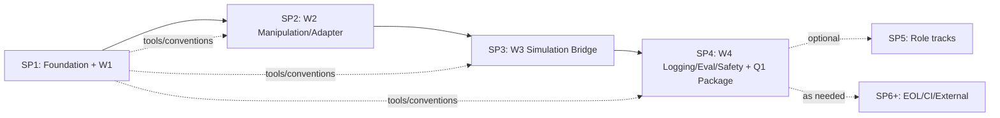

# Robotics Education Course — SP1 設計書

## 0. メタ情報

| 項目 | 値 |
|---|---|
| 設計対象 | Sub-Project 1 (リポジトリ基盤 + Week 1教材) |
| 期間目安 | 〜2026-05-01 (Week 1完了に合わせる) |
| 原典 | [`docs/Robotics_simulation_phase0_education_plan.md`](../../Robotics_simulation_phase0_education_plan.md) |
| 計画§対応 | §4.2 (Week 1) + §8.1/§8.5 (テンプレ) + §運用ルール |
| 後続 | SP2 (Week 2), SP3 (Week 3), SP4 (Week 4), SP5+ (任意Role tracks/EOL/CI) |
| 想定総ファイル数 | **42** (うち1件は原典の移動) |
| 想定総行数 | 約3,400行 |

このdocumentはbrainstormingで合意した5セクションを統合した設計書である。実装計画は別途 `docs/superpowers/plans/2026-04-27-robotics-course-sp1-plan.md` でstep-by-step化する。

---

## 1. 全体アーキテクチャ

### 1.1 リポジトリ階層 (mono-repo)

```
Robotics_Education/
├── README.md                     # Course全体の入口、リポジトリ全体の地図
├── CONTRIBUTING.md               # commit/branch/PR規約、Codex利用ルール
├── .gitignore                    # ROS2 build, rosbag2, Python等
│
├── docs/                         # 全ドキュメント集約
│   ├── Robotics_simulation_phase0_education_plan.md   # 原典 (移動)
│   ├── CONVENTIONS.md            # 言語規約、命名規約、Lecture/Lab/Templateフォーマット
│   ├── glossary.md               # 英↔日 用語と短い定義
│   ├── references.md             # R-01〜R-39 リソース台帳
│   └── superpowers/              # brainstorming/writing-plans成果物
│       ├── specs/
│       │   └── 2026-04-27-robotics-course-sp1-design.md   # 本文書
│       └── plans/
│           └── 2026-04-27-robotics-course-sp1-plan.md     # 後工程で生成
│
├── course/                       # 教材本体
│   ├── 00_setup/                 # 環境構築章
│   ├── week1/                    # SP1で完成
│   ├── week2/                    # SP2
│   ├── week3/                    # SP3
│   ├── week4/                    # SP4
│   └── role_tracks/              # SP5+ (任意)
│
├── sandbox_reference/            # instructor模範実装
│   ├── README.md
│   └── week1/
│
└── tools/                        # 共通スクリプト
    ├── verify_env.sh             # 環境チェック (正本)
    ├── new_week_skeleton.sh      # 次週フォルダ雛形生成
    ├── codex_prompt_template.md  # Codex prompt前5項目雛形
    └── check_structure.sh        # SP1完了判定G1/G2/G4自動化
```

### 1.2 3層の責務分離

| レイヤー | 役割 | 主な読者 | 編集頻度 |
|---|---|---|---|
| `course/` | 教材本体。学習者が読む/写経する/各自Sandbox repoへ転載 | 学習者全員 | サブプロジェクト単位で安定追加 |
| `sandbox_reference/` | instructorが実際にCourseを走らせた成果物 | 行き詰まった学習者 | 各週で実装時に蓄積 |
| `tools/` | Course運用の補助スクリプト | instructor + 学習者 | 必要時のみ |

### 1.3 サブプロジェクトのライフサイクル

各SPは独立した brainstorming → spec → plan → implementation → review サイクルで進行。SP2以降はSP1で確立した型 (`docs/CONVENTIONS.md`) を踏襲。

### 1.4 主要な構造判断

- **教材と模範実装を同mono-repoに置く**: 学習者各自の `Sandbox_<name>` repoは別物。本リポジトリの `sandbox_reference/` はinstructor1名分のスナップショット
- **Role別トラックは後回し**: 全員共通のW1-W4 (SP1-SP4) を確立してから SP5以降で派生
- **Docker/CI設定は含めない**: 環境戦略は native Ubuntu 22.04前提。`tools/verify_env.sh` で代替

---

## 2. ドキュメントフォーマット規約

(完全版は実装時に `docs/CONVENTIONS.md` として書き出す。本セクションはその要約。)

### 2.1 命名規約

| 対象 | 規約 | 例 |
|---|---|---|
| Lecture file | `l<番号>_<topic_snake>.md` (lowercase) | `l1_ros2_basics.md` |
| Lab folder | `lab<番号>[a-z]?_<topic_snake>/` | `lab1_turtlesim_rosbag/`, `lab4b_codex_mock_adapter/` |
| Lab中の文書 | `README.md` (手順)、`HINTS.md` (任意)、`CHECKLIST.md` (合格条件、正本) | |
| Template | `<deliverable>_template.md` | `skill_baseline_sheet_template.md` |
| Sandbox reference | `sandbox_reference/week<N>/lab<N>/` | `sandbox_reference/week1/lab1/` |
| Branch (instructor) | `course/sp<N>-<topic>` | `course/sp1-week1-foundation` |
| Branch (学習者向け推奨) | `learner/<name>/wk<N>-<topic>` | `learner/alice/wk1-tf-tree` |
| Commit prefix | `feat:`, `docs:`, `chore:`, `lab:`, `tool:`, `resource:`, `fix:` | `lab: add turtlesim bag exercise` |

**大文字例外** (GitHub慣習・Course独自):
- `README.md`, `CONTRIBUTING.md`, `LICENSE`, `CHANGELOG.md` — リポジトリ慣習
- `CHECKLIST.md`, `HINTS.md` — Lab内特殊役割文書
- 上記以外はすべて lowercase ASCII (`a-z 0-9 _ -`)

### 2.2 文書共通 front matter (10キー)

```yaml
---
type: lecture | lab | template | reference | week | setup | guide | checklist | hints | spec | plan
id: W1-L1                          # W<week>-{L<n>|Lab<n>[a-z]?|T-<short>} | SPEC-<id> | PLAN-<id>
title: ROS2 基礎 (node/topic/service/action/launch)
week: 1
duration_min: 45
prerequisites: [W1-L0]             # 統一キー
worldcpj_ct: [CT-01, CT-07]
roles: [common]                    # common | affordance | adapter | logging | sim | nav | gate | sandbox
references: [R-01, R-02]           # docs/references.md の ID
deliverables: []                   # lectureなら空、labなら成果物リスト
---
```

#### type別 front matter 必須/任意

| type | 対象ファイル | front matter |
|---|---|---|
| `lecture` | `course/week<N>/lectures/l<n>_*.md` | **必須** (10キー) |
| `lab` | `course/week<N>/labs/lab<n>*/README.md` | **必須** |
| `template` | `course/week<N>/deliverables/*_template.md` | **必須** |
| `week` | `course/week<N>/README.md` | **必須** |
| `setup` | `course/00_setup/*.md` | **必須** (空配列許容) |
| `reference` | `sandbox_reference/**/*.md` | **必須** |
| `checklist` | `lab<n>*/CHECKLIST.md` | **任意** (Lab READMEを継承) |
| `hints` | `lab<n>*/HINTS.md` | **任意** (Lab READMEを継承) |
| `guide` | root `README.md`, `CONTRIBUTING.md`, `docs/CONVENTIONS.md`, `docs/glossary.md`, `docs/references.md` | **任意** (慣習文書) |
| `spec` | `docs/superpowers/specs/*.md` | **専用 front matter** (course 10キー対象外)。必須キー: `type`, `id`, `title`, `date`, `status` (`draft`/`pending_user_review`/`approved`/`superseded`), `sub_project`, `related_plan` (生成予定の implementation plan へのパス。plan未生成時もパス予定値を記載) |
| `plan` | `docs/superpowers/plans/*.md` | **専用 front matter** (course 10キー対象外)。必須キー: `type`, `id`, `title`, `date`, `status`, `sub_project`, `related_spec` (派生元specへのパス) |

### 2.3 Lab成果物のGit管理ルール

`.gitignore` (root):

```gitignore
# ROS2 build artifacts at repo root
/build/
/install/
/log/

# rosbag2 / mcap bodies are not committed
*.db3
*.db3-journal
*.mcap
**/rosbag2_*/

# Lab 2 local-only artifacts (view_frames出力)
**/frames.pdf
**/frames.gv
**/frames.png

# Python / IDE
__pycache__/
*.pyc
.vscode/
.idea/

# Large media
*.mp4
*.mov
```

#### Commit対象 (軽量証跡のみ)

| 種別 | OK (commit) | NG (commitしない) |
|---|---|---|
| bag関連 | `bag_info.txt`, `rosbag_metadata.yaml` (rosbag2 ディレクトリ内 `metadata.yaml` を `cp` した軽量コピー) | `.db3`, `.mcap`, `rosbag2_*/` 本体 |
| terminal log | `terminal_*.log` | バイナリterminal capture |
| 画像 | 1MB以下のPNG | 動画、未圧縮画像 |
| 大きなbag | 必要時は外部ストレージ参照URLをmdに書く | リポジトリへ直接push |

学習者向け一文を `course/week1/labs/lab1_turtlesim_rosbag/README.md` 末尾に明記。

### 2.4 合格条件の正本一本化

- **正本: `CHECKLIST.md`**
- Lab `README.md` は末尾に `# 合格条件` セクションだけ置き、本文は1行: `合格条件は [CHECKLIST.md](./CHECKLIST.md) を参照。`
- `CHECKLIST.md` はチェックボックス形式

### 2.5 ドキュメント分離

| ファイル | 責務 |
|---|---|
| `docs/glossary.md` | 英↔日 用語と短い定義のみ |
| `docs/references.md` | リソース台帳 (R-01〜R-39 + R-40+)。表項目: ID, タイトル, URL, 種別, 対応Week, 対応Role, 最終確認日 |

front matterの `references: [R-01]` は `docs/references.md` を引く。`glossary.md` は引かれない。

### 2.6 Codex統合パターン

| Week | Codex 必須度 | 内容 |
|---|---|---|
| Week 1 | **接続確認 + ルール理解 + prompt前5項目の練習のみ** | Codex生成コードを成果物に必須化しない。Lab 0で workspace接続/connector確認/`tools/codex_prompt_template.md` 写経 |
| Week 2 | **必須**: Lab 4b で生成→PR→人間レビュー一巡 | `sandbox_pr_review_notes.md` を最低1件提出 |
| Week 3 | **必須**: Lab 6b で bridge stub / schema mappingをCodex支援で1PR | レビュー観点に schema整合性追加 |
| Week 4 | **必須**: Lab 8b でCodex任せ範囲・人間判断・検証証跡を分離記録 | 最終sandbox final review |

W2/W3/W4 Lab 4b/6b/8b の各 `README.md` に共通セクション:

```markdown
# Codex 利用ガイド (このLab必須)
## prompt前に書く5項目
- 目的 / 入力 / 制約 / 成功条件 / 検証コマンド
  → 雛形: ../../../../tools/codex_prompt_template.md
## 委ねない判断
- Affordance schema、評価指標、安全境界、実機投入可否
## レビュー観点 (sandbox_pr_review_notes.md に記録)
- diff summary / 動く根拠 / 壊れうる条件 / 採用しない提案 / 追加修正
```

### 2.7 Templateの2形態

| ファイル | 場所 | 用途 |
|---|---|---|
| `<x>_template.md` (空欄) | `course/week<N>/deliverables/` | 学習者がコピーして使う |
| `<x>_example.md` (記入済) | `sandbox_reference/week<N>/` | instructor記入例 |

### 2.8 sandbox_reference 構成方針

**フォルダ方式**: `sandbox_reference/week<N>/lab<N>/` に成果物配置。`sandbox_reference/README.md` 冒頭に「これは1スナップショットであり唯一解ではない。学習者は自分の `Sandbox_<name>` repoで自分のbranch/PRを作ること」と明示。

### 2.9 図表方針

- **第一選択: Mermaid** (GitHub標準対応、` ```mermaid ` コードフェンス必須)
- **第二選択: ASCII図**
- PlantUML / 外部ツールDSLは不採用 (GitHub標準で直接レンダリングされない)
- バイナリ画像は `assets/` 配下、1MB以下、再現可能性のスクショに限定

### 2.10 文字制限とロケール

| 対象 | ルール |
|---|---|
| ファイル名・フォルダ名 | lowercase ASCII (例外は §2.1)、`a-z 0-9 _ -` のみ |
| Branch名 | lowercase ASCII、`/` 区切り |
| Commit message | 英語、prefix付き (§2.1) |
| 散文 (md本文) | 日本語OK |
| コード識別子 | 英語snake_case (Python) / camelCase (該当時) |

### 2.11 Tool動作確認規約

| 種別 | 必須 | 推奨 |
|---|---|---|
| Tool (`tools/*.sh`, `course/00_setup/verify_setup.sh`) | `bash -n` 構文チェック通過 + 実行成功 | `shellcheck` 警告解消 |

理由: `bash -n` はbash同梱で追加install不要。`shellcheck` は別installのため必須化の摩擦が大きい。CI整備時 (SP6+) に必須昇格を検討。

### 2.12 リソース参照のIDシステム

教育計画原典 §6 の R-01 〜 R-39 をそのままIDとして `docs/references.md` で管理。新規リソースは R-40+ で追番。各SPでは既存IDを `references:` で参照、必要時に最終確認日更新やURL差し替え。

---

## 3. SP1 具体成果物

### 3.1 ファイル全リスト (42ファイル)

#### A. ルート / 運用 (6ファイル)

| # | path | 種別 | 骨子 |
|---|---|---|---|
| 1 | `README.md` | new | Course全体の地図、対象、進め方、SP1完了時に何ができるか、`docs/` `course/` `sandbox_reference/` `tools/` の役割、最初に読むべき順序 |
| 2 | `CONTRIBUTING.md` | new | branch/commit/PR規約、Codex利用ルール、レビュー観点、Sandbox原則 (秘密情報禁止等)、原典移動の運用 (tracked時 `git mv` / untracked時 `mv + git add`) |
| 3 | `.gitignore` | new | §2.3 改訂版そのまま |
| 4 | `docs/Robotics_simulation_phase0_education_plan.md` | move | 現状untrackedのため `mv + git add` で配置 |
| 5 | `docs/CONVENTIONS.md` | new | §2 全項目を文書化 |
| 6 | `docs/glossary.md` | new | 英↔日 用語と短い定義のみ。ROS2/MoveIt/Calibration/Safety/Git/Codex を分類別に列挙 |

#### B. リソース台帳 (1ファイル)

| # | path | 種別 | 骨子 |
|---|---|---|---|
| 7 | `docs/references.md` | new | R-01〜R-39 を計画§6から全移植。表項目: ID, タイトル, URL, 種別, 対応Week, 対応Role, 最終確認日 (2026-04-27) |

#### C. 環境セットアップ (5ファイル)

| # | path | 種別 | 骨子 |
|---|---|---|---|
| 8 | `course/00_setup/README.md` | new | この章の目的、Ubuntu 22.04 native前提の明記、Windows利用者向け案内 (VirtualBox/WSLは各自管理、Course側はサポート外と明示)、所要時間目安、SP1で必要な範囲 (W1完遂分まで) |
| 9 | `course/00_setup/ubuntu_2204_humble_setup.md` | new | apt source追加、`ros-humble-desktop` install、source `/opt/ros/humble/setup.bash`、`.bashrc` 追記、`ros2 doctor` 実行 |
| 10 | `course/00_setup/gazebo_fortress_setup.md` | new | Gazebo Fortressのapt install、`ros-humble-ros-gz` bridge package、起動確認 |
| 11 | `course/00_setup/moveit2_humble_setup.md` | new | `ros-humble-moveit` install、demo起動確認。SP1ではdemo起動できればOK、本格利用はSP2 |
| 12 | `course/00_setup/verify_setup.sh` | new | `tools/verify_env.sh` (#36) を呼ぶ薄いwrapper |

#### D. Week 1 README (1ファイル)

| # | path | 種別 | 骨子 |
|---|---|---|---|
| 13 | `course/week1/README.md` | new | front matter (`type: week, week: 1`)、目的、合格条件サマリ、Lecture/Lab一覧と所要時間、参照 (R-01〜R-05, R-33〜R-38) |

#### E. Week 1 Lectures (3ファイル、lowercase)

| # | path | 種別 | 骨子 |
|---|---|---|---|
| 14 | `course/week1/lectures/l0_git_codex_sandbox.md` | new | Git/GitHub最小語彙、branch/commit/remote/PR/review、Codex接続確認手順、頼む粒度、prompt前5項目、何を委ねないか |
| 15 | `course/week1/lectures/l1_ros2_basics.md` | new | node/topic/service/action/launch/QoS、`ros2` CLIの構造、ログが評価証跡である理由 |
| 16 | `course/week1/lectures/l2_tf_urdf.md` | new | TF/static transform、URDF構造、`robot_state_publisher`、`map`/`odom`/`base_link`/`camera_link`/`tool0`、frame命名のルール |

#### F. Week 1 Labs (3 Lab × 3ファイル/Lab = 9ファイル)

| # | path | 種別 | 骨子 |
|---|---|---|---|
| 17 | `course/week1/labs/lab0_sandbox_setup/README.md` | new | 自分の `Sandbox_<name>` repo作成、clone、最初のbranch、最初のcommit、PR作成、reviewコメント応答。Codex接続確認のみ (生成は必須化しない) |
| 18 | `course/week1/labs/lab0_sandbox_setup/CHECKLIST.md` | new | `Sandbox_<name>` repo作成済 / first PR URL記録 / Codex workspace確認 / `sandbox_setup_log.md` 記入完了 |
| 19 | `course/week1/labs/lab0_sandbox_setup/HINTS.md` | new | よくある詰まり (SSH key、PR description、Codex GitHub connector承認待ち) |
| 20 | `course/week1/labs/lab1_turtlesim_rosbag/README.md` | new | turtlesim起動 → topic echo → bag record/play/info → 提出物作成手順。bag本体commit禁止注記 |
| 21 | `course/week1/labs/lab1_turtlesim_rosbag/CHECKLIST.md` | new | `/turtle1/cmd_vel` echo成功 / bag再生でturtle動作 / `bag_info.txt` `rosbag_metadata.yaml` `terminal_5min.log` をSandbox commit/PR |
| 22 | `course/week1/labs/lab1_turtlesim_rosbag/HINTS.md` | new | bagが空になる原因、`metadata.yaml` の場所、`script` 互換性 |
| 23 | `course/week1/labs/lab2_tf_tree/README.md` | new | `static_transform_publisher`、`tf2_echo`、`view_frames` (PDFはローカル確認用)、Mermaid TF treeで提出 |
| 24 | `course/week1/labs/lab2_tf_tree/CHECKLIST.md` | new | static transform起動成功 / tf2_echo出力取得 / `view_frames` ローカル確認 (PDF commitしない) / `frame_inventory.md` にMermaid TF tree記述しSandboxにcommit |
| 25 | `course/week1/labs/lab2_tf_tree/HINTS.md` | new | TF time stamp問題、parent/child命名のtypo |

#### G. Week 1 Deliverables Templates (2ファイル)

| # | path | 種別 | 骨子 |
|---|---|---|---|
| 26 | `course/week1/deliverables/skill_baseline_sheet_template.md` | new | 計画§8.1 の表をmd table化、自己評価レベル0/1/2、署名・日付欄 |
| 27 | `course/week1/deliverables/sandbox_setup_log_template.md` | new | 計画§8.5 の表 (repo URL, access, local setup, first branch, Codex access, rules) |

#### H. Sandbox Reference (Week 1) (8ファイル)

| # | path | 種別 | 骨子 |
|---|---|---|---|
| 28 | `sandbox_reference/README.md` | new | 「これは1スナップショット、唯一解ではない」明示。学習者は自分のSandbox repoを別に持つこと |
| 29 | `sandbox_reference/week1/skill_baseline_sheet_example.md` | new | instructor自己採点記入例。8項目すべて記載 |
| 30 | `sandbox_reference/week1/sandbox_setup_log_example.md` | new | 本リポジトリ自体をSandbox例とした記入例 |
| 31 | `sandbox_reference/week1/lab0/codex_connection_check.md` | new | Lab 0でのCodex接続確認の手順とログ。生成コード含まない |
| 32 | `sandbox_reference/week1/lab1/bag_info.txt` | new | turtlesim実行で取得した `ros2 bag info` 出力 |
| 33 | `sandbox_reference/week1/lab1/rosbag_metadata.yaml` | new | rosbag2 `metadata.yaml` の軽量コピー |
| 34 | `sandbox_reference/week1/lab1/terminal_5min.log` | new | `script` で記録した実行ログ |
| 35 | `sandbox_reference/week1/lab2/frame_inventory.md` | new | CC/MSで想定するframe一覧案 (Mermaid TF tree付き)。`base_link` `camera_link` `tool0` を含む |

#### I. Tools (4ファイル)

| # | path | 種別 | 骨子 |
|---|---|---|---|
| 36 | `tools/verify_env.sh` | new | 正本実装。lsb_release / ros2 / gazebo (`gz`または`ign` 両対応) / moveit / git / python3 のversion出力。期待値比較しPASS/FAIL表示 |
| 37 | `tools/new_week_skeleton.sh` | new | 引数 `<week_number>` で `course/week<N>/{lectures,labs,deliverables,assets}/` と `README.md` 雛形を生成 |
| 38 | `tools/codex_prompt_template.md` | new | prompt前5項目テンプレ (目的/入力/制約/成功条件/検証コマンド) + 記入例1件 |
| 39 | `tools/check_structure.sh` | new | G1/G2/G4の自動化。42ファイル存在確認、命名規約lint、front matter 10キー検査 (type別必須/任意)、参照ID解決、ローカルlink解決、`sandbox_reference/week1/` 内容パターン検査、`bash -n` 全 `*.sh` |

#### J. SP仕様・計画 (2ファイル)

| # | path | 種別 | 骨子 |
|---|---|---|---|
| 40 | `docs/superpowers/specs/2026-04-27-robotics-course-sp1-design.md` | new | 本文書 |
| 41 | `docs/superpowers/plans/2026-04-27-robotics-course-sp1-plan.md` | new (後工程) | `writing-plans` skillで生成。SP1の実装手順をstep分解 |

#### K. SP1 補足 (1ファイル)

| # | path | 種別 | 骨子 |
|---|---|---|---|
| 42 | `sandbox_reference/week1/lab0/README.md` | new | Lab 0で作ったfirst PRのURLメモ、Codex workspace確認結果、軽量ログ |

### 3.2 分量見積もり

| 区分 | ファイル数 | 1ファイル平均 (行) | 合計 (行) |
|---|---|---|---|
| ルート/運用 (A) | 6 | 80 | 480 |
| リソース台帳 (B) | 1 | 200 | 200 |
| 環境setup (C) | 5 | 60 | 300 |
| Week 1 README (D) | 1 | 80 | 80 |
| Lectures (E) | 3 | 150 | 450 |
| Labs (F) | 9 | 60 | 540 |
| Templates (G) | 2 | 50 | 100 |
| Sandbox reference (H) | 8 | 40 | 320 |
| Tools (I) | 4 | 80 (sh) / 50 (md) | 290 |
| Specs / plan (J) | 2 | 300 | 600 |
| SP1補足 (K) | 1 | 50 | 50 |
| **合計** | **42** | | **約3,410行** |

### 3.3 SP1 で作らないもの (YAGNI 明示)

教育計画に含まれていてもSP1スコープ外:

| 不作成 | 理由 |
|---|---|
| Week 2/3/4のLecture/Lab/Template | SP2-SP4で扱う |
| Role別トラック教材 | 全員共通W1-W4完了後、SP5+ |
| Q1 Reduced Lv1 Execution Package テンプレート | W4 Lab 8 成果物、SP4 |
| Robot Readiness Mini Report テンプレ | W2 Lab 4、SP2 |
| Simulation Bridge Draft テンプレ | W3 Lab 6、SP3 |
| Sandbox PR Review Notes テンプレ | W2 Lab 4b、SP2 |
| URSim、UR ROS2 driver、MoveIt2 のフル設定 | SP2、SP1ではdemo起動確認のみ |
| Docker / docker-compose / WSL2手順 | 環境戦略でnative前提を選択済み |
| CI / GitHub Actions | Q1優先度低、必要時SP6+ |
| 動画教材 | 計画§7「動画だけを成果にしない」と整合 |
| ベンチマーク再現 (CC/MS Lv1の実装) | Q1本体プロジェクトの作業 |

---

## 4. 週間連続性とサブプロジェクト ロードマップ

### 4.1 サブプロジェクト全体マップ

| SP | 期間目安 | スコープ | 主要成果物 | 計画§対応 |
|---|---|---|---|---|
| **SP1** | 〜2026-05-01 | リポジトリ基盤 + W1 | 42ファイル | §4.2 + §8.1/§8.5 |
| **SP2** | 〜2026-05-08 | W2 Manipulation / Robot Adapter | W2教材一式、Robot Readiness Mini Report、Sandbox PR Review Notesテンプレ、Codex統合本格運用 | §4.3 + §8.2 + §8.6 |
| **SP3** | 〜2026-05-15 | W3 Simulation Bridge | W3教材一式、Simulation Bridge Draft、Simulator Decision Tableテンプレ | §4.4 + §8.3 |
| **SP4** | 〜2026-05-22 | W4 Logging/Eval/Safety + Q1統合 | W4教材一式、Trial Sheet、Episode Record、Q1 Execution Package、Safety Checklistテンプレ | §4.5 + §8.4 |
| **SP5** | Q1後半以降 (任意) | Role別トラック | `course/role_tracks/` 7Role分の補習教材 | §5 |
| **SP6+** | 必要時 | EOL対応 (Fortress 2026-09 EOL前にHarmonic検証)、CI、外部公開 | (随時) | §運用ルール |

### 4.2 SP1で確立した型の再利用

| 再利用される型 | SP2-SP4での新規追加例 |
|---|---|
| `course/week<N>/` ディレクトリ構造 | 構造そのまま |
| Lecture/Lab/Template の共通 front matter キー集合 (10キー) | `worldcpj_ct` `roles` の値が変わる |
| `CHECKLIST.md` を正本とする合格条件 | Lab固有のチェック項目 |
| `<x>_template.md` + `<x>_example.md` の2形態 | 各週新テンプレ追加 |
| Codex統合パターン (Lab Xb のREADME必須セクション) | SP2で本格運用開始 |
| `tools/new_week_skeleton.sh` での雛形生成 | SP2/3/4の最初に実行 |
| Commit prefix / branch命名 | 規約そのまま |
| `docs/references.md` のID参照システム | R-08〜R-32 を該当週で `references:` に列挙 |
| `sandbox_reference/week<N>/` | 各週軽量証跡を蓄積 |

SP2の最初の作業 = `bash tools/new_week_skeleton.sh 2`。

### 4.3 SP間の依存関係



直線依存 (SP1→SP2→SP3→SP4): 学習者の積み上げと一致。  
点線依存: SP1が型を提供。SP1完了せずにSP2着手しない。  
SP5以降は任意: Q1本体プロジェクト負荷次第で延期可能。

### 4.4 SP2〜SP4 中身プレビュー

詳細スコープはSP着手時のbrainstormingで再合意。

#### SP2: Week 2 — Manipulation / Robot Adapter

| 区分 | 想定ファイル例 |
|---|---|
| Lectures | `l3_moveit2_overview.md`, `l4_robot_adapter_stages.md` |
| Labs | `lab3_rviz_planning/`, `lab4_ursim_or_mock_hardware/`, `lab4b_codex_mock_adapter/` |
| Templates | `robot_readiness_mini_report_template.md`, `sandbox_pr_review_notes_template.md` |
| Sandbox reference | `sandbox_reference/week2/lab3-4b/` 軽量証跡 |
| references.md 参照/更新 | R-08〜R-14, R-15〜R-17 |
| 想定ファイル数 | 約30 |

SP2固有のリスク: URSim実環境セットアップ。Lab 4 で「URSim困難時は mock_hardware で代替可」と明記する設計を予定。

#### SP3: Week 3 — Simulation Bridge

| 区分 | 想定ファイル例 |
|---|---|
| Lectures | `l5_gazebo_fortress_ros2_bridge.md`, `l6_simulator_landscape.md` |
| Labs | `lab5_gazebo_topic_bridge/`, `lab6_sim_to_worldcpj_schema/`, `lab6b_codex_bridge_stub/` |
| Templates | `simulation_bridge_draft_template.md`, `simulator_decision_table_template.md` |
| references.md 参照/更新 | R-18〜R-27 |
| 想定ファイル数 | 約28 |

SP3固有のリスク: 全員にIsaac/ManiSkillをハンズオンさせない (計画§7)。Lab 6では Gazebo bridge stub のみハンズオン、MuJoCo/Isaacは Lecture 6 で用途差を読むだけ。

#### SP4: Week 4 — Logging / Evaluation / Safety + Q1統合

| 区分 | 想定ファイル例 |
|---|---|
| Lectures | `l7_rosbag2_mcap_episode_record.md`, `l8_safety_sop_safe_no_action.md` |
| Labs | `lab7_episode_record/`, `lab8_q1_execution_package/`, `lab8b_codex_sandbox_final_review/` |
| Templates | `trial_sheet_template.md`, `episode_record_template.md`, `q1_reduced_lv1_execution_package_template.md`, `safety_checklist_template.md` |
| references.md 参照/更新 | R-28〜R-32 |
| 想定ファイル数 | 約32 |

SP4固有のリスク: 安全関連はBlogだけで済ませない (計画§7)。Lab 8で公式マニュアル + 現場SOP + 責任者レビューの3点引用。Role Owner (Robot Adapter/Safety) のレビュー必須化検討。

#### SP5 (任意): Role別トラック

| 想定 | 内容 |
|---|---|
| `course/role_tracks/affordance_calibration/` | CT-01/02、Modern Robotics Ch.3/5/6索引 |
| `course/role_tracks/robot_adapter_safety/` | CT-06/09、UR safety docs深掘り |
| `course/role_tracks/logging_gate_eval/` | CT-07、rosbag2/MCAP/LeRobot差分 |
| `course/role_tracks/simulation_bridge/` | CT-08、MuJoCo/ManiSkill/Isaac個別hands-on (希望者のみ) |
| `course/role_tracks/ms_belief_navigation/` | CT-04/05/08、Nav2/Kachaka |
| `course/role_tracks/cc_gate_0a/` | CT-01/02/06/07、5物体 x 3 trial評価準備 |
| `course/role_tracks/agentic_workflow_sandbox/` | 全CT横断、Codex運用深化 |

各トラックは独立サブプロジェクト化可能 (SP5a, SP5b, ...)。

### 4.5 ロードマップ全体のリスクと既知の落とし穴

| リスク | 発生時期 | 緩和 |
|---|---|---|
| Gazebo Fortress EOL (2026-09) | SP3〜SP4後 | SP6+で「Harmonic + Jazzy への移行レビュー」(計画§運用ルール「EOLを意識する」) |
| URSim/UR ROS2 driverのversion drift | SP2 | SP2着手時に R-13/R-14 最終確認日更新、driverのHumble対応版commit hash固定 |
| Codex機能仕様変更 | SP1〜SP4全期間 | R-36〜R-38 を毎SP頭に確認、変更があればCodex統合パターン (§2.6) を改訂 |
| Role別トラック (SP5) がQ1本体作業に押し潰される | SP4後 | SP5は任意。SP4完了でPhase 0教育として十分機能する設計 |
| 学習者環境のドリフト | 全期間 | `tools/verify_env.sh` をSP頭で再実行する運用ルールを CONTRIBUTING.md に明記 |
| サブプロジェクト間でCONVENTIONS変更が必要 | SP2以降 | CONVENTIONS変更は単独PR、影響範囲を `docs/superpowers/specs/` 配下に変更ログとして記録 |

### 4.6 SP1完了後にユーザーが判断する分岐

| 分岐 | 選択基準 |
|---|---|
| (a) **そのままSP2着手** | SP1で型が機能した感触があり、Q1スケジュール通り進める場合 |
| (b) **SP1の補足修正を先行** | W1教材を実走して型の欠陥が見えた場合 |
| (c) **Role割当を先に確定してSP2再ブレスト** | チームメンバーRole分担状況に応じてSP2スコープを調整したい場合 |
| (d) **SP2スキップしてSP4を先行** | リスク高 (W2/W3前提なしにW4 Q1 Packageは作れない)、推奨しない |

推奨は **(a)**。SP1実走後の手応え次第で (b) もありえる。

### 4.7 SP1〜SP4完了で得られるPhase 0教育の最低形

SP4完了時点で揃うもの:

- 全員共通のW1〜W4 教材一式 (**Lecture 9本** (L0〜L8) + **Lab 12本** (Lab 0〜Lab 8b))
- **10種類のDeliverable Template** (skill_baseline / sandbox_setup_log / robot_readiness / sandbox_pr_review_notes / simulation_bridge_draft / simulator_decision_table / trial_sheet / episode_record / q1_reduced_lv1_execution_package / safety_checklist)
- instructor模範実装の `sandbox_reference/week1〜week4/`
- 共通ツール (`verify_env.sh`, `new_week_skeleton.sh`, `codex_prompt_template.md`, `check_structure.sh`)
- `docs/references.md` (R-01〜R-39 + 必要追加)

これだけあれば、Q1 Reduced Lv1 + Phase 0 の教育計画§1表 (8領域) の全項目に対し「全員が同じ用語で会話でき、Role担当が実作業を出せる」状態を達成。Role別トラック (SP5) はQ1の進捗に応じて追加するOptional教材。

---

## 5. 検証・承認アプローチ

### 5.1 SP1 完了の正式判定基準 (5ゲート)

すべてPASSでSP1完了。

| ゲート | 判定対象 | 判定方法 | 失敗時の対応 |
|---|---|---|---|
| **G1: 構造ゲート** | 42ファイルすべて存在し、§2命名規約に準拠 | `tools/check_structure.sh` で全ファイル存在確認 + 命名規約lint | 不足ファイル追加、命名修正 |
| **G2: 内容整合ゲート** | front matter が type別必須/任意通り (course文書は10キー、`spec`/`plan` は専用7キー、`checklist`/`hints`/`guide` は任意)、`prerequisites` / `references` / `worldcpj_ct` の参照先が実在 | 同lintスクリプトで参照解決チェック | 不存在ID修正、front matter補完 |
| **G3: 環境ゲート** | `bash tools/verify_env.sh` がinstructor環境 (Ubuntu 22.04 + Humble + Fortress + MoveIt2 + Git) でPASS | 実環境で実行 | OS/パッケージ追加 |
| **G4: 走破ゲート** | W1全Labをinstructor自身が手順通り実行し、`sandbox_reference/week1/` に**期待ファイルが存在し、非空で、最低限の内容パターンを含む** | `tools/check_structure.sh` で内容パターンマッチ | 手順誤り修正、HINTSへ追記 |
| **G5a: ローカルリンク** | 全mdの相対パス参照、anchor link、`./` `../` 参照先がリポジトリ内に実在 | `tools/check_structure.sh` 内でlocal link解決 | リンク修正、参照先文書補完 |
| **G5b: 外部URLリンク** | `docs/references.md` のR-01〜R-39 URLおよびLecture/Lab中の外部URL | link checker (例: lychee) で到達確認 | **警告扱い、手動確認で補完** |

### 5.2 G4 内容パターン検査の具体

| 期待ファイル | 内容パターン |
|---|---|
| `sandbox_reference/week1/lab1/bag_info.txt` | 非空 + `Duration:` または `Topic information:` を含む |
| `sandbox_reference/week1/lab1/rosbag_metadata.yaml` | 非空 + `topics_with_message_count:` を含む |
| `sandbox_reference/week1/lab1/terminal_5min.log` | 非空 (1KB以上) |
| `sandbox_reference/week1/lab2/frame_inventory.md` | ` ```mermaid` code fence を含む + `base_link` + `camera_link` + `tool0` の3キーワードすべて含む |
| `sandbox_reference/week1/lab0/codex_connection_check.md` | 非空 + `workspace` + `connector` を含む |
| `sandbox_reference/week1/skill_baseline_sheet_example.md` | 非空 + 計画§8.1の8項目名 (ROS2 CLI / TF/URDF / MoveIt2 / Calibration / Simulation / Logging / Safety / Git/Codex) を含む |
| `sandbox_reference/week1/sandbox_setup_log_example.md` | 非空 + `repo:` + `first branch:` を含む |

### 5.3 自己検証 (instructor pre-flight)

```
1. bash tools/check_structure.sh     # G1, G2, G4 (内容パターン), G5a
2. bash tools/verify_env.sh          # G3
3. course/week1/ をREADMEから順に読み、Lab 0/1/2を実走  # G4本体
4. 外部URL link checker (lychee等) を全md対象で実行    # G5b (warning扱い)
```

### 5.4 第三者検証 (任意、SP2着手前推奨)

instructor以外のチームメンバー1名に「未経験者役」で `course/week1/README.md` から走らせる。

| 観察項目 | 期待 | 失敗パターン |
|---|---|---|
| 30分以内にLab 0開始可能 | YES | setup章で詰まる → `00_setup/` 補強 |
| 各Labの所要時間が `duration_min` ±20%以内 | YES | 大幅超過 → 手順分割 or 前提追加 |
| `HINTS.md` を見つけて活用できる | YES | 場所不明 → `README.md` に明示リンク |
| 提出物を自Sandboxにcommit/PRできる | YES | Git操作詰まり → Lab 0補強 |

第三者検証はSP1合格条件に含めない (Q1スケジュール圧迫回避)。SP1完了後オプション。

### 5.5 教材の「動く」とは何か

| 種別 | 動作確認の定義 |
|---|---|
| Lecture (`l<n>_*.md`) | 散文の整合性・用語のglossary準拠・参照IDの解決可能性 (静的check) |
| Lab (`lab<n>*/README.md`) | 手順を実環境で実行し、CHECKLIST全項目PASS (動的check) |
| Template (`*_template.md`) | 空欄項目を `sandbox_reference/` の `*_example.md` で埋められる (記入可能性確認) |
| 環境 (`00_setup/*.md`) | 手順通りインストール後、`verify_env.sh` がPASS |
| Tool (`tools/*.sh`) | `bash -n` 構文チェック必須通過 + 実行成功。`shellcheck` 推奨 |

「動画で動いている様子を見せる」は動作確認にならない (計画§7と整合)。

### 5.6 SP1 着手後の主要リスクと対応

| リスク | 影響範囲 | 緩和策 |
|---|---|---|
| Codex接続がworkspace owner設定で動かない | Lab 0 | Lab 0 README に「workspace ownerに `Codex local/cloud + GitHub connector` 有効化を依頼」手順を含める。動かなくてもLab 0完遂可 (Codex部分は接続確認のみ) |
| `ros2 doctor` 未知警告でverifyスクリプトがFAIL扱い | G3 | `verify_env.sh` は `ros2 doctor` 戻り値ではなく必須コマンド存在確認 (`which ros2`, `which gz`/`which ign`, `which python3`) と version regex マッチで判定 |
| `gz`/`ign` コマンド名差異 | G3, Lab未来 | `verify_env.sh` は両方を順に試行、いずれかPASSでOK判定 |
| `script` コマンド互換性問題 | Lab 1 | `lab1` HINTS に複数の `script` 起動例を併記 |
| `view_frames` 出力ファイル | Lab 2 | `.gitignore` に `**/frames.pdf` `**/frames.gv` `**/frames.png`。Lab 2 はMermaid提出が正なのでPDF生成失敗でもCHECKLIST合格可 |
| Markdown link checker false positive | G5b | 外部URL link checkは警告のみ、手動確認補完 |
| `git mv` 履歴保全に拘って原典移動を遅らせる | SP1初期 | 現状untrackedなので `mv + git add` で問題なし (CONTRIBUTING.md明記) |

### 5.7 SP1 → SP2 移行ゲート

SP1の5ゲートPASSに加え:

| 項目 | 判定 |
|---|---|
| ユーザー(あなた)による spec / 実装 / 完了報告のレビューがPASS | 必須 |
| `docs/superpowers/specs/2026-04-27-robotics-course-sp1-design.md` がmainにmerge済 | 必須 |
| `tools/new_week_skeleton.sh` でW2雛形が即生成可能 (動作確認済) | 必須 |
| §4.6 の分岐判断が明確に選択されている | 必須 |
| Q1スケジュール (2026-05-04開始) とSP2着手日が整合 | 推奨 |

### 5.8 SP1 失敗時の撤退基準

| 兆候 | 対応 |
|---|---|
| 実装ファイル数が60を超えそう | scope肥大。不要削減か SP1a / SP1b に分割 |
| W1 Lab1/Lab2 の実走で1日以上詰まる | 環境前提が現実と合わない。`00_setup/` 見直し優先 |
| Codex連携の前提が変化 | Lab 0と CONVENTIONS.md §2.6 改訂、SP1スコープから一時除外 |
| 教育計画原典に矛盾発見 | 原典の修正PRを別途作成 (SP1 specで「原典更新前提のため凍結」と注記) |

### 5.9 ユーザーレビューの観点

SP1完了時点で見るべき5観点:

1. **学習者視点**: `README.md` から始めて、未経験者なら走破できるか
2. **Phase 0 整合**: Course内容が教育計画§1表 (W1合格条件5項目 + Sandbox 1項目) を満たすか
3. **再利用性**: SP2以降で同じ型を回せるか
4. **安全境界**: Sandbox原則 (秘密情報禁止、実機接続禁止) が CONTRIBUTING.md と各Lab で明示されているか
5. **コスト**: 42ファイルのうち、実際に使うものに絞れているか (YAGNI再確認)

---

## 6. Decision Log (brainstorming合意履歴)

brainstorming中のユーザー判断と、その理由・反映先。

| # | 質問 | 判断 | 反映先 |
|---|---|---|---|
| Q1 | 分解戦略 | A: 週次積み上げ | §4.1 サブプロジェクト全体マップ |
| Q2 | リポジトリ位置づけ | C: Course配信 + 模範Sandboxの2層構造 | §1.1 リポジトリ階層 |
| Q3 | 実行環境 | A: ネイティブUbuntu 22.04前提・最小化 (Windowsは各自VirtualBox/WSL) | §3.1 #8 setup README、Docker/CI不採用 |
| Q4 | 言語規約 | B: 散文=日本語、識別子・commit・branch=英語 | §2.10 文字制限 |
| Q5 | SP1境界 | B: リポジトリ基盤 + Week 1 | §3 全体 |
| F1 (sec2) | docs分離 | glossary.md (用語) と references.md (URL台帳) を分離 | §2.5 |
| F2 (sec2) | Week 1 Codex位置づけ | 接続・ルール・prompt練習のみ。生成必須化はW2以降 | §2.6 |
| F3 (sec2) | Lab成果物Git管理 | bag本体commit禁止、`rosbag_metadata.yaml` 軽量コピー運用 | §2.3, §3.1 #20 |
| F4 (sec2) | README/CHECKLIST | CHECKLISTを正本、READMEは1行参照 | §2.4 |
| F5 (sec2) | front matterキー統一 | `prereq` / `prereq_lectures` 廃止、`prerequisites` に統一 | §2.2 |
| F6 (sec2) | .gitignore範囲 | `/log/` root限定、bagディレクトリ内metadataはコピー出して提出 | §2.3 |
| F1 (sec3) | Lectureファイル名 | lowercase化 (`l0_...md`)、慣習ファイル (README/CONTRIBUTING/CHECKLIST/HINTS) は例外 | §2.1, §3.1 #14-16 |
| F2 (sec3) | front matter type拡張 | `week`, `setup`, `guide` 追加 | §2.2 |
| F3 (sec3) | 原典移動方針 | 現状untrackedなので `mv + git add` (履歴保全対象なし) | §3.1 #4, CONTRIBUTING.md |
| F4 (sec3) | references.mdスコープ | SP1で R-01〜R-39 全移植、SP2+ は参照/更新のみ | §3.1 #7, §4.4 |
| F5 (sec3) | verify script正本 | `tools/verify_env.sh` 正本、`course/00_setup/verify_setup.sh` は薄いwrapper | §3.1 #12, #36 |
| F6 (sec3) | Lab 2 提出物 | `frames.pdf` ではなくMermaid TF treeを正に統一 | §3.1 #23-25, .gitignore |
| F7 (sec3) | frames.pdf ignore範囲 | `**/frames.pdf` 等で全階層対象 | §2.3 .gitignore |
| F1 (sec4) | Lecture/Lab本数 | Lecture 9本 / Lab 12本 (再集計) | §4.7 |
| F2 (sec4) | Template本数 | 10種類で確定 | §4.7 |
| F3 (sec4) | references.md 用語 | 「追加」→「参照/更新」、新規はR-40+ | §4.4 |
| F4 (sec4) | front matter キー数 | 7キー → **10キー** で正確化 | §4.2 |
| F5 (sec4) | Mermaid記法 | コードフェンス記法 (` ```mermaid `) 必須、PlantUML不採用 | §2.9, §4.3 |
| F1 (sec5) | ファイル数 | 41 → 42 (`tools/check_structure.sh` 追加) で全表記統一 | §3.1 #39, §3.2, §4.1, §5.1 |
| F2 (sec5) | G5分割 | local必須PASS / external警告で運用 | §5.1 G5a/G5b |
| F3 (sec5) | G4強化 | ファイル存在 + 内容パターン検査 | §5.2 |
| F4 (sec5) | front matterチェック対象 | type別必須/任意マトリクス、`checklist` `hints` 追加 | §2.2 |
| F5 (sec5) | shellcheck運用 | `bash -n` 必須、`shellcheck` 推奨 | §2.11, §5.5 |

(F = Findings、各セクションのレビューで指摘された修正)

---

## 7. Open Questions / Future Work

SP1スコープ外で、SP2以降で扱う:

| 項目 | 想定対応SP |
|---|---|
| W2 URSim実環境のDocker化検討 (mock_hardware代替戦略の評価) | SP2 |
| W3 simulator decision tableの内容詳細 (MuJoCo/ManiSkill/Isaac用途差) | SP3 |
| W4 Q1 Reduced Lv1 Execution Package のCT-01〜CT-09 完全マッピング | SP4 |
| Role別トラック教材の必要性再評価 (Q1中盤の進捗を見て) | SP5 検討時 |
| Gazebo Fortress → Harmonic 移行レビュー | SP6+ (2026-09 EOL前) |
| GitHub Actions CI整備 (`tools/check_structure.sh` を毎PR実行) | SP6+ |
| 外部公開・ライセンス・LICENSE設置検討 | 必要時 |

---

## 8. 承認

| ロール | 承認 | 日付 |
|---|---|---|
| Brainstorming session | 全5セクション + 全findings 反映 | 2026-04-27 |
| ユーザー最終レビュー | 未承認 (本spec commit後に依頼予定。承認時に `status: approved` へ更新) | 未確定 |

承認後、`writing-plans` skill で `docs/superpowers/plans/2026-04-27-robotics-course-sp1-plan.md` を生成する。
