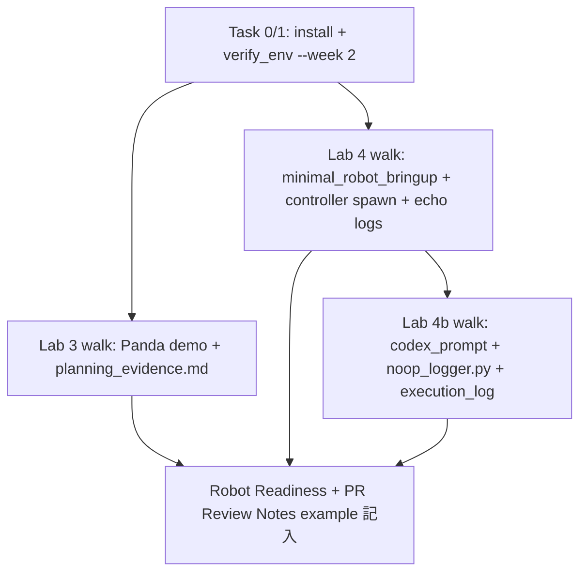

# Robotics Education Course — SP2 設計書

## 0. メタ情報

| 項目 | 値 |
|---|---|
| 設計対象 | Sub-Project 2 (Week 2: Manipulation / Robot Adapter) |
| 期間目安 | 〜2026-05-08 (Week 2完了に合わせる) |
| 原典 | [`docs/Robotics_simulation_phase0_education_plan.md`](../../Robotics_simulation_phase0_education_plan.md) §4.3 |
| 計画§対応 | §4.3 (Week 2) + §8.2 (Robot Readiness Mini Report) + §8.6 (Sandbox PR Review Notes) + §運用ルール |
| 前提 | SP1 完了 (commit `90bc64c` mainにmerge済、42→43ファイル + tools/ 完備) |
| 後続 | SP3 (Week 3 Simulation Bridge), SP4 (Week 4 Logging/Eval/Safety + Q1統合) |
| 想定総ファイル数 | **設計完了時 27 新規 + 3 修正 = 30、writing-plans 後 28 新規 + 3 修正 = 31** |
| 想定総行数 | 約 2,500 行 (新規分) |

---

## 1. 全体スコープと SP1 からの継承

### 1.1 SP2 ミッション

Week 2 (Manipulation / Robot Adapter) の教材を SP1 で確立した型 (CONVENTIONS.md / tools / sandbox_reference 構造) に沿って追加し、全員が **MoveIt2 Panda demo で planning scene / IK / trajectory を体験 (Lab 3)**、**別 Lab で mock_hardware 上の Robot Adapter 境界を体験 (Lab 4)**、さらに **Codex 生成→PR レビューの一巡を実走 (Lab 4b)** できる状態にする。

**二軸の方針**: 全員向け教材の標準ルートは **mock_hardware 中心** (質問 1 の判断 B)。一方、instructor が `sandbox_reference/week2/` に残す模範実装は **MoveIt2 + ros2_control を実走** (質問 4 の判断 A) して証跡を作る。**URSim / 実機 / IK mock は SP2 全員ベースラインに含めない** (Robot Adapter / Safety Role Owner Stretch goal として SP5 または個別宿題で扱う)。

### 1.2 SP1 からの継承 (新規設計しないもの)

| 継承項目 | SP1 で確立済 | SP2 で利用 |
|---|---|---|
| リポジトリ階層 | `course/`, `sandbox_reference/`, `tools/`, `docs/` | `course/week2/` を追加 |
| 命名規約 (Lecture `l<n>`, Lab `lab<n>[a-z]?`) | CONVENTIONS.md §1 | L3/L4, Lab3/Lab4/Lab4b を新設 |
| 共通 front matter (10キー) + type別マトリクス | CONVENTIONS.md §2 | template/lecture/lab/reference/week すべてに適用 |
| Codex 統合パターン (Lab Xb 共通セクション) | CONVENTIONS.md §6 | Lab 4b で **初の本格運用** |
| .gitignore / Lab 成果物 commit ルール | CONVENTIONS.md §3 | mock_hardware 出力にも適用 (生成ログは軽量証跡のみ) |
| references.md ID システム | docs/references.md (R-01〜R-39) | R-08〜R-17, R-30, R-31 を front matter で参照 |
| `tools/new_week_skeleton.sh` | 完成済 | **SP2 開始時に `bash tools/new_week_skeleton.sh 2`** で `course/week2/{lectures,labs,deliverables,assets}/` + 雛形 README を一発生成 |
| `tools/check_structure.sh` | G1/G2/G4/G5a 自動化 | **SP2 完了時に再実行**、SP1+SP2 expected files 全件を検証 |
| `tools/verify_env.sh` | OS/ROS2/Gazebo/MoveIt2/Git チェック | SP2 着手時に **再実行** + `--week 2` モード追加 |
| `tools/codex_prompt_template.md` | 完成済 | **Lab 4b 入口で利用必須化** |

### 1.3 SP2 で新規設計するもの

| 新規 | 内容 |
|---|---|
| Week 2 教材 (Lecture × 2, Lab × 3, Template × 2, Week README × 1) | L3 MoveIt2 概観、L4 Robot Adapter + Calibration + Safety 最小語彙、Lab3 RViz planning、Lab4 mock_hardware adapter、Lab4b Codex no-op logger、Robot Readiness Mini Report、Sandbox PR Review Notes、course/week2/README.md |
| Sandbox reference week2/ (12 ファイル) | 各 Lab の real run 軽量証跡 + 2 template 記入例 + codex_prompt_lab4b.md + controllers_list.txt |
| `tools/verify_env.sh` の **週別モード化** | `--week N` 引数で週ごとに必須/WARN/skip を切り替え。デフォルトは SP1 互換 |
| `tools/check_structure.sh` 拡張 | `EXPECTED_FILES` を SP2 expected files へ拡張、10キー必須対象に W2 追加、G4 patterns に Lab 3/4/4b 内容パターン追加、front matter 検査を here-string 化、`sandbox_reference/week1/lab1/README.md` を expected list に正規化 |
| `README.md` (root) 更新 | `今後の予定` テーブルの SP2 行を「**完了 (Week 2 — Manipulation / Robot Adapter)**」に変更、`SP2で何ができるか` 段落追加 |

### 1.4 SP2 で **作らない** もの (YAGNI 明示)

| 不作成 | 理由 |
|---|---|
| URSim install 自動化、URCapX、PolyScopeX 接続手順 | Stretch goal、SP5/SP6+ |
| UR ROS2 driver の package 追加 | 同上 |
| URDF + IK mock adapter (KDL ベース) | Robot Adapter Role Owner Stretch、Robot Readiness Mini Report 内「次段階」欄に記録 |
| カメラハードウェア / camera_calibration package のハンズオン | Calibration role 担当 SP5 |
| MoveIt2 Configuration Wizard 自前 robot setup | SP5/SP6+ |
| Trial Sheet、Episode Record、Safety Checklist テンプレ | SP4 |
| Q1 Reduced Lv1 Execution Package | SP4 |
| W3/W4 教材 (L5-L8, Lab5-8b) | SP3/SP4 |
| `course/week2/labs/lab4c_*` 等の追加 lab | Lab 4b のみで Codex 段階を完結 |
| `course/week1/README.md` の更新 | W1 内容は SP1 で完成済、W2 への参照は root README が担う |

### 1.5 SP2 完了時の状態 (エンドステート)

- `course/week2/` 完成 (Lecture 2 + Lab 3 + Template 2 + README + sandbox_reference 12 件)
- `tools/verify_env.sh --week 2` PASS、`tools/check_structure.sh` PASS
- 全員ベースライン: MoveIt2 Panda demo 体験 + mock_hardware adapter 境界体験 + Codex no-op logger PR レビュー一巡
- Robot Adapter / Safety Role Owner Stretch: URSim / IK mock adapter は Robot Readiness Mini Report 「次段階」欄で記録 (W2 内では未実施)
- README.md `今後の予定` テーブルの SP2 行が完了状態に更新
- Q1 reduced Lv1 W2 開始日 (2026-05-04) に間に合う
- SP3 (Simulation Bridge) 着手準備完了 (Gazebo Fortress install を SP3 Task 0 で実施予定、`verify_env.sh --week 3` モード追加で復活)

---

## 2. SP2 ファイル一覧

### 2.1 全件サマリ

**設計完了時点: 新規 27 / 修正 3 / 計 30 ファイル**。`writing-plans` skill 実行後に **plan ファイル 1 件追加** され、最終 SP2 着手時は新規 28 + 修正 3 = 31 ファイル。`docs/references.md` の修正は条件付きで増加可能性あり (§2.3 #28 参照)。

### 2.2 新規ファイル詳細

#### A. Week 2 Lectures (2 ファイル)

| # | path | 種別 | 骨子 |
|---|---|---|---|
| 1 | `course/week2/lectures/l3_moveit2_overview.md` | new | MoveIt2 全体像 (planning scene、collision、IK、trajectory、controller 接続層)、`ros2 launch moveit_resources_panda_moveit_config demo.launch.py` 動作確認、Python motion planning API の存在に触れる (R-08, R-09, R-10) |
| 2 | `course/week2/lectures/l4_robot_adapter_calibration_safety.md` | new | Robot Adapter 4 段階 (no-op / URDF+IK mock / URSim / real) と各段階で評価できること、`ros2_control` と hardware interface の境界、URSim/UR ROS2 driver は概念のみ (Stretch 案内)、**Calibration 最小語彙** (intrinsic / extrinsic / hand-eye / fixture / reprojection error)、**Safety 最小語彙** (emergency / safeguard / protective stop / safe no-action / operator confirmation) (R-11, R-12, R-13, R-14, R-15, R-16, R-17, R-30, R-31) |

#### B. Week 2 Labs (3 lab × 3 ファイル = 9 ファイル)

| # | path | 種別 | 骨子 |
|---|---|---|---|
| 3 | `course/week2/labs/lab3_rviz_planning/README.md` | new | MoveIt2 Panda demo を RViz で起動、Planning タブで start/goal を設定、planning success/failure を観察、collision-aware IK を体験。**実走 log が正、RViz スクショは任意 (1MB 以下、`assets/` 配下)** |
| 4 | `course/week2/labs/lab3_rviz_planning/CHECKLIST.md` | new | demo 起動成功 / Plan 成功 1 件 / **Plan 失敗 1 件 (joint limit/unreachable/timeout/collision のいずれか)** / `planning_evidence.md` を Sandbox commit / planning scene 1 文説明 |
| 5 | `course/week2/labs/lab3_rviz_planning/HINTS.md` | new | demo 起動失敗 (apt パッケージ確認) / 失敗を起こす最易ルートは joint limit 外 pose / RViz Planning タブ位置 / GUI 取得困難時は move_group log 抜粋のみで合格可 |
| 6 | `course/week2/labs/lab4_mock_hardware_adapter/README.md` | new | **最小カスタム URDF + ros2_control mock_components YAML + colcon build + ros2 launch** の単一ルート。教材内に完全な package.xml/CMakeLists.txt/urdf/yaml/launch を提示。**Robot Adapter 段階のうち no-op / mock_hardware 段階を観察。URDF + IK mock 段階は本 Lab では扱わず、Robot Readiness Mini Report の「次段階」欄に記録** |
| 7 | `course/week2/labs/lab4_mock_hardware_adapter/CHECKLIST.md` | new | colcon build 成功 / launch 起動 / `joint_state_broadcaster` active / `ros2 control list_controllers` 出力取得 / `/joint_states` non-empty (5秒分) / Robot Readiness Mini Report 全 7 行記入 (空欄 NG、safety state は「未確認 / SP4で評価予定 / 実機接続なし」可) / `next gate` に「URDF+IK mock adapter を別 PR で検討」記載 |
| 8 | `course/week2/labs/lab4_mock_hardware_adapter/HINTS.md` | new | minimal URDF の link/joint 数を増やしたい場合の例 / launch 起動順 (controller_manager → spawner) / `mock_components/GenericSystem` 設定例 / colcon build エラー時の対処 |
| 9 | `course/week2/labs/lab4b_codex_noop_adapter_logger/README.md` | new | Lab 4 mock_hardware 環境上で動く `noop_logger.py` を Codex に作らせる。**冒頭に禁止リスト明記** (IK / KDL / URDF parsing / trajectory 生成 / controller 操作 / 安全判断自動化)、Codex 利用ガイド (CONVENTIONS.md §6 共通テンプレ)、prompt 5 項目を `tools/codex_prompt_template.md` から複写 |
| 10 | `course/week2/labs/lab4b_codex_noop_adapter_logger/CHECKLIST.md` | new | prompt 5 項目記述 / Codex diff 読了 / mock_hardware で実行 + INFO log 取得 / Sandbox PR Review Notes 6 行すべて記入 / 動く根拠/壊れうる条件/採用しない提案を各 1 件以上記載 / **禁止リスト遵守を人間が確認** (IK 実装/URDF parsing/trajectory 生成/controller 操作/安全判断自動化 の実コードがないこと、コメント言及は OK) |
| 11 | `course/week2/labs/lab4b_codex_noop_adapter_logger/HINTS.md` | new | Codex 接続再確認 / GitHub connector 承認状態 / **Python syntax check は `python3 -m py_compile noop_logger.py`** / **mock_hardware 動作中は `/joint_states` 自動流入。単体検証時のみ `timeout`+`ros2 topic pub --rate 1` 完全形 (header+name+position+velocity+effort)** / 禁止語含有時の対処 (採用拒否 + Notes 記録) |

#### C. Week 2 Templates (2 ファイル)

| # | path | 種別 | 骨子 |
|---|---|---|---|
| 12 | `course/week2/deliverables/robot_readiness_mini_report_template.md` | new | 計画 §8.2 の 7 行表 (robot_id / adapter stage / ROS interface / calibration state / **safety state** / logging state / next gate)、**全行 必須記入 / 空欄 NG** ルール、Phase 0 後の宿題欄 (URDF+IK mock adapter Stretch 等) |
| 13 | `course/week2/deliverables/sandbox_pr_review_notes_template.md` | new | 計画 §8.6 の 6 行表 (task split / Codex prompt / diff summary / human review / debug evidence / judgment boundary)、Codex Lab 用に最適化、prompt 5 項目への参照 |

#### D. Week 2 README (1 ファイル)

| # | path | 種別 | 骨子 |
|---|---|---|---|
| 14 | `course/week2/README.md` | new | front matter (`type: week, week: 2`)、目的 (3 本柱: MoveIt2 / mock_hardware / Codex PR レビュー)、所要時間目安 (合計 6-7 時間)、Lecture 一覧、Lab 一覧、Template 一覧、合格条件サマリ (教育計画 §4.3 末尾 5 項目)、参照、Stretch goal 案内 |

#### E. Sandbox Reference Week 2 (12 ファイル)

| # | path | 種別 | 骨子 |
|---|---|---|---|
| 15 | `sandbox_reference/week2/robot_readiness_mini_report_example.md` | new (`type: reference` 10キー) | instructor 環境例: robot_id `Panda demo + minimal_robot URDF`、adapter stage `mock_hardware (URDF+IK mock 未到達)`、calibration/safety state `すべて 未確認 / SP4-5 で評価予定`、logging state `rosbag2 OK (W1 Lab1 で実証)`、next gate `URDF+IK mock adapter を別 PR で検討` |
| 16 | `sandbox_reference/week2/sandbox_pr_review_notes_example.md` | new (`type: reference` 10キー) | Lab 4b の no-op logger PR を題材に 6 行記入例。task split は `[./lab4b/codex_prompt_lab4b.md](./lab4b/codex_prompt_lab4b.md)` を相互参照、judgment boundary に「安全判断は人間 / 禁止リスト遵守確認」 |
| 17 | `sandbox_reference/week2/lab3/README.md` | new (`type: reference` 10キー) | walk summary、Plan 成功/失敗の実例、所要時間 |
| 18 | `sandbox_reference/week2/lab3/planning_evidence.md` | new (`type: reference` 10キー) | 実走 `move_group` log 抜粋 (Plan 成功 + Plan 失敗各 1 件)、Mermaid 流れ図 (start_state → planning_scene → IK → trajectory → execute or fail) |
| 19 | `sandbox_reference/week2/lab4/README.md` | new (`type: reference` 10キー) | walk summary、minimal_robot_bringup package 構造、controller spawn 順序 |
| 20 | `sandbox_reference/week2/lab4/controller_spawn.log` | new (front matter なし) | 実走 `ros2 launch` 出力 (redirect で取得) |
| 21 | `sandbox_reference/week2/lab4/controllers_list.txt` | new (front matter なし) | `ros2 control list_controllers` 出力 (`active` 含む) |
| 22 | `sandbox_reference/week2/lab4/joint_states_echo.log` | new (front matter なし) | `timeout 5s ros2 topic echo /joint_states` 出力 |
| 23 | `sandbox_reference/week2/lab4b/README.md` | new (`type: reference` 10キー) | walk summary、instructor case 注記 (Codex 直接利用なし、prompt 5 項目に従って手書き) |
| 24 | `sandbox_reference/week2/lab4b/codex_prompt_lab4b.md` | new (`type: reference` 10キー) | **必須**: prompt 5 項目記入例 (目的/入力/制約/成功条件/検証コマンド)、禁止リスト言及 |
| 25 | `sandbox_reference/week2/lab4b/noop_logger.py` | new (front matter なし) | 実装 (~30 行 Python)、`rclpy.Node` 継承、`/joint_states` subscriber、INFO log 出力 (`recv name={...} pos={...} ts={...}`)、Ctrl-C graceful shutdown |
| 26 | `sandbox_reference/week2/lab4b/execution_log.txt` | new (front matter なし) | 実走 log (mock_hardware 動作中に `noop_logger.py` 実行、5 秒分の `recv name=` `pos=` 出力含む) |

### 2.3 修正ファイル詳細

#### F. Tool 拡張 (2 ファイル修正)

| # | path | 種別 | 修正内容 |
|---|---|---|---|
| 27 | `tools/verify_env.sh` | modify | **週別モード対応** (`--week N` 引数)。`--week 2` で `ros-humble-moveit` + **`ros-humble-moveit-resources-panda-moveit-config`** + `ros-humble-ros2-control` + `ros-humble-ros2-controllers` + **colcon CLI** 必須化、Gazebo は SKIP 表示。デフォルト無引数は SP1 互換 |
| 28 | `tools/check_structure.sh` | modify | `EXPECTED_FILES` に **`sandbox_reference/week1/lab1/README.md` を追加 (SP1 fix I-5 を正規化)** + W2 ファイル (#1-26 のうち course/sandbox_reference 配下、22 件) を追加。10キー必須対象 (COURSE_TEN_KEY_FILES) に W2 lecture/lab/template/sandbox_reference 系 (`reference` 型 6 件 + `codex_prompt_lab4b.md` 含む) を追加。G4 patterns に W2 内容パターン (§5.2) 追加。**front matter 検査を here-string (`<<< "$fm"`) 化し false positive 抑制**。新規 helper `check_pattern_must_not` と `check_min_size` 追加。`bash -n` ループに variable redirect で stderr 捕捉 |

#### G. Root 更新 (1 ファイル修正)

| # | path | 種別 | 修正内容 |
|---|---|---|---|
| 29 | `README.md` (root) | modify | `今後の予定` テーブルの SP2 行を「**完了 (Week 2 — Manipulation / Robot Adapter)**」に変更、`SP2で何ができるか` 段落追加 (3 本柱: MoveIt2 体験 / mock_hardware adapter / Codex PR レビュー一巡) |

#### 条件付き修正

| path | 種別 | 内容 |
|---|---|---|
| `docs/references.md` | **修正は条件付き** | SP2 pre-flight として R-08〜R-17, R-30, R-31 の URL 到達を再確認。**差分なし想定** (SP1 で 2026-04-27 確認済み)。URL 変更や新規リソース追加が必要な場合のみ R-40+ で追加し修正対象に昇格 |

#### H. Spec + Plan (1 新規 + 1 後工程)

| # | path | 種別 | 内容 |
|---|---|---|---|
| 30 | `docs/superpowers/specs/2026-04-27-robotics-course-sp2-design.md` | new | 本文書 |
| (後工程) | `docs/superpowers/plans/2026-04-27-robotics-course-sp2-plan.md` | new (writing-plans skill で生成) | SP2 design 完了後、別 skill で生成。本ファイル一覧の集計には含めない |

### 2.4 ファイル数集計

| 区分 | 新規 | 修正 |
|---|---|---|
| A. Lectures | 2 | 0 |
| B. Labs | 9 | 0 |
| C. Templates | 2 | 0 |
| D. Week README | 1 | 0 |
| E. Sandbox reference | 12 | 0 |
| F. Tools | 0 | 2 |
| G. Root/docs | 0 | 1 |
| H. Spec | 1 | 0 |
| **合計 (design 完了時点)** | **27 新規** | **3 修正** |
| (writing-plans 後追加) | +1 plan | — |

---

## 3. Lecture / Lab / Template 内容仕様

### 3.1 L3 (MoveIt2 概観) 内容不変条件

`course/week2/lectures/l3_moveit2_overview.md` (~150 行目安)

| Section | 必須内容 |
|---|---|
| 目的 | 1 文 — MoveIt2 を planning scene / IK / trajectory / controller の合成として理解 |
| 1. MoveIt2 全体像 | 4 層 (planning scene / kinematics / motion planning / execution) を Mermaid 流れ図、各層の ROS 2 実体 |
| 2. planning scene | ロボット + 環境 (collision objects)、`/move_group/planning_scene` topic、attach/detach |
| 3. IK feasibility | 解の存在性 (feasibility) と解の品質 (manipulability)、collision-aware IK |
| 4. trajectory | `JointTrajectory` メッセージ、controller への手渡し |
| 5. Panda demo の起動 | `ros2 launch moveit_resources_panda_moveit_config demo.launch.py`、Planning タブ最低操作 |
| 6. ros2_control との接続 | trajectory → controller → hardware interface の流れ (詳細は L4) |
| 7. よくある誤解 | 「MoveIt2 が直接ロボットを動かす」「IK 解が出れば実行できる」「Panda demo を改造すれば自前 robot が動く」 |
| 次のLab | → `../labs/lab3_rviz_planning/README.md` |

References: R-08, R-09, R-10, R-11, R-12

### 3.2 L4 (Robot Adapter + Calibration + Safety 最小語彙) 内容不変条件

`course/week2/lectures/l4_robot_adapter_calibration_safety.md` (~200 行目安)

| Section | 必須内容 |
|---|---|
| 目的 | 1 文 — Robot Adapter 4 段階の境界と Calibration / Safety 最小語彙 |
| 1. なぜ Adapter が必要か | Python adapter は orchestration / bridge 層。制御本体は ros2_control + driver |
| 2. 4 段階の評価範囲 | 表で 4 段階 × 評価可能/不可能。no-op = 接続/ログ、mock_hardware = controller 起動順序/`/joint_states`、URSim = driver protocol、real = 実機安全 |
| 3. ros2_control の役割 | controller_manager / hardware interface / controller / joint_state_broadcaster 関係、`mock_components` |
| 4. URSim と UR ROS2 driver (概念) | URSim = URCap protocol simulator、UR ROS2 driver = ROS 2 側 driver。**実体験は Stretch goal、本 Lecture は概念のみ** |
| 5. Calibration 最小語彙 | 5 用語 1-2 行ずつ: `intrinsic` / `extrinsic` / `hand-eye` / `fixture` / `reprojection error`。**ハンズオンは SP5 で扱う** |
| 6. Safety 最小語彙 | 5 用語: `emergency stop` / `safeguard stop` / `protective stop` / `safe no-action` / `operator confirmation`。**SOP / stop condition / 禁止操作の設計は SP4 (W4) で扱う** |
| 7. よくある誤解 | 「mock_hardware で OK なら実機でも OK」「emergency stop を通常停止にも使う」「IK 解が出たから実行してよい」 |
| 次のLab | → `../labs/lab4_mock_hardware_adapter/README.md` |

References: R-11, R-12, R-13, R-14, R-15, R-16, R-17, R-30, R-31

### 3.3 Lab 3 (RViz Planning) 内容不変条件

**README**: 前提 (SP1 setup + `sudo apt install ros-humble-moveit ros-humble-moveit-resources-panda-moveit-config`)、5 step 手順 (demo 起動 → Plan 成功 → Plan 失敗 → log 取得 → Sandbox commit)、提出物 (`planning_evidence.md` 正、スクショ任意)、合格条件 1 行リンク、参照 R-08/R-09/R-11

**CHECKLIST** (5 項目):
- [ ] `demo.launch.py` 起動成功
- [ ] Plan 成功 1 件以上
- [ ] Plan 失敗 1 件以上 (**joint limit / unreachable / timeout / collision のいずれか**)
- [ ] `planning_evidence.md` を Sandbox に commit (move_group log 抜粋 + Mermaid 流れ図)
- [ ] planning scene の意味を 1 文で説明できる

**HINTS** (4 項目): demo 起動失敗 / 失敗を起こす最易ルート (joint limit 外) / RViz Planning タブ位置 / GUI 取得困難時は log 抜粋のみ

### 3.4 Lab 4 (mock_hardware adapter) 内容不変条件

**README**: 前提 (SP1 setup + `sudo apt install ros-humble-ros2-control ros-humble-ros2-controllers python3-colcon-common-extensions`)、**最小 ROS package + colcon build 標準ルート**:

```
~/lab4_ws/src/minimal_robot_bringup/
├── package.xml
├── CMakeLists.txt
├── urdf/minimal_robot.urdf      # 1 base_link + 1 fixed joint + 1 movable joint + 1 link + ros2_control ブロック
├── config/controllers.yaml       # mock_components/GenericSystem + joint_state_broadcaster + forward_position_controller
└── launch/minimal_lab4.launch.py # 起動順: robot_state_publisher → ros2_control_node → joint_state_broadcaster spawner → forward_position_controller spawner
```

教材内に上記 5 ファイルの完全な雛形を提示 (写経可能)。Panda 依存排除 (Lab 3 と Lab 4 の依存切り離し)。

手順: workspace 作成 → 写経 → `colcon build` → `source install/setup.bash` → `timeout 20s ros2 launch ...` (sandbox 用、redirect 取得) → `ros2 control list_controllers` → `timeout 5s ros2 topic echo /joint_states`

提出物: `controller_spawn.log`, `controllers_list.txt`, `joint_states_echo.log`, **Robot Readiness Mini Report 全 7 行記入**

**CHECKLIST** (6 項目):
- [ ] colcon build 成功
- [ ] launch 起動成功
- [ ] `joint_state_broadcaster` active (`ros2 control list_controllers` で確認)
- [ ] `controllers_list.txt` を Sandbox に commit
- [ ] `/joint_states` non-empty (5 秒分 echo log)
- [ ] **Robot Readiness Mini Report 全 7 行記入** (空欄 NG。`safety state` は「未確認 / SP4 で評価予定 / 実機接続なし」可)、`next gate` に「URDF + IK mock adapter を別 PR で検討」記載

**HINTS** (4 項目): minimal URDF 拡張例 / launch 起動順 / `mock_components/GenericSystem` 設定例 / colcon build エラー対処

### 3.5 Lab 4b (Codex no-op adapter logger) 内容不変条件

**README**: 前提 (Lab 4 完了、W1 Lab 0 で Codex 接続確認済)、**冒頭に禁止リスト明記** (太字: IK / KDL / URDF parsing / trajectory 生成 / controller 操作 / 安全判断自動化)、Codex 利用ガイドセクション (CONVENTIONS.md §6 共通テンプレ複写)、prompt 5 項目を `tools/codex_prompt_template.md` から複写

手順:
1. prompt 5 項目を `notes/codex_prompt_lab4b.md` に書く
2. Codex に prompt → `noop_logger.py` 生成
3. diff 読了 (禁止リスト違反確認)
4. **Lab 4 launch を background 起動した状態で** mock_hardware 上で `python3 noop_logger.py` 実行、INFO log 取得
5. PR 作成、Sandbox PR Review Notes 6 行記入
6. Sandbox commit/PR

提出物: `noop_logger.py`, `execution_log.txt`, `sandbox_pr_review_notes.md` 記入済、PR URL

参照: R-33〜R-38

**CHECKLIST** (7 項目):
- [ ] prompt 5 項目を書いた
- [ ] Codex 出力 `noop_logger.py` の diff を読んだ
- [ ] mock_hardware 環境で実行成功、INFO log 取得 (`execution_log.txt`)
- [ ] **Sandbox PR Review Notes 6 行すべて記入** (空欄 NG)
- [ ] 「動く根拠」に検証コマンド実行ログを記載
- [ ] 「壊れうる条件」を 1 件以上記載
- [ ] **禁止リスト遵守を人間が確認**: noop_logger.py に IK 実装 / URDF parsing / trajectory 生成 / controller 操作 / 安全判断自動化 の **実コード** がないことを目視確認 (コメント上の言及や "Does not parse URDF" 等の説明文は OK)

**HINTS** (5 項目): Codex 接続再確認 / GitHub connector 承認状態 / **Python syntax check は `python3 -m py_compile noop_logger.py`** / **mock_hardware 動作中は `/joint_states` 自動流入。単体検証時のみ** `timeout 5s ros2 topic pub --rate 1 /joint_states sensor_msgs/msg/JointState '{header: {stamp: {sec:0,nanosec:0}, frame_id: "base_link"}, name: ["j1"], position: [0.0], velocity: [0.0], effort: [0.0]}'` (完全形) / 禁止語含有時の対処 (採用拒否 + Notes 記録)

### 3.6 Robot Readiness Mini Report テンプレ内容不変条件

`course/week2/deliverables/robot_readiness_mini_report_template.md` (10キー `type: template`)

7 行 md table:

| 項目 | 記入内容 |
|---|---|
| robot_id | `<UR7e/CRX/CobotMagic/Kachaka/Panda demo/その他>` |
| adapter stage | `<no-op / mock_hardware / URDF+IK mock / URSim / real>` |
| ROS interface | `<driver / controller / topic / action / service の主な interface 列挙>` |
| calibration state | `<intrinsic / extrinsic / hand-eye / fixture それぞれ 完了 or 未確認 or SP5で評価予定>` |
| **safety state** | `<emergency stop / safeguard / protective / safe no-action / operator confirmation の確認状態。mock 環境では「未確認 / SP4で評価予定 / 実機接続なし」可>` |
| logging state | `<rosbag2 topics / episode_record / trial sheet の有無>` |
| next gate | `<G1 offline/sim evidence / G2 minimal real-robot trial / Phase 0 後の宿題 (例: URDF+IK mock adapter を別 PR で検討)>` |

**全行 必須記入 / 空欄 NG / 未確認なら「未確認」と書く**

自由記述: `## 詰まった点`, `## 次に試したいこと` / 記入者・記入日

### 3.7 Sandbox PR Review Notes テンプレ内容不変条件

`course/week2/deliverables/sandbox_pr_review_notes_template.md` (10キー `type: template`)

6 行 md table (計画 §8.6):

| 項目 | 記入内容 |
|---|---|
| task split | `<人間が定義した目的 / 入力 / 制約 / 成功条件 / 検証コマンド (prompt 5 項目)>` |
| Codex prompt | `<Codex に依頼した範囲。設計判断を委ねていないことを確認>` |
| diff summary | `<変更ファイル / 責務 / 主要ロジック>` |
| human review | `<動く根拠 / 壊れうる条件 / 採用しない提案 / 追加修正>` |
| debug evidence | `<失敗ログ / 最小再現 / 修正前後のコマンド結果>` |
| judgment boundary | `<人間が決めた Affordance schema / 評価指標 / 安全境界 / 実機投入可否>` |

関連リンク欄 (PR URL、関連 Lab、関連 commit hash) / 記入者・記入日

### 3.8 Sandbox reference week2/ 内容仕様 (新規 12 ファイル)

各ファイルの詳細は §2.2 #15-26 で骨子提示。ここでは G4 検査対象 patterns (§5.2 で集約) と特記事項のみ:

#### 3.8.1 codex_prompt_lab4b.md (必須化、§4 修正 5 反映)
- `type: reference` 10キー
- prompt 5 項目すべて (目的/入力/制約/成功条件/検証コマンド) + 禁止リスト言及
- PR Review Notes 例の task split から相互参照される

#### 3.8.2 noop_logger.py (~30-50 行)
- front matter なし
- callback 出力形式を **固定**: `f'recv name={names} pos={positions} ts={ts}'`
- ヘッダコメントに「Does not implement IK. Does not parse URDF. Does not generate trajectory. Does not control the robot.」を含めること推奨

```python
"""
no-op adapter logger.
Does not implement IK. Does not parse URDF. Does not generate trajectory.
Does not control the robot. Subscribes /joint_states and prints INFO log only.
"""
import rclpy
from rclpy.node import Node
from sensor_msgs.msg import JointState

class NoopLogger(Node):
    def __init__(self):
        super().__init__('noop_logger')
        self.sub = self.create_subscription(
            JointState, '/joint_states', self.cb, 10)
        self.get_logger().info('noop_logger started, subscribing /joint_states')

    def cb(self, msg: JointState):
        names = list(msg.name)
        positions = [round(p, 4) for p in msg.position]
        ts = msg.header.stamp.sec
        self.get_logger().info(f'recv name={names} pos={positions} ts={ts}')

def main():
    rclpy.init()
    node = NoopLogger()
    try:
        rclpy.spin(node)
    except KeyboardInterrupt:
        pass
    finally:
        node.destroy_node()
        rclpy.shutdown()

if __name__ == '__main__':
    main()
```

### 3.9 言語規約 (CONVENTIONS.md §10 準拠)

- 全 lecture / lab / template / sandbox_reference の **散文は日本語**
- ファイル名・コード識別子・Python 関数名・branch 名・commit message は **英語**
- `noop_logger.py` 内のコメントは **英語推奨**
- README 内の手順コマンド (`ros2 launch ...`) は当然英語

---

## 4. Sandbox Reference Walk-through Plan

### 4.1 SP2 着手前: instructor 環境セットアップ

SP2 implementation Task 0 / Task 1 で実施:

```bash
sudo apt update
sudo apt install -y \
    ros-humble-moveit \
    ros-humble-moveit-resources-panda-moveit-config \
    ros-humble-ros2-control \
    ros-humble-ros2-controllers \
    python3-colcon-common-extensions

source /opt/ros/humble/setup.bash
bash tools/verify_env.sh --week 2
```

期待: `verify_env.sh --week 2` で 5 パッケージ + colcon + git + python3 + bash + ROS 2 Humble 全 PASS、Gazebo は SKIP。

### 4.2 Lab 3 walk-through

```bash
mkdir -p sandbox_reference/week2/lab3
source /opt/ros/humble/setup.bash

# script で move_group ターミナル log を保存
script -q sandbox_reference/week2/lab3/move_group_session.log -c "
  ros2 launch moveit_resources_panda_moveit_config demo.launch.py
"
# RViz Planning タブで:
#   1. Plan 成功例: start = current, goal = small joint offset
#   2. Plan 失敗例: goal を joint_limit 外 (例: panda_joint1 = +3.0)
# Ctrl-C で script 終了
```

成果物 (2 ファイル):
- `sandbox_reference/week2/lab3/README.md` (walk summary、front matter `type: reference` 10キー)
- `sandbox_reference/week2/lab3/planning_evidence.md` (move_group log 抜粋 + Mermaid 流れ図、front matter 10キー)

`move_group_session.log` 生は commit せず、必要部分のみ planning_evidence.md に貼付。

### 4.3 Lab 4 + Lab 4b walk-through (連続実行)

`ros2 launch` を background で起動し、Lab 4 / Lab 4b を連続実行 → 共通 cleanup:

```bash
mkdir -p sandbox_reference/week2/lab4 sandbox_reference/week2/lab4b
source ~/lab4_ws/install/setup.bash

# === Lab 4 walk-through ===
# launch を background で起動 (redirect、pipe 不使用、LAUNCH_PID は ros2 launch 本体を指す)
ros2 launch minimal_robot_bringup minimal_lab4.launch.py \
    > sandbox_reference/week2/lab4/controller_spawn.log 2>&1 &
LAUNCH_PID=$!

sleep 5   # controller spawn 完了待ち

ros2 control list_controllers \
    | tee sandbox_reference/week2/lab4/controllers_list.txt

timeout 5s ros2 topic echo /joint_states \
    > sandbox_reference/week2/lab4/joint_states_echo.log 2>&1 || true

# === Lab 4b walk-through (launch は動作継続中) ===
# (codex_prompt_lab4b.md と noop_logger.py は事前に作成済)
timeout 5s python3 sandbox_reference/week2/lab4b/noop_logger.py \
    > sandbox_reference/week2/lab4b/execution_log.txt 2>&1 || true

# === 共通 cleanup (cleanup hardening: kill/wait に 2>/dev/null || true) ===
kill "$LAUNCH_PID" 2>/dev/null || true
wait "$LAUNCH_PID" 2>/dev/null || true
```

#### redirect vs pipe 使い分け原則 (本 spec で確立)

| プロセス形態 | 出力捕捉方法 | 理由 |
|---|---|---|
| Background (`&` 付き) | **`> file 2>&1 &`** (redirect のみ、tee 不可) | `$!` で当該プロセスの PID を取得するため |
| 前景 (短時間) | `\| tee file` または `> file 2>&1` | PID 管理不要 |
| 前景 (timeout 付き) | `timeout Ns ... > file 2>&1 \|\| true` | timeout exit 124 を許容 |

成果物 (Lab 4 = 4 ファイル + Lab 4b = 4 ファイル):
- `sandbox_reference/week2/lab4/{README.md, controller_spawn.log, controllers_list.txt, joint_states_echo.log}`
- `sandbox_reference/week2/lab4b/{README.md, codex_prompt_lab4b.md, noop_logger.py, execution_log.txt}`

### 4.4 instructor case (Codex 直接利用なし、W1 Lab 0 と同じ扱い)

Lab 4b walk-through で instructor は Codex を直接使わず、`prompt 5 項目に従って手書き` で `noop_logger.py` を作成。Codex 出力擬似と扱う旨を `lab4b/README.md` に明記。PR URL は placeholder。

### 4.5 Robot Readiness Mini Report example (sandbox_reference/week2/robot_readiness_mini_report_example.md)

| 項目 | 記入内容 (instructor case) |
|---|---|
| robot_id | `Panda demo (Lab 3) + minimal_robot URDF (Lab 4 mock_hardware)` |
| adapter stage | `mock_hardware (URDF+IK mock 未到達)` |
| ROS interface | `controller_manager + mock_components/GenericSystem + joint_state_broadcaster + forward_position_controller` |
| calibration state | `すべて 未確認 / SP5 で評価予定 (実カメラ未接続)` |
| safety state | `すべて 未確認 / SP4 で評価予定 / 実機接続なし` |
| logging state | `rosbag2 OK (W1 Lab 1 で実証)、controller_manager log + joint_states echo を sandbox_reference/week2/lab4/ に記録` |
| next gate | `URDF + IK mock adapter を別 PR で検討 (Robot Adapter Role Owner Stretch)` |

### 4.6 Sandbox PR Review Notes example (sandbox_reference/week2/sandbox_pr_review_notes_example.md)

| 項目 | 記入内容 |
|---|---|
| task split | prompt 5 項目を別ファイル `[./lab4b/codex_prompt_lab4b.md](./lab4b/codex_prompt_lab4b.md)` に記録。本 example では参照のみ |
| Codex prompt | instructor case のため Codex 利用なし。**もし Codex を使う場合**は上記 prompt をそのまま渡し、生成コードを diff レビューする想定 |
| diff summary | `noop_logger.py` 1 ファイル新規。`rclpy.Node` 継承、`/joint_states` subscriber、INFO log 出力。約 30 行 |
| human review | **動く根拠**: `execution_log.txt` で 5 秒間 INFO log 流れた / **壊れうる条件**: `/joint_states` の `name` と `position` 配列長が不一致 / **採用しない提案**: なし (instructor case) / **追加修正**: なし |
| debug evidence | `execution_log.txt` の INFO log 抜粋 |
| judgment boundary | 安全判断は人間 (instructor) が判定: 禁止リスト遵守、コメントヘッダで明記 |

### 4.7 walk-through 依存関係



### 4.8 失敗時の縮退

| 失敗 | 対応 |
|---|---|
| MoveIt 2 install で apt error | apt source 確認、SP1 setup `course/00_setup/moveit2_humble_setup.md` 手順を再実行 |
| Panda demo 起動で RViz が出ない | DISPLAY 確認、X11 forwarding。GUI 不可なら move_group log のみで `planning_evidence.md` 作成可 |
| ros2_control YAML で controller spawn 失敗 | `controller_manager` log 確認、`hardware_interface` 名前 mismatch 確認 |
| Lab 4b noop_logger 実行時 `/joint_states` が来ない | Lab 4 mock_hardware の `joint_state_broadcaster` active か確認 |
| 全 GUI 不可環境 | Lab 3 を planning_evidence.md log 抜粋のみで完結、screenshot 省略 (CONVENTIONS.md §3.2 準拠) |

### 4.9 walk-through 完了の判定

instructor walk-through 完了 = `sandbox_reference/week2/` 配下の **全 12 ファイル** が commit され、`bash tools/check_structure.sh` が PASS の状態。

---

## 5. 検証 / SP2 → SP3 Transition

### 5.1 SP2 完了の正式判定基準 (5 ゲート)

| ゲート | 判定対象 | 判定方法 | SP1 からの差分 |
|---|---|---|---|
| **G1: 構造ゲート** | SP1 + SP2 expected files (**43 + 27 = 70 ファイル** + plan 1 = 71) すべて存在 | `bash tools/check_structure.sh` | EXPECTED_FILES に W2 27 件追加、SP1 fix I-5 由来の `sandbox_reference/week1/lab1/README.md` を expected list に正規化 |
| **G2: 内容整合ゲート** | course/sandbox_reference の 10キー必須 / spec/plan 7キー / guide/checklist/hints 任意、参照先 ID 実在 | 同 lint | 10キー必須対象に W2 lecture/lab/template/sandbox_reference (`reference` 型 6 件 + `codex_prompt_lab4b.md`) を追加。**SP2 Task 0 で `tools/check_structure.sh` の front matter 検査を here-string 化し false positive 抑制** |
| **G3: 環境ゲート** | `bash tools/verify_env.sh --week 2` で **MoveIt 2 + ros-humble-moveit-resources-panda-moveit-config + ros2_control + ros2_controllers + colcon 必須化**、Gazebo は SKIP 表示 | 実環境で実行 | **`--week 2` モード追加** (本SP2で実装) |
| **G4: 走破ゲート** | W2 全 Lab を instructor 自身が実行し、`sandbox_reference/week2/` に **期待ファイル + 内容パターン** | `tools/check_structure.sh` で内容パターンマッチ | G4 patterns 33 件追加 (§5.2) |
| **G5a: ローカルリンク** | 全 md の相対パス参照、anchor link が実在 | 同 lint | W2 ファイル相互リンク追加 |
| **G5b: 外部 URL** | references.md R-08〜R-17, R-30, R-31 URL | link checker (任意) | SP2 着手時 references.md 最終確認日を再確認 (差分なければ修正なし) |

### 5.2 G4 内容パターン検査の SP2 拡張

注: 全 G4 patterns は `grep -qE` で評価。`|` はそのまま OR (extended regex)、`\|` は使わない。

```bash
# Lab 3 (3 patterns)
check_pattern_must "sandbox_reference/week2/lab3/planning_evidence.md" '```mermaid' "mermaid fence"
check_pattern_must "sandbox_reference/week2/lab3/planning_evidence.md" "[Pp]lan" "Plan言及"
check_pattern_must "sandbox_reference/week2/lab3/planning_evidence.md" "[Ff]ail|FAIL|失敗" "Plan失敗例"

# Lab 4 (4 patterns)
check_pattern_must "sandbox_reference/week2/lab4/controller_spawn.log" "controller_manager" "ros2_control起動"
check_pattern_must "sandbox_reference/week2/lab4/controllers_list.txt" "joint_state_broadcaster|forward_position_controller" "controller名"
check_pattern_must "sandbox_reference/week2/lab4/controllers_list.txt" "active" "controller active 状態確認"
check_pattern_must "sandbox_reference/week2/lab4/joint_states_echo.log" "position:|name:" "/joint_states 実受信"

# Lab 4b (7 patterns)
check_pattern_must "sandbox_reference/week2/lab4b/noop_logger.py" "rclpy" "rclpy import"
check_pattern_must "sandbox_reference/week2/lab4b/noop_logger.py" "/joint_states" "joint_states subscribe"
check_pattern_must_not "sandbox_reference/week2/lab4b/noop_logger.py" "KDL" "禁止: KDL実コード"
check_pattern_must_not "sandbox_reference/week2/lab4b/noop_logger.py" "controller_manager" "禁止: controller_manager"
check_pattern_must "sandbox_reference/week2/lab4b/execution_log.txt" "noop_logger" "noop_logger 起動確認"
check_pattern_must "sandbox_reference/week2/lab4b/execution_log.txt" "recv name=|pos=" "joint_states 実受信証跡"
check_min_size    "sandbox_reference/week2/lab4b/execution_log.txt" 200 "実行ログ最小サイズ 200 bytes"

# codex_prompt_lab4b.md (6 patterns)
check_pattern_must "sandbox_reference/week2/lab4b/codex_prompt_lab4b.md" "目的" "prompt5項目: 目的"
check_pattern_must "sandbox_reference/week2/lab4b/codex_prompt_lab4b.md" "入力" "prompt5項目: 入力"
check_pattern_must "sandbox_reference/week2/lab4b/codex_prompt_lab4b.md" "制約" "prompt5項目: 制約"
check_pattern_must "sandbox_reference/week2/lab4b/codex_prompt_lab4b.md" "成功条件" "prompt5項目: 成功条件"
check_pattern_must "sandbox_reference/week2/lab4b/codex_prompt_lab4b.md" "検証コマンド" "prompt5項目: 検証コマンド"
check_pattern_must "sandbox_reference/week2/lab4b/codex_prompt_lab4b.md" "禁止" "禁止リスト言及"

# Robot Readiness Mini Report example (7 patterns、行ごと個別)
check_pattern_must "sandbox_reference/week2/robot_readiness_mini_report_example.md" "robot_id" "robot_id 行"
check_pattern_must "sandbox_reference/week2/robot_readiness_mini_report_example.md" "adapter stage" "adapter stage 行"
check_pattern_must "sandbox_reference/week2/robot_readiness_mini_report_example.md" "ROS interface" "ROS interface 行"
check_pattern_must "sandbox_reference/week2/robot_readiness_mini_report_example.md" "calibration state" "calibration state 行"
check_pattern_must "sandbox_reference/week2/robot_readiness_mini_report_example.md" "safety state" "safety state 行"
check_pattern_must "sandbox_reference/week2/robot_readiness_mini_report_example.md" "logging state" "logging state 行"
check_pattern_must "sandbox_reference/week2/robot_readiness_mini_report_example.md" "next gate" "next gate 行"

# Sandbox PR Review Notes example (6 patterns、行ごと個別)
check_pattern_must "sandbox_reference/week2/sandbox_pr_review_notes_example.md" "task split" "task split 行"
check_pattern_must "sandbox_reference/week2/sandbox_pr_review_notes_example.md" "Codex prompt" "Codex prompt 行"
check_pattern_must "sandbox_reference/week2/sandbox_pr_review_notes_example.md" "diff summary" "diff summary 行"
check_pattern_must "sandbox_reference/week2/sandbox_pr_review_notes_example.md" "human review" "human review 行"
check_pattern_must "sandbox_reference/week2/sandbox_pr_review_notes_example.md" "debug evidence" "debug evidence 行"
check_pattern_must "sandbox_reference/week2/sandbox_pr_review_notes_example.md" "judgment boundary" "judgment boundary 行"
```

**G4 patterns 計 33 件** (Lab3: 3 + Lab4: 4 + Lab4b: 7 + codex_prompt: 6 + Robot Readiness 例: 7 + PR Review Notes 例: 6)

### 5.3 instructor Pre-flight (SP2 着手時の前提作業)

Pre-flight は SP2 implementation の **Task 0 / Task 1** 段階で実施。Step 1-2 は blocking (環境セットアップが完了していないと SP2 が走らない)、Step 3-4 は **参考確認** (W2 ファイル未作成段階で実行する場合は missing FAIL を期待動作として許容):

```bash
# 1. ROS 2 SP2 用パッケージ install — blocking
sudo apt update
sudo apt install -y \
    ros-humble-moveit \
    ros-humble-moveit-resources-panda-moveit-config \
    ros-humble-ros2-control \
    ros-humble-ros2-controllers \
    python3-colcon-common-extensions

# 2. tools/verify_env.sh の --week 2 モードを実装した上で実行 — blocking
#    (SP2 implementation Task 0 で week-別モード化を完了してから本ステップを通す)
bash tools/verify_env.sh --week 2

# 3. tools/check_structure.sh を SP2 expected files に拡張した上で実行 — 参考確認
#    W2 ファイル未作成段階で実行すると missing FAIL が出るのが期待動作。
#    SP2 implementation 終盤 (§5.4) で改めて全 PASS を確認する。
bash tools/check_structure.sh || true

# 4. SP1 互換性回帰確認 (--week 引数なしで SP1 同等の挙動) — 参考確認、NON-BLOCKING
#    Gazebo 未導入環境では FAIL になり得るが、SP2 の G3 は --week 2 が正式判定。
bash tools/verify_env.sh || true
```

### 5.4 自己検証 (instructor Pre-flight Lab 走破)

```
1. bash tools/check_structure.sh        # G1, G2, G4 patterns, G5a (W2拡張版) — blocking
2. bash tools/verify_env.sh --week 2    # G3 (W2モード正式判定) — blocking
3. bash tools/verify_env.sh || true     # SP1 互換性確認・参考出力 — NON-BLOCKING
                                         # (Gazebo 未導入環境では FAIL になり得るが、
                                         #  SP2 の G3 は --week 2 が正式判定であり、
                                         #  無引数モードの結果は SP2 完了判定に影響しない)
4. course/week2/ をREADMEから順に読み、Lab 3/4/4b を §4 walk-through 手順で実走  # G4本体
5. 外部URL link checker (lychee等) を全md対象で実行    # G5b (warning扱い)
```

**SP2 完了の正式判定は §5.1 の 5 ゲートで行い、step 3 は参考情報のみ**。

### 5.5 第三者検証 (任意、SP3 着手前推奨)

instructor 以外のチームメンバー 1 名に「未経験者役」で `course/week2/README.md` から走らせる:

| 観察項目 | 期待 | 失敗パターン |
|---|---|---|
| `apt install` で 5 パッケージ + colcon が走る | YES | apt source 不備 → SP1 setup 章再実行 |
| Lab 3 demo 起動が 10 分以内 | YES | RViz GUI 不可 → log 抜粋のみで完結 |
| Lab 4 で colcon build 成功 | YES | colcon 未インストール → `python3-colcon-common-extensions` 追加 |
| Lab 4 で controller spawn 成功 | YES | URDF/YAML 写経ミス → 教材内雛形と diff |
| Lab 4b で Codex (実環境) 利用可能 | YES (任意) | Codex 接続 NG → instructor case 同様 prompt 5 項目練習で合格可 |

第三者検証は SP2 合格条件に含めない (Q1 スケジュール圧迫回避)。

### 5.6 SP2 着手後の主要リスクと対応

| リスク | 影響範囲 | 緩和策 |
|---|---|---|
| MoveIt 2 install で apt error | Task 1 setup | apt source 確認、SP1 setup 手順再実行 |
| Lab 3 GUI 不可 | Lab 3 walk-through | `move_group` log のみで `planning_evidence.md` 作成 |
| Lab 4 colcon build で `package.xml` parse error | Lab 4 walk-through | 教材内 package.xml 雛形コピー、`<format>3</format>` 確認 |
| Lab 4 controller spawn 失敗 | Lab 4 walk-through | `controller_manager` log 確認、`mock_components/GenericSystem` 記述確認 |
| Lab 4b Codex 利用が workspace 設定で実行不可 | Lab 4b 学習者環境 | instructor case と同様、prompt 5 項目練習まで完遂可 |
| Lab 4 → Lab 4b 連続実行で `LAUNCH_PID` を見失う | Lab 4 walk-through script | redirect ベースで PID 確実取得、cleanup `kill ... 2>/dev/null \|\| true` で堅牢化 |
| `/joint_states` が echo に来ない | Lab 4/4b 検証 | `ros2 control list_controllers` で `joint_state_broadcaster` active 確認 |
| `tools/verify_env.sh --week N` 引数解析ミス | Task 0 | `--help` 表示 + 既存無引数モード回帰防止テスト |

### 5.7 SP2 → SP3 移行ゲート

SP2 の 5 ゲート PASS に加え:

| 項目 | 判定 |
|---|---|
| ユーザーによる spec / 実装 / 完了報告のレビューが PASS | 必須 |
| 本 spec が main に merge 済 | 必須 |
| `tools/new_week_skeleton.sh 3` で W3 雛形が即生成可能 | 必須 |
| `course/week2/README.md` が完成し W2 学習者導線が成立 | 必須 |
| `sandbox_reference/week2/` に real ROS execution 証跡がある (Lab 3/4/4b すべて) | 必須 |
| Q1 スケジュール (W2 = 2026-05-04 開始、W3 = 2026-05-11 開始) と SP3 着手日が整合 | 推奨 |
| SP3 brainstorming のための **SP2 失敗事例 / 改善メモ** が記録 | 推奨 |

### 5.8 SP2 失敗時の撤退基準

| 兆候 | 対応 |
|---|---|
| MoveIt 2 install が dev 環境でどうしても失敗 | Lab 3 を全面 hand-authored ルートに切替、G3 を「partial」と明示し SP3 で再挑戦 |
| 実装ファイル数が 40 を超えそう | scope 縮小か SP2a / SP2b に分割 |
| Codex 連携の前提が変化 | Lab 4b と CONVENTIONS.md §6 の Week 2 行を更新 |
| `mock_components/GenericSystem` が deprecated | 代替 hardware_interface 確認、教材内 controllers.yaml 更新 |
| 教育計画原典に矛盾を発見 | 原典の修正 PR を別途作成、SP2 spec で「凍結」と注記 |

### 5.9 ユーザーレビューの観点

SP2 完了時点で見るべき 5 観点:

1. **学習者視点**: `course/week2/README.md` から始めて、未経験者が Lab 3/4/4b を 6-7 時間で走破できるか
2. **Phase 0 整合**: Course 内容が教育計画 §4.3 表 (W2 合格条件 6 項目) を満たすか
3. **再利用性**: SP3 以降で同じ型を回せるか
4. **安全境界**: Codex Lab 4b の禁止リスト遵守、Robot Readiness の `safety state` 必須記入が学習者の責任意識を強化しているか
5. **コスト**: 27 新規 + 3 修正 = 30 ファイルが Q1 進行 (W2 = 2026-05-04) に間に合うか

### 5.10 SP2 完了で得られるもの (エンドステート再掲)

- `course/week2/` 完成 (Lecture 2 + Lab 3 + Template 2 + README + sandbox_reference 12 件)
- `tools/verify_env.sh --week 2` PASS、`tools/check_structure.sh` PASS
- 全員ベースライン: MoveIt2 Panda demo 体験 + mock_hardware adapter 境界体験 + Codex no-op logger PR レビュー一巡
- Robot Adapter / Safety Role Owner Stretch: URSim / IK mock adapter は Robot Readiness Mini Report 「次段階」欄で記録
- SP2 完了時 expected files: **71 件 (SP1 ベース 43 + SP2 新規 27 + plan 1)**
- Q1 reduced Lv1 W2 開始日 (2026-05-04) に間に合う
- SP3 (Simulation Bridge) 着手準備完了

---

## 6. Decision Log (brainstorming合意履歴)

| # | 質問/Finding | 判断 | 反映先 |
|---|---|---|---|
| Q1 | ハンズオン野心度 | **B**: mock 中心 + URSim は Robot Adapter/Safety Role Owner Stretch 限定 | §1.1, §1.4 |
| Q2 | Calibration 扱い | **A**: L4 内で語彙のみ、hands-on は SP5 | §1.4, §3.2 |
| Q3 | Codex Lab 4b 粒度 | **A**: no-op adapter logger (`lab4b_codex_noop_adapter_logger`) + 禁止リスト | §2.2 #9-11, §3.5 |
| Q4 | Sandbox reference 実走 | **A**: MoveIt2 + ros2_control を instructor 環境にインストール、全 Lab real run | §1.1 二軸方針, §4 |
| Q5 | L4 Safety 最小語彙 | **B**: 5 用語 + Lab 4 で safety state 必須記入 | §3.2, §3.4, §3.6 |
| F1 (sec1) | mission 表現強すぎ | Lab 3 と Lab 4 別系統、mock_hardware 上で MoveIt2 と読まれない表現に | §1.1 |
| F2 (sec1) | G3 週別モード明示 | `verify_env.sh --week N` 化、SP2 G3 と SP1 互換の整合 | §1.3, §5.1, §5.3 |
| F3 (sec1) | ファイル数を「拡張」表現に | 設計後に確定、SP2 expected files | §1.5, §5.1 |
| F4 (sec1) | README 更新範囲明確化 | root + course/week2、course/week1 不変 | §1.3, §1.4 |
| F5 (sec1) | 二軸方針 (mock vs instructor 実走) | §1.1 末尾に明記 | §1.1 |
| F1 (sec2) | 新規/修正の内訳整理 | design 完了時 vs writing-plans 後を分離 | §2.1, §2.4 |
| F2 (sec2) | references.md 修正は条件付き | URL 再確認のみ、差分なければ修正対象外 | §2.3 条件付き |
| F3 (sec2) | sandbox_reference example の type 明記 | `type: reference` 10キー、check_structure 反映 | §2.3 #28 |
| F4 (sec2) | Lab 4 表現の正確化 | mock_hardware 段階観察、URDF+IK mock は次段階 | §2.2 #6, §3.4 |
| F5 (sec2) | Lab 3 スクショ方針明記 | 実走 log 正、screenshot 任意 1MB 以下 | §2.2 #3, §3.3 |
| F1 (sec3) | Lab 3 失敗例柔軟化 | joint limit/unreachable/timeout/collision のいずれか可 | §3.3 |
| F2 (sec3) | Lab 4 標準ルート固定 | 最小 ROS package + colcon build 単一路線、Panda 排除 | §3.4, §4.3 |
| F3 (sec3) | Python syntax check 修正 | `python3 -m py_compile` 使用 | §3.5 |
| F4 (sec3) | `/joint_states` 単体検証扱い | mock 動作中は自動流入、単体検証時のみ rate 指定完全形 | §3.5 |
| F5 (sec3) | URDF G4 自動検査削除 | コメント誤検出回避、人間 CHECKLIST に移譲 | §3.5, §3.8.2 |
| F6 (sec3) | IK G4 自動検査削除 | Python 識別子誤検出回避、人間 CHECKLIST に移譲 | §3.5, §3.8.2 |
| F7 (sec3) | trajectory G4 自動検査削除 | コメント誤検出回避 (推奨採用) | §3.5, §3.8.2, §5.2 |
| F1 (sec4) | Lab 4 launch コマンド成立化 | 最小 ROS package + colcon build + ros2 launch | §4.3 |
| F2 (sec4) | timeout ベースに変更 | `timeout Ns ... > file 2>&1 || true` | §4.3 |
| F3 (sec4) | Lab 4 controller 起動順明示 | launch 内で robot_state_publisher → ros2_control_node → spawner 順 | §3.4, §4.3 |
| F4 (sec4) | `/joint_states` echo 5 秒分 | `timeout 5s ros2 topic echo` 正、`--once` HINTS のみ | §4.3 |
| F5 (sec4) | codex_prompt_lab4b.md 必須化 | sandbox_reference に必須ファイル追加、E. 12 件 (controllers_list.txt 必須化と合算)、合計 27 新規 | §2.2 #24, §2.4 |
| F6 (sec4) | Mermaid フェンス使用 | spec 書き出し時に ` ```mermaid ` で記述 | §4.7 |
| F1' (sec4) | Lab 4 timeout 後の list_controllers 失敗 | background launch + cleanup パターンに変更 | §4.3 |
| F2' (sec4) | noop_logger.py 実行パスズレ | `sandbox_reference/week2/lab4b/noop_logger.py` に統一 | §4.3 |
| F3' (sec4) | sec2 への codex_prompt 反映 | EXPECTED_FILES, 10キー, G4 patterns に追加 | §2.2 #24, §2.3 #28, §3.8.1, §5.2 |
| F1'' (sec4) | pipe LAUNCH_PID 問題 | redirect (`> file 2>&1 &`) で確実取得、cleanup hardening | §4.3 |
| F2'' (sec4) | execution_log G4 強化 | `recv name=|pos=` + `noop_logger` + ≥200 bytes | §3.8.2, §5.2 |
| F1 (sec5) | colcon 必須追加 | `python3-colcon-common-extensions` install + `command -v colcon` check | §5.1, §5.3 |
| F2 (sec5) | G4 regex `\|` → `|` | grep -E は bare `|`、§5.2 全件修正 | §5.2 |
| F3 (sec5) | controllers_list.txt active 検査 | controller 名 + active の AND 条件 | §5.2 |
| F4 (sec5) | G1 base 43 + SP2 新規を expected list に追加 | SP1 fix I-5 由来 `sandbox_reference/week1/lab1/README.md` を expected list に正規化、SP2 新規 27 (controllers_list.txt 必須化込) を加算 | §2.3 #28, §5.1 |
| F5 (sec5) | front matter false positive 修正 | `echo "$fm" | grep` を here-string `grep <<< "$fm"` に置換 | §2.3 #28, §5.1 G2 |
| F6 (sec5) | sec5.4 step 3 非blocking 明記 | `bash tools/verify_env.sh || true` 参考扱い | §5.4 |
| F1''' (sec5) | Panda demo package 個別検出 | `--week 2` で `ros-humble-moveit-resources-panda-moveit-config` 追加 | §5.1, §5.3, §2.3 #27 |
| F2''' (sec5) | Template G4 行ごと分割 | OR 結合廃止、Robot Readiness 7 行 / PR Review Notes 6 行を個別 must check | §5.2 |

---

## 7. Open Questions / Future Work

SP2 スコープ外で、SP3 以降で扱う:

| 項目 | 想定対応SP |
|---|---|
| Gazebo Fortress install + `verify_env.sh --week 3` 復活 | SP3 Task 0 |
| MoveIt2 + Gazebo bridge 統合 | SP3 |
| URSim 実環境セットアップ (Robot Adapter Role Owner Stretch) | SP5 |
| URDF + IK mock adapter (KDL ベース) Codex 課題 | SP5 (Robot Adapter Role) |
| camera_calibration package のハンズオン | SP5 (Calibration Role) |
| Trial Sheet / Episode Record / Safety Checklist テンプレ | SP4 |
| Q1 Reduced Lv1 Execution Package | SP4 |
| `tools/check_structure.sh` の `COURSE_TEN_KEY_FILES` リネーム (`TEN_KEY_REQUIRED_FILES` 等) | SP6+ refactor |
| GitHub Actions CI 整備 | SP6+ |

---

## 8. 承認

| ロール | 承認 | 日付 |
|---|---|---|
| Brainstorming session | 全 5 セクション + 全 findings 反映 | 2026-04-27 |
| ユーザー最終レビュー | 承認済 (`195689d` の 2 点修正適用後に最終 OK) | 2026-04-27 |

承認後、`writing-plans` skill で `docs/superpowers/plans/2026-04-27-robotics-course-sp2-plan.md` を生成する。
