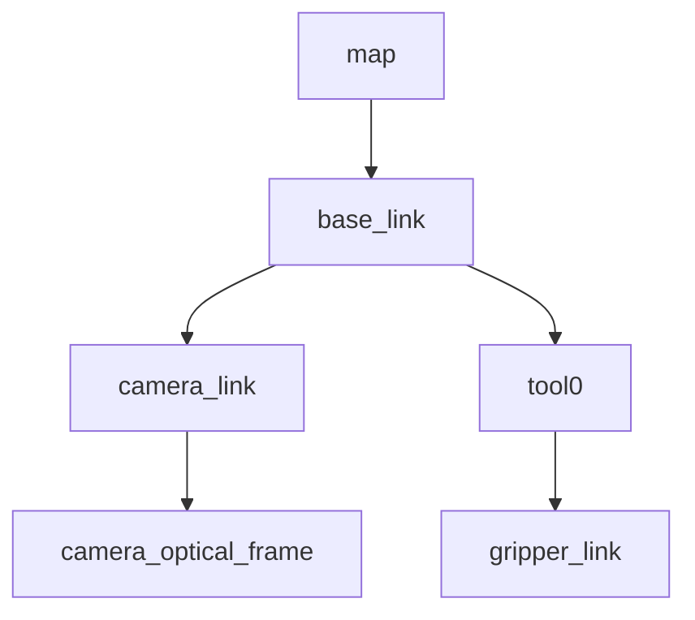

# CC/MS で使う frame 一覧 (instructor draft)

> 本草案は WorldCPJ の CC (Cell Cooperation) と MS (Multi-Stage) で共通利用を想定する frame 列挙。Phase 0 では **概念整理が目的**であり、実機の URDF と完全一致は要求されない。SP2 (W2 manipulation) で実機 URDF と照合。

## TF tree (Mermaid)

## frame 詳細

| frame | 親 | 用途 | 備考 |
|---|---|---|---|
| `map` | (root) | 静的世界座標 | CC/MS 共通。 calibration の起点 |
| `base_link` | `map` | ロボット本体 | UR7e / CRX 共通。実機では `base` の場合あり |
| `camera_link` | `base_link` | カメラ筐体 | hand-eye calibration の対象 |
| `camera_optical_frame` | `camera_link` | カメラ光軸 (Z=光軸) | REP-103/REP-105。pose推定の出力先 |
| `tool0` | `base_link` | エンドエフェクタ取付 (フランジ) | UR convention |
| `gripper_link` | `tool0` | gripper 本体 | gripper に応じて child を追加 (例: `gripper_finger_left`) |

## 命名で注意した点

- `base_link` は `baselink`/`base` と書かないこと (CC/MS で frame 孤立の原因)
- `tool0` の `0` は数字 ゼロ (UR の慣習)。 `tool_0` は別物
- カメラの `camera_link` (筐体) と `camera_optical_frame` (光軸) を分けて持つ

## 次の作業 (SP2 で扱う)

- 実機 URDF (UR7e, CRX) との frame 照合
- hand-eye calibration を踏まえた `camera_optical_frame` 位置の決定
- gripper child frame の確定 (gripper 種別に依存)
