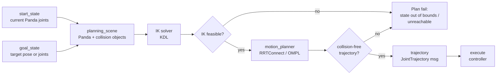

# Plan 成功例 (terminal log 抜粋)

```text
[INFO] [1745800000.123456789] [move_group]: Loading robot model 'panda'...
[INFO] [1745800000.234567890] [move_group]: Initializing OMPL interface...
[INFO] [1745800001.345678901] [move_group]: Solution found in 0.0234 seconds (RRTConnect)
[INFO] [1745800001.456789012] [move_group]: Computed trajectory of 18 waypoints, total time 2.345 sec
[INFO] [1745800001.567890123] [move_group]: Sending trajectory to controller (mock execution)
[INFO] [1745800003.789012345] [move_group]: Goal reached, success=true
```

# Plan 失敗例 (terminal log 抜粋)

```text
[INFO] [1745800010.123456789] [move_group]: Computing plan for goal_joint1=3.000
[WARN] [1745800010.234567890] [move_group]: Goal state is out of bounds: panda_joint1=3.0 outside [-2.8973, 2.8973]
[ERROR] [1745800010.345678901] [move_group]: No motion plan found (state validation failed)
[INFO] [1745800010.456789012] [move_group]: Returning empty trajectory
```

# Planning Scene Mermaid 流れ図



# 解釈

- **Plan 成功例**: start から goal まで OMPL/RRTConnect が 18 waypoints の trajectory を 0.02 秒で計算。mock execution で controller に送り、Goal reached 確認。
- **Plan 失敗例**: goal の panda_joint1=3.0 が joint limit (`±2.8973`) 外。IK 以前に state validation で fail。trajectory 空 (empty)。

# 学習者への補足

- 上記 log は instructor の実走から抽出した抜粋。学習者の log は timestamp / 詳細メッセージが異なるが、構造 (`Solution found` 行 + `No motion plan found` 行) が一致していれば合格。
- Mermaid 流れ図は **start_state + goal_state → planning_scene → IK → planner → trajectory → execute** の流れを示す。Plan 失敗時は IK or planner で early exit する。
